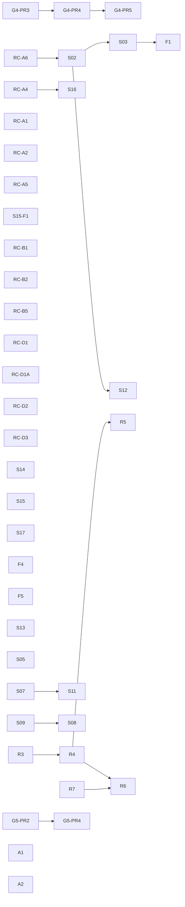

# Open Task Route

Fast execution route for selecting the next task without scanning all planning
surfaces.

Authoritative task source remains:
[Execution Workboard](execution-workboard.md).

## Current Open Snapshot

- `in_progress`: 0
- `review`: 5
- `queued`: 33
- `blocked`: 4
- `done`: tracked in closeouts and evidence (not listed here)

## Actionable Now (Strictly Unblocked)

Pick from this list when you want immediate execution with no hard dependency
block in the workboard.

| Priority | Task ID  | Why now                                                                    | Next action                                                            |
| -------- | -------- | -------------------------------------------------------------------------- | ---------------------------------------------------------------------- |
| `P0`     | `G4-PR3` | Already in `Review`; unlocks API lane.                                     | Close review/merge decision and lock baseline.                         |
| `P0`     | `RC-A1`  | Already in `Review`; close QA/merge decision for production hardening.     | Merge and lock runtime policy baseline.                                |
| `P0`     | `RC-A2`  | Deterministic intent invariant is implemented and awaiting merge closure.  | Merge review and lock deterministic intent-id baseline.                |
| `P0`     | `RC-D2`  | Already in `Review`; closes deployment-fragile claim lease timeout.        | Merge review and lock configurable claim timeout baseline.             |
| `P0`     | `RC-D3`  | Already in `Review`; closes temporal not-found robustness drift.           | Merge review and lock error-code normalization baseline.               |
| `P0`     | `RC-A4`  | Already in `Review`; unblocks runtime planVersion enforcement (`S16`).     | Close review/merge decision and lock shared version source of truth.   |
| `P1`     | `RC-A6`  | Explicit prerequisite for the full state-store split sweep (`S02`).        | Align dead-letter contract signatures with tenant-scoped concrete API. |
| `P1`     | `RC-B1`  | Removes concrete adapter-internal coupling in lineage worker.              | Inject lineage outbox dependency directly in composition root.         |
| `P1`     | `RC-B2`  | Unlocks real SQL facets output from existing compiled-code reference flow. | Wire non-noop compiled-code resolver in lineage worker runtime.        |
| `P1`     | `S15`    | Already in `Review`; closes snapshot regression under concurrency.         | Merge review and lock monotonic snapshot CAS baseline.                 |
| `P1`     | `S15-F1` | Follow-up to S15; makes stale snapshot write discards visible.             | Expose stale-write discard outcome to repair/archival callers.         |
| `P1`     | `S14`    | Correctness drift risk in gateway decisions across workflow segments.      | Preserve `completedStepResults` or fail loudly on missing context.     |
| `P1`     | `S13`    | Fast contract cleanup with no blockers.                                    | Remove duplicate `estimateRunRef` declaration.                         |
| `P1`     | `S05`    | Explicitly unblocked by `S01` closure.                                     | Add payload version handling in envelope flow.                         |
| `P1`     | `S07`    | No blockers; unlocks `S11`.                                                | Normalize lineage job naming + sink shape.                             |
| `P1`     | `S09`    | No blockers; unlocks `S08`.                                                | Set retry ownership ADR/runtime rule.                                  |
| `P2`     | `RC-B5`  | Lineage retry path currently exhausts too quickly under outage.            | Add scheduled retry (`next_attempt_at`) with exponential backoff.      |
| `P2`     | `RC-D1`  | Reconciler startup degradation is not visible to health consumers.         | Expose reconciler status as `degraded` in API health.                  |
| `P2`     | `RC-D1A` | RC-D1 follow-up still needs compatibility closure and runtime timer proof. | Add `/healthz` compat policy and watchdog integration tests.           |
| `P2`     | `F4`     | DDD finding still open and currently only documented.                      | Freeze `WorkflowSnapshot` role and versioning rule.                    |
| `P2`     | `F5`     | DDD boundary finding still open.                                           | Move/remove engine-side provider selection env handling.               |
| `P2`     | `S17`    | Multi-worker safety depends on claim path semantics today.                 | Harden outbox contract/runtime to require claim/lease semantics.       |
| `P2`     | `A1`     | Review-validated gap with no current owner slice.                          | Define realtime run-status delivery contract.                          |
| `P2`     | `A2`     | Per-process limiter does not hold in horizontal deployments.               | Design distributed tenant rate-limiter rollout.                        |
| `P2`     | `R7`     | Unblocks `R6` dependency gate currently marked external.                   | Close DSL/interpreter governance decision.                             |

## Blocked Or Gated Next

| Task ID  | State   | Dependency gate                               |
| -------- | ------- | --------------------------------------------- |
| `G4-PR4` | Queued  | waits for `G4-PR3`                            |
| `G4-PR5` | Queued  | waits for `G4-PR4`                            |
| `S02`    | Queued  | full sweep gated by `RC-A6`                   |
| `S03`    | Queued  | depends on `S02` (C1 path)                    |
| `F1`     | Queued  | C2 final wiring depends on `S03`              |
| `S16`    | Queued  | waits for `RC-A4`                             |
| `S08`    | Blocked | waits for `S09`                               |
| `S11`    | Blocked | waits for `S07`                               |
| `S12`    | Blocked | waits for `S02`                               |
| `R4`     | Queued  | waits for `R3`                                |
| `R5`     | Queued  | waits for `R4`                                |
| `R6`     | Queued  | waits for `R4` and `R7`                       |
| `G5-PR2` | Queued  | pending archival prerequisites in lane        |
| `G5-PR4` | Queued  | depends on archival base and policy decisions |

## Dependency Route (Open Tasks)

## Parallel Start Pack

If you want maximum parallelism now without violating gates, start these lanes:

1. `API lane`: close `G4-PR3`.
2. `Correctness lane`: `RC-A1` + `RC-A2` + `S15` + `S15-F1` + `S14`.
3. `Version lane`: `RC-A4` then `S16`.
4. `State-store lane`: `RC-A6` then `S02` then `S03` then `F1`.
5. `Traceability lane`: `RC-B1` + `RC-B2` + `S07` + `RC-B5`.
6. `Planner lane`: `S09`.
7. `Ops lane`: `RC-D1` + `RC-D1A` + `RC-D2` + `RC-D3`.
8. `Governance lane`: `S13` + `F4` + `F5` + `A1` + `A2` + `R7`.

## Usage Rule

Before starting a task:

1. verify task row in [Execution Workboard](execution-workboard.md);
2. verify dependency in this route;
3. update both docs when status changes.
