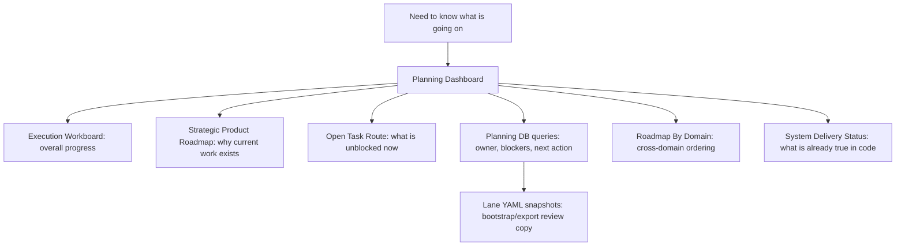
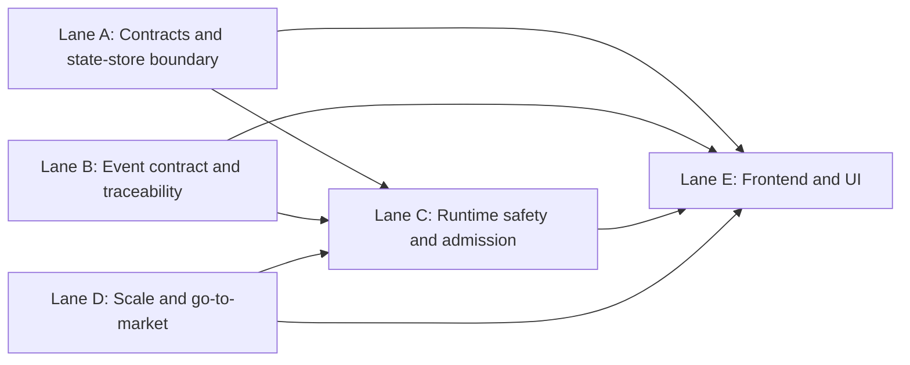

# Planning Dashboard

This is the human entry point for planning.

Use this page when the question is simple:

- what is active now;
- what is blocked now;
- which lane owns a task;
- where is the board;
- what document should I open next.

If the question is "how do I update planning correctly?", go to
[Planning Control Tower](./planning-control-tower.md). The control tower governs
updates. This dashboard explains the current board.

## Where The Board Is

- Portfolio board:
  [Execution Workboard](./execution-workboard.md)
- Strategic direction:
  [Strategic Product Roadmap](../roadmap/strategic-product-roadmap.md)
- Strictly unblocked work:
  [Open Task Route](./open-task-route.md)
- Operational task state:
  `pnpm planning:db:query focus`, `pnpm planning:db:query next`,
  `pnpm planning:db:query open`, and `pnpm planning:db:query tasks`
- Bootstrap/export lane snapshots:
  [Agent Lane A](./agent-lane-a.yaml), [Agent Lane B](./agent-lane-b.yaml),
  [Agent Lane C](./agent-lane-c.yaml), [Agent Lane D](./agent-lane-d.yaml),
  [Agent Lane E](./agent-lane-e.yaml)
- Cross-domain sequence:
  [Roadmap By Domain](../roadmap/roadmap-by-domain.md)
- Current implementation truth:
  [System Delivery Status](../../architecture/system-delivery-status.md)

## Read This In 30 Seconds

## Lane Roles

| Lane | Title                              | Owns                                                                   | Commonly unblocks                   | Bootstrap/export snapshot           |
| ---- | ---------------------------------- | ---------------------------------------------------------------------- | ----------------------------------- | ----------------------------------- |
| `A`  | Contracts and state-store boundary | contracts, ownership boundaries, plan/state-store seams                | `C`, `E`                            | [Agent Lane A](./agent-lane-a.yaml) |
| `B`  | Event contract and traceability    | event schemas, lineage, provenance, evidence mapping                   | `C`, `E`                            | [Agent Lane B](./agent-lane-b.yaml) |
| `C`  | Runtime safety and admission       | caller-visible runtime behavior, auth, freshness, admin/runtime routes | `E`                                 | [Agent Lane C](./agent-lane-c.yaml) |
| `D`  | Scale and go-to-market             | retention, scale, deferred operational risks, GTM isolation            | `C`, `E`                            | [Agent Lane D](./agent-lane-d.yaml) |
| `E`  | Frontend and UI                    | operator UX, frontend contracts, shell/canvas/run views                | consumes `A`, `B`, `C`, `D` outputs | [Agent Lane E](./agent-lane-e.yaml) |

Task-level dependencies, status, claims, and evidence refs are read from the
planning DB effective task views. The YAML files listed here are
bootstrap/export snapshots for Git review and recovery.

## Current Lane Dependency Shape

## What To Open Next

| If you need...                                                  | Open this                                                              |
| --------------------------------------------------------------- | ---------------------------------------------------------------------- |
| overall progress and active items                               | [Execution Workboard](./execution-workboard.md)                        |
| long-range product direction and why current work matters       | [Strategic Product Roadmap](../roadmap/strategic-product-roadmap.md)   |
| the next strictly unblocked slice                               | [Open Task Route](./open-task-route.md)                                |
| the real owner, blocker, target, and evidence refs for one task | `pnpm planning:db:query tasks --task <id>`                             |
| the reviewable bootstrap/export copy for a lane                 | the relevant `agent-lane-*.yaml` file                                  |
| cross-domain sequence and why a lane is blocked                 | [Roadmap By Domain](../roadmap/roadmap-by-domain.md)                   |
| current implementation truth instead of planning intent         | [System Delivery Status](../../architecture/system-delivery-status.md) |
| how to update planning surfaces without drift                   | [Planning Control Tower](./planning-control-tower.md)                  |

## Interpretation Rule

- `System Delivery Status` = what is already true in code
- `Execution Workboard` = current portfolio board
- `Open Task Route` = current unblocked queue
- `planning DB` = source of truth for task state, blockers, target, and evidence
- `lane yaml` = bootstrap/export snapshot for Git review and recovery
- `Roadmap By Domain` = why one lane blocks or sequences another
- `Planning Control Tower` = update protocol, not the easiest reading surface
