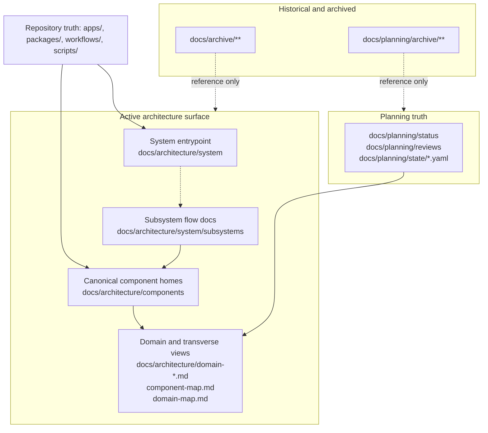
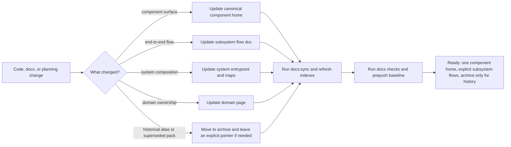

# Documentation information architecture current vs target

## Purpose

Specify the documentation model that exists after `DOC-ARCH-01`, show the
target operating model closed by `GOV-S2`, and make the active documentation
surface auditable against real code and planning sources.

## Governing sources

- [Governance document rule inventory](./governance-document-rule-inventory.md)
- [Architecture surface inventory 2026-04-02](../../architecture/architecture-surface-inventory-20260402.md)
- [AI work protocol](../../guides/ai-work-protocol.md)
- [Planning control tower](../state/planning-control-tower.md)
- [Documentation maintenance guide](../../guides/documentation-maintenance-guide-20260407.md)

## Current-state model

## Current code-alignment facts

| Area                          | Current active entrypoint                           | Code-alignment action in this slice                                                                              |
| ----------------------------- | --------------------------------------------------- | ---------------------------------------------------------------------------------------------------------------- |
| System routing                | `docs/architecture/system/index.md`                 | added explicit system -> subsystem -> component navigation                                                       |
| Subsystem routing             | `docs/architecture/system/subsystems/index.md`      | introduced named subsystem folders under the system tree, distinct from component homes                          |
| Read flow                     | `docs/architecture/system/subsystems/read/index.md` | documented real browser -> API -> engine/state-store read path with code anchors                                 |
| Engine component home         | `docs/architecture/components/engine/*`             | retired the top-level engine pack; engine truth now lives under the component tree with subsystem links          |
| Frontend component home       | `docs/architecture/components/web/*`                | consolidated `apps/web` and `@dvt/web` into one canonical component home and removed the top-level frontend pack |
| Archived architecture aliases | `docs/archive/architecture/components/*`            | moved stale or duplicate aliases out of the active tree                                                          |

## Target-state model

## Operational specification

- A real repo component gets exactly one active home under
  `docs/architecture/components/`.
- Subsystem docs explain flows across components and must link back to the
  canonical component pages they compose.
- System docs explain top-level composition and routing into subsystems.
- Domain docs explain ownership and responsibility boundaries; they are not a
  second subsystem tree.
- Historical aliases and superseded packs belong in archive once active links
  are migrated.
- Docs validation must prove the active tree, not overwhelm contributors with
  archive-only drift.

## Remaining follow-up space

- add more named subsystem folders under
  `docs/architecture/system/subsystems/` beyond `canonical-run-lifecycle` and
  `read` as more end-to-end flows are clarified.
- Frontmatter normalization and `last_reviewed` coverage across the historical
  corpus are not `GOV-S2` umbrella blockers after its 2026-05-07 closure. Route
  them through concrete docs-governance tasks or existing changed-file gates.
- Several secondary active docs still deep-link straight into component pages
  without first routing through the system/subsystem entrypoints.
