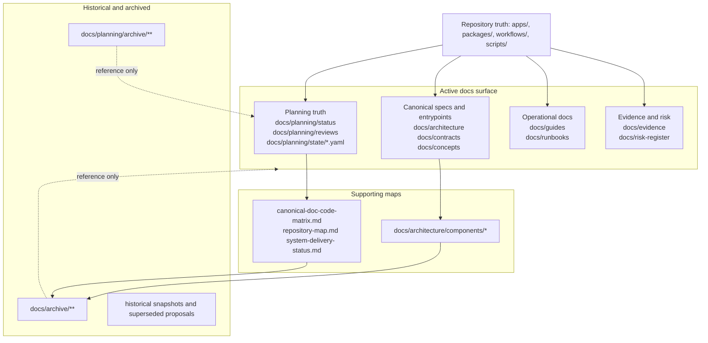
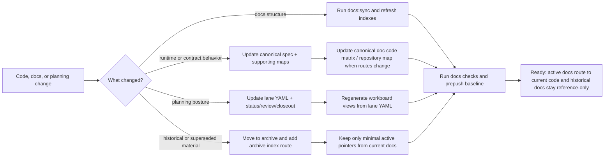

# Documentation information architecture current vs target

## Purpose

Specify the documentation model that exists after `DOC-ARCH-01`, show the
target operating model required by `GOV-S2`, and make the active documentation
surface auditable against real code and planning sources.

## Governing sources

- [Governance document rule inventory](governance-document-rule-inventory.md)
- [Architecture surface inventory 2026-04-02](../../architecture/architecture-surface-inventory-20260402.md)
- [AI work protocol](../../guides/ai-work-protocol.md)
- [Planning control tower](../state/planning-control-tower.md)
- [Documentation maintenance guide](../../guides/documentation-maintenance-guide-20260407.md)

## Current-state model

## Current code-alignment facts

| Area                        | Current active entrypoint                                                | Code-alignment action in this slice                                                                    |
| --------------------------- | ------------------------------------------------------------------------ | ------------------------------------------------------------------------------------------------------ |
| API runtime surface         | `docs/architecture/components/api/api-current-to-target-architecture.md` | promoted as the canonical repo-map and infra entrypoint instead of the old `G8` gap spec               |
| Engine component map        | `docs/architecture/components/engine/*`                                  | rebuilt as summary-only navigation to canonical engine docs; removed dead local links                  |
| Planner component map       | `docs/architecture/components/planner/*`                                 | rewritten around `PlannerFacade`, `PlannerInputEnvelopeV1`, and `ExecutionPlan.v1.ts`                  |
| Archived architecture packs | `docs/archive/architecture/components/*`                                 | stale component packs moved out of the active tree                                                     |
| Active planning reviews     | `docs/planning/reviews/*`                                                | repaired relative links after archive moves and proposal reclassification                              |
| Docs validation             | `tools/docs/check-links.ts`                                              | checker now skips historical sources by taxonomy instead of surfacing archive noise as active failures |

## Target-state model

## Operational specification

- Active component trees are summaries only. They must point to canonical docs
  instead of reintroducing local structure packs.
- Historical documents may remain link targets, but they are not maintained as
  active source files and should not dominate link-check results.
- When an active doc refers to code, the path must match the real shipped file
  and the real contract version.
- Archive moves require an archive index or active pointer so readers can still
  discover historical context deliberately.
- Planning execution truth lives in `docs/planning/state/agent-lane-*.yaml`;
  generated workboard views are derived artifacts.
- Docs validation must prove the active tree, not overwhelm contributors with
  archive-only drift.

## Remaining follow-up space

- Frontmatter normalization and `last_reviewed` coverage across the historical
  corpus remain broader `GOV-S2` work.
- A few historical narrative docs still mention superseded names for context;
  they are acceptable only when the file is explicitly historical or archived.
