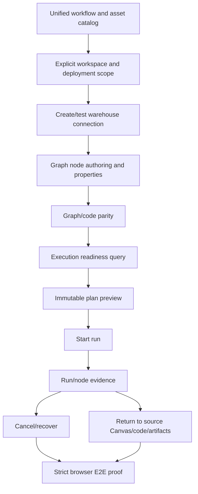

# Frontend Mature-System Gap Status 2026-06-02

## Purpose

This status document compares the current DVT web Canvas and workflow surface
against mature data workflow systems. It records visible product gaps that must
be closed before the frontend can be treated as a mature end-to-end workflow
application.

This document is a status snapshot. It does not authorize new behavior by
itself. Any implementation that changes user-visible behavior must still update
the owning command/query catalog before code changes.

## Governing Sources

- `AGENTS.md`
- `docs/planning/status/governance-document-rule-inventory.md`
- `docs/guides/ai-work-protocol.md`
- `docs/architecture/command-query-rail-governance.md`
- `docs/architecture/fowler-opportunity-planning-governance.md`
- `docs/architecture/components/web/frontend-command-query-rail-inventory.md`
- `docs/architecture/components/web/graph/canvas-workbench-command-query-catalog.md`
- `docs/planning/proposals/mandatory/frontend-and-ux/e-canvas-workflow-e2e-usability-plan-20260601.md`

## Mature-System Reference Baseline

The comparison uses common behavior from mature workflow and data-platform
frontends, not visual preference alone:

- Apache Airflow exposes DAG discovery, metadata, actions, Grid, Graph, Runs,
  Tasks, Events, Code, Details, logs, filters, and run/task drill-down in one
  DAG detail surface.
  Reference: <https://airflow.apache.org/docs/apache-airflow/stable/ui.html>
- Dagster centers the UI on an asset catalog, global asset lineage, asset
  detail tabs, partitions, events, checks, lineage, automation, runs, run
  details, logs, and re-execution.
  Reference: <https://master.dagster.dagster-docs.io/concepts/webserver/ui>
- Databricks Lakeflow Jobs exposes job/pipeline discovery, run matrix/list
  views, active and completed runs, filters, stop/cancel controls, job/task run
  detail, lineage links, and run-log export.
  Reference: <https://docs.databricks.com/aws/en/jobs/monitor>
- Databricks Unity Catalog lineage captures table/job/query/dashboard lineage,
  including column-level lineage for supported workloads.
  Reference:
  <https://docs.databricks.com/aws/en/data-governance/unity-catalog/data-lineage>
- Prefect deployments are server-side workflow representations that store when,
  where, and how a workflow runs; the UI/API support triggering, cancelling,
  schedules, automations, parameters, work pools, and versioned deployment
  configuration.
  Reference: <https://docs.prefect.io/v3/concepts/deployments>
- dbt Explorer uses post-run production metadata as a source of truth for
  lineage, node context, run status, descriptions, search, and upstream or
  downstream discovery.
  Reference:
  <https://www.getdbt.com/blog/navigate-and-understand-your-dbt-cloud-projects-with-dbt-explorer>

The target for DVT is not to copy these products. The target is to provide the
same class of trustworthy workflow affordances: real source authority, explicit
graph/code parity, safe execution admission, observable runs, navigable
evidence, and fail-closed gaps instead of fake success.

## Current Executive Status

Current posture: **not mature E2E**.

DVT has meaningful foundations: protected runtime rails, workspace graph draft
read/write, workspace file reads/writes, plan preview/import, run start/status
events, Canvas tab routing, configurable node inspector metadata, generated
workspace artifacts, and a frontend command/query inventory.

The product still falls short of mature systems because several critical user
flows are either partial, implicit, or not demonstrably connected end to end:

- a user cannot create or test a new warehouse connection from the UI;
- source selection can import server-known tables but does not prove
  user-owned credentialed connection setup;
- graph nodes and code buffers are not yet one coherent editing authority;
- execution readiness is inferred and rejected late instead of readable before
  plan preview;
- run cancellation, recovery, and source-canvas navigation are missing from the
  frontend port surface;
- node-level execution evidence is split across plugin panels instead of one
  owned query;
- visual/browser proof is still fragile because the current worktree fails
  feature-mechanization symbol coverage for open Canvas interaction work.

## Capability Comparison

| Capability                   | Mature-system expectation                                                                                            | Current DVT posture                                                                                                                                                                 | Gap                                                                            |
| ---------------------------- | -------------------------------------------------------------------------------------------------------------------- | ----------------------------------------------------------------------------------------------------------------------------------------------------------------------------------- | ------------------------------------------------------------------------------ |
| Asset/workflow discovery     | Searchable workflow or asset catalog with filters, tags, owner, status, and recent history                           | Canvas and workspace routes expose project resources and files, but no unified asset/workflow catalog comparable to Airflow DAG list, Dagster asset catalog, or Databricks job list | Missing unified discoverability model                                          |
| Source connection            | User can create, test, authenticate, and audit data source connections                                               | Existing server-known warehouse connections can be listed and imported                                                                                                              | Missing `CreateWarehouseConnection` and `TestWarehouseConnection` rails        |
| Graph authoring              | Insert, connect, configure, delete, and validate nodes with contextual commands                                      | Canvas has authoring rails and context-menu work in progress                                                                                                                        | Gate still fails feature-mechanization coverage for context-menu symbols       |
| Node properties              | Selected node exposes structured details, columns, dependencies, config, code, history, and editable owned fields    | Inspector has structured tabs and editable authoring sections for DVT/dbt nodes                                                                                                     | Needs one node-evidence model and stronger graph/code synchronization          |
| Code/graph parity            | Graph node config and source code stay aligned; code edits can be saved through one authority                        | Code route has workspace file reads and local editable buffer posture                                                                                                               | Missing `SaveCodeWorkspaceFileBuffer` and `UpdateNodeCodeProjection`           |
| Execution readiness          | UI explains missing source, transform, sink, scope, permissions, artifacts, and invalid edges before plan/run        | Plan preview and validation exist, but readiness is not one explicit query read model                                                                                               | Missing `ValidateCanvasExecutionReadiness`                                     |
| Plan preview                 | Immutable preview shows plan metadata, scope, source/sink, steps, cost, and evidence in a readable layout            | Plan preview exists and persists evidence, but recent usability concerns show layout and provenance clarity are not yet mature                                                      | Needs strict UX proof and source/sink provenance clarity                       |
| Run start                    | User can start from a selected deployment/workflow and see where it runs                                             | `StartRun` exists through frontend port and backend rail                                                                                                                            | Needs better environment/source canvas provenance in the run detail route      |
| Run monitoring               | Matrix/list/timeline, status filters, task details, logs, active run controls, and recent history                    | DVT has run list, snapshot, events, console/log surfaces                                                                                                                            | Missing cancel/recover commands and richer task/node evidence                  |
| Run control                  | Stop/cancel active runs, retry/recover failed runs, expose allowed actions by state                                  | Backend vocabulary includes cancel/recover routes, frontend port does not expose them                                                                                               | Missing `CancelRun` and `RecoverRun` frontend commands                         |
| Lineage                      | Graph lineage, upstream/downstream drill-down, column-level lineage where available, external assets                 | Canvas graph and inspector dependency tabs exist; column metadata can be shown when present                                                                                         | Missing trustworthy column-level lineage derivation and external asset lineage |
| Evidence navigation          | From any run/task/node, navigate back to the defining workflow, source, code, logs, artifacts, and previous attempts | Run pages and Canvas tabs are separate; source-canvas navigation is not explicit                                                                                                    | Missing `OpenRunSourceCanvas` and `ListNodeExecutionEvidence`                  |
| Deployment/workspace scope   | Workflow/deployment has explicit environment, schedule/event trigger, parameters, version/provenance                 | Project/canvas environment properties exist, but workspace selection remains implicit in places                                                                                     | Missing `SelectWorkspaceScope` and stronger deployment identity                |
| Operational retention/export | Run history, logs, artifacts, and results have retention/export affordances                                          | Artifact and file routes exist; run export/retention UX is not mature                                                                                                               | Missing retention/export status and user commands                              |
| User confidence              | Browser-level E2E proves first-user path without mock semantics                                                      | Unit and Cypress assets exist, but the current tree has an open feature-mechanization failure                                                                                       | Strict user audit cannot yet claim full compliance                             |

## Gap Register

### MS-GAP-001: Unified Workflow And Asset Catalog

- Severity: High.
- Mature signal: Airflow DAG list, Dagster asset catalog, Databricks Jobs list,
  dbt Explorer search.
- Current DVT evidence: workspace files, project resources, Canvas documents,
  artifacts, runs, and plugin views are separate entry points.
- Missing rail: likely `ListWorkflowAssets` or a scoped read model built on
  existing workspace/project/runs queries.
- Acceptance evidence: users can search/filter workflows, resources, files,
  runs, owners, tags, and status from one discoverability surface.

### MS-GAP-002: Real User-Created Warehouse Connection

- Severity: Critical.
- Mature signal: source connections are authenticated server-side, testable,
  auditable, and cannot be faked in the browser.
- Current DVT evidence: `ListWarehouseConnections`,
  `ListWarehouseConnectionTables`, and `ImportWarehouseSources` exist for
  server-known connections.
- Missing rails: `CreateWarehouseConnection`, `TestWarehouseConnection`.
- Acceptance evidence: UI creates a connection through a protected backend
  command, tests credentials without leaking secrets, lists real tables, imports
  selected tables, and records negative tests for invalid credentials,
  unauthorized tenant, duplicate connection name, unsupported adapter, and
  failed audit write.

### MS-GAP-003: Graph/Code Editing Authority

- Severity: Critical.
- Mature signal: workflow source, visual graph, and generated/executable code
  are consistent and traceable.
- Current DVT evidence: `SaveWorkspaceFileContent` exists, but Code route is
  still documented as local editable buffer posture.
- Missing rails: `SaveCodeWorkspaceFileBuffer`,
  `UpdateNodeCodeProjection`.
- Acceptance evidence: editing SQL/dbt properties in graph updates code
  projections, editing code can be saved through the workspace file command,
  stale writes fail closed, and graph/code/artifacts invalidate consistently.

### MS-GAP-004: Explicit Execution Readiness

- Severity: Critical.
- Mature signal: users see missing prerequisites before execution, not only
  after an attempted plan.
- Current DVT evidence: local validation and plan-preview rejection exist.
- Missing rail: `ValidateCanvasExecutionReadiness`.
- Acceptance evidence: toolbar and inspector report missing source,
  transform, sink, compatible edge, scope, permission, artifact, environment,
  and unresolved code errors before preview/run.

### MS-GAP-005: Run Control From Frontend

- Severity: High.
- Mature signal: active runs can be stopped/cancelled; failed or completed runs
  can be retried or recovered where policy allows.
- Current DVT evidence: backend vocabulary has cancel/recover routes; frontend
  run port does not expose governed commands.
- Missing rails: `CancelRun`, `RecoverRun`.
- Acceptance evidence: run list and detail show contextual allowed actions by
  state, commands call protected backend routes, optimistic UI is reversible,
  and unauthorized/stale/terminal-state actions fail closed.

### MS-GAP-006: Node-Scoped Execution Evidence

- Severity: High.
- Mature signal: selecting a task/asset/node exposes run history, logs,
  materialization, checks, timing, status, and upstream/downstream context.
- Current DVT evidence: dbt plugin history panel and run events exist, but
  node evidence is plugin-local rather than a single read model.
- Missing rail: `ListNodeExecutionEvidence`.
- Acceptance evidence: inspector history works for DVT and dbt nodes through
  one query, with consistent status, latest run, event list, logs, materialized
  table, row count, error message, and provenance.

### MS-GAP-007: Run-To-Source Navigation

- Severity: High.
- Mature signal: run detail can navigate to the job/workflow definition,
  source code, generated artifacts, and the selected scope that produced it.
- Current DVT evidence: run detail and Canvas are separate views; run
  provenance is visible but not a complete navigation contract.
- Missing rail: `OpenRunSourceCanvas`.
- Acceptance evidence: from a run detail, user can return to the exact Canvas,
  selected nodes, source/sink, code artifact, environment, and plan preview
  that produced the run.

### MS-GAP-008: Mature Lineage And Column Semantics

- Severity: Medium.
- Mature signal: lineage includes upstream/downstream drill-down, job/table
  association, column lineage where supported, and external assets.
- Current DVT evidence: graph dependencies and column metadata can render when
  metadata is present.
- Missing rail or component: column-lineage projection policy and external
  asset/source lineage policy.
- Acceptance evidence: column lineage is computed or imported from an
  authoritative source, not guessed from labels; unsupported lineage is marked
  unavailable rather than blank or fake.

### MS-GAP-009: Operational Run History, Retention, And Export

- Severity: Medium.
- Mature signal: run results, logs, and artifacts have retention rules and
  export/download affordances.
- Current DVT evidence: artifact download/view and run events exist, but run
  result retention/export is not surfaced as a mature workflow.
- Missing rail: likely `ExportRunEvidence` or a run-artifact export read model.
- Acceptance evidence: run detail shows retention posture and lets users export
  logs/events/artifact refs without relying on transient console output.

### MS-GAP-010: Scope And Deployment Identity

- Severity: High.
- Mature signal: workflow/deployment has explicit environment, schedule/event
  posture, parameter defaults, owner, version, and source location.
- Current DVT evidence: project/canvas environment fields exist; workspace
  selection remains implicit in places.
- Missing rail: `SelectWorkspaceScope`.
- Acceptance evidence: the active tenant/project/environment is selected and
  visible before source import, plan preview, run start, and artifact writes.

### MS-GAP-011: Browser-Level Strict User Proof

- Severity: Critical for release confidence.
- Mature signal: E2E tests prove the exact first-user path against real rails:
  create workspace/canvas, connect source, configure nodes, save code, preview
  plan, run, inspect evidence, cancel/recover where applicable.
- Current DVT evidence: focused unit and Cypress tests exist, but the current
  open tree fails feature-mechanization implementation coverage for Canvas
  interaction symbols.
- Missing proof: strict user audit with screenshots and no mocked success paths.
- Acceptance evidence: Browser/Cypress proof documents all actions and
  screenshots, with API calls going through governed rails and no intercept that
  fabricates `/workspace/graph/draft` semantics.

### MS-GAP-012: Governance Drift Closure

- Severity: High.
- Mature signal: docs, command/query catalog, feature mechanization manifest,
  architecture tests, Cypress workflows, and shipped code describe the same
  behavior.
- Current DVT evidence: frontend command/query inventory has identified gaps;
  `docs:feature-mechanization:implementation` currently fails on undeclared
  Canvas context-menu and authoring symbols in the open worktree.
- Missing action: update governing proposal manifests or reduce open symbols
  to match the accepted feature surface.
- Acceptance evidence: `pnpm docs:feature-mechanization:implementation` and
  `pnpm verify:prepush` pass without bypass.

## Maturity Dependency Flow

## Priority Order

1. Close governance drift: feature mechanization symbol coverage must pass
   before the Canvas interaction work can be treated as mechanically governed.
2. Implement real source connection creation and test rails.
3. Wire Code save and graph/code projection through one authority.
4. Add execution readiness as an explicit query.
5. Add run cancel/recover commands and node-scoped execution evidence.
6. Add run-to-source Canvas navigation.
7. Build unified workflow/asset search and operational retention/export.
8. Expand lineage to authoritative column and external asset lineage.

## State Classification

The frontend should be described as:

> A governed Canvas authoring and workflow inspection workbench with partial
> E2E execution rails, not yet a mature workflow orchestration UI.

It may be promoted to mature E2E only when the critical gaps above have passing
unit, architecture, and browser/user-flow evidence and the repository closeout
gate passes without bypass.
