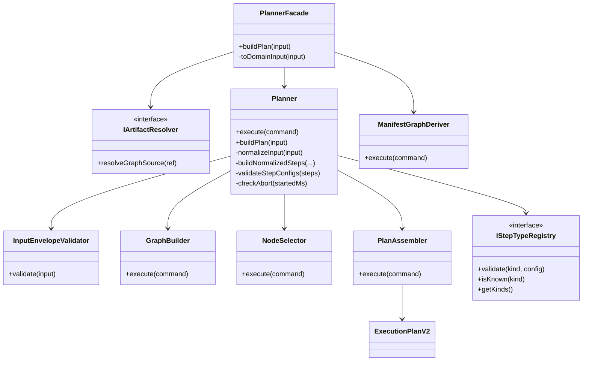
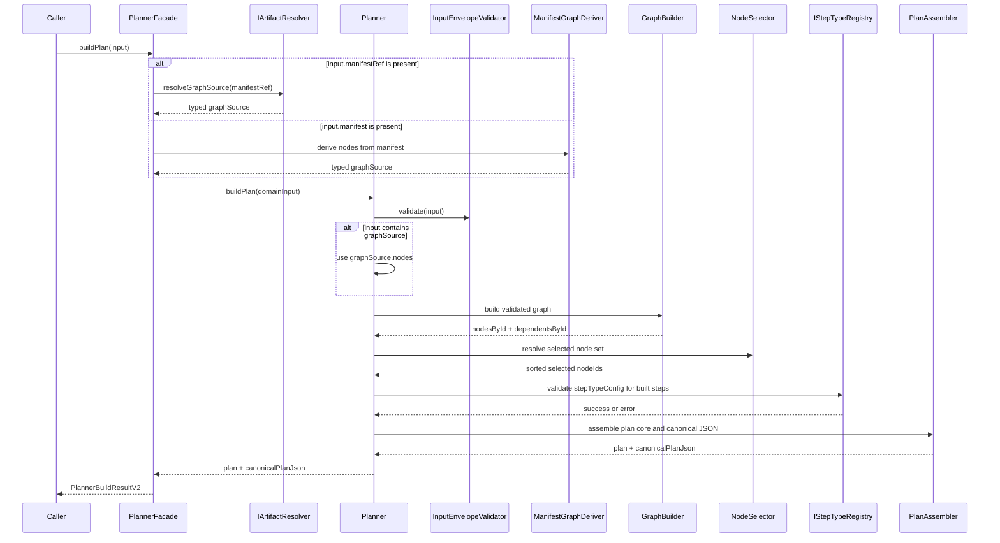
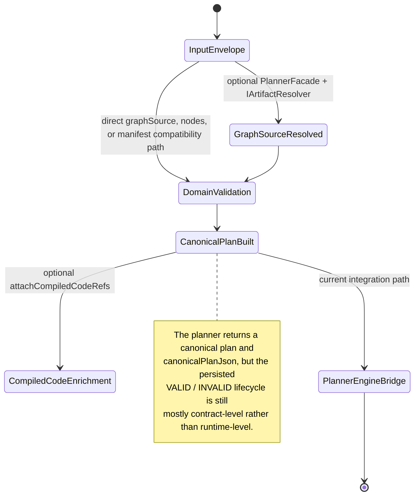

# Planner Current State Assessment

This document is the planner-specific status baseline for the current
repository. It exists because the planner bounded context is still reported as
`Partial`, but the repository did not yet have one current artifact that
quantified what is implemented, what is only governed in contracts, and what is
still roadmap-only.

Use this page with:

- [Governance Document And Rule Inventory](governance-document-rule-inventory.md)
- [Canonical Doc Code Matrix](canonical-doc-code-matrix.md)
- [Planner Local Doc Triage](planner-local-doc-triage-20260320.md)
- [Current Status](../../architecture/system-delivery-status.md)
- [Planner Contracts](../../contracts/planner/index.md)
- [ADR-0035 - Planner Public Contract Evolution Protocol](../../adr/ADR-0035-planner-public-contract-evolution-protocol.md)
- [Stage 1.1 - Planner Contract, Canonical Ownership, and Documentation Placement](../../../packages/@dvt/planner/docs/planning/Stage-1.1-Planner-Canonicalization.md)

## Traceability Tuple

- `canonical_spec`:
  [Planner Contracts](../../contracts/planner/index.md),
  [ADR-0035](../../adr/ADR-0035-planner-public-contract-evolution-protocol.md),
  [ADR-0012](../../adr/ADR-0012-plan-integrity-ownership.md),
  [ADR-0017](../../adr/ADR-0017_ExecutionPlan_Schema_Versioning.md)
- `status_doc`:
  [planner-current-state-assessment-20260320.md](planner-current-state-assessment-20260320.md)
- `code_paths`:
  `packages/@dvt/planner/src/**`,
  `packages/@dvt/contracts/src/contracts/planner/**`,
  `packages/@dvt/contracts/src/step-registry/StepTypeRegistry.ts`,
  `packages/@dvt/plan-verifier/src/**`,
  `packages/@dvt/plan-interpreter/src/**`,
  `packages/@dvt/dsl/src/**`
- `test_paths`:
  `packages/@dvt/planner/test/**`,
  `packages/@dvt/plan-verifier/test/**`,
  `packages/@dvt/plan-interpreter/test/**`,
  `packages/@dvt/dsl/test/**`,
  `apps/api/test/integration/plannerEngineContract.test.ts`
- `verification_cmd`:
  `pnpm --filter @dvt/planner test`,
  `pnpm --filter @dvt/plan-verifier test`,
  `pnpm --filter @dvt/plan-interpreter test`,
  `pnpm --filter @dvt/dsl test`,
  `pnpm validate:contracts`
- `evidence_or_risk`:
  planner Stage 1.1 proposal and closeouts under
  `docs/planning/closeouts/20260317-*` and `20260318-*`

## Scope

This assessment covers the planner bounded context plus the packages that now
act as its execution-facing satellites:

- `@dvt/planner`
- planner public contracts in `@dvt/contracts`
- `@dvt/plan-verifier`
- `@dvt/plan-interpreter`
- `@dvt/dsl`
- planner-related contract tests and the planner-to-engine integration bridge

It does not claim to assess the full engine, adapters, or product UI. Those
systems appear here only where they consume planner artifacts or reveal planner
gaps.

## Scoring Method

Percentages in this document do **not** represent effort spent or story points.
They represent capability closure against the current target operating model.

Per checkpoint:

- `Implemented` = `1.0`
- `Partial` = `0.5`
- `Open` = `0.0`

Per component:

`completion % = (sum(checkpoint scores) / number of checkpoints) * 100`

This makes the percentages explicit and reproducible. It also avoids the common
failure mode of saying "partial" without saying _which part_ is actually open.

## Current Inventory

| Surface                                     | Files | Lines | Tests                                                           |
| ------------------------------------------- | ----- | ----- | --------------------------------------------------------------- |
| `@dvt/planner` source                       | 22    | 1284  | -                                                               |
| `@dvt/planner` tests                        | 18    | 835   | 55                                                              |
| planner public contracts (`@dvt/contracts`) | 12    | 1531  | contract tests live in `packages/@dvt/contracts/test/**`        |
| `StepTypeRegistry`                          | 1     | 149   | covered by `packages/@dvt/contracts/test/step-registry.test.ts` |
| `@dvt/plan-verifier` source                 | 5     | 229   | -                                                               |
| `@dvt/plan-verifier` tests                  | 2     | 113   | 10                                                              |
| `@dvt/plan-interpreter` source              | 4     | 288   | -                                                               |
| `@dvt/plan-interpreter` tests               | 1     | 252   | 23                                                              |
| `@dvt/dsl` source                           | 4     | 85    | -                                                               |
| `@dvt/dsl` tests                            | 1     | 24    | 4                                                               |

## Executive Summary

The planner bounded context is **strong in deterministic plan compilation and
much weaker in productization and runtime handoff**.

What is concretely true now:

- the public planner contract family already lives in `@dvt/contracts`;
- planner-local docs now have a repo-level triage inventory with explicit
  promote / retain-local / archive classification;
- the public planner entrypoint is `PlannerFacade`, with `manifestRef`
  resolution behind `IArtifactResolver`;
- the core pipeline (`validate -> derive nodes -> build graph -> select nodes ->
topo/depth -> resolve policies -> build steps -> assemble canonical plan`) is
  implemented and heavily tested;
- G9 hardening is real: `IStepTypeRegistry` exists, DBT kinds have canonical
  schemas, and the planner validates `stepTypeConfig` at build time;
- planner-adjacent satellites exist and work: `@dvt/plan-verifier`,
  `@dvt/plan-interpreter`, and `@dvt/dsl`.

What is _not_ closed:

- explicit operational plan modeling for artifact truth, adapter-scoped
  executability, admission linkage, supersession, and archival (`S08` plus
  runtime handoff);
- planner-side enforcement of `custom` namespace registration;
- fail-closed unknown `StepKind` enforcement end-to-end;
- unified plan-version governance across planner, contracts, verifier, engine,
  and adapters;
- business recovery / replanning product flow.

## Component Scorecard

| Component                                 | Score | Checkpoints | Current truth                                                                                                                    | Main open items                                                          |
| ----------------------------------------- | ----- | ----------- | -------------------------------------------------------------------------------------------------------------------------------- | ------------------------------------------------------------------------ |
| Contract and governance surface           | `92%` | `5.5 / 6`   | Public contracts are canonicalized; local-doc triage and owner/date assignment now exist                                         | Stage 1.1 is still package-local rather than repo-local                  |
| Application boundary and artifact ingress | `83%` | `5 / 6`     | `PlannerFacade`, `manifestRef` ingress, and typed `graphSource` normalization are real                                           | default resolver composition, compatibility-path retirement              |
| Deterministic compilation core            | `94%` | `7.5 / 8`   | Core planning pipeline is implemented and well tested                                                                            | volatile plan metadata still mixed into assembly                         |
| Step semantics and type governance        | `71%` | `5 / 7`     | Policy vocabulary and `IStepTypeRegistry` are real                                                                               | fail-closed unknown kinds, `custom` enforcement                          |
| Compiled artifact binding and enrichment  | `70%` | `3.5 / 5`   | `compiledCodeRef` enrichment exists and is governed                                                                              | runtime binding lifecycle not fully closed                               |
| Version and compatibility governance      | `67%` | `4 / 6`     | contracts, verifier, and engine now all contain plan-version surfaces                                                            | planner still emits a hardcoded version, governance still split          |
| Validation lifecycle and plan storage     | `50%` | `3 / 6`     | contracts describe the lifecycle and the runtime already uses `PostgresPlanStore` plus a partial executability-validation bridge | no mature `PlanRecord` model, no explicit admission/supersession surface |
| Plan interpreter satellite                | `88%` | `3.5 / 4`   | shared DAG interpreter exists and is consumed                                                                                    | still lacks a dedicated normative contract                               |
| Gateway DSL satellite                     | `75%` | `3 / 4`     | deterministic parser/evaluator exists and is consumed                                                                            | no accepted repository-wide DSL spec                                     |
| Productization and recovery integration   | `17%` | `1 / 6`     | planner-engine bridge tests exist                                                                                                | no recovery flow, no persisted plan product surface                      |

Equal-weight average across those components: `71%`.

That average is less important than the shape of the profile:

- the planner core is substantially built;
- the public contract surface is mostly governed;
- the missing closure is concentrated in runtime handoff, storage, recovery,
  and productization.

## What Exists Now

- `PlannerFacade` is the sole public planner entrypoint, and the domain
  `Planner` is intentionally not exported.
- `manifestRef` is the canonical production graph source; `graphSource` is the
  canonical typed inline path; `manifest` and `nodes` remain compatibility
  paths with a declared removal rule.
- `IArtifactResolver` exists as the planner application-boundary port and now
  resolves typed graph sources for the domain boundary.
- The core domain pipeline is split into dedicated collaborators:
  `InputEnvelopeValidator`, `ManifestGraphDeriver`, `GraphBuilder`,
  `NodeSelector`, `PlanAssembler`, `resolvePolicies`, and `StepFactory`.
- Determinism is treated as a first-class behavior:
  `planId = sha256(JCS(planCore))`,
  `canonicalPlanJson` is returned,
  and fixed-vector plus cross-runtime tests exist.
- `IStepTypeRegistry` and `StepTypeRegistry` exist in `@dvt/contracts`.
- `compiledCodeRef` enrichment exists via `attachCompiledCodeRefs`, with the
  binding intentionally outside the hashed plan core.
- `@dvt/plan-verifier` exists and now includes a runtime compatibility matrix.
- `@dvt/plan-interpreter` exists as the shared DAG-analysis package used by
  adapters.
- `@dvt/dsl` exists as a deliberately tiny deterministic gateway-expression
  package.
- `PostgresPlanStore`, `StoredPlanExecutabilityValidator`, and
  `PlannerBackedStartRunUseCase` already provide a partial persisted-plan
  runtime bridge for planner-backed admission.

## What Is Still Open

- `graphSource` now exists as the typed boundary, but raw `manifest` remains a
  compatibility input at the public contract edge until callers migrate off the
  DBT-shaped path.
- `PlanAssembler` still emits `planVersion: '2.3'` inline instead of consuming
  the governed registry directly.
- Planner output still requires a planner-to-engine bridge that adds
  `schemaVersion` and `contractVersion`; this is documented by
  `apps/api/test/integration/plannerEngineContract.test.ts`.
- The contracts for plan validation lifecycle, executability validation,
  binding verification, and binding storage exist, and the runtime now has a
  partial persisted-plan bridge, but the repository still lacks a coherent
  `PlanRecord` model, explicit admission links, and an artifacts-owned plan
  storage boundary.
- `custom` namespace registration is governed in contracts but not enforced in
  planner code.
- The target-state fail-closed unknown-step policy exists in contracts, while
  planner validation still fails open for unknown kinds by design.
- Recovery and replanning are still proposal-only.
- Planner-local docs under `packages/@dvt/planner/docs/**` are now triaged, but
  the active Stage 1.1 proposal still remains package-local until it is
  promoted into the repo docs tree.

## Current-State Maps

### Current Package And Flow Map

```mermaid
flowchart LR
    Caller[Caller or API integration]
    Resolver[IArtifactResolver port]
    Facade[PlannerFacade]
    Planner[Planner domain service]
    Validator[InputEnvelopeValidator]
    Deriver[ManifestGraphDeriver]
    Graph[GraphBuilder]
    Selector[NodeSelector]
    Policies[resolvePolicies]
    Factory[dbtStepFactory or custom StepFactory]
    Registry[IStepTypeRegistry]
    Assembler[PlanAssembler]
    Plan[ExecutionPlanV2 + canonicalPlanJson]
    Enrich[attachCompiledCodeRefs]
    Verifier[@dvt/plan-verifier]
    Bridge[planner -> engine bridge]
    Interpreter[@dvt/plan-interpreter]
    DSL[@dvt/dsl]

    Caller --> Facade
    Facade --> Resolver
    Facade --> Planner
    Planner --> Validator
    Planner --> Deriver
    Planner --> Graph
    Planner --> Selector
    Planner --> Policies
    Planner --> Factory
    Planner --> Registry
    Planner --> Assembler
    Assembler --> Plan
    Plan --> Enrich
    Plan --> Verifier
    Plan --> Bridge
    Bridge --> Interpreter
    Bridge --> DSL
```

### Current Domain Class Diagram



### Current `buildPlan()` Sequence



### Current Plan Artifact Lifecycle



## Detailed Component Evidence

### 1. Contract And Governance Surface - `92%`

Implemented:

- public planner contracts live in `@dvt/contracts`
- ADR-0035 formalizes semantic authorship and compatibility review scope
- `packages/@dvt/planner/src/contracts/**` is absent in the current tree, so the
  previous local public-contract duplication has already been removed
- Stage 1.1 companion contracts now exist for executability validation,
  binding verification, binding storage, validation lifecycle, custom namespace
  governance, and step-kind governance
- planner-local docs now have an explicit triage inventory under
  `docs/planning/status/planner-local-doc-triage-20260320.md`
- owners and target dates now exist for the remaining roadmap slices in
  `docs/planning/proposals/planner-target-state-roadmap-20260320.md`

Partial:

- canonical planner status and architecture material is still split between
  repo-level docs and `packages/@dvt/planner/docs/**`

### 2. Application Boundary And Artifact Ingress - `83%`

Implemented:

- `PlannerFacade` implements the public `IPlanner` contract
- `IArtifactResolver` exists and is only used at the application boundary
- the one-active-source rule is enforced at the public boundary
- `graphSource` now exists as the canonical typed inline boundary
- raw `manifest` compatibility input is normalized in `PlannerFacade`, so the
  domain planner only consumes `graphSource` or `nodes`
- `environment` is accepted then stripped before domain hand-off

Partial:

- resolver composition is caller-owned; the repository does not yet present one
  default production-grade planner ingestion assembly
- raw `manifest` and direct `nodes` remain published compatibility inputs while
  downstream callers migrate to `manifestRef` / `graphSource`

### 3. Deterministic Compilation Core - `94%`

Implemented:

- structural input validation
- manifest-to-graph derivation
- graph validation and adjacency build
- upstream/downstream selection semantics
- deterministic topological order and depth calculation
- planner limits and timeout guards
- canonical hashing of input and plan core
- deterministic vector and load tests

Partial:

- `PlanAssembler` still mixes immutable plan assembly with volatile fields
  (`createdAtIso`, observability layer telemetry)

### 4. Step Semantics And Type Governance - `71%`

Implemented:

- canonical policy vocabulary in contracts
- planner-side policy resolution
- canonical `IStepTypeRegistry`
- build-time validation of known step kinds
- known DBT kinds and schemas are registered

Partial:

- unknown-step governance exists in contracts, but current planner behavior
  remains fail-open for unknown kinds
- policy mapping contracts exist, but the end-to-end executability path is not
  broadly closed across runtimes

Open:

- the planner does not yet enforce `ICustomPolicyNamespaceRegistry`

### 5. Compiled Artifact Binding And Enrichment - `70%`

Implemented:

- compiled code enrichment path exists
- `compiledCodeRef` is governed and validated
- adapter consumption path validates `compiledCodeRef`

Partial:

- binding verification and binding storage now exist as canonical contracts,
  but not yet as a visibly closed runtime lifecycle

Open:

- no fully demonstrated persisted execution-binding lifecycle from plan storage
  through execution-time verification

### 6. Version And Compatibility Governance - `67%`

Implemented:

- `PlanVersion.v1.ts` is now the governed version vocabulary
- `@dvt/plan-verifier` has a runtime compatibility matrix
- the engine has `PlanVersionPolicy`
- planner-to-engine integration tests explicitly check the bridge behavior

Partial:

- planner emission still hardcodes `'2.3'` inside `PlanAssembler`
- compatibility governance is split across contracts, verifier, engine, and
  tests instead of one accepted planner-specific compatibility artifact

Open:

- there is still no accepted planner-specific `planVersion` ADR / compatibility
  matrix document

### 7. Validation Lifecycle And Plan Storage - `50%`

Implemented:

- `IPlanExecutabilityValidator` contract exists
- `IPlanValidationLifecycleStore` contract exists
- planner-to-engine bridge tests exist

Partial:

- the contract model for persisted plans is real, but it is still mostly
  governance and testing surface rather than product runtime

Open:

- `PostgresPlanStore` now exists, but there is still no mature `PlanRecord`
  product model
- the persisted validation lifecycle still depends on a partial bridge rather
  than an explicit artifacts-owned operational model
- admission still does not consume explicit plan record, executability, and
  admission-link records end-to-end

### 8. Plan Interpreter Satellite - `88%`

Implemented:

- shared deterministic package exists
- adapter runtime consumption exists
- package tests are strong

Partial:

- the package still lacks a dedicated normative contract beyond code plus
  package architecture docs

### 9. Gateway DSL Satellite - `75%`

Implemented:

- deterministic parser exists
- deterministic evaluator exists
- runtime consumer exists
- package tests exist

Open:

- there is still no accepted repository-wide DSL specification

### 10. Productization And Recovery Integration - `17%`

Implemented:

- planner-engine contract integration tests prove the current bridge

Open:

- explicit plan storage implementation
- validated admission path as a product runtime
- business recovery / replanning flow
- planner-facing operator workflow
- lineage-aware recovery model

## Drift Between Proposals And The Current Tree

This assessment found three important drift signals.

### 1. Stage 1.1 proposal still describes planner-local duplicate public contract surfaces

The current tree does **not** contain `packages/@dvt/planner/src/contracts/**`.
That means the canonicalization proposal remains important as governance, but
its duplication snapshot is now stale and must not be treated as current code
truth.

### 2. `planVersion` is partially hardened in code but not closed as one coherent planner story

Current code now contains:

- `packages/@dvt/contracts/src/contracts/planner/PlanVersion.v1.ts`
- `packages/@dvt/plan-verifier/src/planVersion.ts`
- `packages/@dvt/engine/src/contracts/PlanVersionPolicy.ts`

But the planner still emits `'2.3'` inline in `PlanAssembler`, so the code is
past the old proposal baseline but not yet at a fully unified target state.

### 3. Planner output still requires an engine bridge

`apps/api/test/integration/plannerEngineContract.test.ts` explicitly documents
that planner output lacks `schemaVersion` and `contractVersion` and therefore
still needs a planner-to-engine bridge object. This is current truth, not just
planning debt.

## Architecture Review

### SOLID Review

| Principle | Rating   | Evidence                                                                                                            | Planner-specific gap                                                                                                   |
| --------- | -------- | ------------------------------------------------------------------------------------------------------------------- | ---------------------------------------------------------------------------------------------------------------------- |
| SRP       | Strong   | `InputEnvelopeValidator`, `ManifestGraphDeriver`, `GraphBuilder`, `NodeSelector`, `PlanAssembler` are each narrow   | `Planner` is still the orchestration center and `PlanAssembler` still mixes canonical assembly with volatile metadata  |
| OCP       | Moderate | `StepFactory`, `IStepTypeRegistry`, and policy vocabulary create extension seams                                    | default `dbtStepFactory` remains DBT-centric and raw `manifest` compatibility still lives in the facade migration path |
| LSP       | Strong   | no inheritance-heavy design; substitution is interface-based (`IPlanner`, `IArtifactResolver`, `IStepTypeRegistry`) | none significant in the current tree                                                                                   |
| ISP       | Strong   | interfaces are small and bounded                                                                                    | the lifecycle surface is still spread across several contract files                                                    |
| DIP       | Moderate | application boundary depends on `IArtifactResolver`; planner depends on `IStepTypeRegistry` abstraction             | `Planner` still constructs several concrete collaborators internally and `PlanAssembler` uses `new Date()` directly    |

### Hexagonal Architecture Review

| Area                | Rating             | Evidence                                                                                                            | Gap                                                                                            |
| ------------------- | ------------------ | ------------------------------------------------------------------------------------------------------------------- | ---------------------------------------------------------------------------------------------- |
| Boundary separation | Strong             | `PlannerFacade` owns ingestion concerns; domain planner stays IO-free and now consumes typed `graphSource` or nodes | raw `manifest` compatibility input is still published and resolver composition is caller-owned |
| Port usage          | Strong             | `IArtifactResolver` is a real incoming port; `IStepTypeRegistry` is a contract-owned dependency                     | no default repository composition for the artifact resolver path                               |
| Pure domain core    | Moderate-to-strong | core pipeline is deterministic and side-effect free in the happy path                                               | timestamps and observability layering are still emitted from `PlanAssembler`                   |
| Runtime handoff     | Moderate           | contracts for validation lifecycle exist                                                                            | plan storage and validated-start runtime are not implemented                                   |

### DDD Review

| Area                                  | Rating             | Evidence                                                                                                                  | Gap                                                                              |
| ------------------------------------- | ------------------ | ------------------------------------------------------------------------------------------------------------------------- | -------------------------------------------------------------------------------- |
| Bounded context clarity               | Strong             | planner, engine, state, and adapters are explicitly separated in governance and code                                      | planner-local docs still blur canonical vs local status                          |
| Ubiquitous language                   | Moderate-to-strong | `plan`, `selection`, `manifestRef`, `graphSource`, `compiledCodeRef`, `planVersion`, and `PlanCore` are consistently used | the planner-to-engine bridge still reveals metadata drift                        |
| Domain services and value objects     | Strong             | command objects and pure services are present across the pipeline                                                         | `PlanCore` is not yet backed by an explicit aggregate lifecycle outside assembly |
| Context map to other bounded contexts | Moderate           | contracts exist for executability validation, binding verification, and plan lifecycle                                    | runtime implementations lag behind the context map                               |

## Bottom Line

The planner should no longer be described as "partial" without qualification.

The accurate statement is:

> The planner **core compiler and contract surface are substantially built**,
> while **validated plan lifecycle, storage, recovery, and productization are
> still open**.

That is why the component profile is uneven rather than uniformly incomplete.
