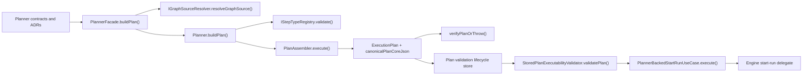
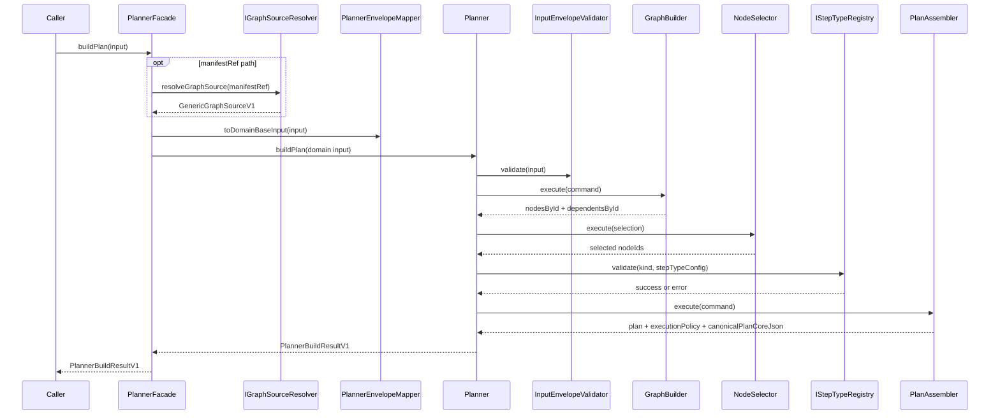
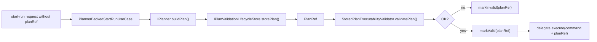

# Planner Current State Assessment

This document is the planner-specific source of truth for the current repository
state.

The first planner assessment was published on `2026-03-20`. This file keeps a
stable name so links do not rot. The content is intentionally limited to claims
that can be verified in the current tree.

## How To Read This Page

Use this page when the question is one of these:

- what the planner bounded context does today
- which packages and methods form the active planner path
- where planner stops and runtime ownership begins
- which gaps are still open in code, not just in proposals

Do not use this page as a roadmap, scorecard, or proposal backlog. The previous
percentage-based assessment drifted from code and has been removed.

## Verification Method

This review was refreshed on `2026-04-08` against the current code and tests in:

- `packages/@dvt/planner/**`
- `packages/@dvt/contracts/src/contracts/planner/**`
- `packages/@dvt/plan-verifier/**`
- `packages/@dvt/plan-interpreter/**`
- `packages/@dvt/dsl/**`
- `apps/api/src/application/services/**`
- `apps/api/src/infrastructure/planner/**`

## Canonical References

- [Governance Document And Rule Inventory](./governance-document-rule-inventory.md)
- [Canonical Doc Code Matrix](./canonical-doc-code-matrix.md)
- [Planner contracts](../../contracts/planner/index.md)
- [ADR-0035 - Planner public contract evolution](../../adr/ADR-0035-planner-public-contract-evolution-protocol.md)
- [ADR-0036 - ExecutionPlan planVersion registry](../../adr/ADR-0036-execution-plan-planversion-registry-and-runtime-matrix.md)
- [Planner component docs](../../architecture/components/planner/index.md)
- [Current status](../../architecture/system-delivery-status.md)

## Current System View

## Current Package Map

| Surface                               | Current role in code                                                                         | Primary anchors                                                                                                                                                                                                                                                                                                                               | Primary evidence                                                                                                                                                                                                                                                                                                                                              |
| ------------------------------------- | -------------------------------------------------------------------------------------------- | --------------------------------------------------------------------------------------------------------------------------------------------------------------------------------------------------------------------------------------------------------------------------------------------------------------------------------------------- | ------------------------------------------------------------------------------------------------------------------------------------------------------------------------------------------------------------------------------------------------------------------------------------------------------------------------------------------------------------- |
| `@dvt/planner`                        | Contract boundary plus deterministic plan compilation                                        | [PlannerFacade.ts](../../../packages/@dvt/planner/src/application/PlannerFacade.ts), [Planner.ts](../../../packages/@dvt/planner/src/domain/Planner.ts), [PlanAssembler.ts](../../../packages/@dvt/planner/src/domain/PlanAssembler.ts)                                                                                                       | `packages/@dvt/planner/test/unit/**`                                                                                                                                                                                                                                                                                                                          |
| planner contracts in `@dvt/contracts` | Public input envelope, execution plan, plan version, plan record, step registry              | [ExecutionPlan.v1.ts](../../../packages/@dvt/contracts/src/contracts/planner/ExecutionPlan.v1.ts), [PlanVersion.v1.ts](../../../packages/@dvt/contracts/src/contracts/planner/PlanVersion.v1.ts), [PlanRecord.v1.ts](../../../packages/@dvt/contracts/src/contracts/planner/PlanRecord.v1.ts)                                                 | `packages/@dvt/contracts/test/**`                                                                                                                                                                                                                                                                                                                             |
| `@dvt/plan-verifier`                  | Version gate plus planId integrity verification                                              | [verify.ts](../../../packages/@dvt/plan-verifier/src/verify.ts)                                                                                                                                                                                                                                                                               | [verify.test.ts](../../../packages/@dvt/plan-verifier/test/verify.test.ts)                                                                                                                                                                                                                                                                                    |
| `@dvt/plan-interpreter`               | Shared DAG analysis helpers used by adapters                                                 | [index.ts](../../../packages/@dvt/plan-interpreter/src/index.ts)                                                                                                                                                                                                                                                                              | `packages/@dvt/plan-interpreter/test/**`                                                                                                                                                                                                                                                                                                                      |
| `@dvt/dsl`                            | Deterministic parser and evaluator for gateway expressions                                   | [index.ts](../../../packages/@dvt/dsl/src/index.ts)                                                                                                                                                                                                                                                                                           | `packages/@dvt/dsl/test/**`                                                                                                                                                                                                                                                                                                                                   |
| `apps/api` planner bridge             | Manifest artifact resolution, stored-plan executability validation, planner-backed start-run | [ManifestArtifactResolver.ts](../../../apps/api/src/infrastructure/planner/ManifestArtifactResolver.ts), [StoredPlanExecutabilityValidator.ts](../../../apps/api/src/application/services/StoredPlanExecutabilityValidator.ts), [PlannerBackedStartRunUseCase.ts](../../../apps/api/src/application/services/PlannerBackedStartRunUseCase.ts) | [PlannerBackedStartRunUseCase.test.ts](../../../apps/api/test/application/services/PlannerBackedStartRunUseCase.test.ts), [StoredPlanExecutabilityValidator.test.ts](../../../apps/api/test/application/services/StoredPlanExecutabilityValidator.test.ts), [plannerEngineContract.test.ts](../../../apps/api/test/integration/plannerEngineContract.test.ts) |

## Public Methods And Boundaries

| Method                                  | Owner                                  | What it does today                                                                                                                                  | Boundary note                                        |
| --------------------------------------- | -------------------------------------- | --------------------------------------------------------------------------------------------------------------------------------------------------- | ---------------------------------------------------- |
| `buildPlan(input)`                      | `PlannerFacade`                        | validates the public envelope, resolves `manifestRef` through `IGraphSourceResolver`, normalizes `graphSource`, and delegates to the domain planner | public planner entrypoint                            |
| `buildPlan(input)` / `execute(command)` | `Planner`                              | validates normalized input, builds graph, applies selection, validates step configs, assembles the canonical plan                                   | pure planner core                                    |
| `execute(command)`                      | `PlanAssembler`                        | hashes planner input, builds `planCore`, computes `planId`, emits `ExecutionPlan`, and returns `canonicalPlanCoreJson` plus `executionPolicy`       | deterministic core plus volatile metadata attachment |
| `resolveGraphSource(ref)`               | `IGraphSourceResolver` implementations | turns `manifestRef` into a validated `GenericGraphSourceV1`                                                                                         | IO boundary outside the planner domain               |
| `verifyPlanOrThrow(params)`             | `@dvt/plan-verifier`                   | checks plan version compatibility and `planId` integrity                                                                                            | verifier, not planner                                |
| `validatePlan(planRef, adapterId)`      | `StoredPlanExecutabilityValidator`     | fetches the stored plan, parses it, checks ref alignment, step-kind support, and required adapter capabilities                                      | API admission bridge                                 |
| `execute(command, context)`             | `PlannerBackedStartRunUseCase`         | compiles when `planRef` is absent, stores the plan, validates executability, marks valid or invalid, then delegates start-run                       | API orchestration, not planner package               |

## Current `buildPlan()` Flow

## Runtime Handoff Today

## Verified Current Truths

- The public planner envelope is `PlannerInputEnvelopeV1`, and the contract allows exactly one active source: `manifestRef` or `graphSource`. The active contract does not publish raw `manifest` or raw `nodes` as public inputs. See [ExecutionPlan.v1.ts](../../../packages/@dvt/contracts/src/contracts/planner/ExecutionPlan.v1.ts).
- The planner application-boundary port is `IGraphSourceResolver`, not `IArtifactResolver`. See [IGraphSourceResolver.ts](../../../packages/@dvt/planner/src/ports/IGraphSourceResolver.ts) and [PlannerFacade.ts](../../../packages/@dvt/planner/src/application/PlannerFacade.ts).
- `PlannerFacade` still carries compatibility aliases `resolver` and `manifestRefCacheSize`, but the canonical names are `graphSourceResolver` and `graphSourceRefCacheSize`. See [PlannerFacade.ts](../../../packages/@dvt/planner/src/application/PlannerFacade.ts).
- The domain planner consumes normalized `graphSource` only and stays IO-free once the facade handoff is complete. See [Planner.ts](../../../packages/@dvt/planner/src/domain/Planner.ts) and [types.ts](../../../packages/@dvt/planner/src/domain/types.ts).
- `PlanAssembler` does not hardcode `planVersion: '2.3'`. It emits `CURRENT_EXECUTION_PLAN_VERSION` from contracts, which is currently `1.0`. See [PlanAssembler.ts](../../../packages/@dvt/planner/src/domain/PlanAssembler.ts) and [PlanVersion.v1.ts](../../../packages/@dvt/contracts/src/contracts/planner/PlanVersion.v1.ts).
- The planner still validates known step kinds through `IStepTypeRegistry`, and unknown step kinds still fail open. This is not a hypothetical gap; it is asserted in [step-registry-integration.test.ts](../../../packages/@dvt/planner/test/unit/step-registry-integration.test.ts).
- `PlanRecord.v1` exists as a governed contract, and the API/runtime path already persists and validates stored plans through `PostgresPlanStore`, `StoredPlanExecutabilityValidator`, and `PlannerBackedStartRunUseCase`. See [PlanRecord.v1.ts](../../../packages/@dvt/contracts/src/contracts/planner/PlanRecord.v1.ts), [StoredPlanExecutabilityValidator.ts](../../../apps/api/src/application/services/StoredPlanExecutabilityValidator.ts), and [PlannerBackedStartRunUseCase.ts](../../../apps/api/src/application/services/PlannerBackedStartRunUseCase.ts).
- The shipped planner package stops at canonical plan construction. Runtime admission, stored-plan lifecycle transitions, and provider dispatch belong to API and engine surfaces, not to `@dvt/planner` itself.

## Verified Open Gaps

- The planner still fails open for unknown step kinds. If the target policy is fail closed end to end, that change has not landed yet. Evidence: [step-registry-integration.test.ts](../../../packages/@dvt/planner/test/unit/step-registry-integration.test.ts).
- `PlanAssembler` still attaches volatile metadata such as `createdAtIso` to the final `ExecutionPlan`, so the strict determinism guarantee applies to `planCore` and `canonicalPlanCoreJson`, not to the full serialized plan object. Evidence: [PlanAssembler.ts](../../../packages/@dvt/planner/src/domain/PlanAssembler.ts).
- The planner package does not ship a default repository-wide production composition for `IGraphSourceResolver`; that composition currently lives in API infrastructure through [ManifestArtifactResolver.ts](../../../apps/api/src/infrastructure/planner/ManifestArtifactResolver.ts).
- This document still depends on summary component pages under `docs/architecture/components/planner/**`. Those pages are maintained as summaries only; normative behavior continues to live in contracts, ADRs, and code.

## Historical Note

The `2026-03-20` assessment was useful as a first pass, but its percentages,
file counts, and several architecture claims drifted. This stable file now
keeps only verifiable current-state material. Historical planner proposals and
older assessment slices belong in planning history, not in the active source of
truth.
