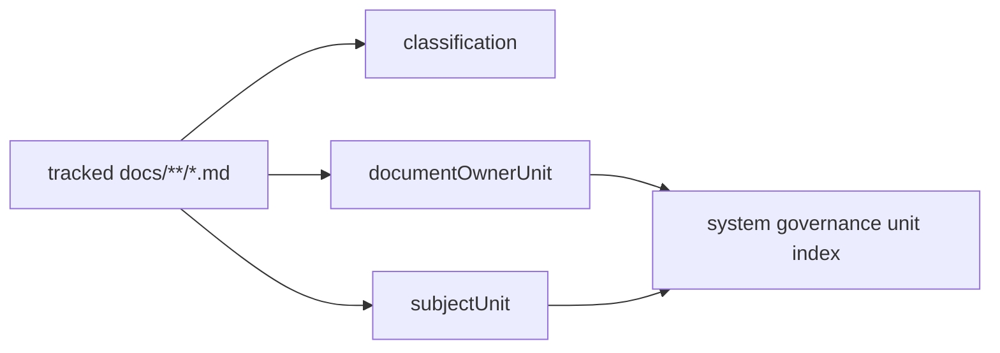

# System Governance Document Unit Map

## Purpose

This map indexes every tracked Markdown document under `docs/**` and attaches
it to the system governance unit model. The extensive per-document inventory is
machine-readable:

- [system-governance-document-unit-map.docs.yaml](./system-governance-document-unit-map.docs.yaml)

This document is the navigation and rationale surface. The YAML file is the
complete index and must contain one entry per tracked document.

## Governing Sources

- `AGENTS.md`
- `docs/planning/status/governance-document-rule-inventory.md`
- `docs/guides/ai-work-protocol.md`
- `docs/architecture/reference-architecture.md`
- `docs/architecture/command-query-rail-governance.md`
- `docs/architecture/fowler-opportunity-planning-governance.md`
- `docs/planning/status/system-governance-unit-taxonomy-20260501.md`
- `docs/planning/status/system-governance-unit-index-20260501.md`

## Model

Each document entry records:

- `path`: tracked Markdown document path.
- `classification`: how the document participates in governance.
- `documentOwnerUnit`: the component/source unit that owns the file itself.
- `subjectUnit`: the system unit primarily governed, described, tracked, or
  evidenced by the document.

The split between `documentOwnerUnit` and `subjectUnit` is intentional.
Documentation files are operationally owned by docs governance, while their
subject may be runtime, plan-store, web, contracts, adapters, or another system
unit.

## Counts

- Documents indexed: 1431

### By Classification

- `describes unit`: 74
- `governs unit`: 507
- `historical/reference only`: 254
- `proves evidence`: 151
- `tracks drift`: 413
- `tracks risk`: 32

### By Subject Unit

- `SYS-ADAPTERS`: 86
- `SYS-API`: 43
- `SYS-CI-GOVERNANCE`: 15
- `SYS-CONTRACTS`: 154
- `SYS-DOCS-GOVERNANCE`: 653
- `SYS-OBSERVABILITY`: 24
- `SYS-PLANNER`: 73
- `SYS-PLANSTORE`: 28
- `SYS-RUNTIME`: 138
- `SYS-TRACEABILITY`: 56
- `SYS-WEB`: 132
- `SYS-WORKERS`: 29

## Diagram



## Mechanical Rule

Run:

```bash
pnpm docs:governance:document-unit-map:check
```

The check regenerates both outputs and fails if the committed map is stale.
Every new tracked Markdown document under `docs/**` must therefore appear in
the YAML index before the docs governance gate can pass.
