# System Governance Unit Index

## Purpose

This index is the root map of governed DVT units. It complements the runtime
operation view in
[System Operations Inventory](./system-operations-inventory-20260501.md) and
uses the rules in
[System Governance Unit Taxonomy](./system-governance-unit-taxonomy-20260501.md).

The companion machine-readable manifest is
[system-governance-unit-index.units.yaml](./system-governance-unit-index.units.yaml).
The manifest is the mechanical source for coverage validation; this document is
the human navigation surface.

## Target Shape

```mermaid
flowchart TB
  DVT["SYS-DVT<br/>DVT system"]
  Contracts["SYS-CONTRACTS"]
  Runtime["SYS-RUNTIME"]
  PlanStore["SYS-PLANSTORE"]
  Api["SYS-API"]
  Web["SYS-WEB"]
  Planner["SYS-PLANNER"]
  Adapters["SYS-ADAPTERS"]
  Workers["SYS-WORKERS"]
  Observability["SYS-OBSERVABILITY"]
  Traceability["SYS-TRACEABILITY"]
  Ci["SYS-CI-GOVERNANCE"]
  Docs["SYS-DOCS-GOVERNANCE"]
  Repo["SYS-REPO-METADATA"]

  DVT --> Contracts
  DVT --> Runtime
  DVT --> PlanStore
  DVT --> Api
  DVT --> Web
  DVT --> Planner
  DVT --> Adapters
  DVT --> Workers
  DVT --> Observability
  DVT --> Traceability
  DVT --> Ci
  DVT --> Docs
  DVT --> Repo

  PlanStore --> PlanStoreContracts["SYS-PLANSTORE-CONTRACTS<br/>drift"]
  PlanStore --> PlanStoreArtifacts["SYS-PLANSTORE-ARTIFACTS-PORTS<br/>review"]
  PlanStore --> PlanStorePostgres["SYS-PLANSTORE-POSTGRES<br/>drift"]
  PlanStore --> PlanStoreApi["SYS-PLANSTORE-API-COMPOSITION<br/>drift"]
  PlanStore --> PlanStoreTemporal["SYS-PLANSTORE-TEMPORAL-COMPOSITION<br/>legacy"]
  PlanStore --> PlanStoreEngine["SYS-PLANSTORE-ENGINE-FETCH<br/>drift"]
  PlanStore --> PlanStoreDocs["SYS-PLANSTORE-DOCS-RISK<br/>review"]
  Web --> WebRoot["SYS-WEB-ROOT<br/>coverage-required"]
  Api --> ApiRoot["SYS-API-ROOT<br/>coverage-required"]
```



What we are building:

```text
Every tracked file
  -> exactly one component/source owner
  -> parent workspace/domain/system
  -> DDD owner and C&Q posture
  -> governing docs, tests, drift, and next subdivision
```

## Root Units

| Unit                  | Level       | Status              | Initial component owner    | Governance                                                     |
| --------------------- | ----------- | ------------------- | -------------------------- | -------------------------------------------------------------- |
| `SYS-DVT`             | `system`    | `review`            | none                       | Reference architecture, domain language, governance inventory  |
| `SYS-CONTRACTS`       | `workspace` | `coverage-required` | `SYS-CONTRACTS-ROOT`       | Contracts index, ADR-0005, ADR-0006, ADR-0018                  |
| `SYS-RUNTIME`         | `domain`    | `coverage-required` | `SYS-RUNTIME-ROOT`         | Execution model, engine contracts, system operations inventory |
| `SYS-PLANSTORE`       | `domain`    | `review`            | `SYS-PLANSTORE-*` units    | S08 C&Q matrix, system operations inventory, ADR-0043          |
| `SYS-API`             | `workspace` | `coverage-required` | `SYS-API-ROOT`             | API runtime docs and operations inventory                      |
| `SYS-WEB`             | `workspace` | `coverage-required` | `SYS-WEB-ROOT`             | Frontend proposals and future UI/API C&Q inventory             |
| `SYS-PLANNER`         | `workspace` | `coverage-required` | `SYS-PLANNER-ROOT`         | Planner contracts and planner proposals                        |
| `SYS-ADAPTERS`        | `domain`    | `coverage-required` | `SYS-ADAPTERS-ROOT`        | Adapter ADRs and operations inventory                          |
| `SYS-WORKERS`         | `domain`    | `coverage-required` | `SYS-WORKERS-ROOT`         | Worker runtime docs and operations inventory                   |
| `SYS-OBSERVABILITY`   | `domain`    | `coverage-required` | `SYS-OBSERVABILITY-ROOT`   | Observability ports and ops docs                               |
| `SYS-TRACEABILITY`    | `domain`    | `coverage-required` | `SYS-TRACEABILITY-ROOT`    | ADR-0000, traceability docs, lineage docs                      |
| `SYS-CI-GOVERNANCE`   | `workspace` | `coverage-required` | `SYS-CI-GOVERNANCE-ROOT`   | CI workflows, scripts, tools, hooks                            |
| `SYS-DOCS-GOVERNANCE` | `workspace` | `coverage-required` | `SYS-DOCS-GOVERNANCE-ROOT` | Docs governance, planning, ADRs, risk, evidence                |
| `SYS-REPO-METADATA`   | `workspace` | `canonical`         | `SYS-REPO-METADATA-ROOT`   | Root config and repository metadata                            |

## Initial Component Ownership

The first manifest pass intentionally uses broad component owners so every
tracked file is covered mechanically. Broad component owners remain
`coverage-required` until child units replace them.

| Component                  | Owns                                                        | Next subdivision                               |
| -------------------------- | ----------------------------------------------------------- | ---------------------------------------------- |
| `SYS-API-ROOT`             | `apps/api/**`                                               | routes, use cases, modules, db, ops            |
| `SYS-WEB-ROOT`             | `apps/web/**`                                               | views, API client, state, tests, workflows     |
| `SYS-CONTRACTS-ROOT`       | `packages/@dvt/contracts/**`, `contracts/**`                | contract families and schema packs             |
| `SYS-RUNTIME-ROOT`         | engine, state-store, delivery, run-domain packages          | engine core, state store, delivery projections |
| `SYS-PLANSTORE-*`          | 107 plan-store files across code, tests, docs, risks        | source/symbol split and legacy removal         |
| `SYS-ADAPTERS-ROOT`        | adapter packages                                            | Postgres, Temporal, adapter test surfaces      |
| `SYS-WORKERS-ROOT`         | worker apps                                                 | Temporal, outbox, projector, lineage workers   |
| `SYS-OBSERVABILITY-ROOT`   | observability packages                                      | ports, OTEL adapter, ops endpoints             |
| `SYS-TRACEABILITY-ROOT`    | traceability package and manifests                          | ADR-0000 graph, lineage, evidence exports      |
| `SYS-CI-GOVERNANCE-ROOT`   | `.github/**`, `scripts/**`, `tools/**`, hooks and CI config | workflow checks, docs scripts, release config  |
| `SYS-DOCS-GOVERNANCE-ROOT` | `docs/**`, `runbooks/**`, root contributor docs             | ADRs, planning, risk, evidence, runbooks       |
| `SYS-REPO-METADATA-ROOT`   | root metadata files and repository support folders          | package/build/tooling config groups            |

## First Deep Subdivisions

### `SYS-PLANSTORE`

Current children:

- `SYS-PLANSTORE-CONTRACTS`
- `SYS-PLANSTORE-ARTIFACTS-PORTS`
- `SYS-PLANSTORE-POSTGRES`
- `SYS-PLANSTORE-API-COMPOSITION`
- `SYS-PLANSTORE-TEMPORAL-COMPOSITION`
- `SYS-PLANSTORE-ENGINE-FETCH`
- `SYS-PLANSTORE-DOCS-RISK`

File ownership report:

- [System Governance Plan-Store File Ownership](./system-governance-planstore-file-ownership-20260501.md)

Current total:

- repository tracked files: 4018;
- plan-store governed files: 107;
- ungoverned files: 0, enforced by `pnpm docs:governance:unit-coverage`.

### `SYS-WEB`

Required children:

- `SYS-WEB-ADMIN`
- `SYS-WEB-RUNS`
- `SYS-WEB-PLANS`
- `SYS-WEB-API-CLIENT`
- `SYS-WEB-STATE`
- `SYS-WEB-TESTS`

## Validation

Run:

```bash
pnpm docs:governance:unit-coverage
```

This checks that every tracked file has exactly one owning component/source
unit and that all units obey the taxonomy parent chain.
