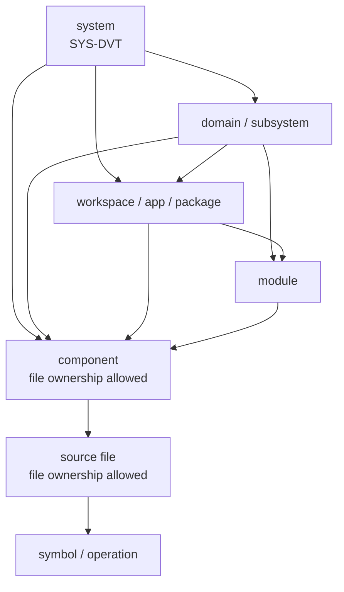

# System Governance Unit Taxonomy

## Purpose

This taxonomy defines the mechanical model used to subdivide DVT into governed
units. It is the rulebook for the companion unit index and machine-readable
manifest:

- [System Governance Unit Index](./system-governance-unit-index-20260501.md)
- [System Governance Unit Manifest](./system-governance-unit-index.units.yaml)
- [System Governance File Index](./system-governance-file-index-20260501.md)
- [System Governance Component Index](./system-governance-component-index-20260501.md)

The rule is strict: every tracked repository file must belong to exactly one
governance unit. File ownership belongs to `component` or `source` units only.
Components must belong to a module, workspace, domain, or system unit. Source
units must belong to a component. Symbol units must belong to a source unit.

## Governing Sources

- `AGENTS.md`
- `docs/planning/status/governance-document-rule-inventory.md`
- `docs/guides/ai-work-protocol.md`
- `docs/architecture/reference-architecture.md`
- `docs/architecture/command-query-rail-governance.md`
- `docs/architecture/fowler-opportunity-planning-governance.md`
- `docs/planning/proposals/mandatory/governance-and-docs/system-governance-unit-index-plan-20260501.md`

## Unit Hierarchy



ASCII fallback:

```text
system
  -> domain / subsystem
    -> workspace / app / package
      -> module
        -> component
          -> source file
            -> exported symbol / operation
```

## Levels

| Level       | Meaning                                                        | May own files |
| ----------- | -------------------------------------------------------------- | ------------- |
| `system`    | Root system or repository-wide governance area                 | No            |
| `domain`    | Bounded context or subsystem                                   | No            |
| `workspace` | Deployable app, package, or top-level workspace family         | No            |
| `module`    | Internal module or grouped capability                          | No            |
| `component` | Governable implementation component                            | Yes           |
| `source`    | Individual source file when file-level governance is needed    | Yes           |
| `symbol`    | Exported symbol, operation, command, query, class, or function | No            |

File ownership is intentionally restricted to `component` and `source`. This
prevents large workspaces from claiming completion while hiding unclassified
components.

## Status Values

| Status              | Meaning                                                                |
| ------------------- | ---------------------------------------------------------------------- |
| `canonical`         | Current code, docs, tests, and governance agree                        |
| `review`            | Unit is documented and awaiting architecture review or acceptance      |
| `drift`             | Unit violates a governance rule but is not necessarily legacy behavior |
| `legacy`            | Unit is active or importable but must be removed or superseded         |
| `coverage-required` | Unit is known but must be subdivided before related closure is claimed |
| `superseded`        | Unit remains only as historical or transition context                  |

`coverage-required` is not drift. It means the repository knows the unit exists
but has not yet decomposed it deeply enough to judge every child surface.

## Required Unit Fields

| Field              | Rule                                                                                  |
| ------------------ | ------------------------------------------------------------------------------------- |
| `id`               | Stable uppercase identifier, for example `SYS-PLANSTORE-POSTGRES-ROOT`                |
| `name`             | Human-readable unit name                                                              |
| `level`            | One value from the level table                                                        |
| `parent`           | Required except for the root `system` unit                                            |
| `status`           | One value from the status table                                                       |
| `owns`             | Glob patterns; allowed only on `component` and `source` units                         |
| `excludes`         | Glob patterns removed from this unit's broad `owns` patterns                          |
| `childrenRequired` | `true` when the unit is too broad to claim final closure                              |
| `dddOwner`         | Bounded context, `AGG`, `DS`, `AS`, `PORT`, `ADP`, `PROJ`, `INFRA`, `ENTRY`, or `N/A` |
| `cqRails`          | Accepted/proposed command/query rails, or `none` with rationale                       |
| `governance`       | ADRs, contracts, proposals, reviews, status docs, risk entries, or evidence docs      |
| `fowlerSignals`    | Fowler opportunity signals that explain the split or current drift                    |

## Mechanical Rules

The manifest is validated by:

```bash
pnpm docs:governance:unit-coverage
```

The guard checks:

- every tracked file returned by `git ls-files` has exactly one owning unit;
- only `component` and `source` units own files;
- broad owners may use `excludes` only when child or peer units own the
  excluded files explicitly;
- every non-root unit has a valid parent;
- parent levels follow the hierarchy in this taxonomy;
- source units have component parents;
- symbol units have source parents;
- parent chains are acyclic;
- overlapping ownership patterns fail.

Feature implementation closure is validated by:

```bash
pnpm docs:feature-mechanization
```

Feature-specific validation uses:

```bash
pnpm docs:feature-mechanization:tf-e2-m-b
```

The feature mechanization guard checks that a feature plan with a
`feature-mechanization` manifest has:

- a closed mechanization status;
- `noHumanDecisionsRemaining: true`;
- C&Q rails with DDD owners;
- red/green cycles with red test command, expected failure, patch surfaces, and
  green test command;
- new symbols tied to C&Q, DDD, Fowler signals, architecture guard, Cypress
  coverage, and unit tests;
- completion gates including `pnpm verify:prepush`.

The file and component indexes are generated by:

```bash
pnpm docs:governance:file-component-index
```

The guard checks that the committed exhaustive file/component indexes are fresh:

```bash
pnpm docs:governance:file-component-index:check
```

## Command And Query Rule

Commands and queries must attach to DDD ownership. A unit may list
`cqRails: none` only when it is infrastructure, documentation, generated
metadata, or a passive artifact with no externally observable behavior.

Free-floating C&Q labels are invalid. A command or query must be owned by an
aggregate, domain service, application service, read model, projection, or
owned port.

## Fowler Review Rule

Each subdivision pass must state why the split exists. Accepted signals are:

- boundary drift;
- responsibility overload;
- duplicate semantics;
- feature envy;
- primitive obsession;
- data clump;
- hidden authority;
- anemic domain;
- test-only confidence;
- documentation drift;
- coverage refinement.

Coverage refinement is valid only when the parent is broad and no behavior
judgment is being made yet.

## Closure Rule

No implementation closure may claim a system area is governed while any
required child remains `coverage-required`, `drift`, or `legacy` without an
accepted risk or explicit follow-up unit.

No governed feature plan may claim fully mechanical implementation when the
feature-specific mechanization guard fails or when a required
`feature-mechanization` manifest is absent.
