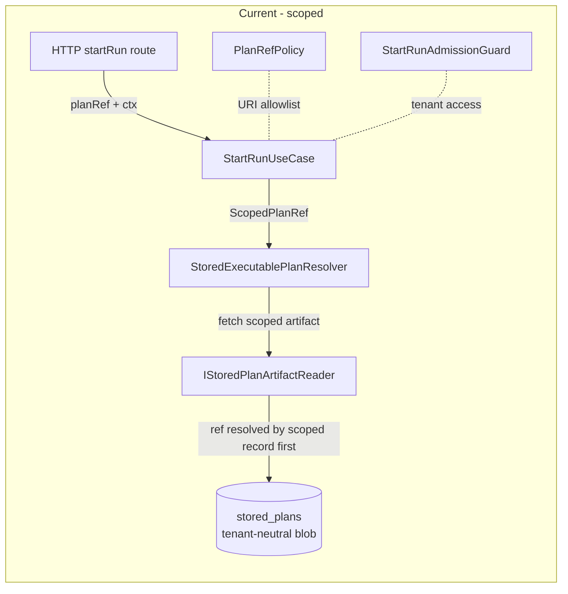
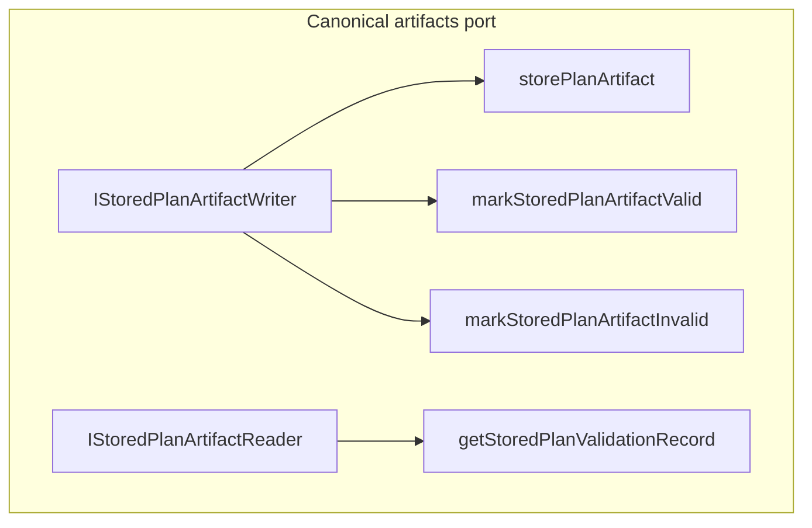
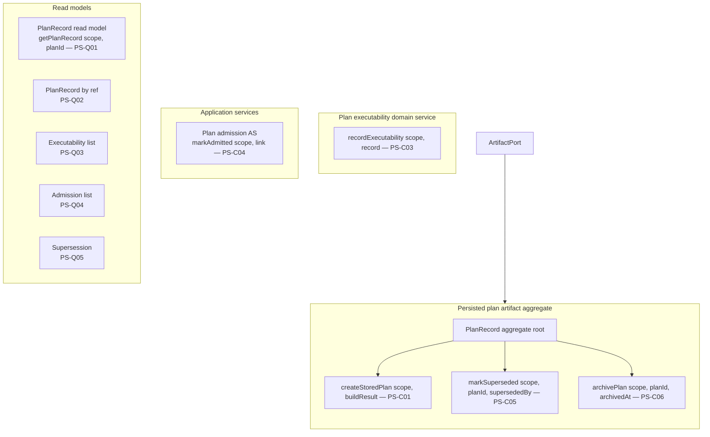

# System Operations Inventory

## Purpose

This is a grouped per-file inventory of the runtime/domain backbone operations
(command, query, domain behavior, adapter call, application service, route
handler) that the runtime graph of DVT+ exposes. For each covered operation it
answers four questions:

1. Is the operation **legacy**? If so, classify and mark for removal.
2. Is the operation modeled as **C&Q (Command/Query Separation)**? If not,
   describe the C&Q shape it should take.
3. Does the operation have an explicit **DDD owner** (aggregate root, domain
   service, application service, owned port)? If not, describe the DDD shape it
   should take and provide a remediation diagram.
4. Where does the operation live (file, symbol, package)?

The inventory is **descriptive**, not prescriptive: it does not change behavior.
It is a review-ready status surface intended to feed scoped C&Q matrices (see the S08
plan-store matrix as the precedent template:
`docs/planning/proposals/mandatory/runtime-and-contracts/s08-plan-store-command-query-matrix-20260501.md`).
It also feeds the broader system governance unit index:
`docs/planning/status/system-governance-unit-index-20260501.md`.

## Governing Sources

- `AGENTS.md` (mandatory startup)
- `docs/planning/status/governance-document-rule-inventory.md`
- `docs/adr/ADR-0003-execution-model.md` (DVT-owned execution lifecycle)
- `docs/adr/ADR-0004-event-sourcing-strategy.md` (write/read separation,
  ordering, idempotency, tenant scoping)
- `docs/adr/ADR-0014-run-driven-adapter-model.md`
- `docs/adr/ADR-0015-getRunStatus-read-model-separation.md`
- `docs/adr/ADR-0018_Shared_Kernel_Ownership_Governance.md`
- `docs/adr/ADR-0029-run-maintenance-service.md`
- `docs/adr/ADR-0031-adapter-tenant-isolation.md`
- `docs/adr/ADR-0034-bounded-context-boundaries-and-communication-rules.md`
- `docs/adr/ADR-0035-planner-public-contract-evolution-protocol.md`
- `docs/adr/ADR-0043-plan-record-plan-store-and-artifacts-ownership.md`
- `docs/architecture/reference-architecture.md`
- `docs/planning/execution-model/dvt-execution-model.md`
- `docs/contracts/index.md`
- S08 plan-store C&Q matrix (template for scoped C&Q rows)

## Classification Vocabulary

### DDD owner classes

| Code    | Meaning                                     | Example                                |
| ------- | ------------------------------------------- | -------------------------------------- |
| `AGG`   | Aggregate root behavior                     | `Run.cancel()`, `PlanRecord.archive()` |
| `DS`    | Domain service                              | `PlanExecutability` validator          |
| `AS`    | Application service / use case orchestrator | `StartRunApplicationService.start()`   |
| `PORT`  | Owned port (interface) declared by a domain | `IRunStateStore`, `IPlanStoreWriter`   |
| `ADP`   | Adapter implementation of an owned port     | `PostgresPlanStore`                    |
| `PROJ`  | Read-model / projection                     | `getRunStatus` read model              |
| `INFRA` | Infrastructure helper (no domain meaning)   | SQL connection wrapper                 |
| `ENTRY` | Process / runtime entrypoint                | HTTP route, worker bootstrap           |
| `?`     | Unclear ownership — drift                   | Free-floating helper, repo method      |

### C&Q classification

| Code      | Meaning                                                    |
| --------- | ---------------------------------------------------------- |
| `CMD`     | Pure command (mutates state, returns void / minimal ack)   |
| `QRY`     | Pure query (read-only, no side effects)                    |
| `CMD-RET` | Command that returns mutated state (acceptable but noted)  |
| `MIXED`   | Mixes command and query side effects — drift               |
| `LIFE`    | Lifecycle / state-machine transition (acceptable as `CMD`) |
| `FETCH`   | Adapter-level fetch crossing boundary (sub-`QRY`)          |
| `EVENT`   | Event-publishing operation (acceptable as `CMD`)           |
| `N/A`     | Pure type / DTO / contract — not an operation              |

### Legacy classification

| Code     | Meaning                                                              |
| -------- | -------------------------------------------------------------------- |
| `OK`     | Current canonical surface                                            |
| `LEGACY` | Active runtime behavior pending removal (blocking drift)             |
| `SUPER`  | Superseded by another surface, still callable                        |
| `MIGR`   | One-way migration asset only — must not be used as runtime authority |
| `DRAFT`  | Under construction, not yet runtime-active                           |

## Coverage Note (Honesty)

The repository carries 1216 source files in 24 workspaces. This inventory
covers the runtime/domain backbone first. Pending workspaces are listed at the
bottom under "Coverage Gaps" as explicit coverage gaps, not silent omission.

Covered in this pass:

- `@dvt/contracts`
- `@dvt/run-domain`
- `@dvt/state-store`
- `@dvt/engine`
- `@dvt/artifacts`
- `@dvt/planner`
- `@dvt/adapter-postgres`
- `@dvt/adapter-temporal`
- `@dvt/delivery`
- `@dvt/traceability-service`
- `@dvt/observability` and `@dvt/observability-otel`
- `@dvt/plan-interpreter`, `@dvt/plan-verifier`, `@dvt/crypto`, `@dvt/dsl`,
  `@dvt/cli`
- `apps/api`
- `apps/temporal-worker`, `apps/outbox-worker`, `apps/projector-worker`,
  `apps/lineage-worker`

Pending in this pass:

- `apps/web` (524 files; frontend, deferred — see Coverage Gaps section)

---

<!-- INVENTORY BODY BEGINS BELOW -->

## 1. `@dvt/contracts`

`@dvt/contracts` is the shared kernel (ADR-0018). It must contain only
versioned serializable vocabulary, DTOs, schemas, refs, envelopes, parsers, and
error vocabulary. Behavior ports are inventoried by their owner packages.

### 1.1 Engine contracts

**File**: `packages/@dvt/engine/src/ports/IRunStateStore.ts`

| Symbol / operation                                                  | DDD                                            | C&Q          | Legacy      | Notes                                                                                                                                                                                             |
| ------------------------------------------------------------------- | ---------------------------------------------- | ------------ | ----------- | ------------------------------------------------------------------------------------------------------------------------------------------------------------------------------------------------- |
| `IRunStateStoreWrite.bootstrapRunTx(input)`                         | `PORT` (engine-owned, run aggregate write)     | `CMD`        | `OK`        | Atomic run bootstrap (ADR-0013).                                                                                                                                                                  |
| `IRunStateStoreWrite.appendAndEnqueueTx(runId, events)`             | `PORT` (run aggregate event append)            | `CMD-RET`    | `OK`        | Append-only event log (ADR-0004). Returns `AppendResult` for dedup ack — acceptable as command result.                                                                                            |
| `IRunStateStoreWrite.saveProviderRef(tenantId, runId, providerRef)` | `PORT` (run aggregate metadata reconciliation) | `CMD-RET`    | `OK`        | Tenant-scoped — correct shape.                                                                                                                                                                    |
| `IRunStateStoreWrite.bootstrapRecoveryRunTx(...)`                   | `PORT` (atomic recovery-child bootstrap)       | `CMD-RET`    | `OK`        | Resolves and reserves retry lineage, then persists child metadata, first events, and outbox rows in one transaction.                                                                              |
| `IRunStateStoreRead.getRunMetadataByRunId(tenantId, runId)`         | `PROJ`                                         | `QRY`        | `OK`        | Tenant-scoped read.                                                                                                                                                                               |
| `IRunStateStoreRead.listEvents(tenantId, runId, opts)`              | `PROJ`                                         | `QRY`        | `OK`        | Cursor-based — recommended.                                                                                                                                                                       |
| `IRunStateStoreRead.listRuns(opts)`                                 | `PROJ`                                         | `QRY`        | `OK`        | Tenant required by `ListRunsOptions`.                                                                                                                                                             |
| `IRunStateStoreRead.getSnapshot(tenantId, runId)`                   | `PROJ` (read model)                            | `QRY`        | `OK`        | ADR-0015 read-model separation.                                                                                                                                                                   |
| `IRunStateStoreMaintenance.rebuildSnapshot(tenantId, runId)`        | `DS` (maintenance domain service via port)     | `CMD-RET`    | `OK`        | ADR-0029 maintenance service.                                                                                                                                                                     |
| `IRunStateStore` (combined alias)                                   | `PORT` agg                                     | n/a          | **`SUPER`** | Mixes write+read+maintenance concerns; ADR-0034 prefers narrowed segregated ports. Composition is acceptable for adapter classes but consumers should depend only on the narrowed face they need. |
| `RunStateCommandPort.bootstrapRun(input)`                           | `PORT`                                         | `CMD`        | `OK`        | Public command façade for write side.                                                                                                                                                             |
| `RunStateCommandPort.appendTransitions(runId, events)`              | `PORT`                                         | `CMD-RET`    | `OK`        | Public command façade.                                                                                                                                                                            |
| `IStoredPlanArtifactReader.fetchStoredPlanArtifact(ScopedPlanRef)`  | `PORT` (artifacts-owned executable fetch)      | `FETCH`      | `OK`        | Scoped artifact query carries `(tenantId, projectId, environmentId, planRef)` before runtime dispatch. See diagram §18.1.                                                                         |
| `IPlanIntegrityValidator.fetchAndValidate(input, fetcher)`          | `DS` (engine integrity domain)                 | `QRY`        | `OK`        | Engine validates the fetched artifact through the artifacts reader without owning plan-store persistence.                                                                                         |
| `IIdempotencyKeyBuilder.runEventKey/startRunIntentId/eventId`       | `DS` (deterministic identity)                  | `QRY` (pure) | `OK`        | Pure functions; `INV-INTENT-011`.                                                                                                                                                                 |
| `IClock.nowIsoUtc()`                                                | `INFRA`                                        | `QRY`        | `OK`        | Determinism boundary.                                                                                                                                                                             |

**File**: `packages/@dvt/contracts/src/contracts/engine/IWorkflowEngine.v1.ts`

| Symbol                                                                                                       | DDD   | C&Q   | Legacy | Notes                                                                                     |
| ------------------------------------------------------------------------------------------------------------ | ----- | ----- | ------ | ----------------------------------------------------------------------------------------- |
| Re-exports only (`CanonicalRunStatus`, `EngineRunRef`, `RunContext`, `RunStatusEnrichment`, `SignalRequest`) | `N/A` | `N/A` | `OK`   | The interface itself is declared in `@dvt/engine`. This file is a contract surface alias. |

**File**: `packages/@dvt/contracts/src/contracts/engine/StartRunBoundary.v1.ts`

| Symbol                                                                                           | DDD                 | C&Q                          | Legacy | Notes                                   |
| ------------------------------------------------------------------------------------------------ | ------------------- | ---------------------------- | ------ | --------------------------------------- |
| `StartRunCommand` (DTO)                                                                          | `N/A`               | `N/A` (CMD shape)            | `OK`   | Canonical API→engine command.           |
| `StartRunAcceptedResult` / `StartRunDuplicateResult` / `StartRunTenantBackpressureResult` / etc. | `N/A`               | `N/A` (result discriminator) | `OK`   | Discriminated union for command result. |
| `formatUnsupportedPlanVersionReason(planVersion)`                                                | `INFRA` (formatter) | `QRY` (pure)                 | `OK`   | Pure formatter.                         |
| `isStartRunTargetAdapter(value)`                                                                 | `INFRA` (guard)     | `QRY` (pure)                 | `OK`   | Type guard.                             |

**File**: `packages/@dvt/contracts/src/contracts/engine/IOutboxStorage.v1.ts`

| Symbol                                   | DDD   | C&Q   | Legacy | Notes                            |
| ---------------------------------------- | ----- | ----- | ------ | -------------------------------- |
| `OutboxRecord`, `DeadLetterRecord` (DTO) | `N/A` | `N/A` | `OK`   | Outbox storage shape (ADR-0033). |

**File**: `packages/@dvt/engine/src/ports/IProjector.ts`

| Symbol                              | DDD                 | C&Q          | Legacy | Notes            |
| ----------------------------------- | ------------------- | ------------ | ------ | ---------------- |
| `IProjector.rebuild(runId, events)` | `PORT` (projection) | `QRY` (pure) | `OK`   | Pure event-fold. |

**File**: `packages/@dvt/contracts/src/contracts/engine/SignalSemantics.v1.ts`

| Symbol                                                     | DDD                              | C&Q   | Legacy | Notes                                 |
| ---------------------------------------------------------- | -------------------------------- | ----- | ------ | ------------------------------------- |
| `resolveSignalSemanticsContract(supportedVersions)`        | `DS` (signal semantics resolver) | `QRY` | `OK`   | Pure resolver; throws on unsupported. |
| `getSignalDerivedEventType(signalType, supportedVersions)` | `DS`                             | `QRY` | `OK`   | Pure mapping.                         |
| `SIGNAL_SEMANTICS_REGISTRY`                                | `N/A` (data)                     | `N/A` | `OK`   | Contract data.                        |

**File**: `packages/@dvt/contracts/src/contracts/engine/RunExecutionPolicy.v1.ts`,
`RunExecutionContext.v1.ts`, `ExecutionSemantics.v1.ts`

| Symbol                                         | DDD                  | C&Q           | Legacy | Notes                           |
| ---------------------------------------------- | -------------------- | ------------- | ------ | ------------------------------- |
| Zod schemas (`RunExecutionPolicySchema`, etc.) | `INFRA` (validation) | `QRY` (parse) | `OK`   | Boundary validators (ADR-0005). |

**File**: `packages/@dvt/contracts/src/engine/IRunSnapshotStalenessQuery.v1.ts`

| Symbol                                                        | DDD                          | C&Q   | Legacy | Notes                               |
| ------------------------------------------------------------- | ---------------------------- | ----- | ------ | ----------------------------------- |
| `IRunSnapshotStalenessQuery.isSnapshotStale(tenantId, runId)` | `PORT` (read-only staleness) | `QRY` | `OK`   | Tenant-scoped, ADR-0029 separation. |
| `IRunSnapshotStalenessQuery.listStaleSnapshotRuns(batchSize)` | `PORT`                       | `QRY` | `OK`   | Worker-driven projection catch-up.  |

### 1.2 Planner contracts

**File**: `packages/@dvt/contracts/src/contracts/planner/IExecutionPlanner.v1.ts`

| Symbol                                                  | DDD                                       | C&Q                              | Legacy | Notes                                              |
| ------------------------------------------------------- | ----------------------------------------- | -------------------------------- | ------ | -------------------------------------------------- |
| `IPlanner.buildPlan(input)`                             | `AS` shape (planner application boundary) | `CMD-RET` (returns build result) | `OK`   | Acceptable as a "compile/return artifact" command. |
| `IPlanner.deriveExecutableSubgraph({draft, selection})` | `DS` (planner domain service)             | `QRY` (pure derivation)          | `OK`   | Pure functional derivation.                        |
| `IExecutionPlanner` alias                               | `N/A`                                     | `N/A`                            | `OK`   | Named alias only.                                  |

**File**: `packages/@dvt/contracts/src/contracts/planner/StoredPlanArtifactValidation.v1.ts`

| Symbol                                                                   | DDD   | C&Q   | Legacy | Notes                                                                                            |
| ------------------------------------------------------------------------ | ----- | ----- | ------ | ------------------------------------------------------------------------------------------------ |
| `StoredPlanArtifactValidationState`                                      | `N/A` | `N/A` | `OK`   | DTO vocabulary for tenant-neutral artifact validation state; not a plan-record lifecycle facade. |
| `StoredPlanArtifactValidationRecord`                                     | `N/A` | `N/A` | `OK`   | Returned only through scoped artifact validation queries.                                        |
| Retired `PlanValidationLifecycle.v1` / `PlanValidationRecord` vocabulary | n/a   | n/a   | `OK`   | Removed from active contracts and root exports by S08 lifecycle contract retirement.             |

**File**: `packages/@dvt/contracts/src/contracts/planner/PlanExecutabilityValidation.v1.ts`

| Symbol                                                         | DDD   | C&Q   | Legacy | Notes                            |
| -------------------------------------------------------------- | ----- | ----- | ------ | -------------------------------- |
| `ExecutabilityRejectionCode` / `ExecutabilityValidationResult` | `N/A` | `N/A` | `OK`   | Validation result discriminator. |
| `EXECUTABILITY_REJECTION_CODES`                                | `N/A` | `N/A` | `OK`   |                                  |

**File**: `packages/@dvt/contracts/src/contracts/planner/PlanAdmission.v1.ts`

| Symbol                                                                  | DDD                     | C&Q          | Legacy | Notes                      |
| ----------------------------------------------------------------------- | ----------------------- | ------------ | ------ | -------------------------- |
| `isAdmittedExecutionPlanPair(planVersion, schemaVersion)`               | `DS` (admission policy) | `QRY` (pure) | `OK`   | ADR-0036 admission matrix. |
| `EXECUTION_PLAN_ADMISSION_REGISTRY` / `EXECUTION_PLAN_ADMISSION_MATRIX` | `N/A` (data)            | `N/A`        | `OK`   |                            |

**File**: `packages/@dvt/contracts/src/contracts/planner/PlanRecord.v1.ts`,
`PlanExecutabilityRecord.v1.ts`, `PlanAdmissionLink.v1.ts` and their `.schema.json` siblings

| Symbol                                            | DDD   | C&Q   | Legacy | Notes                                                                                    |
| ------------------------------------------------- | ----- | ----- | ------ | ---------------------------------------------------------------------------------------- |
| Record DTOs with top-level `PlanStoreScope` tuple | `N/A` | `N/A` | `OK`   | S08-DRIFT-01, S08-DRIFT-17, and S08-DRIFT-32 are closed for the published record family. |

**File**: `packages/@dvt/contracts/src/contracts/planner/ExecutionPlan.v1.ts`,
`ExecutableSubgraph.v1.ts`, `ExecutionSelection.v1.ts`,
`PlanCompileStepTypeConfigs.v1.ts`, `PlannerPolicyVocabulary.v2.ts`,
`PolicyMappingTable.v1.ts`, `StepKindRegistry.v1.ts`,
`TransformationFlow*.v1.ts`, `WorkspaceGraph*.v1.ts`,
`PlanVersion.v1.ts`, `ExecutionBindingVerification.v1.ts`,
`CustomPolicyNamespaceRegistry.v1.ts`

| Symbol category                              | DDD     | C&Q          | Legacy | Notes                                                   |
| -------------------------------------------- | ------- | ------------ | ------ | ------------------------------------------------------- |
| Type/DTO contracts (no behavior)             | `N/A`   | `N/A`        | `OK`   | Pure shape contracts; behavior lives in `@dvt/planner`. |
| Pure helpers / type guards (`isSomethingFn`) | `INFRA` | `QRY` (pure) | `OK`   | Pure validators.                                        |

### 1.3 Adapter contracts

**File**: `packages/@dvt/engine/src/adapters/IProviderAdapter.ts`

| Symbol                                           | DDD                       | C&Q          | Legacy | Notes                                 |
| ------------------------------------------------ | ------------------------- | ------------ | ------ | ------------------------------------- |
| `IProviderAdapter.startRun(planRef, ctx)`        | `PORT` (provider adapter) | `CMD-RET`    | `OK`   | ADR-0014. `ctx` carries tenant scope. |
| `IProviderAdapter.cancelRun(runRef)`             | `PORT`                    | `CMD`        | `OK`   |                                       |
| `IProviderAdapter.getProviderStatusView(runRef)` | `PORT`                    | `QRY`        | `OK`   | Provider-side projection.             |
| `IProviderAdapter.signal(runRef, request)`       | `PORT`                    | `CMD`        | `OK`   |                                       |
| `IProviderAdapter.signalSemanticsVersions()`     | `PORT`                    | `QRY` (pure) | `OK`   | Capability advertisement.             |
| `IProviderAdapter.estimateRunRef?(ctx)`          | `PORT`                    | `QRY` (pure) | `OK`   | Optional deterministic estimate.      |

### 1.4 Errors, schemas, validation

**File**: `packages/@dvt/contracts/src/errors.ts`, `errorContract.ts`,
`schemas.ts`, `workflows.ts`, `validation.ts`,
`validation/{core,events,planner,runtime}.ts`

| Symbol category                                           | DDD                                | C&Q                | Legacy | Notes                                                           |
| --------------------------------------------------------- | ---------------------------------- | ------------------ | ------ | --------------------------------------------------------------- |
| Error classes (`InvalidEventError`, error codes)          | `INFRA` (cross-cutting vocabulary) | `N/A`              | `OK`   | ADR-0012A canonical error codes.                                |
| `validation/*.ts` parse helpers                           | `INFRA`                            | `QRY` (pure parse) | `OK`   | Boundary validators fail closed on unscoped plan-store records. |
| `schema-packs/plan-records.ts`                            | `INFRA`                            | `N/A`              | `OK`   | Validates scoped plan-store record contracts.                   |
| `schema-packs/{run-events,start-run,plan-preview,...}.ts` | `INFRA`                            | `N/A`              | `OK`   | Boundary schema packs.                                          |

### 1.5 Step type registry

**File**: `packages/@dvt/contracts/src/step-registry/StepTypeRegistry.ts`,
`BuiltInStepTypeEntries.ts`, `DbtStepTypeConfig.ts`

| Symbol                     | DDD                        | C&Q          | Legacy | Notes               |
| -------------------------- | -------------------------- | ------------ | ------ | ------------------- |
| `StepTypeRegistry` lookups | `DS` (step-kind authority) | `QRY` (pure) | `OK`   | Read-only registry. |

### 1.6 Utils

**File**: `packages/@dvt/contracts/src/utils/{contractPrimitives,jcsCanonicalize,sha256HexUtf8}.ts`

| Symbol                                                       | DDD     | C&Q          | Legacy | Notes                   |
| ------------------------------------------------------------ | ------- | ------------ | ------ | ----------------------- |
| `jcsCanonicalize(value)`, `sha256HexUtf8(value)`, validators | `INFRA` | `QRY` (pure) | `OK`   | Determinism primitives. |

### 1.7 Public barrel

**File**: `packages/@dvt/contracts/src/index.ts`

| Symbol                                                                                     | DDD | C&Q | Legacy | Notes                                                                       |
| ------------------------------------------------------------------------------------------ | --- | --- | ------ | --------------------------------------------------------------------------- |
| Re-export of `StoredPlanArtifactValidation.v1` artifact DTO vocabulary                     | n/a | n/a | `OK`   | Active S08 artifact-validation vocabulary; no lifecycle facade is exported. |
| Re-exports of scoped `PlanRecord.v1`, `PlanExecutabilityRecord.v1`, `PlanAdmissionLink.v1` | n/a | n/a | `OK`   | Published record DTOs now carry the scope tuple required by S08.            |
| Re-exports of engine ports, start-run boundary, signal semantics, error codes              | n/a | n/a | `OK`   | Canonical.                                                                  |

## 2. `@dvt/run-domain`

`@dvt/run-domain` is a pure domain package: it owns run projection rules and
state-transition guards. It contains no IO and is the canonical location for
the **Run** aggregate's behavior.

### 2.1 `applyRunEvent.ts`

| Symbol                                                            | DDD                        | C&Q                                                  | Legacy | Notes                                                                                                                                                                                                     |
| ----------------------------------------------------------------- | -------------------------- | ---------------------------------------------------- | ------ | --------------------------------------------------------------------------------------------------------------------------------------------------------------------------------------------------------- |
| `applyRunEvent(snapshot, envelope)`                               | `AGG` (Run aggregate fold) | `CMD` on snapshot mutation, but pure (deterministic) | `OK`   | Reducer that fold events into snapshot; ADR-0003 / ADR-0004. Mutates an in-memory snapshot, no IO. The mutation is acceptable as the projector's local fold; alternative immutable shape is non-blocking. |
| `PROJECTION_HANDLERS` (per-event handler)                         | `AGG` internal             | `CMD` (pure)                                         | `OK`   | One handler per `EventType`.                                                                                                                                                                              |
| `assertRunNotTerminal`, `assertRunStatusIn`, `assertStepStatusIn` | `DS` (transition guard)    | `QRY` (pure assertion)                               | `OK`   | Transition guards.                                                                                                                                                                                        |
| `clearActiveStep`, `clearMaterializationEvidence`                 | `AGG` internal             | `CMD` (pure)                                         | `OK`   |                                                                                                                                                                                                           |

### 2.2 `transitionPolicy.ts`

| Symbol                                              | DDD                            | C&Q          | Legacy | Notes |
| --------------------------------------------------- | ------------------------------ | ------------ | ------ | ----- |
| `TERMINAL_RUN_STATUSES`, `TERMINAL_STEP_STATUSES`   | `DS` (terminal-state policy)   | `N/A` (data) | `OK`   |       |
| `RUN_EVENT_ALLOWED_FROM`, `STEP_EVENT_ALLOWED_FROM` | `DS` (transition policy table) | `N/A` (data) | `OK`   |       |

### 2.3 `mapEventEnvelopeToProjectableEvent.ts`

| Symbol                                         | DDD                              | C&Q          | Legacy | Notes                                                                      |
| ---------------------------------------------- | -------------------------------- | ------------ | ------ | -------------------------------------------------------------------------- |
| `mapEventEnvelopeToProjectableEvent(envelope)` | `DS` (envelope-to-domain mapper) | `QRY` (pure) | `OK`   | Normalizes raw envelopes into a discriminated `ProjectableRunEvent`. Pure. |

### 2.4 `errors.ts`

| Symbol                                                            | DDD        | C&Q   | Legacy | Notes           |
| ----------------------------------------------------------------- | ---------- | ----- | ------ | --------------- |
| `InvalidStateTransitionError` (`code = INVALID_STATE_TRANSITION`) | `DS` error | `N/A` | `OK`   | ADR-0012A code. |
| `InvalidRunEventShapeError` (`code = INVALID_RUN_EVENT_SHAPE`)    | `DS` error | `N/A` | `OK`   | ADR-0012A code. |

### 2.5 Public barrel `index.ts`

| Symbol                       | DDD   | C&Q   | Legacy | Notes            |
| ---------------------------- | ----- | ----- | ------ | ---------------- |
| Re-exports the symbols above | `N/A` | `N/A` | `OK`   | Pure re-exports. |

**Verdict for `@dvt/run-domain`**: package is properly DDD-shaped. No legacy,
no C&Q drift. It is one of the cleanest packages in the repository.

## 3. `@dvt/state-store`

`@dvt/state-store` ships the run-state command port (in-memory) and the run
archival/delivery-buffer lifecycle services (ADR-0037, ADR-0038). It hosts
adapters and lifecycle services that operate on archive units; the persistence
backend implementations live elsewhere (Postgres adapter, S3 / FS object stores).

### 3.1 `types.ts`

| Symbol                                                                            | DDD    | C&Q   | Legacy | Notes                                                              |
| --------------------------------------------------------------------------------- | ------ | ----- | ------ | ------------------------------------------------------------------ |
| `RunStateCommandPort` (re-export)                                                 | `PORT` | `N/A` | `OK`   | Public command port, narrowed view of `IRunStateStore` write side. |
| `RunBootstrapCommand`, `AppendResultLike`, `RunEventInputLike`, `RunMetadataLike` | `N/A`  | `N/A` | `OK`   | DTO aliases.                                                       |

### 3.2 `inMemoryRunStateCommandPort.ts`

| Symbol                                                         | DDD                       | C&Q       | Legacy              | Notes                                                                                                          |
| -------------------------------------------------------------- | ------------------------- | --------- | ------------------- | -------------------------------------------------------------------------------------------------------------- |
| `InMemoryRunStateCommandPort.bootstrapRun(input)`              | `ADP` (in-memory adapter) | `CMD-RET` | `OK`                | Reference adapter for tests; throws `RUN_ALREADY_EXISTS`.                                                      |
| `InMemoryRunStateCommandPort.appendTransitions(runId, events)` | `ADP`                     | `CMD-RET` | `OK`                | Idempotent dedup via key map.                                                                                  |
| `InMemoryRunStateCommandPort.listEvents(runId)`                | `ADP`                     | `QRY`     | `OK` (test surface) | Test convenience read; not on the production read port. Sync method on the class but not declared on the port. |

**C&Q observation**: errors thrown as plain `Error` with string codes
(`'RUN_ID_REQUIRED'`, `'RUN_NOT_FOUND'`, `'RUN_ALREADY_EXISTS'`) — not aligned
with ADR-0012A canonical error codes. Should throw typed errors like
`RunNotFoundError`. Mark as `LEGACY-DRIFT-LITE`.

### 3.3 `archiveLifecycle.ts`

| Symbol                                             | DDD                             | C&Q          | Legacy | Notes                             |
| -------------------------------------------------- | ------------------------------- | ------------ | ------ | --------------------------------- |
| `deriveTenantBucket(tenantId, archiveBucketCount)` | `DS` (archive partition policy) | `QRY` (pure) | `OK`   | Deterministic CRC32-based bucket. |
| `buildArchiveUnitKey(parts)`                       | `DS`                            | `QRY` (pure) | `OK`   | Composite key builder.            |
| `parseArchiveUnitKey(key)`                         | `DS`                            | `QRY` (pure) | `OK`   |                                   |
| `calculateDeleteAfterIso(input)`                   | `DS` (deletion grace policy)    | `QRY` (pure) | `OK`   | Pure date arithmetic.             |

### 3.4 `lifecycle/RunArchiveCoordinator.ts`

| Symbol                                              | DDD                          | C&Q       | Legacy | Notes                       |
| --------------------------------------------------- | ---------------------------- | --------- | ------ | --------------------------- |
| `RunArchiveCoordinator.archiveEligibleHotData(...)` | `AS` (archive orchestration) | `CMD-RET` | `OK`   | ADR-0037 ELIGIBLE→EXPORTED. |

### 3.5 `lifecycle/RunArchiveVerifier.ts`

| Symbol                                               | DDD                         | C&Q       | Legacy | Notes              |
| ---------------------------------------------------- | --------------------------- | --------- | ------ | ------------------ |
| `RunArchiveVerifier.verifyExportedArchiveUnits(...)` | `AS` (archive verification) | `CMD-RET` | `OK`   | EXPORTED→VERIFIED. |

### 3.6 `lifecycle/RunArchiveDeleter.ts`

| Symbol                                           | DDD  | C&Q       | Legacy | Notes                     |
| ------------------------------------------------ | ---- | --------- | ------ | ------------------------- |
| `RunArchiveDeleter.markDeleteEligibleUnits(...)` | `AS` | `CMD-RET` | `OK`   | VERIFIED→DELETE_ELIGIBLE. |
| `RunArchiveDeleter.dropEligibleUnits(...)`       | `AS` | `CMD-RET` | `OK`   | DELETE_ELIGIBLE→dropped.  |

### 3.7 `lifecycle/RunArchiveRestorer.ts`

| Symbol                                           | DDD  | C&Q       | Legacy | Notes             |
| ------------------------------------------------ | ---- | --------- | ------ | ----------------- |
| `RunArchiveRestorer.restoreRun(request)`         | `AS` | `CMD-RET` | `OK`   | ADR-0037 restore. |
| `RunArchiveRestorer.restoreArchiveUnit(request)` | `AS` | `CMD-RET` | `OK`   |                   |

### 3.8 `lifecycle/DeliveryBufferPurger.ts`

| Symbol                                                                | DDD            | C&Q          | Legacy | Notes     |
| --------------------------------------------------------------------- | -------------- | ------------ | ------ | --------- |
| `DeliveryBufferPurger.purge(policy)`                                  | `AS`           | `CMD-RET`    | `OK`   | ADR-0038. |
| `subtractDaysFromIso(iso, days)`, `DEFAULT_DELIVERY_BUFFER_RETENTION` | `INFRA` / data | `QRY` (pure) | `OK`   |           |

### 3.9 `lifecycle/ObjectStorageRunArchiveExporter.ts`

| Symbol                                                     | DDD                           | C&Q          | Legacy | Notes                                                            |
| ---------------------------------------------------------- | ----------------------------- | ------------ | ------ | ---------------------------------------------------------------- |
| `ArchiveRedactionPolicy`                                   | `DS`                          | policy       | `OK`   | Secure archive-export redaction policy; default keys are sticky. |
| `ObjectStorageRunArchiveExporter.exportArchiveUnit(input)` | `ADP` (`IRunArchiveExporter`) | `CMD-RET`    | `OK`   | Object storage adapter; redacts sensitive cold payload fields.   |
| `ObjectStorageRunArchiveExporter.verifyArchiveUnit(input)` | `ADP`                         | `CMD`        | `OK`   |                                                                  |
| `sortArchiveEvents(events)`                                | `INFRA`                       | `QRY` (pure) | `OK`   | Deterministic ordering.                                          |

### 3.10 `lifecycle/adapters/{FileSystemArchiveObjectStore,S3ArchiveObjectStore}.ts`

| Symbol                                                 | DDD   | C&Q       | Legacy | Notes                    |
| ------------------------------------------------------ | ----- | --------- | ------ | ------------------------ |
| `FileSystemArchiveObjectStore` (`IArchiveObjectStore`) | `ADP` | `CMD/QRY` | `OK`   | Dev/test object store.   |
| `S3ArchiveObjectStore` (`IArchiveObjectStore`)         | `ADP` | `CMD/QRY` | `OK`   | Production object store. |

### 3.11 `lifecycle/archiveArtifacts.ts` and `archiveRuntime.ts`

| Symbol category                                                                                                                                             | DDD                         | C&Q          | Legacy | Notes                            |
| ----------------------------------------------------------------------------------------------------------------------------------------------------------- | --------------------------- | ------------ | ------ | -------------------------------- |
| `buildArchivedTerminalSnapshot`, `buildArchiveUnitManifest`, `buildPinnedTerminalSnapshot`, `calculateArchiveEventChecksum`                                 | `DS` (archive shape policy) | `QRY` (pure) | `OK`   |                                  |
| Telemetry interfaces (`ArchiveLifecycleTelemetry`, etc.)                                                                                                    | `PORT`                      | `N/A`        | `OK`   |                                  |
| Storage ports (`IArchiveObjectStore`, `IArchiveLeaseStore`, `IRunArchiveStore`, `IRunArchiveExporter`, `IRunArchiveRestoreStore`, `IRunArchiveDeleteStore`) | `PORT`                      | mixed        | `OK`   | Owned ports for archive runtime. |

**Verdict for `@dvt/state-store`**: lifecycle and archive surfaces are
DDD-shaped (application services + owned ports + adapters). Sole drift is
`InMemoryRunStateCommandPort` using string-based `Error` rather than typed
codes per ADR-0012A — minor, scope-local.

## 4. `@dvt/engine`

`@dvt/engine` owns the DVT-sovereign execution model (ADR-0003). It hosts
ports, application services, domain services, in-memory adapters, security
policies, and the workflow-engine façade. With 114 source files, this is the
largest backend package.

### 4.1 Engine ports — `src/ports/`

| File / port                                                                        | DDD                                       | C&Q               | Legacy           | Notes                                                                                              |
| ---------------------------------------------------------------------------------- | ----------------------------------------- | ----------------- | ---------------- | -------------------------------------------------------------------------------------------------- |
| `IWorkflowEngine.startRun(planRef, context)`                                       | `PORT` (engine boundary)                  | `CMD-RET`         | `OK`             | ADR-0003. Returns `EngineRunRef`. Tenant scope is in `RunContext` (verified at `RunAccessPolicy`). |
| `IWorkflowEngine.recoverRun(sourceRunId, planRef, context)`                        | `PORT`                                    | `CMD-RET`         | `OK`             | Recovery path.                                                                                     |
| `IWorkflowEngine.cancelRun(engineRunRef)`                                          | `PORT`                                    | `CMD`             | `OK`             | ADR-0007.                                                                                          |
| `IWorkflowEngine.getRunStatus(engineRunRef)`                                       | `PORT`                                    | `QRY`             | `OK`             | ADR-0015 (read-model separation).                                                                  |
| `IWorkflowEngine.signal(engineRunRef, request)`                                    | `PORT`                                    | `CMD`             | `OK`             | ADR-0008 idempotency.                                                                              |
| `IStoredPlanArtifactReader.fetchStoredPlanArtifact(ScopedPlanRef)`                 | `PORT` (artifacts-owned executable fetch) | `FETCH`           | `OK`             | Runtime dispatch fetches executable artifacts through the canonical artifacts port.                |
| `IPlanIntegrityValidator.fetchAndValidate(ScopedPlanRef, fetcher)`                 | `DS`                                      | `QRY`             | `OK`             | Integrity validation stays engine-owned while storage access stays behind the artifacts port.      |
| `StartRunApplicationService.toScopedPlanRef(planRef, context)`                     | `AS`                                      | `QRY`             | `OK`             | Derives the scoped plan reference from resolved run context before artifact fetch.                 |
| `IProjector.rebuild(runId, events)`                                                | `PORT`                                    | `QRY` (pure)      | `OK`             |                                                                                                    |
| `IRunMaintenanceService.detectStuckRuns(opts)`                                     | `PORT`                                    | `QRY-RET`         | `OK`             | ADR-0029.                                                                                          |
| `IRunMaintenanceService.detectStuckCancellingRuns(opts)`                           | `PORT`                                    | `QRY-RET`         | `OK`             |                                                                                                    |
| `IRunMaintenanceService.reconcileOrphanedIntents(opts)`                            | `PORT`                                    | `CMD-RET`         | `OK`             |                                                                                                    |
| `IRunSnapshotStalenessQuery.*` (re-export from contracts)                          | `PORT`                                    | `QRY`             | `OK`             |                                                                                                    |
| `IRunStateStore` (re-export of contracts shape)                                    | `PORT`                                    | mixed             | `OK` (composite) |                                                                                                    |
| `IStartRunIntentCommandStore.createIntent/markDispatched/markResolved/markExpired` | `PORT` (intent aggregate persistence)     | `CMD-RET`/`CMD`   | `OK`             | ADR-0030.                                                                                          |
| `IStartRunIntentQueryStore.listOrphaned(threshold, now, limit)`                    | `PORT`                                    | `QRY`             | `OK`             |                                                                                                    |
| `IStartRunIntentQueryStore.getIntent(ref)`                                         | `PORT`                                    | `QRY`             | `OK`             |                                                                                                    |
| `IRunExecutionContextResolver.resolve(ref)`                                        | `PORT`                                    | `QRY`             | `OK`             |                                                                                                    |
| `IRunExecutionContextBindingPolicy.assertPluginContextAllowed(input)`              | `DS`                                      | `QRY` (assertion) | `OK`             |                                                                                                    |

### 4.2 Engine domain ports — `src/domain/`

| File / port                                           | DDD                | C&Q          | Legacy | Notes |
| ----------------------------------------------------- | ------------------ | ------------ | ------ | ----- |
| `IRunControlService.cancel(ref)` / `signal(ref, req)` | `DS` (run control) | `CMD`        | `OK`   |       |
| `IRunHealthService.healthCheck()`                     | `DS`               | `QRY`        | `OK`   |       |
| `IRunRecoveryService.recoverRun(request)`             | `DS`               | `CMD-RET`    | `OK`   |       |
| `IRunStatusQueryService.getStatus(ref)`               | `DS`               | `QRY`        | `OK`   |       |
| `startRunIntentPolicy.ts` (pure functions)            | `DS` (policy)      | `QRY` (pure) | `OK`   |       |

### 4.3 Engine application services — `src/application/`

| Symbol                                                                            | DDD                            | C&Q               | Legacy                                                                | Notes                               |
| --------------------------------------------------------------------------------- | ------------------------------ | ----------------- | --------------------------------------------------------------------- | ----------------------------------- |
| `StartRunApplicationService.startRun(...)`                                        | `AS` (start-run orchestration) | `CMD-RET`         | `OK`                                                                  | Sequences start-run phase services. |
| `RecoverRunApplicationService.recoverRun(...)`                                    | `AS`                           | `CMD-RET`         | `OK`                                                                  | Implements `IRunRecoveryService`.   |
| `StartRunAdmissionGuard.assertStartRunAllowed(planRef, ctx)`                      | `DS` (admission policy)        | `QRY` (assertion) | `OK` (but see S08-DRIFT-40 — admission ≠ scoped plan-store ownership) |                                     |
| `StartRunAdmissionGuard.assertExecutionPolicyAllowed(admission)`                  | `DS`                           | `QRY` (assertion) | `OK`                                                                  |                                     |
| `StartRunAdmissionGuard.resolveAdapter(context)`                                  | `DS`                           | `QRY`             | `OK`                                                                  |                                     |
| `IStartRunApplicationService.startRun(...)`                                       | `PORT`                         | `CMD-RET`         | `OK`                                                                  |                                     |
| `providerSelection.resolveEngineProvider/buildAdapterRegistry/pickDefaultAdapter` | `DS` (provider-routing)        | `QRY` (pure)      | `OK`                                                                  |                                     |

### 4.4 Engine workflow-engine use cases — `src/application/workflow-engine-use-cases/`

| Symbol                              | DDD                    | C&Q             | Legacy | Notes                                      |
| ----------------------------------- | ---------------------- | --------------- | ------ | ------------------------------------------ |
| `WorkflowStartRunUseCase`           | `AS` (façade use case) | `CMD-RET`       | `OK`   | One use case per `IWorkflowEngine` method. |
| `WorkflowRecoverRunUseCase`         | `AS`                   | `CMD-RET`       | `OK`   |                                            |
| `WorkflowCancelRunUseCase`          | `AS`                   | `CMD`           | `OK`   |                                            |
| `WorkflowRunStatusUseCase`          | `AS`                   | `QRY`           | `OK`   |                                            |
| `WorkflowSignalRunUseCase`          | `AS`                   | `CMD`           | `OK`   |                                            |
| `buildWorkflowEngineUseCases(deps)` | `INFRA` (builder)      | `QRY` (factory) | `OK`   |                                            |

**DDD observation**: this directory is the canonical example of clean C&Q +
use-case separation in the repo. Other packages should mirror this pattern.

### 4.5 Engine domain services — `src/services/`

| Symbol                                                                                     | DDD                             | C&Q                 | Legacy | Notes |
| ------------------------------------------------------------------------------------------ | ------------------------------- | ------------------- | ------ | ----- |
| `RunStatusQueryService.getStatus(ref)`                                                     | `DS` (`IRunStatusQueryService`) | `QRY`               | `OK`   |       |
| `RunMaintenanceService.detectStuckRuns/detectStuckCancellingRuns/reconcileOrphanedIntents` | `DS` (`IRunMaintenanceService`) | `QRY-RET`/`CMD-RET` | `OK`   |       |
| `RunEnrichmentService.getRunEnrichment(ref)`                                               | `DS` (`IRunEnrichmentService`)  | `QRY`               | `OK`   |       |
| `RunHealthService.healthCheck()`                                                           | `DS` (`IRunHealthService`)      | `QRY`               | `OK`   |       |

### 4.6 Engine startRun internals — `src/services/startRun/`

| Symbol                                                        | DDD                               | C&Q               | Legacy | Notes                                                                                             |
| ------------------------------------------------------------- | --------------------------------- | ----------------- | ------ | ------------------------------------------------------------------------------------------------- |
| `RunExecutionContextAdmissionPolicy`                          | `DS` (admission policy)           | `QRY`             | `OK`   |                                                                                                   |
| `StartRunAdmissionService`                                    | `AS` (admission coordinator)      | `QRY` (assertion) | `OK`   | Coordinates pre-dispatch admission, provider resolution, scoped integrity, and capability checks. |
| `StartRunEventFactory`                                        | `DS` (event factory)              | `QRY` (pure)      | `OK`   | Deterministic event construction.                                                                 |
| `StartRunExecutionService`                                    | `AS` (intra-package collaborator) | `CMD-RET`         | `OK`   |                                                                                                   |
| `StartRunFailurePolicy` (+ `PostStartIntentPersistenceError`) | `DS` (failure-handling policy)    | `CMD/QRY` mix     | `OK`   |                                                                                                   |
| `StartRunIntentService`                                       | `DS` (intent creation policy)     | `CMD`             | `OK`   | Derives deterministic pre-dispatch intent ids before provider side effects.                       |
| `StartRunValidationPolicy`                                    | `DS`                              | `QRY` (assertion) | `OK`   |                                                                                                   |
| `START_RUN_MESSAGE`, `START_RUN_FAILURE_REASON`               | `N/A` (constants)                 | `N/A`             | `OK`   |                                                                                                   |

### 4.7 Engine maintenance internals — `src/services/runMaintenance/`

| Symbol                                 | DDD               | C&Q             | Legacy | Notes |
| -------------------------------------- | ----------------- | --------------- | ------ | ----- |
| `DispatchedIntentReconciliationPolicy` | `DS`              | `QRY`/`CMD` mix | `OK`   |       |
| `PendingIntentReconciliationPolicy`    | `DS`              | `QRY`/`CMD` mix | `OK`   |       |
| `RunMaintenanceEventFactory`           | `DS`              | `QRY` (pure)    | `OK`   |       |
| `RunMaintenanceObservabilityFacade`    | `INFRA` (adapter) | mixed           | `OK`   |       |
| `RunMaintenanceOrphanedIntentService`  | `AS`              | `CMD-RET`       | `OK`   |       |
| `RunMaintenanceStuckRunService`        | `AS`              | `CMD-RET`       | `OK`   |       |
| `buildMaintenanceContext(tenantId)`    | `INFRA`           | `QRY` (pure)    | `OK`   |       |

### 4.8 Engine signal internals — `src/services/signal/`

| Symbol                  | DDD                            | C&Q               | Legacy | Notes     |
| ----------------------- | ------------------------------ | ----------------- | ------ | --------- |
| `SignalTransitionGuard` | `DS` (signal admission policy) | `QRY` (assertion) | `OK`   | ADR-0008. |

### 4.9 Engine security — `src/security/`

| Symbol                                                           | DDD                              | C&Q               | Legacy     | Notes                                                                             |
| ---------------------------------------------------------------- | -------------------------------- | ----------------- | ---------- | --------------------------------------------------------------------------------- |
| `AuthorizationError`                                             | `INFRA` (typed error)            | `N/A`             | `OK`       |                                                                                   |
| `RunAccessPolicy.canAccess/assertCanAccess` (`IRunAccessPolicy`) | `DS` (tenant access)             | `QRY` (assertion) | `OK`       | ADR-0031.                                                                         |
| `IAuthorizer` / `AllowAllAuthorizer`                             | `PORT`/`ADP`                     | `QRY`             | `OK` (dev) |                                                                                   |
| `HostRiskClassifier` / `DefaultHostRiskClassifier`               | `DS`                             | `QRY`             | `OK`       |                                                                                   |
| `PlanIntegrityValidator.fetchAndValidate(...)`                   | `DS` (`IPlanIntegrityValidator`) | `FETCH`+verify    | `OK`       | Consumes scoped artifact fetch through the artifacts port before engine dispatch. |
| `PlanRefPolicy.assertAllowed(planRef)` (+ allowlist)             | `DS` (URI policy)                | `QRY` (assertion) | `OK`       | URI integrity policy remains necessary but not sufficient for store ownership.    |
| `isDeniedUriScheme(scheme)`                                      | `INFRA`                          | `QRY` (pure)      | `OK`       |                                                                                   |
| `PlanUri` parser/value object                                    | `DS` (URI value object)          | `QRY` (pure)      | `OK`       |                                                                                   |

### 4.10 Engine core — `src/core/`

| Symbol                                                                 | DDD                             | C&Q                     | Legacy      | Notes                                                                                                                                                 |
| ---------------------------------------------------------------------- | ------------------------------- | ----------------------- | ----------- | ----------------------------------------------------------------------------------------------------------------------------------------------------- |
| `applyRunEvent(snap, e)`                                               | `AGG` (Run aggregate fold)      | `CMD` (mutation, pure)  | **`SUPER`** | Duplicates `@dvt/run-domain.applyRunEvent`. Engine should depend on `@dvt/run-domain` rather than re-implementing. Drift: package boundary violation. |
| `snapshotToStatus(snap)`                                               | `DS` (read-model derivation)    | `QRY` (pure)            | `OK`        |                                                                                                                                                       |
| `SnapshotProjector`                                                    | `DS` (`IProjector`)             | `QRY` (rebuild)         | `OK`        |                                                                                                                                                       |
| `WorkflowEngine` (impl `IWorkflowEngine`)                              | `AS` (workflow engine façade)   | `CMD/QRY` (composition) | `OK`        |                                                                                                                                                       |
| `WorkflowEngineCoreService` (impl `IRunControlService`)                | `DS`                            | `CMD`                   | `OK`        |                                                                                                                                                       |
| `buildRunControlService(deps)`                                         | `INFRA` (builder)               | `QRY`                   | `OK`        |                                                                                                                                                       |
| `buildWorkflowEngineFacade(deps)`                                      | `INFRA` (builder)               | `QRY`                   | `OK`        |                                                                                                                                                       |
| `IdempotencyKeyBuilder.runEventKey(e)/eventId()/startRunIntentId(...)` | `DS` (`IIdempotencyKeyBuilder`) | `QRY` (pure)            | `OK`        | INV-INTENT-011.                                                                                                                                       |

### 4.11 Engine core lifecycle — `src/core/lifecycle/`

| Symbol                 | DDD          | C&Q   | Legacy | Notes                |
| ---------------------- | ------------ | ----- | ------ | -------------------- |
| `StartRunTraceContext` | `INFRA`      | `QRY` | `OK`   | OTEL trace context.  |
| `coreDomainConstants`  | `N/A` (data) | `N/A` | `OK`   |                      |
| `coreRuntime`          | `INFRA`      | `QRY` | `OK`   | Runtime composition. |

### 4.12 Engine in-memory state — `src/state/`

| Symbol                                                                                                       | DDD                          | C&Q                            | Legacy | Notes                |
| ------------------------------------------------------------------------------------------------------------ | ---------------------------- | ------------------------------ | ------ | -------------------- |
| `InMemoryOutboxState` (impl `IOutboxStorage`)                                                                | `ADP`                        | `CMD/QRY`                      | `OK`   |                      |
| `InMemoryRunStateCore` (impl `IRunStateStore`, `IRunSnapshotStalenessQuery`)                                 | `ADP`                        | `CMD/QRY`                      | `OK`   |                      |
| `InMemoryRunStateStore`                                                                                      | `ADP`                        | `CMD/QRY`                      | `OK`   |                      |
| `InMemoryTxStore`                                                                                            | `ADP` (composite)            | `CMD/QRY`                      | `OK`   |                      |
| `InMemoryStartRunIntentStore` (impl `IStartRunIntentStore`)                                                  | `ADP`                        | `CMD/QRY`                      | `OK`   |                      |
| `saveInMemoryProviderRef`, `reserveInMemoryRetryAttempt`                                                     | `ADP` helpers                | `CMD-RET`                      | `OK`   |                      |
| `getInMemoryRunMetadata`, `listInMemoryRunEvents`, `listInMemoryRuns`                                        | `ADP` helpers                | `QRY`                          | `OK`   |                      |
| `getInMemorySnapshot`, `rebuildInMemorySnapshot`, `listInMemoryStaleSnapshotRuns`, `isInMemorySnapshotStale` | `ADP` helpers                | `QRY`/`CMD-RET`                | `OK`   |                      |
| `outboxSharding.resolveOutboxShardId({ tenantId, runId }, shardCount)`                                       | `DS` (sharding policy)       | `QRY` (pure)                   | `OK`   | ADR-0033 / AR-D7.    |
| `retryLineagePolicy.*`                                                                                       | `DS` (retry-lineage policy)  | `QRY` (pure)                   | `OK`   |                      |
| `runEventWritePolicy.*` (assertions, factories)                                                              | `DS` (write-side invariants) | `QRY` (assertion)/`QRY` (pure) | `OK`   | Tenant matchers etc. |
| `snapshotStaleness.*`                                                                                        | `DS`                         | `QRY` (pure)                   | `OK`   |                      |

### 4.13 Engine outbox — `src/outbox/`

| Symbol                          | DDD    | C&Q       | Legacy | Notes |
| ------------------------------- | ------ | --------- | ------ | ----- |
| `IOutboxRateLimiter`            | `PORT` | mixed     | `OK`   |       |
| `TokenBucketRateLimiter` (impl) | `ADP`  | `CMD/QRY` | `OK`   |       |

### 4.14 Engine workers — `src/workers/`

| Symbol                   | DDD           | C&Q                  | Legacy | Notes                                                    |
| ------------------------ | ------------- | -------------------- | ------ | -------------------------------------------------------- |
| `IntentReconcilerWorker` | `AS` (worker) | `CMD-RET` (per tick) | `OK`   | Drives `RunMaintenanceService.reconcileOrphanedIntents`. |

### 4.15 Engine metrics, utils, types

| Symbol                     | DDD                    | C&Q          | Legacy      | Notes                                                                                                            |
| -------------------------- | ---------------------- | ------------ | ----------- | ---------------------------------------------------------------------------------------------------------------- |
| `IMetricsCollector`        | `PORT`                 | mixed        | `OK`        |                                                                                                                  |
| `clock.ts` (`SystemClock`) | `INFRA` (`IClock`)     | `QRY`        | `OK`        |                                                                                                                  |
| `errorUtils.ts`            | `INFRA`                | `QRY` (pure) | `OK`        |                                                                                                                  |
| `jcs.ts`, `sha256.ts`      | `INFRA`                | `QRY` (pure) | **`SUPER`** | Duplicates `@dvt/contracts/utils`. Should depend on contracts utils rather than re-implementing. Boundary drift. |
| `types/*`                  | `N/A` (DTO)            | `N/A`        | `OK`        |                                                                                                                  |
| `testing.ts`               | `INFRA` (test surface) | `N/A`        | `OK`        |                                                                                                                  |

### 4.16 Engine `index.ts`

| Symbol                                                                       | DDD   | C&Q   | Legacy | Notes                                                                                               |
| ---------------------------------------------------------------------------- | ----- | ----- | ------ | --------------------------------------------------------------------------------------------------- |
| Re-exports of ports, services, in-memory adapters, security, core, contracts | `N/A` | `N/A` | `OK`   | Plan artifact fetch exports now route through `@dvt/artifacts` plus the engine integrity validator. |

**Verdict for `@dvt/engine`**:

- Ports, application services, use cases, domain services and security
  policies are well DDD-shaped; this package is one of the architectural
  references in the repo.
- **Closed S08 drift**: plan artifact fetch now uses `ScopedPlanRef` through
  the canonical `@dvt/artifacts` reader, and engine-owned integrity validation
  no longer owns persistence or unscoped plan lookup.
  (S08-DRIFT-39/40). See diagram §18.1.
- **Code duplication drift**: `core/SnapshotProjector.applyRunEvent` and
  `utils/{jcs,sha256}.ts` shadow `@dvt/run-domain` and `@dvt/contracts/utils`
  respectively. Should be removed in favor of shared-kernel deps (ADR-0018).

## 5. `@dvt/artifacts`

`@dvt/artifacts` owns the canonical plan-store ports (ADR-0043). It also
hosts artifact-backed runtime readers for execution context and dbt bundles,
plus compiled-code blob storage adapters.

### 5.1 Plan-store ports — `src/ports/{IPlanStoreReader,IPlanStoreWriter,IStoredPlanArtifactStore}.ts`

| Symbol                                                                                               | DDD                                    | C&Q   | Legacy | Notes                                                       |
| ---------------------------------------------------------------------------------------------------- | -------------------------------------- | ----- | ------ | ----------------------------------------------------------- |
| `IStoredPlanArtifactWriter.storePlanArtifact(input: StorePlanArtifactInput)`                         | `PORT` (stored artifact lifecycle)     | `CMD` | `OK`   | S08 PS-C01; writes tenant-neutral artifact plus scoped row. |
| `IStoredPlanArtifactWriter.markStoredPlanArtifactValid(input: ScopedPlanRef)`                        | `PORT`                                 | `CMD` | `OK`   | S08 PS-C07; validation transition requires scoped ref.      |
| `IStoredPlanArtifactWriter.markStoredPlanArtifactInvalid(input: MarkStoredPlanArtifactInvalidInput)` | `PORT`                                 | `CMD` | `OK`   | S08 PS-C08; rejection report remains explicit.              |
| `IStoredPlanArtifactReader.getStoredPlanValidationRecord(input: ScopedPlanId)`                       | `PORT` (validation read model)         | `QRY` | `OK`   | S08 PS-Q06; no naked plan id lookup remains.                |
| `IStoredPlanArtifactReader.fetchStoredPlanArtifactForValidation(input: ScopedPlanRef)`               | `PORT`                                 | `QRY` | `OK`   | S08 PS-Q07; validation materialization is scoped.           |
| `IStoredPlanArtifactReader.fetchStoredPlanArtifact(input: ScopedPlanRef)`                            | `PORT`                                 | `QRY` | `OK`   | S08 PS-Q08; runtime materialization is scoped.              |
| `IPlanStoreReader.getPlanRecord(input: ScopedPlanId)`                                                | `PORT` (read model)                    | `QRY` | `OK`   | S08 PS-Q01; composite scope is mandatory.                   |
| `IPlanStoreReader.getPlanRecordByRef(input: ScopedPlanRef)`                                          | `PORT`                                 | `QRY` | `OK`   | S08 PS-Q02; `planRef` alone is insufficient.                |
| `IPlanStoreReader.listExecutabilityByAdapter(input: ScopedPlanExecutabilityQuery)`                   | `PORT`                                 | `QRY` | `OK`   | S08 PS-Q03; optional adapter filter stays scoped.           |
| `IPlanStoreReader.getAdmissionLinks(input: ScopedPlanId)`                                            | `PORT`                                 | `QRY` | `OK`   | S08 PS-Q04; admission evidence is tenant-owned.             |
| `IPlanStoreReader.getSupersession(input: ScopedPlanId)`                                              | `PORT`                                 | `QRY` | `OK`   | S08 PS-Q05; lineage query cannot cross scope.               |
| `IPlanStoreWriter.createPlanRecord(record)`                                                          | `PORT` (PlanRecord aggregate creation) | `CMD` | `OK`   | S08 PS-C02; `PlanRecord` carries `PlanStoreScope`.          |
| `IPlanStoreWriter.recordExecutability(record)`                                                       | `PORT`                                 | `CMD` | `OK`   | S08 PS-C03; record carries `PlanStoreScope`.                |
| `IPlanStoreWriter.markAdmitted(link)`                                                                | `PORT`                                 | `CMD` | `OK`   | S08 PS-C04; link carries `PlanStoreScope`.                  |
| `IPlanStoreWriter.markSuperseded(input: MarkPlanSupersededInput)`                                    | `PORT`                                 | `CMD` | `OK`   | S08 PS-C05; old and new plan ids share scope.               |
| `IPlanStoreWriter.archivePlan(input: ArchivePlanInput)`                                              | `PORT`                                 | `CMD` | `OK`   | S08 PS-C06; retention transition is tenant-local.           |

### 5.2 Other plan-related ports — `src/ports/`

| Symbol                                                   | DDD    | C&Q   | Legacy | Notes                                                          |
| -------------------------------------------------------- | ------ | ----- | ------ | -------------------------------------------------------------- |
| `ICompiledCodeStorage.upload(tenantId, sha256, content)` | `PORT` | `CMD` | `OK`   | Tenant-scoped.                                                 |
| `ICompiledCodeStorage.read(tenantId, sha256)`            | `PORT` | `QRY` | `OK`   |                                                                |
| `ICompiledCodeStorage.exists(tenantId, sha256)`          | `PORT` | `QRY` | `OK`   |                                                                |
| `IDbtProjectBundleReader.read(...)`                      | `PORT` | `QRY` | `OK`   |                                                                |
| `IRunExecutionContextReader.resolve(ref)`                | `PORT` | `QRY` | `OK`   | Should require tenant scope at call site (caller must verify). |

### 5.3 Runtime — `src/runtime/`

| Symbol                                                                        | DDD                     | C&Q               | Legacy | Notes                                       |
| ----------------------------------------------------------------------------- | ----------------------- | ----------------- | ------ | ------------------------------------------- |
| `ArtifactBackedDbtProjectBundleReader` (impl `IDbtProjectBundleReader`)       | `ADP`                   | `QRY`             | `OK`   |                                             |
| `ArtifactBackedRunExecutionContextReader` (impl `IRunExecutionContextReader`) | `ADP`                   | `QRY`             | `OK`   |                                             |
| `ArtifactReadError` (with `ArtifactReadErrorCode`)                            | `INFRA` (typed error)   | `N/A`             | `OK`   | ADR-0012A code.                             |
| `assertDbtProjectBundleBinding({...})`                                        | `DS` (binding policy)   | `QRY` (assertion) | `OK`   | Tenant + locator + store binding assertion. |
| `readArtifactBytes(opts)`                                                     | `INFRA` (helper)        | `QRY` (FETCH)     | `OK`   |                                             |
| `validateArtifactIntegrity(input)`                                            | `DS` (integrity policy) | `QRY` (assertion) | `OK`   |                                             |

### 5.4 Compiled-code adapters — `src/compiledCode/`

| Symbol                          | DDD                                    | C&Q          | Legacy      | Notes                                                                              |
| ------------------------------- | -------------------------------------- | ------------ | ----------- | ---------------------------------------------------------------------------------- |
| `FileSystemCompiledCodeStorage` | `ADP`                                  | `CMD/QRY`    | `OK`        | Dev.                                                                               |
| `InMemoryCompiledCodeStorage`   | `ADP`                                  | `CMD/QRY`    | `OK`        | Tests.                                                                             |
| `MinioCompiledCodeStorage`      | `ADP`                                  | `CMD/QRY`    | `OK`        | Local prod-like.                                                                   |
| `NoopCompiledCodeStorage`       | `ADP`                                  | n/a          | `OK`        | Disabled mode.                                                                     |
| `S3CompiledCodeStorage`         | `ADP`                                  | `CMD/QRY`    | `OK`        | Production.                                                                        |
| `attachCompiledCodeRefs(opts)`  | `DS` (compiled-code attachment policy) | `CMD-RET`    | `OK`        | ADR-0032.                                                                          |
| `computeSha256(content)`        | `INFRA`                                | `QRY` (pure) | **`SUPER`** | Duplicates `@dvt/contracts/utils/sha256HexUtf8`. Should depend on contracts utils. |

**Verdict for `@dvt/artifacts`**:

- Compiled-code, dbt-bundle, run-execution-context, and plan-store port
  surfaces are well-shaped.
- **Closed S08 drift**: plan-store behavior ports now require `ScopedPlanId`,
  `ScopedPlanRef`, or scoped record payloads; `IStoredPlanArtifactStore` is a
  composition convenience over reader/writer roles, not a duplicate semantic
  rail.
- Minor `computeSha256` duplication remains outside this S08 closure.

## 6. `@dvt/planner`

`@dvt/planner` owns the planner application/domain, plus several private ports
that are still drifting toward the S08 model.

### 6.1 Planner private contracts — `src/contracts/`

| Symbol                                                                                    | DDD                              | C&Q                   | Legacy | Notes                                                          |
| ----------------------------------------------------------------------------------------- | -------------------------------- | --------------------- | ------ | -------------------------------------------------------------- |
| `ICustomPolicyNamespaceRegistry.lookup(namespace)` / `listNamespaces()`                   | `PORT` (planner policy registry) | `QRY`                 | `OK`   |                                                                |
| `IExecutionBindingVerifier.verifyStepBinding(planId, stepId, storageUri, expectedSha256)` | `PORT` (binding verifier)        | `QRY` (assertion+ret) | `OK`   |                                                                |
| `IPlanExecutabilityValidator.validatePlan({ scope, planRef, adapterId })`                 | `PORT` (executability validator) | `QRY`                 | `OK`   | S08-DRIFT-31 closed by requiring the full plan-store scope.    |
| `IStoredPlanArtifactWriter.storePlanArtifact(buildResult)`                                | `PORT` (artifact store writer)   | `CMD-RET`             | `OK`   | Scoped artifact persistence command lives in `@dvt/artifacts`. |
| `IStoredPlanArtifactWriter.markStoredPlanArtifactValid(ScopedPlanRef)`                    | `PORT`                           | `CMD`                 | `OK`   | Scoped artifact validation transition.                         |
| `IStoredPlanArtifactWriter.markStoredPlanArtifactInvalid(ScopedPlanRef, report)`          | `PORT`                           | `CMD`                 | `OK`   | Scoped artifact rejection transition.                          |
| `IStoredPlanArtifactReader.getStoredPlanValidationRecord(ScopedPlanId)`                   | `PORT`                           | `QRY`                 | `OK`   | Scoped validation read model query.                            |

### 6.2 Planner ports — `src/ports/`

| Symbol                          | DDD                                      | C&Q | Legacy | Notes |
| ------------------------------- | ---------------------------------------- | --- | ------ | ----- |
| `ports/ICompiledCodeStorage.ts` | `PORT` (re-export from `@dvt/artifacts`) | n/a | `OK`   |       |

### 6.3 Planner application — `src/application/`

| Symbol                                                               | DDD                                     | C&Q                     | Legacy | Notes |
| -------------------------------------------------------------------- | --------------------------------------- | ----------------------- | ------ | ----- |
| `ExecutableSubgraphDeriver.derive(input)`                            | `AS` (subgraph derivation orchestrator) | `QRY` (pure derivation) | `OK`   |       |
| `PlannerEnvelopeMapper.toNormalizedPlannerInput(envelope)`           | `DS` (envelope mapper)                  | `QRY` (pure)            | `OK`   |       |
| `PlannerFacade.buildPlan(input)` / `deriveExecutableSubgraph(input)` | `AS` (planner façade — impl `IPlanner`) | `CMD-RET` / `QRY`       | `OK`   |       |

### 6.4 Planner domain — `src/domain/`

| Symbol                                                         | DDD                              | C&Q               | Legacy      | Notes                                              |
| -------------------------------------------------------------- | -------------------------------- | ----------------- | ----------- | -------------------------------------------------- |
| `Planner.buildPlan(...)` (with `BuildPlanCommand`)             | `AGG` / `AS` (planner aggregate) | `CMD-RET`         | `OK`        |                                                    |
| `PlanAssembler.assemble(...)` (with `AssemblePlanCommand`)     | `DS` (plan assembler)            | `QRY` (pure)      | `OK`        |                                                    |
| `NodeSelector.select(...)` (with `SelectNodesCommand`)         | `DS` (selection)                 | `QRY` (pure)      | `OK`        |                                                    |
| `InputEnvelopeValidator`                                       | `DS` (input validation)          | `QRY` (assertion) | `OK`        |                                                    |
| `ManifestGraphDeriver` (with `DeriveNodesCommand`)             | `DS` (manifest mapper)           | `QRY` (pure)      | `OK`        |                                                    |
| `graph/Depth.ts`, `graph/GraphBuilder.ts`, `graph/TopoSort.ts` | `DS` (graph algorithms)          | `QRY` (pure)      | `OK`        |                                                    |
| `hashing.ts` (`canonicalJson`)                                 | `INFRA`                          | `QRY` (pure)      | **`SUPER`** | Duplicates `@dvt/contracts/utils/jcsCanonicalize`. |
| `limits.ts` (`resolveLimits`, `throwLimitExceeded`)            | `DS` (planner limits)            | `QRY`/`CMD`       | `OK`        |                                                    |
| `metrics.ts` (`PlannerMetrics`)                                | `PORT`                           | mixed             | `OK`        |                                                    |
| `policies.ts` (`resolvePolicies`)                              | `DS` (policy resolution)         | `QRY` (pure)      | `OK`        |                                                    |
| `sorting.ts` (`binaryCompare`)                                 | `INFRA`                          | `QRY` (pure)      | `OK`        |                                                    |
| `manifest.ts` (`ManifestGraphDeriver`)                         | `DS`                             | `QRY` (pure)      | `OK`        |                                                    |
| `errors.ts` (`PlannerError`, `asPlannerError`)                 | `INFRA` (typed error)            | `N/A`             | `OK`        |                                                    |
| `types.ts`                                                     | `N/A` (DTO)                      | `N/A`             | `OK`        |                                                    |
| `stepFactory/StepFactory.ts` and `dbtStepFactory.ts`           | `DS` (step factory)              | `QRY` (pure)      | `OK`        |                                                    |

### 6.5 Planner runtime — `src/runtime/`

| Symbol         | DDD     | C&Q   | Legacy | Notes                 |
| -------------- | ------- | ----- | ------ | --------------------- |
| `time.nowMs()` | `INFRA` | `QRY` | `OK`   | Determinism boundary. |

### 6.6 Planner public barrel — `src/index.ts`

| Symbol                                                             | DDD | C&Q | Legacy | Notes                                                        |
| ------------------------------------------------------------------ | --- | --- | ------ | ------------------------------------------------------------ |
| Re-export of scoped `IPlanExecutabilityValidator`                  | n/a | n/a | `OK`   | Public planner validator now requires scope plus adapter id. |
| Re-exports of `IPlanner`/`PlannerFacade`/`Planner` and graph types | n/a | n/a | `OK`   |                                                              |
| Re-export of `ICompiledCodeStorage` from `@dvt/artifacts`          | n/a | n/a | `OK`   |                                                              |

**Verdict for `@dvt/planner`**:

- The application/domain layer is well DDD-shaped (aggregates, domain
  services, value objects, command objects).
- **Active drift**: lifecycle and validator ports still expose unscoped, legacy
  shapes (S08-DRIFT-09/12/31). `canonicalJson` duplicates contracts utils.

## 7. `@dvt/adapter-postgres`

`@dvt/adapter-postgres` ships the production-grade implementations of every
state-store / outbox / plan-store / snapshot / archive port. 57 source files.
Tenant isolation is enforced via `PostgresTenantIsolationPolicy` (ADR-0031).

### 7.1 PlanStore — `PostgresPlanStore.*.ts`

| Symbol                                                                                                 | DDD                               | C&Q                | Legacy  | Notes                                                                                                                                                                                      |
| ------------------------------------------------------------------------------------------------------ | --------------------------------- | ------------------ | ------- | ------------------------------------------------------------------------------------------------------------------------------------------------------------------------------------------ |
| `PostgresPlanStore` (composite class)                                                                  | `ADP` (composite)                 | mixed              | `SUPER` | Implements the three canonical scoped ports. Follow-up decomposition can split per-port adapters, but the composite no longer exposes the retired lifecycle facade as canonical authority. |
| `PostgresPlanRecordRepository` (tenant-scoped record SQL)                                              | `INFRA` (repo) - adapter internal | `CMD/QRY`          | `OK`    | Uses tenant, project, environment, and plan predicates for tenant-owned records.                                                                                                           |
| `PostgresExecutableBlobRepository` (tenant-neutral artifact blob SQL)                                  | `INFRA` (repo)                    | `CMD/QRY`          | `MIGR`  | Retains artifact bytes and validation-state DTO vocabulary; runtime authority must enter through scoped record/ref checks.                                                                 |
| `PostgresPlanExecutabilityRepository` (tenant-scoped `(plan_id, adapter_id)` SQL)                      | `INFRA` (repo)                    | `CMD/QRY`          | `OK`    | Executability rows include the full scope tuple plus adapter id.                                                                                                                           |
| `PostgresPlanAdmissionRepository` (tenant-scoped `(plan_id, run_id, adapter_id)` SQL)                  | `INFRA` (repo)                    | `CMD/QRY`          | `OK`    | Admission links include the full scope tuple plus run and adapter ids.                                                                                                                     |
| `PostgresPlanStore.mappers.ts`                                                                         | `INFRA`                           | `QRY` (pure)       | `OK`    | Maps scoped record rows and tenant-neutral artifact rows into canonical contract shapes.                                                                                                   |
| `PostgresPlanStore.schema-manager.ts` (backfill)                                                       | `INFRA`                           | `CMD`              | `OK`    | Backfills `plan_records` from stored plans using the ownership tuple carried in canonical plan metadata.                                                                                   |
| `PostgresPlanStore.sql.ts` (DDL: `stored_plans`)                                                       | `INFRA`                           | `N/A`              | `MIGR`  | `stored_plans` remains tenant-neutral with `plan_id` primary key; scoped record/ref checks own tenant authorization before artifact reads.                                                 |
| `PostgresPlanStore.sql.ts` (DDL: `plan_records`, `plan_executability_records`, `plan_admission_links`) | `INFRA`                           | `N/A`              | `OK`    | Scoped tables include tenant/project/environment columns and composite scoped keys.                                                                                                        |
| `PostgresPlanStore.tx.ts`                                                                              | `INFRA`                           | `CMD` (tx wrapper) | `OK`    |                                                                                                                                                                                            |
| `PostgresPlanStoreComposer`                                                                            | `INFRA` (composition)             | `QRY` (factory)    | `OK`    | Composer is the right path for keeping repository helpers internal to scoped port adapters.                                                                                                |

### 7.2 RunState / RunEvents / Snapshots / Outbox — repositories

| File / class                                                                                                                                                                          | DDD                                         | C&Q               | Legacy | Notes                                                                                                                                                                                                                                                    |
| ------------------------------------------------------------------------------------------------------------------------------------------------------------------------------------- | ------------------------------------------- | ----------------- | ------ | -------------------------------------------------------------------------------------------------------------------------------------------------------------------------------------------------------------------------------------------------------- |
| `PostgresRunStateStoreAdapter` (impl `IRunStateStore`)                                                                                                                                | `ADP`                                       | `CMD/QRY`         | `OK`   | All methods tenant-scoped: `bootstrapRunTx`, `bootstrapRecoveryRunTx`, `appendAndEnqueueTx`, `getRunMetadataByRunId`, `listRuns`, `saveProviderRef`, `listEvents`, `getSnapshot`, `pinTerminalSnapshot`, `getPinnedTerminalSnapshot`, `rebuildSnapshot`. |
| `PostgresRunEventStore.append/listEvents` (impl `RunEventWriteRepository`, `RunEventReadRepository`)                                                                                  | `ADP`                                       | `CMD-RET`/`QRY`   | `OK`   | Append-only.                                                                                                                                                                                                                                             |
| `PostgresRunSnapshotStore.{getSnapshot, pinTerminalSnapshot, getPinnedTerminalSnapshot, rebuildSnapshot, updateWithClient, validateAppendedTransitionsWithClient, persistWithClient}` | `ADP`                                       | mixed             | `OK`   |                                                                                                                                                                                                                                                          |
| `PostgresOutboxStore.{enqueueWithClient, enqueueTx, listPending, listPendingForClaim, markDelivered, markFailed, hasPendingRetries, listDeadLetter, replayDeadLetters}`               | `ADP` (impl `IOutboxStorage`)               | `CMD/QRY`         | `OK`   | ADR-0033 sharding model.                                                                                                                                                                                                                                 |
| `PostgresStartRunIntentStore.{createIntent, markDispatched, markResolved, markExpired, listOrphaned, getIntent, migrate, close}`                                                      | `ADP` (impl `IStartRunIntentStore`)         | `CMD/QRY`         | `OK`   | ADR-0030.                                                                                                                                                                                                                                                |
| `PostgresStateStoreAdapter.{enqueueTx, listPending, listPendingForClaim, markDelivered, markFailed, hasPendingRetries, listDeadLetter, getLineageOutboxStore, replayDeadLetters}`     | `ADP` (composite outbox-state-store façade) | `CMD/QRY`         | `OK`   |                                                                                                                                                                                                                                                          |
| `PostgresStateStoreAdminAdapter.{migrate, planSchemaRollback, rollbackSchemaTo}`                                                                                                      | `ADP` (admin)                               | `CMD-RET`         | `OK`   | Schema admin.                                                                                                                                                                                                                                            |
| `PostgresStateStoreRuntime` / `PostgresStateStoreRuntimeComposer` / `PostgresStateStoreRuntimeConfig`                                                                                 | `INFRA` (composition)                       | `QRY`             | `OK`   |                                                                                                                                                                                                                                                          |
| `PostgresRunMetadataRepository`                                                                                                                                                       | `INFRA` (repo)                              | `CMD/QRY`         | `OK`   |                                                                                                                                                                                                                                                          |
| `PostgresMaintenanceAccess.assertPostgresServiceAccessCapability(...)`                                                                                                                | `DS` (capability assertion)                 | `QRY` (assertion) | `OK`   |                                                                                                                                                                                                                                                          |
| `PostgresSnapshotStalenessQuery.{listStaleSnapshotRuns, isSnapshotStale}`                                                                                                             | `ADP` (impl `IRunSnapshotStalenessQuery`)   | `QRY`             | `OK`   |                                                                                                                                                                                                                                                          |
| `PostgresSnapshotQueueAdapter.{listStaleSnapshotRuns, isSnapshotStale, claimSnapshotWork, completeSnapshotWork, failSnapshotWork}`                                                    | `ADP`                                       | `CMD/QRY`         | `OK`   |                                                                                                                                                                                                                                                          |
| `PostgresSnapshotWorkQueue.{claimSnapshotWork, completeSnapshotWork, failSnapshotWork}`                                                                                               | `ADP`                                       | `CMD/QRY`         | `OK`   |                                                                                                                                                                                                                                                          |
| `PostgresBackpressureSnapshotReader`                                                                                                                                                  | `ADP`                                       | `QRY`             | `OK`   | Capacity signal.                                                                                                                                                                                                                                         |

### 7.3 Archive / Lineage / Delivery-buffer

| File / class                                                                                                                                                                                                                                                                                                                                                                                                                                  | DDD                                                                                | C&Q             | Legacy | Notes     |
| --------------------------------------------------------------------------------------------------------------------------------------------------------------------------------------------------------------------------------------------------------------------------------------------------------------------------------------------------------------------------------------------------------------------------------------------- | ---------------------------------------------------------------------------------- | --------------- | ------ | --------- |
| `PostgresRunArchiveStore.*` (`listEligibleArchiveUnits`, `startArchiveBatch`, `loadArchiveUnitEvents`, `listTerminalSnapshotsForArchiveUnit`, `pinTerminalSnapshot`, `getPinnedTerminalSnapshot`, `markArchiveBatch{Exported,Failed,Verified,VerifyFailed,Dropped}`, `markDeleteEligibleUnits`, `listDueForDrop`, `dropHotArchiveUnit`, `startRestoreLog`, `markRestore{Completed,Failed}`, `writeRestoredEvents`, `getExportedBatchForUnit`) | `ADP` (impl `IRunArchiveStore`/`IRunArchiveDeleteStore`/`IRunArchiveRestoreStore`) | `CMD/QRY`       | `OK`   | ADR-0037. |
| `PostgresArchiveLeaseStore.{tryAcquire, renew, release, assertLeaseHeld}`                                                                                                                                                                                                                                                                                                                                                                     | `ADP` (impl `IArchiveLeaseStore`)                                                  | `CMD/QRY`       | `OK`   |           |
| `PostgresLineageOutboxStore.{enqueue, listPending, countPending, markDelivered, markFailed, listDeadLetter, countDeadLetter, replayDeadLetters}`                                                                                                                                                                                                                                                                                              | `ADP` (impl `ILineageOutboxStore`)                                                 | `CMD/QRY`       | `OK`   |           |
| `PostgresDeliveryBufferPurgeStore.{purge*, count*}`                                                                                                                                                                                                                                                                                                                                                                                           | `ADP` (impl `IDeliveryBufferPurgeStore`)                                           | `CMD-RET`/`QRY` | `OK`   | ADR-0038. |
| `lineageOutboxStorePolicy.ts`                                                                                                                                                                                                                                                                                                                                                                                                                 | `DS`                                                                               | `QRY` (pure)    | `OK`   |           |

### 7.4 Schema / Tenant isolation / Capabilities

| File / class                                                              | DDD                                  | C&Q                                | Legacy                                                              | Notes                                              |
| ------------------------------------------------------------------------- | ------------------------------------ | ---------------------------------- | ------------------------------------------------------------------- | -------------------------------------------------- |
| `PostgresSchemaManager` / `PostgresSchemaManagerSql`                      | `INFRA`                              | `CMD`                              | `OK`                                                                |                                                    |
| `StartRunIntentSchemaManager`                                             | `INFRA`                              | `CMD`                              | `OK`                                                                |                                                    |
| `PostgresTenantIsolationPolicy`                                           | `DS` (RLS / tenant predicate policy) | `QRY` (assertion / SQL templating) | `OK`                                                                | ADR-0031.                                          |
| `PostgresAdapterClientSession` (+ Constants/Sql)                          | `INFRA` (session)                    | mixed                              | `OK`                                                                |                                                    |
| `PostgresAdapterConnectionString` / `PostgresAdapterConstants`            | `INFRA`                              | `N/A`                              | `OK`                                                                |                                                    |
| `PostgresObjectFileLoadingCapability` / `PostgresServiceAccessCapability` | `DS` (capability)                    | `QRY`                              | `OK`                                                                | Object-file loading and governed service access.   |
| `PostgresRunStateCoordinator` (+ Constants)                               | `INFRA` (coordinator)                | `CMD/QRY`                          | `OK`                                                                |                                                    |
| `migratePostgresRuntimeStores`                                            | `INFRA`                              | `CMD`                              | `OK`                                                                | Schema migration entrypoint.                       |
| `runEventEnvelopePolicy`                                                  | `DS`                                 | `QRY` (pure)                       | `OK`                                                                |                                                    |
| `runEventStoreErrors.ts`                                                  | `INFRA` (typed errors)               | `N/A`                              | `OK`                                                                |                                                    |
| `runStateCommandPortBridge`                                               | `INFRA` (bridge)                     | `QRY`                              | `OK`                                                                | Bridges `RunStateCommandPort` to `IRunStateStore`. |
| `RunEventWriteRepository.ts`                                              | `PORT` (internal)                    | `CMD-RET`                          | `OK`                                                                |                                                    |
| `sqlUtils.ts`                                                             | `INFRA`                              | `QRY` (pure)                       | `OK`                                                                |                                                    |
| `types.ts`                                                                | `N/A` (DTO)                          | `N/A`                              | `OK`                                                                |                                                    |
| `index.ts` (barrel)                                                       | n/a                                  | n/a                                | `OK` (carries forward `LEGACY` PlanStore exports until S08 closure) |                                                    |

**Verdict for `@dvt/adapter-postgres`**:

- The state-store / outbox / archive / snapshot adapter family is well-shaped:
  one class per port, tenant-scoped, ADR-aligned.
- **PlanStore family is the largest legacy block** in this package. Each
  repository is a free-floating SQL helper keyed by `plan_id` without tenant
  predicates and the executable-blob repository encodes the lifecycle
  `validation_state` as a runtime authority. All these are explicitly listed
  in the S08 matrix (PS-Cxx, PS-Qxx, S08-DRIFT-02/04/19/20).

## 8. `@dvt/adapter-temporal`

`@dvt/adapter-temporal` implements the `IProviderAdapter` for Temporal Cloud /
self-hosted Temporal (ADR-0014). 53 source files. The package contains the
provider adapter, the workflow definition, activities, plugins, and policy
helpers.

### 8.1 Provider adapter — top-level files

| File / class                                                                                                                                                            | DDD                                                     | C&Q          | Legacy | Notes                                                                                                                    |
| ----------------------------------------------------------------------------------------------------------------------------------------------------------------------- | ------------------------------------------------------- | ------------ | ------ | ------------------------------------------------------------------------------------------------------------------------ |
| `TemporalAdapter` (impl `IProviderAdapter`)                                                                                                                             | `ADP`                                                   | `CMD/QRY`    | `OK`   | `estimateRunRef`, `startRun`, `cancelRun`, `getProviderStatusView`, `signal`, `capabilities`, `signalSemanticsVersions`. |
| `ObservedTemporalAdapter` (decorator over `TemporalAdapter`)                                                                                                            | `ADP` (decorator)                                       | `CMD/QRY`    | `OK`   | Adds metrics/tracing + `lookupRunRef`, `ping`.                                                                           |
| `TemporalClient.TemporalClientManager.{connect, isConnected, getClient, ensureConnected, close}`                                                                        | `INFRA` (connection lifecycle)                          | `CMD/QRY`    | `OK`   |                                                                                                                          |
| `TemporalWorkerHost.{start, shutdown, isRunning}`                                                                                                                       | `INFRA` (worker lifecycle)                              | `CMD/QRY`    | `OK`   |                                                                                                                          |
| `RunStateCommandPortCircuitBreaker.CircuitBreakingRunStateCommandPort.{bootstrapRun, appendTransitions, getSnapshot}`                                                   | `ADP` (resilience decorator over `RunStateCommandPort`) | `CMD/QRY`    | `OK`   |                                                                                                                          |
| `TemporalPolicyMapper`                                                                                                                                                  | `DS` (Temporal policy mapping)                          | `QRY` (pure) | `OK`   |                                                                                                                          |
| `WorkflowMapper.{toTemporalWorkflowId, toTemporalTaskQueue, toTemporalRunRef, mapTemporalStatusToRunStatus, toProviderRunStatusView, extractRuntimeStatusFromDescribe}` | `DS` (mapper)                                           | `QRY` (pure) | `OK`   |                                                                                                                          |
| `temporalErrorPolicy.ts`                                                                                                                                                | `DS` (error classification)                             | `QRY` (pure) | `OK`   |                                                                                                                          |
| `temporalObservability.ts`                                                                                                                                              | `INFRA`                                                 | mixed        | `OK`   |                                                                                                                          |
| `temporalPlanRefCapacitySlaPolicy.evaluateTemporalPlanRefCapacitySla(input)`                                                                                            | `DS` (capacity SLA policy)                              | `QRY` (pure) | `OK`   | AR-D2 closeout.                                                                                                          |
| `versioning.ts`                                                                                                                                                         | `DS`                                                    | `QRY` (pure) | `OK`   |                                                                                                                          |
| `config.ts`, `engine-types.ts`                                                                                                                                          | `INFRA`/DTO                                             | `N/A`        | `OK`   | Temporal runtime composition exposes the canonical `IStoredPlanArtifactReader` dependency for artifact fetch.            |

### 8.2 Workflows — `src/workflows/`

| File                                                                                                                                                                                       | DDD                             | C&Q                                              | Legacy | Notes                                         |
| ------------------------------------------------------------------------------------------------------------------------------------------------------------------------------------------ | ------------------------------- | ------------------------------------------------ | ------ | --------------------------------------------- |
| `RunPlanWorkflow.ts` (workflow entrypoint)                                                                                                                                                 | `AS` (workflow orchestrator)    | `CMD/QRY` (signals/queries by Temporal contract) | `OK`   | Long-running workflow as application service. |
| `runPlanWorkflow.{activities,cancellation,layerHelpers,layerResults,layers,lifecycle,signals,state,stepExecution,types}.ts`                                                                | `AS` internals                  | mixed                                            | `OK`   | Composition modules.                          |
| `executionSegmentResolver.ts`                                                                                                                                                              | `DS` (segment resolution)       | `QRY` (pure)                                     | `OK`   |                                               |
| `workflowArtifactHelpers.ts`                                                                                                                                                               | `DS` (artifact helpers)         | `QRY`                                            | `OK`   |                                               |
| `workflowControlSignalRetentionPolicy.ts`                                                                                                                                                  | `DS` (signal retention)         | `QRY` (pure)                                     | `OK`   |                                               |
| `workflowCursorHelpers.ts`, `workflowErrorHelpers.ts`, `workflowFailureReasonPolicy.ts`, `workflowGatewayHelpers.ts`, `workflowInputParsingHelpers.ts`, `workflowRuntimePayloadHelpers.ts` | `DS`/`INFRA` (workflow helpers) | `QRY` (pure)                                     | `OK`   |                                               |

### 8.3 Activities — `src/activities/`

| File                            | DDD                                                           | C&Q               | Legacy | Notes                                                                                                           |
| ------------------------------- | ------------------------------------------------------------- | ----------------- | ------ | --------------------------------------------------------------------------------------------------------------- |
| `activityFactory.ts`            | `INFRA` (builder)                                             | `QRY`             | `OK`   |                                                                                                                 |
| `activityFailures.ts`           | `DS` (failure mapping)                                        | `QRY`             | `OK`   |                                                                                                                 |
| `activityTypes.ts`              | `N/A` (DTO)                                                   | `N/A`             | `OK`   | Activity deps require a scoped `TemporalPlanArtifactReader`.                                                    |
| `gatewayStepActivity.ts`        | `AS` (gateway step)                                           | `CMD-RET`         | `OK`   |                                                                                                                 |
| `stepActivities.ts`             | `AS` (step execution surface)                                 | `CMD-RET`         | `OK`   |                                                                                                                 |
| `stepActivityDispatcher.ts`     | `DS` (dispatch policy)                                        | `QRY`             | `OK`   |                                                                                                                 |
| `stepActivityValidation.ts`     | `DS`                                                          | `QRY` (assertion) | `OK`   |                                                                                                                 |
| `temporalPlanArtifactReader.ts` | `ADP`/`POLICY` (engine-dispatch plan materialization gateway) | `QRY`             | `OK`   | Implements S08 `PS-Q08` for Temporal activities: fetch + integrity + ownership check before segment projection. |

### 8.4 Plugins — `src/plugins/`

| File                                                                                                                                                             | DDD                                   | C&Q          | Legacy | Notes |
| ---------------------------------------------------------------------------------------------------------------------------------------------------------------- | ------------------------------------- | ------------ | ------ | ----- |
| `TemporalStepPluginProfile.ts`                                                                                                                                   | `DS` (plugin profile)                 | `QRY` (pure) | `OK`   |       |
| `TemporalStepPluginRunner.ts`                                                                                                                                    | `AS` (plugin runner)                  | `CMD-RET`    | `OK`   |       |
| `dbt/DbtCliPluginRunner.ts`                                                                                                                                      | `ADP` (dbt CLI plugin)                | `CMD-RET`    | `OK`   |       |
| `dbt/DbtStepActivity.ts`                                                                                                                                         | `AS` (dbt step)                       | `CMD-RET`    | `OK`   |       |
| `dbt/dbtCliArguments.ts`, `dbtCliFailures.ts`, `dbtCliProcess.ts`, `dbtCliProjectMaterializer.ts`, `dbtCliTypes.ts`, `dbtPluginManifest.ts`, `dbtPluginTypes.ts` | `DS`/`INFRA` (dbt CLI policy + types) | mixed        | `OK`   |       |

### 8.5 Public barrel — `src/index.ts`

| Symbol                                                          | DDD | C&Q | Legacy | Notes |
| --------------------------------------------------------------- | --- | --- | ------ | ----- |
| Re-exports of `TemporalAdapter`, workflows, activities, plugins | n/a | n/a | `OK`   |       |

**Verdict for `@dvt/adapter-temporal`**:

- Provider adapter, workflow, activities, and plugin layers are well-shaped
  (workflow as application service, activities as commands, mappers as pure
  domain helpers).
- **Closed local S08 drift**: workflow activities now resolve execution
  segments through scoped `PS-Q08 FetchPlanForEngineDispatch` with
  `ResolvedRunContext`; `IStoredPlanArtifactReader` is the activity dependency
  and worker runtime authority.
- **Residual S08 drift outside this package**: Postgres/API
  scoped plan-record migration remain tracked in their owning units.

## 9. `@dvt/delivery`

`@dvt/delivery` owns the outbox and projector worker runtimes (ADR-0033) plus
the start-run admission/backpressure guard.

### 9.1 Application — `src/application/`

| Symbol                                                                                                                         | DDD                              | C&Q       | Legacy | Notes                                                                 |
| ------------------------------------------------------------------------------------------------------------------------------ | -------------------------------- | --------- | ------ | --------------------------------------------------------------------- |
| `OutboxWorker.tick()`                                                                                                          | `AS` (worker tick)               | `CMD-RET` | `OK`   | Reads pending outbox, publishes to event bus, marks delivered/failed. |
| `OutboxWorkerRuntime`, `OutboxWorkerRuntimeHookRunner`, `OutboxWorkerRuntimeLoopController`, `outboxWorkerRuntimeErrorSupport` | `AS`/`INFRA` (worker runtime)    | `CMD/QRY` | `OK`   |                                                                       |
| `ProjectorWorkerRuntime.{start, stop, runOnce}`                                                                                | `AS` (snapshot projector worker) | `CMD-RET` | `OK`   | Drives `rebuildSnapshot` for stale snapshots (ADR-0029).              |

### 9.2 Backpressure — `src/backpressure/`

| Symbol                                                                                                            | DDD                     | C&Q               | Legacy | Notes |
| ----------------------------------------------------------------------------------------------------------------- | ----------------------- | ----------------- | ------ | ----- |
| `StartRunAdmissionGuard.assertAdmitted(...)`                                                                      | `DS` (admission policy) | `QRY` (assertion) | `OK`   |       |
| `BackpressureError`, `TenantBackpressureError`, `SystemBackpressureError`, `BackpressureSnapshotUnavailableError` | `INFRA` (typed errors)  | `N/A`             | `OK`   |       |
| `IBackpressureSnapshotReader.getTenantSnapshot(tenantId)`                                                         | `PORT`                  | `QRY`             | `OK`   |       |

### 9.3 Contracts — `src/contracts.ts`

| Symbol                                                                                                              | DDD                  | C&Q       | Legacy | Notes     |
| ------------------------------------------------------------------------------------------------------------------- | -------------------- | --------- | ------ | --------- |
| `IOutboxStorage` (`enqueueTx`, `listPending`, `markDelivered`, `markFailed`, `listDeadLetter`, `replayDeadLetters`) | `PORT`               | `CMD/QRY` | `OK`   | ADR-0033. |
| `IEventBus.publish(events)`                                                                                         | `PORT`               | `CMD`     | `OK`   |           |
| `OutboxWorkerObserver`, `OutboxTickResult`, `OutboxClaimSelection`                                                  | `N/A` (DTO/observer) | `N/A`     | `OK`   |           |

### 9.4 Testing — `src/testing/`

| Symbol                                                               | DDD                  | C&Q       | Legacy | Notes |
| -------------------------------------------------------------------- | -------------------- | --------- | ------ | ----- |
| `InMemoryEventBus`, `InMemoryOutboxStorage`, `outboxSharding` (test) | `ADP` (test surface) | `CMD/QRY` | `OK`   |       |

**Verdict**: clean DDD shape (worker = `AS`, ports + adapters + policy).

## 10. `@dvt/observability` and `@dvt/observability-otel`

| Symbol                                                                  | DDD                       | C&Q               | Legacy | Notes |
| ----------------------------------------------------------------------- | ------------------------- | ----------------- | ------ | ----- |
| `ICounter.add`, `IHistogram.record`, `IGauge.set` (in `IObservability`) | `PORT`                    | `CMD`             | `OK`   |       |
| `IMetrics.{counter,histogram,gauge}` factory                            | `PORT`                    | `QRY` (factory)   | `OK`   |       |
| `ISpan.setAttribute/end` and tracing API                                | `PORT`                    | `CMD`             | `OK`   |       |
| `ObservabilityContext.ts`                                               | `N/A` (value object)      | `N/A`             | `OK`   |       |
| `noopObservability.ts`                                                  | `ADP` (no-op)             | `N/A`             | `OK`   |       |
| `policy/cardinalityPolicy.ts`                                           | `DS` (cardinality policy) | `QRY` (assertion) | `OK`   |       |
| `OtelObservability` (impl `IObservability`)                             | `ADP` (OTel)              | `CMD/QRY`         | `OK`   |       |

**Verdict**: clean port/adapter pair.

## 11. `@dvt/traceability-service`

`@dvt/traceability-service` owns ADR-0000 traceability, lineage worker, and
OpenLineage emission. 36 source files.

### 11.1 ADR-0000 traceability — `src/contracts.ts`, `src/service.ts`, `src/core/`, `src/adapters/`

| Symbol                                                                      | DDD           | C&Q                        | Legacy | Notes                |
| --------------------------------------------------------------------------- | ------------- | -------------------------- | ------ | -------------------- |
| `IAdrCatalog.{getAdr, listAdrs}`                                            | `PORT`        | `QRY`                      | `OK`   |                      |
| `ITraceHeaderScanner.scan(input)`                                           | `PORT`        | `QRY`                      | `OK`   |                      |
| `ITraceValidator.{validate, validateReverseCoverage}`                       | `PORT`        | `QRY` (assertion)          | `OK`   |                      |
| `IManifestBuilder.build(input)`                                             | `PORT`        | `CMD-RET` (build artifact) | `OK`   |                      |
| `ITraceabilityService.validateAndBuildManifest(input)`                      | `PORT`        | `CMD-RET`                  | `OK`   | Application service. |
| `TraceabilityService` (impl)                                                | `AS`          | `CMD-RET`                  | `OK`   |                      |
| `core/header-parser.ts`, `issue-baseline.ts`, `manifest.ts`, `validator.ts` | `DS`/`INFRA`  | `QRY` (pure)               | `OK`   |                      |
| `adapters/adr-catalog-filesystem.ts`                                        | `ADP`         | `QRY`                      | `OK`   |                      |
| `adapters/header-scanner-glob.ts`                                           | `ADP`         | `QRY`                      | `OK`   |                      |
| `cli.ts`                                                                    | `ENTRY` (CLI) | `CMD`                      | `OK`   |                      |

### 11.2 Lineage worker — `src/lineage/`

| Symbol                                                                                                                                               | DDD                             | C&Q            | Legacy | Notes |
| ---------------------------------------------------------------------------------------------------------------------------------------------------- | ------------------------------- | -------------- | ------ | ----- |
| `LineageWorkerRuntime.{start, stop, runOnce}`                                                                                                        | `AS` (worker)                   | `CMD-RET`      | `OK`   |       |
| `LineageOutboxObserver`                                                                                                                              | `INFRA` (observer)              | `CMD` (notify) | `OK`   |       |
| `HttpOpenLineageSink`                                                                                                                                | `ADP` (OpenLineage HTTP sink)   | `CMD`          | `OK`   |       |
| `mapper/StepStartedLineageMapper`, `mapCompiledCodeResolutionWarning`                                                                                | `DS` (event-to-OL mapper)       | `QRY` (pure)   | `OK`   |       |
| `facets/SqlJobFacetBuilder`                                                                                                                          | `DS` (facet builder)            | `QRY` (pure)   | `OK`   |       |
| `readers/CompositeCompiledCodeReader`, `FileUriCompiledCodeReader`, `InMemoryCompiledCodeReader`                                                     | `ADP` (compiled-code readers)   | `QRY`          | `OK`   |       |
| `resolver/CachedRetryCompiledCodeResolver`                                                                                                           | `DS` (caching resolver)         | `QRY`          | `OK`   |       |
| `cache/InMemoryCompiledCodeCache`                                                                                                                    | `ADP`                           | `CMD/QRY`      | `OK`   |       |
| `compiledCodeRef.ts`, `openlineageSchema.ts`                                                                                                         | `INFRA`                         | `QRY` (pure)   | `OK`   |       |
| `runtime/lineageWorkerRecordProcessor`, `lineageWorkerDeadLetterSupport`, `lineageWorkerRuntimeConfig`                                               | `AS`/`INFRA` (worker internals) | mixed          | `OK`   |       |
| `errorContract.ts`, `warningContract.ts`, `errorPersistenceSupport.ts`, `errorSupport.ts`, `errors.ts`, `logMessages.ts`, `contracts.ts`, `types.ts` | `INFRA` (typed errors / shapes) | `N/A`          | `OK`   |       |

**Verdict**: well-shaped. Worker runtime + ports + adapters + pure mappers.

## 12. Support packages — `@dvt/plan-interpreter`, `@dvt/plan-verifier`, `@dvt/crypto`, `@dvt/dsl`, `@dvt/cli`

| Package                 | File / symbol                                                              | DDD                 | C&Q               | Legacy | Notes                                                                                                            |
| ----------------------- | -------------------------------------------------------------------------- | ------------------- | ----------------- | ------ | ---------------------------------------------------------------------------------------------------------------- |
| `@dvt/plan-interpreter` | `dagAnalyzer.{planExecutionLayers, validateDag, collectDownstreamStepIds}` | `DS` (DAG analysis) | `QRY` (pure)      | `OK`   |                                                                                                                  |
| `@dvt/plan-interpreter` | `errors.ts`, `types.ts`                                                    | `INFRA`/DTO         | `N/A`             | `OK`   |                                                                                                                  |
| `@dvt/plan-verifier`    | `verify.ts.verifyPlanVersionOrThrow(...)`                                  | `DS` (verifier)     | `QRY` (assertion) | `OK`   |                                                                                                                  |
| `@dvt/plan-verifier`    | `crypto.ts`, `planVersion.ts`, `stepTypeConfig.ts`                         | `INFRA`/`DS`        | `QRY` (pure)      | `OK`   |                                                                                                                  |
| `@dvt/crypto`           | `encoding.ts`, `jcs.ts`, `sha256.ts`, `md5.ts`, `random.ts`, `uuid.ts`     | `INFRA`             | `QRY` (pure)      | `OK`   | Single primitive authority established by #2189; bounded consumer and wrapper retirement remains owned by #2191. |
| `@dvt/dsl`              | `v1/{ast,parser,evaluator}.ts`                                             | `DS` (mini DSL)     | `QRY` (pure)      | `OK`   | Pure functional.                                                                                                 |
| `@dvt/cli`              | `index.ts`                                                                 | `ENTRY` (CLI)       | `CMD`             | `OK`   |                                                                                                                  |

**Verdict**: support packages are clean except for the
consumer-level duplicate retirement remains tracked by #2191.

## 13. `apps/api`

`apps/api` is the HTTP entrypoint (Fastify-style). 200 src files across
application use cases, HTTP routes, infrastructure adapters, domain auth and
runtime modules. Below are file-class clusters; per-file rows would be very
long, so the table groups by responsibility while explicitly naming each file.

### 13.1 Application use cases — `src/application/services/`

| File / class                                                                                                                                                                                                                                                                                                                                           | DDD                                       | C&Q                     | Legacy                      | Notes                                                                                                  |
| ------------------------------------------------------------------------------------------------------------------------------------------------------------------------------------------------------------------------------------------------------------------------------------------------------------------------------------------------------ | ----------------------------------------- | ----------------------- | --------------------------- | ------------------------------------------------------------------------------------------------------ |
| `CompilePlanUseCase`                                                                                                                                                                                                                                                                                                                                   | `AS`                                      | `CMD-RET`               | `OK`                        | Stateless compile (no persistence).                                                                    |
| `PreviewPlanUseCase`                                                                                                                                                                                                                                                                                                                                   | `AS` (preview orchestration)              | `CMD-RET`               | `OK`                        | Stores and validates compiled artifacts through `IStoredPlanArtifactWriter` with scoped plan identity. |
| `PlannerBackedStartRunUseCase`                                                                                                                                                                                                                                                                                                                         | `AS`                                      | `CMD-RET`               | `OK`                        | Uses the same scoped artifact writer before delegating to protected start-run runtime.                 |
| `BackpressureAwareStartRunUseCase`                                                                                                                                                                                                                                                                                                                     | `AS` (decorator)                          | `CMD-RET`               | `OK`                        | Wraps with backpressure gate.                                                                          |
| `engineStartRunUseCase` (with `startRunEngineBridge`, `startRunRouteCommandBuilder`)                                                                                                                                                                                                                                                                   | `AS`                                      | `CMD-RET`               | `OK`                        | Engine dispatch now derives a `ScopedPlanRef` from resolved run context before artifact fetch.         |
| `recoverRunUseCase`                                                                                                                                                                                                                                                                                                                                    | `AS`                                      | `CMD-RET`               | `OK`                        | Recovery path uses the same scoped artifact fetch shape.                                               |
| `cancelRunUseCase`                                                                                                                                                                                                                                                                                                                                     | `AS`                                      | `CMD`                   | `OK`                        |                                                                                                        |
| `signalRunUseCase`                                                                                                                                                                                                                                                                                                                                     | `AS`                                      | `CMD`                   | `OK`                        |                                                                                                        |
| `getRunStatusUseCase`                                                                                                                                                                                                                                                                                                                                  | `AS` (read model)                         | `QRY`                   | `OK`                        | Plan enrichment uses scoped plan-store read models.                                                    |
| `getRunEventsUseCase`                                                                                                                                                                                                                                                                                                                                  | `AS`                                      | `QRY`                   | `OK`                        | Tenant-scoped via context.                                                                             |
| `listRunsUseCase`                                                                                                                                                                                                                                                                                                                                      | `AS`                                      | `QRY`                   | `OK`                        |                                                                                                        |
| `ImportPlanUseCase`                                                                                                                                                                                                                                                                                                                                    | `AS`                                      | `CMD-RET`               | `OK`                        | Resolves stored plans through a scoped plan resolver.                                                  |
| `StoredExecutablePlanResolver`                                                                                                                                                                                                                                                                                                                         | `DS` (resolver)                           | `QRY` (FETCH+integrity) | `OK`                        | Fetches through `IStoredPlanArtifactReader` and validates integrity in the engine domain service.      |
| `StoredPlanExecutabilityValidator`                                                                                                                                                                                                                                                                                                                     | `DS` (validator)                          | `QRY` (assertion)       | `OK`                        | Uses `fetchStoredPlanArtifactForValidation(ScopedPlanRef)`.                                            |
| `WorkflowEngineFactory`                                                                                                                                                                                                                                                                                                                                | `INFRA` (factory)                         | `QRY`                   | `OK`                        | Accepts `IStoredPlanArtifactReader`, not a package-local fetch port.                                   |
| `notImplementedStartRunUseCase`                                                                                                                                                                                                                                                                                                                        | `INFRA` (placeholder)                     | `CMD`                   | **`RETIRED`**               | 2026-07-07 maintenance note: throw-only placeholder source was removed from active API services.       |
| `NoopAdmissionTelemetry`, `NoopDuplicateRunProbe`                                                                                                                                                                                                                                                                                                      | `ADP` (no-op)                             | `N/A`                   | `OK`                        | Safe defaults.                                                                                         |
| `defaultStartRunExecutionCapacityPort`                                                                                                                                                                                                                                                                                                                 | `ADP` (default port)                      | `QRY`                   | `OK`                        |                                                                                                        |
| `protectedRuntimeTenantAuthorizer`                                                                                                                                                                                                                                                                                                                     | `DS` (authz)                              | `QRY` (assertion)       | `OK` (but see S08-DRIFT-38) |                                                                                                        |
| `authorizeCommandScopeService`                                                                                                                                                                                                                                                                                                                         | `DS` (authz)                              | `QRY` (assertion)       | `OK`                        |                                                                                                        |
| `authorizeWorkspaceGraphDraftCapabilityService`                                                                                                                                                                                                                                                                                                        | `DS` (authz)                              | `QRY` (assertion)       | `OK`                        |                                                                                                        |
| `getWorkspaceGraphDraftUseCase`, `saveWorkspaceGraphDraftUseCase`                                                                                                                                                                                                                                                                                      | `AS`                                      | `QRY`/`CMD-RET`         | `OK`                        |                                                                                                        |
| `workspaceGraphDraftCapabilityPolicy`                                                                                                                                                                                                                                                                                                                  | `DS`                                      | `QRY`                   | `OK`                        |                                                                                                        |
| `planRoutePolicyCatalog`, `plannerExecutionPlanBridge`, `resolveAuthorizedExecutableSubgraph`, `resolveAuthorizedPlannerInputEnvelope`, `resolveCanonicalPlannerInputEnvelope`, `runMetadataToEngineRunRef`, `runReadEvidenceModel`, `startRunAdmissionDecisions`, `startRunAuthorizedFacade`, `startRunTargetAdapterRegistry`, `storedExecutablePlan` | `DS`/`INFRA` (mappers, policies, bridges) | `QRY` (mostly pure)     | `OK`                        |                                                                                                        |

### 13.2 Application ports — `src/application/ports/`

| File                                                                               | DDD    | C&Q   | Legacy | Notes                                                    |
| ---------------------------------------------------------------------------------- | ------ | ----- | ------ | -------------------------------------------------------- |
| Other application ports (admission telemetry, duplicate run probe, capacity, etc.) | `PORT` | mixed | `OK`   | Stored-plan artifact ports now live in `@dvt/artifacts`. |

### 13.3 HTTP entrypoints — `src/entrypoints/http/`

| File group                                                                                                                                                                                                                                                                                                                                                                                                                                                                                                                                                                                                                                                                                                                                                                                                                                                                                                                                                                          | DDD                                     | C&Q               | Legacy | Notes                                                               |
| ----------------------------------------------------------------------------------------------------------------------------------------------------------------------------------------------------------------------------------------------------------------------------------------------------------------------------------------------------------------------------------------------------------------------------------------------------------------------------------------------------------------------------------------------------------------------------------------------------------------------------------------------------------------------------------------------------------------------------------------------------------------------------------------------------------------------------------------------------------------------------------------------------------------------------------------------------------------------------------- | --------------------------------------- | ----------------- | ------ | ------------------------------------------------------------------- |
| `compilePlanRoute`, `previewPlanRoute(*)`, `importPlanRoute(*)`, `executePlanRouteFacade`                                                                                                                                                                                                                                                                                                                                                                                                                                                                                                                                                                                                                                                                                                                                                                                                                                                                                           | `ENTRY` (HTTP route → AS)               | `CMD-RET`         | `OK`   | Preview/import use scoped artifact ports.                           |
| `startRunRoute(*)`, `recoverRunRoute(*)`, `cancelRunRoute(*)`, `signalRunRoute(*)`, `runCommandRouteExecutor`, `runCommandFieldParsers`, `runCommandRoute.constants`                                                                                                                                                                                                                                                                                                                                                                                                                                                                                                                                                                                                                                                                                                                                                                                                                | `ENTRY`                                 | `CMD`             | `OK`   | Start/recover build scoped plan references before engine dispatch.  |
| `getRunRoute(*)`, `getRunEventsRoute(*)`, `listRunsRoute(*)`                                                                                                                                                                                                                                                                                                                                                                                                                                                                                                                                                                                                                                                                                                                                                                                                                                                                                                                        | `ENTRY`                                 | `QRY`             | `OK`   |                                                                     |
| `adminRoutes.ts`                                                                                                                                                                                                                                                                                                                                                                                                                                                                                                                                                                                                                                                                                                                                                                                                                                                                                                                                                                    | `ENTRY` (admin)                         | `CMD/QRY`         | `OK`   |                                                                     |
| `workspaceGraphDraftRoutes.ts`                                                                                                                                                                                                                                                                                                                                                                                                                                                                                                                                                                                                                                                                                                                                                                                                                                                                                                                                                      | `ENTRY`                                 | `CMD/QRY`         | `OK`   |                                                                     |
| Auth helpers: `authorizeAdminExecutionScope`, `authorizeExecutionScope`, `extractBearerToken`, `startRunIdentity`                                                                                                                                                                                                                                                                                                                                                                                                                                                                                                                                                                                                                                                                                                                                                                                                                                                                   | `DS`/`INFRA` (auth)                     | `QRY` (assertion) | `OK`   |                                                                     |
| Error mapping: `httpDomainErrorClassifier`, `httpErrorContract`, `httpErrorDetails`, `httpErrorMapper`, `httpErrorReasonCatalog`, `httpErrorTranslation`, `routeParseIssue`, `routeParserPrimitives`                                                                                                                                                                                                                                                                                                                                                                                                                                                                                                                                                                                                                                                                                                                                                                                | `INFRA` (HTTP error policy)             | `QRY` (pure)      | `OK`   |                                                                     |
| Plan compile / preview parsers/mappers (`planCompileResponseMapper`, `planCompileRouteInputParser`, `planImportResponseMapper`, `planPreviewContractErrorMapper`, `planPreviewContractGuard`, `planPreviewEnvelopeBinder`, `planPreviewResponseMapper`, `planRefHttpMapper`, `planRouteBodyParser`, `planRoutePlanRefParser`, `planRoutePlanSourcePolicy`, `planRoutePlannerEnvelopeParser`, `planRouteRequestResolver`, `planRouteResponseTranslation`, `planRouteRunExecutionContextRefParser`, `planRouteScope`, `planRouteScopeParser`, `planRouteSelectionParser`, `planRouteTargetAdapterParser`, `previewProfilePolicy`, `previewProvenanceParser`, `compilePlanRouteRequestResolver/ResponseMapper`, `importPlanRouteParser/RequestResolver/ResponseMapper`, `previewPlanRouteCommandParser/ParserResponseMapper/PolicyParser/RequestBinder/RequestResolver`, `signalRunRouteParser(.constants/.constants/.Validation.constants)`, `signalRunRouteAuthorization.constants`) | `DS`/`INFRA` (boundary parsers/mappers) | `QRY` (pure)      | `OK`   | Per ADR-0005, boundary validation is correctly placed at HTTP edge. |
| `runtimeRoutes.constants.ts`                                                                                                                                                                                                                                                                                                                                                                                                                                                                                                                                                                                                                                                                                                                                                                                                                                                                                                                                                        | `N/A` (constants)                       | `N/A`             | `OK`   |                                                                     |

### 13.4 Composition root / runtime modules — `src/modules/`, `src/runtime/`, `src/plugins/`

| File                                                             | DDD                             | C&Q           | Legacy | Notes                                                                            |
| ---------------------------------------------------------------- | ------------------------------- | ------------- | ------ | -------------------------------------------------------------------------------- |
| `app.ts`, `runtime/`                                             | `ENTRY` (HTTP server bootstrap) | `CMD` (start) | `OK`   |                                                                                  |
| `modules/buildProtectedRuntimeModule.ts`                         | `INFRA` (composition)           | `QRY`         | `OK`   | Uses scoped plan-store dependencies.                                             |
| `modules/protectedRuntime/buildProtectedRuntimeStorage.ts`       | `INFRA`                         | `QRY`         | `OK`   | Storage composition exposes the canonical plan artifact store.                   |
| `modules/buildProviderAdapters.ts`, `modules/providerAdapters/*` | `INFRA` (composition)           | `QRY`         | `OK`   |                                                                                  |
| `modules/planCompileBoundary.ts`                                 | `INFRA` (boundary wiring)       | `QRY`         | `OK`   |                                                                                  |
| `modules/registerOperationalHooks.ts`                            | `INFRA`                         | `CMD`         | `OK`   |                                                                                  |
| `modules/startRun/buildProtectedStartRunRuntime.ts`              | `INFRA`                         | `QRY`         | `OK`   | Requires `IStoredPlanArtifactStore` from `@dvt/artifacts`.                       |
| `modules/stateStoreRoles.ts`                                     | `DS` (role policy)              | `QRY`         | `OK`   |                                                                                  |
| `modules/types.ts`                                               | `N/A` (DTO)                     | `N/A`         | `OK`   | Module graph exposes canonical artifacts store and scoped resolver dependencies. |
| `modules/workspaceGraphDraft/*`                                  | `INFRA`                         | mixed         | `OK`   |                                                                                  |
| `plugins/`                                                       | `INFRA` (Fastify plugins)       | `CMD`         | `OK`   |                                                                                  |

### 13.5 Domain — `src/domain/auth/`

| File                                    | DDD                   | C&Q   | Legacy | Notes |
| --------------------------------------- | --------------------- | ----- | ------ | ----- |
| `types.ts` (auth value objects, scopes) | `N/A` (value objects) | `N/A` | `OK`   |       |

### 13.6 Infrastructure adapters — `src/infrastructure/`

| File group              | DDD                                        | C&Q       | Legacy | Notes |
| ----------------------- | ------------------------------------------ | --------- | ------ | ----- |
| `admissionTelemetry/*`  | `ADP`                                      | `CMD`     | `OK`   |       |
| `audit/*`               | `ADP` (audit log)                          | `CMD`     | `OK`   |       |
| `auth/*`                | `ADP` (token verifier, scopes)             | `QRY`     | `OK`   |       |
| `backpressure/*`        | `ADP` (backpressure snapshot reader, sink) | `QRY/CMD` | `OK`   |       |
| `executionCapacity/*`   | `ADP`                                      | `QRY`     | `OK`   |       |
| `planner/*`             | `ADP` (planner runtime wiring)             | `QRY/CMD` | `OK`   |       |
| `startRun/*`            | `ADP` (start-run telemetry)                | `CMD`     | `OK`   |       |
| `telemetry/*`           | `ADP`                                      | `CMD`     | `OK`   |       |
| `workspaceGraphDraft/*` | `ADP`                                      | `CMD/QRY` | `OK`   |       |

### 13.7 Health / db / capabilities — `src/routes/`, `src/db/`

| File                                                          | DDD                          | C&Q   | Legacy | Notes |
| ------------------------------------------------------------- | ---------------------------- | ----- | ------ | ----- |
| `routes/health.ts` (+ contract/mapper/presenter/policy/ports) | `ENTRY` (health route)       | `QRY` | `OK`   |       |
| `routes/dbReady.ts`                                           | `ENTRY`                      | `QRY` | `OK`   |       |
| `routes/version.ts`, `httpStatus.ts`, `capabilities.ts`       | `ENTRY`                      | `QRY` | `OK`   |       |
| `db/*`                                                        | `ADP` (Postgres pool wiring) | `QRY` | `OK`   |       |

**Verdict for `apps/api`**:

- Use-case + route + infrastructure layering is canonical (clean DDD app
  shape).
- **Active drift cluster**: every plan-store / plan-fetcher / lifecycle path
  carries S08 drift markers (S08-DRIFT-04/05/10/22/31/33/38). Routes,
  composition, factories, and resolvers all need scoped C&Q replacement before
  S08 closure can be claimed.

## 14. `apps/temporal-worker`

| File                                                                                             | DDD                               | C&Q       | Legacy | Notes                                                                                                                             |
| ------------------------------------------------------------------------------------------------ | --------------------------------- | --------- | ------ | --------------------------------------------------------------------------------------------------------------------------------- |
| `server.ts`                                                                                      | `ENTRY`                           | `CMD`     | `OK`   | Bootstrap.                                                                                                                        |
| `host/runTemporalWorkerHost.ts`                                                                  | `ENTRY` (host)                    | `CMD`     | `OK`   |                                                                                                                                   |
| `ops/OperationalServer.ts`                                                                       | `INFRA` (HTTP ops endpoint)       | `CMD/QRY` | `OK`   |                                                                                                                                   |
| `ops/TemporalWorkerMonitor.ts`                                                                   | `INFRA` (telemetry)               | `CMD`     | `OK`   |                                                                                                                                   |
| `plugins/env.ts`                                                                                 | `INFRA` (env plugin)              | `QRY`     | `OK`   |                                                                                                                                   |
| `runtime/createTemporalWorkerRuntime.ts`                                                         | `INFRA` (composition)             | `QRY`     | `OK`   |                                                                                                                                   |
| `runtime/runtimeTypes.ts`, `temporalWorkerRuntimeHandle.ts`, `temporalWorkerRuntimeResources.ts` | `INFRA` (runtime types/lifecycle) | mixed     | `OK`   | Carries `TemporalPlanArtifactReader` as the scoped `PS-Q08` query dependency; no `PlanFetcherLike`/`planStore` runtime authority. |
| `runtime/temporalWorkerStores.ts`                                                                | `INFRA`                           | `QRY`     | `OK`   | Wraps `PostgresPlanStore` behind `createScopedTemporalPlanArtifactReader`; dispatch fetch requires run scope and ownership match. |
| `runtime/temporalWorkerDbtProfile.ts`                                                            | `INFRA`                           | `QRY`     | `OK`   |                                                                                                                                   |
| `runtime/temporalWorkerHost.ts`                                                                  | `INFRA`                           | `CMD`     | `OK`   |                                                                                                                                   |
| `runtime/temporalWorkerLifecycle.ts`                                                             | `INFRA`                           | `CMD`     | `OK`   |                                                                                                                                   |

**Verdict**: clean composition; the local S08-DRIFT-26 worker propagation is
closed. Remaining S08 plan-store drift is owned by API/Postgres/engine units.

## 15. `apps/outbox-worker`

| File group                                                                                                                                                                                                                             | DDD                                  | C&Q       | Legacy | Notes     |
| -------------------------------------------------------------------------------------------------------------------------------------------------------------------------------------------------------------------------------------- | ------------------------------------ | --------- | ------ | --------- |
| `server.ts`, `host/runOutboxWorkerHost.ts`, `lifecycle/stopRuntimeAndOperationalServer.ts`                                                                                                                                             | `ENTRY` (worker bootstrap/lifecycle) | `CMD`     | `OK`   |           |
| `bus/HttpEventBus.ts` (impl `IEventBus`)                                                                                                                                                                                               | `ADP`                                | `CMD`     | `OK`   |           |
| `bus/LoggingEventBus.ts`                                                                                                                                                                                                               | `ADP` (dev)                          | `CMD`     | `OK`   |           |
| `db/pool.ts`                                                                                                                                                                                                                           | `INFRA`                              | `QRY`     | `OK`   |           |
| `ops/OperationalServer.ts`, `ops/OutboxWorkerMonitor.ts`, `ops/resolveReadyStaleAfterMs.ts`                                                                                                                                            | `INFRA`                              | `CMD/QRY` | `OK`   |           |
| `ops/monitor/{OutboxDeliveryTelemetry, OutboxRuntimeHealthTracker, RunEventRetentionTelemetry, model, renderOutboxWorkerMetrics, support}`                                                                                             | `INFRA` (telemetry)                  | mixed     | `OK`   |           |
| `ownership/PgShardOwnershipGate.ts`                                                                                                                                                                                                    | `DS` (shard fencing)                 | `CMD/QRY` | `OK`   | ADR-0033. |
| `plugins/env.ts`                                                                                                                                                                                                                       | `INFRA`                              | `QRY`     | `OK`   |           |
| `runtime/{OutboxWorkerRuntime, DeliveryBufferPurgeRuntime, RunEventRetentionRuntime, buildDeliveryBufferPurgeRuntime, buildRunEventRetentionRuntime, createOutboxEventBus, createOutboxWorkerRuntime, outboxRuntimeResourceLifecycle}` | `AS`/`INFRA` (worker runtimes)       | `CMD/QRY` | `OK`   |           |

**Verdict**: clean — workers as `AS`, ports + adapters + telemetry properly
separated.

## 16. `apps/projector-worker`

| File        | DDD     | C&Q   | Legacy | Notes                                                 |
| ----------- | ------- | ----- | ------ | ----------------------------------------------------- |
| `server.ts` | `ENTRY` | `CMD` | `OK`   |                                                       |
| `env.ts`    | `INFRA` | `QRY` | `OK`   | Drives `ProjectorWorkerRuntime` from `@dvt/delivery`. |

**Verdict**: thin bootstrap; logic lives in `@dvt/delivery.ProjectorWorkerRuntime`.

## 17. `apps/lineage-worker`

| File                                                      | DDD                                      | C&Q          | Legacy | Notes |
| --------------------------------------------------------- | ---------------------------------------- | ------------ | ------ | ----- |
| `server.ts`, `bootstrap.ts`                               | `ENTRY`                                  | `CMD`        | `OK`   |       |
| `env.ts`                                                  | `INFRA`                                  | `QRY`        | `OK`   |       |
| `compiled-code-resolver/S3UriCompiledCodeReader.ts`       | `ADP` (compiled-code reader for S3 URIs) | `QRY`        | `OK`   |       |
| `compiled-code-resolver/{errorMapping, policy, types}.ts` | `DS`/`INFRA`                             | `QRY` (pure) | `OK`   |       |
| `compiledCodeResolver.ts`                                 | `AS` (resolver wiring)                   | `QRY`        | `OK`   |       |
| `types/pg.d.ts`                                           | `N/A`                                    | `N/A`        | `OK`   |       |

**Verdict**: clean — drives `LineageWorkerRuntime` from
`@dvt/traceability-service`.

## 18. DDD Remediation Diagrams

The diagrams below describe the target DDD shape for surfaces flagged
`LEGACY-DRIFT` or non-DDD in this inventory. Format: Mermaid + ASCII fallback
where useful.

### 18.1 Plan-store ports / engine artifact fetch (closed S08-DRIFT-06/10/22/26/38/39/40)

**Current**: `IStoredPlanArtifactReader.fetchStoredPlanArtifact(ScopedPlanRef)`,
`IPlanStoreReader.*(ScopedPlanId | ScopedPlanRef)`, and
`IPlanStoreWriter.*(scoped record)` carry tenant, project, and environment
scope. `PlanRefPolicy` and admission guards remain separate integrity/access
checks; they are no longer used as store-ownership proof.



**DDD-shaped target retained by the implementation**:

```mermaid
flowchart LR
  subgraph Target[Target — scoped C&Q]
    B1[HTTP startRun route] -->|StartRunCommand with scope| B2[StartRunApplicationService]
    B2 -->|ScopedPlanRef| B3[IStoredPlanArtifactReader<br/>PS-Q08]
    B3 -->|tenant+project+env predicate| B4[(plan_records + scoped link tables)]
    B4 -->|authorized plan_id| B8[(stored_plans<br/>tenant-neutral blob)]
    B2 -->|markAdmitted(scope, link) PS-C04| B5[ScopedPlanStoreWriter]
    B6[PlanRefPolicy] -.integrity gate only.- B2
    B7[StartRunAdmissionGuard] -.necessary but insufficient.- B2
  end
```

**ASCII fallback**:

```
HTTP route
   |  (StartRunCommand{scope, planRef, runContext})
   v
StartRunApplicationService  ---->  PlanRefPolicy (URI allowlist, integrity)
   |                                StartRunAdmissionGuard (tenant access)
   |                                |
   v                                v   (none of these prove store ownership)
IStoredPlanArtifactReader.fetchStoredPlanArtifact(ScopedPlanRef) <- PS-Q08
   |
   v
SQL:
  plan_records WHERE tenant_id = $1 AND project_id = $2
                 AND environment_id = $3 AND plan_id = $4
  stored_plans WHERE plan_id = $4

Tenant authorization is proven by the scoped record lookup before the
tenant-neutral artifact blob read.
```

### 18.2 Artifact validation transitions through scoped C&Q (closed S08-DRIFT-04/09/12)

**Current**: `IStoredPlanArtifactWriter.{storePlanArtifact,
markStoredPlanArtifactValid, markStoredPlanArtifactInvalid}` handles scoped
artifact transitions, while `IStoredPlanArtifactReader` handles scoped artifact
queries. The serializable validation record vocabulary is
`StoredPlanArtifactValidationRecord`; behavior lives in `@dvt/artifacts`.



**Target**:



### 18.3 `PostgresPlanStore` repository decomposition (partially closed S08-DRIFT-04)

**Current**: a single `PostgresPlanStore` class implements the three canonical
plan-store ports (`IStoredPlanArtifactStore`, `IPlanStoreWriter`, and
`IPlanStoreReader`). The old behavior split has been removed, but repository
helper files still need a follow-up slice if the adapter is decomposed into one
adapter per port.

**Target**:

```
ARTIFACTS PORTS (owned)            ADAPTER LAYER (impl)
-----------------------            --------------------
IPlanStoreReader (scoped)          <----  ScopedPlanRecordReadAdapter
IPlanStoreWriter (scoped)          <----  ScopedPlanStoreWriteAdapter
IStoredPlanArtifactStore (scoped)  <----  ScopedPlanArtifactAdapter
                                       |  (composes)
                                       v
                                   PostgresPlanRecordRepository (tenant pred)
                                   PostgresPlanExecutabilityRepository (tenant pred)
                                   PostgresPlanAdmissionRepository (tenant pred)

ARTIFACT QUERY PORT                 ScopedPostgresPlanArtifactReader
fetchStoredPlanArtifact(ScopedPlanRef)  (tenant pred + integrity check)

ONE-WAY MIGRATION ASSET (NOT a port, NOT runtime authority)
-----------------------
PostgresExecutableBlobRepository.legacyValidationStateMigration()
```

The composer (`PostgresPlanStoreComposer`) remains the single composition point;
it does not re-expose retired behavior ports.

### 18.4 `@dvt/crypto` primitive authority and consumer retirement

**Current**: `@dvt/crypto` is the only physical/public primitive package.
`@dvt/contracts/utils`, `@dvt/engine/utils`, `@dvt/planner/domain/hashing.ts`
and `@dvt/artifacts/compiledCode/sha256.ts` remain bounded consumer-migration
surfaces for #2191; their domain preimages remain owned by those domains.

**Target**:

```
@dvt/crypto (shared primitive authority)
        ^                ^                ^                 ^
        |                |                |                 |
   @dvt/contracts    @dvt/engine     @dvt/planner      @dvt/artifacts
   (re-exports     (depends on,    (depends on,       (depends on,
    from crypto)    NO duplicate)   NO duplicate)      NO duplicate)
```

ADR-0018 (shared-kernel ownership) is the rule: one implementation, many
consumers.

### 18.5 `@dvt/run-domain.applyRunEvent` ↔ `@dvt/engine/core/SnapshotProjector.applyRunEvent`

`@dvt/engine` should not re-implement the run aggregate fold; it should depend
on `@dvt/run-domain`. The current setup is a silent boundary violation
(ADR-0034).

```
@dvt/run-domain (canonical aggregate fold)
        ^
        |
@dvt/engine.SnapshotProjector  (delegates to @dvt/run-domain.applyRunEvent)
```

## 19. Consolidated Findings

### 19.1 Legacy concentration (where the drift lives)

| Cluster                        | Where                                                                                                                                                                                                                                                                                                                                                                                                                                                                                                                                                  | Gating proposal                                                                                                          |
| ------------------------------ | ------------------------------------------------------------------------------------------------------------------------------------------------------------------------------------------------------------------------------------------------------------------------------------------------------------------------------------------------------------------------------------------------------------------------------------------------------------------------------------------------------------------------------------------------------ | ------------------------------------------------------------------------------------------------------------------------ |
| Plan-store artifact ports      | `@dvt/contracts.StoredPlanArtifactValidation.v1` as DTO vocabulary, `@dvt/artifacts.ports.{IPlanStoreReader,IPlanStoreWriter,IStoredPlanArtifactStore}`, `@dvt/adapter-postgres.PostgresPlanStore.*`, `apps/api.application.services.{PreviewPlanUseCase, PlannerBackedStartRunUseCase, ImportPlanUseCase, StoredExecutablePlanResolver, StoredPlanExecutabilityValidator, WorkflowEngineFactory, modules/types.ts}`, `apps/temporal-worker.runtime.{temporalWorkerStores, temporalWorkerRuntimeResources, temporalWorkerRuntimeHandle, runtimeTypes}` | Closed by the scoped S08 artifact-port migration; remaining work is adapter decomposition, not duplicate port semantics. |
| Engine plan integrity boundary | `@dvt/engine.ports.IPlanIntegrityValidator`, `@dvt/engine.security.{planIntegrity, planRefPolicy, RunAccessPolicy}`                                                                                                                                                                                                                                                                                                                                                                                                                                    | Scoped artifact fetch is canonical; architecture tests require the artifacts port instead of engine/API local ports.     |
| Boundary / duplication drift   | `@dvt/engine.core.SnapshotProjector` (duplicates `@dvt/run-domain.applyRunEvent`); primitive consumer wrappers and duplicate implementations outside `@dvt/crypto` remain explicitly bounded by #2191.                                                                                                                                                                                                                                                                                                                                                 | Complete existing #2191 against the `@dvt/crypto` authority; do not open another cleanup front.                          |
| Error-code drift               | `@dvt/state-store.inMemoryRunStateCommandPort` throws plain `Error('RUN_NOT_FOUND')` etc.                                                                                                                                                                                                                                                                                                                                                                                                                                                              | Replace with typed errors per ADR-0012A.                                                                                 |

### 19.2 Non-DDD shapes flagged

- Retired lifecycle facade semantics are closed; artifact validation record
  remains as DTO-only contract language (diagram §18.2).
- `PostgresPlanStore` (composite class implementing three canonical ports) can
  still be decomposed into one adapter per port + composer if the adapter keeps
  growing (diagram §18.3).
- `PostgresPlanStore.*-repository.ts` — free-floating SQL helpers without DDD
  owner. Either become explicit adapter internals or are deleted in favor of
  per-port adapters (S08 matrix).
- `apps/api.modules/types.ts` now exposes scoped artifact store roles; keep this
  shape and avoid package-local stored-plan ports.

### 19.3 Cleanly DDD-shaped backbone (no drift)

- `@dvt/run-domain` — pure aggregate fold + transition policy.
- `@dvt/engine` use cases (`workflow-engine-use-cases/`), domain services
  (`services/*`), and security policies.
- `@dvt/state-store` lifecycle services and ports.
- `@dvt/delivery` worker runtimes and admission guard.
- `@dvt/observability` ports / `@dvt/observability-otel` adapter.
- `@dvt/traceability-service` (ADR-0000 + lineage).
- `@dvt/adapter-postgres` state-store / outbox / archive / snapshot family.
- `@dvt/adapter-temporal` workflows + activities + plugins.
- `apps/outbox-worker`, `apps/projector-worker`, `apps/lineage-worker`.

## 20. Coverage Gaps

This inventory deliberately does NOT cover:

- `apps/web` (524 src files). Reason: SPA frontend. C&Q at the API client / UI
  state level is a separate analysis; surfaces like Redux slices, React Query
  hooks, and form workflow components are not directly part of the runtime
  domain graph. This is a declared coverage gap, not evidence of drift by
  itself.
- Test files (654 across the repo). The S08 matrix already enumerates the
  tests that encode legacy expectations; this inventory points at the same
  body without re-listing them.
- Generated docs and schema artifacts (`*.schema.json` mirrors).

A second pass should cover `apps/web` once the backend C&Q model is closed,
because frontend ports should track the API surface — not the other way
around.

## 21. Validation Baseline For This Planning Artifact

- `pnpm docs:sync`
- `pnpm exec markdownlint-cli2 "docs/planning/status/system-operations-inventory-20260501.md"`
- `pnpm verify:prepush`
