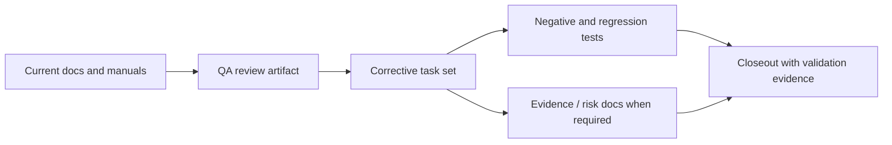
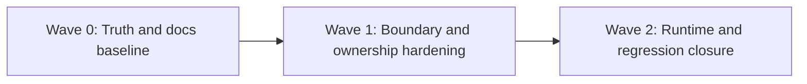

# QA Artifact Example Template

Use this document as a concrete output shape for the QA prompts in this folder.
It is an example artifact template, not a prompt.

The QA prompts in this folder should reference this file explicitly and use it
as the default output shape unless a stricter governed artifact format is
required by the destination path.

It turns a review into an execution-ready Markdown artifact with:

- findings ordered by severity
- alignment and architecture assessment
- task checklist
- task details with rationale and Definition of Done
- Mermaid diagrams for current state and unblock path
- validation baseline

## When To Use It

Use this template when a QA review must leave behind an artifact that teams can
execute directly without rewriting the analysis.

Typical destinations:

- `docs/planning/reviews/**` for formal review outputs
- `docs/planning/closeouts/**` for slice closeout hardening artifacts
- `docs/evidence/**` when the artifact primarily proves conformance or closure

## Markdown Artifact Path Suggestion

- `docs/planning/reviews/<area>/<date>-<slug>.md`
- `docs/planning/closeouts/<date>-<slice>-qa-closeout.md`
- `docs/evidence/ED-<date>-<slug>.md`

## Summary

This artifact translates a QA review into an execution roadmap bound to the
actual slice scope.

Canonical execution tracking remains in:

- `[lane or canonical task registry path]`
- `[primary roadmap / proposal / review / closeout path]`

This document is the implementation sequence, correction map, and Definition of
Done baseline for the reviewed slice.

## Governing Sources

- `[governance-document-rule-inventory.md]`
- `[AGENTS.md]`
- `[ai-work-protocol.md]`
- `[relevant ADR / contract / proposal / review / roadmap / manual]`
- `[relevant technical guide or runbook]`

## Findings

List findings by severity first. Do not start with the roadmap.

### High

- Title:
  Why it matters:
  Evidence:
  Risk:
  Recommendation:

### Medium

- Title:
  Why it matters:
  Evidence:
  Risk:
  Recommendation:

### Low

- Title:
  Why it matters:
  Evidence:
  Risk:
  Recommendation:

If there are no critical findings, say `No critical findings` and still report
residual risks and follow-up work.

## Alignment

- Doc vs code:
- Promise vs implementation:
- Tests vs claims:
- Current truth vs planned truth:
- Documentation update status:
- Evidence and risk-doc status when applicable:

## Architecture Assessment

- SRP:
- DDD:
- Hexagonal:
- CQRS if relevant:
- Complexity:
- Modularity:

## Test Assessment

- Negative paths present:
- Negative paths missing:
- Regression status:
- Determinism:
- Local suite vs meaningful global confidence:
- Global system view applied:
- Harness or shared fixture need:
- Test grouping by type (`unit` / `integration` / `contract` / `e2e` /
  regression) and rationale:

## Quality Gates

- Commands executed:
- What passed:
- What failed:
- What could not be verified:

## Unblock Roadmap

### Wave 0 - Truth and documentation baseline

Tasks: `[TASK-1]`, `[TASK-2]`

Target:

- documentation reflects current behavior rather than target-only intent;
- contracts, routes, and ownership boundaries are explicit;
- current degraded and error posture is documented;
- evidence and risk-doc obligations are classified correctly.

### Wave 1 - Boundary and ownership hardening

Tasks: `[TASK-3]`, `[TASK-4]`

Target:

- boundary ownership is explicit;
- misplaced orchestration is removed from the wrong layer;
- invariants and negative paths are assigned to the right component.

### Wave 2 - Runtime and regression closure

Tasks: `[TASK-5]`, `[TASK-6]`

Target:

- runtime behavior matches contracts and docs;
- regression-sensitive paths have negative coverage;
- observability and closeout evidence are credible.

## Action Artifact

### Task Checklist

- [ ] `TASK-1` Update current-state documentation and diagrams
- [ ] `TASK-2` Reconcile contract, error-code, and naming truth
- [ ] `TASK-3` Extract or harden the ownership seam
- [ ] `TASK-4` Add missing negative and regression tests
- [ ] `TASK-5` Add or update evidence / risk docs if governance requires them
- [ ] `TASK-6` Re-run validation and close the slice with evidence

### Task Details

#### `TASK-1` Update current-state documentation and diagrams

- Objective: Make current system truth explicit before implementation moves forward.
- Scope: Relevant guides, proposals, reviews, closeouts, and architecture entrypoints.
- Recommended owner: Docs + owning lane.
- Dependencies: Access to current code truth and governing sources.
- Documentation impact: Update stale docs and add current-state Mermaid diagrams.
- Evidence / risk-doc impact: None unless the slice is ARC-triggering.
- Comment with rationale: Execution should not proceed on target-state fiction; current-state truth is the baseline for TDD and review.
- Definition of Done:
  - current-state docs are updated;
  - at least one current-state Mermaid diagram exists;
  - outdated claims are removed or reclassified.

#### `TASK-2` Reconcile contract, error-code, and naming truth

- Objective: Remove naming drift between docs, tests, and implementation.
- Scope: Contracts, manuals, review artifacts, and code references.
- Recommended owner: Domain owner for the affected boundary.
- Dependencies: `TASK-1`
- Documentation impact: Contract and terminology sections updated.
- Evidence / risk-doc impact: Note impact if a governed contract or ARC-triggering path is touched.
- Comment with rationale: Inconsistent naming breaks trust in both QA and runtime behavior.
- Definition of Done:
  - one canonical term or code is used;
  - docs and tests reference the same truth;
  - stale aliases are removed or explicitly deprecated.

#### `TASK-3` Extract or harden the ownership seam

- Objective: Put logic in the correct layer and reduce fake modularity.
- Scope: Application/domain/infrastructure boundary touched by the review.
- Recommended owner: Package or bounded-context owner.
- Dependencies: `TASK-2`
- Documentation impact: Architecture notes or technical manual updated if ownership changes.
- Evidence / risk-doc impact: Evaluate whether ARC policy applies.
- Comment with rationale: Quality improves when invariants have a single clear owner.
- Definition of Done:
  - boundary responsibility is explicit;
  - wrong-layer logic is removed or reduced;
  - SRP and hexagonal seams are improved measurably.

#### `TASK-4` Add missing negative and regression tests

- Objective: Close confidence gaps identified by QA.
- Scope: Affected package tests and public-boundary regressions.
- Recommended owner: Owning package team.
- Dependencies: `TASK-2`, `TASK-3`
- Documentation impact: Test evidence and manual expectations aligned.
- Evidence / risk-doc impact: Evidence doc should reference new validation where applicable.
- Comment with rationale: A review without negative-path coverage closes paperwork, not quality risk; test design should also use a global system view and decide whether harnesses or grouping by test type are needed.
- Definition of Done:
  - missing negative tests exist;
  - regression-sensitive paths are covered;
  - tests assert behavior, not incidental implementation details;
  - harness or shared-fixture needs are explicitly evaluated and implemented when justified;
  - tests are grouped by type when that improves clarity, maintenance, or confidence.

#### `TASK-5` Add or update evidence / risk docs if governance requires them

- Objective: Keep ARC and quality-governance surfaces aligned with the slice.
- Scope: `docs/evidence/**` and `docs/risk-register/**` when required.
- Recommended owner: Slice owner preparing the PR.
- Dependencies: Governance trigger confirmed from repo rules.
- Documentation impact: Evidence and risk surfaces updated and indexed.
- Evidence / risk-doc impact: Direct.
- Comment with rationale: If governance requires evidence or risk updates, skipping them turns “green locally” into CI failure or governance drift.
- Definition of Done:
  - applicability is checked against governance rules;
  - required evidence doc exists with valid frontmatter;
  - required risk entry exists and is indexed.

#### `TASK-6` Re-run validation and close the slice with evidence

- Objective: Finish with real validation evidence, not assertions.
- Scope: Touched packages and repo-level gates.
- Recommended owner: Slice owner.
- Dependencies: `TASK-1` through `TASK-5`
- Documentation impact: Closeout updated with validation evidence.
- Evidence / risk-doc impact: Referenced in closeout when applicable.
- Comment with rationale: The slice is not ready until the governed validation baseline is real and recorded.
- Definition of Done:
  - touched-scope validation commands ran;
  - `pnpm verify:prepush` passed;
  - closeout or review artifact records the evidence.

## Mermaid Diagram

### Current-state dependency map

### Unblock sequence

## Validation Baseline For Each Execution Slice

Every implementation or correction slice under this artifact should close with:

1. touched-package or touched-route checks for the affected scope;
2. `pnpm docs:sync` when docs structure changes;
3. `pnpm docs:workboard:generate` when planning state changes;
4. evidence and risk-doc validation when governance requires them;
5. `pnpm verify:prepush`.

## Final Verdict

- Ready
- Ready with follow-ups
- Not ready
