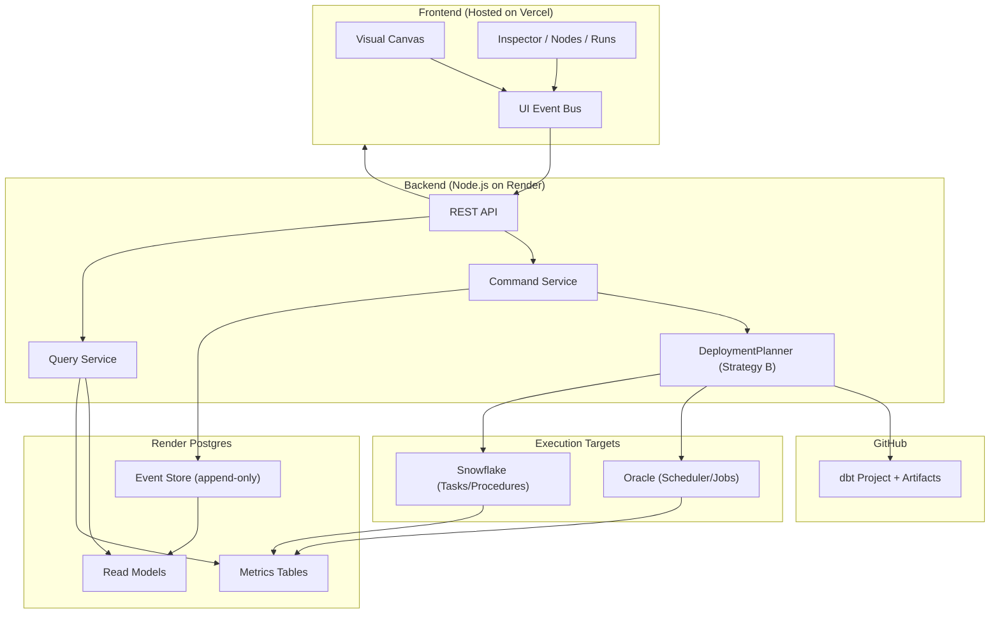
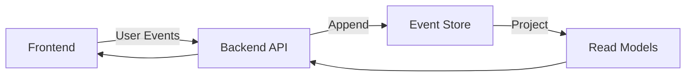
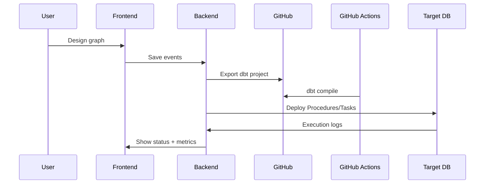
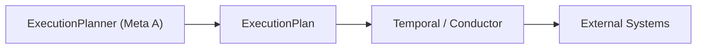

# DVT+ Architecture (Strategy B → Meta A)

## Hosting Strategy (Initial Phase)

---

Layer Technology Hosting

---

Front-end React + TypeScript Vercel (Free Tier)

Backend API Node.js + TypeScript Render (Free Tier Web
(Dockerized) Service)

Database PostgreSQL Render Managed
Postgres (Free)

Event Store PostgreSQL (append-only table) Same Render Postgres

Git Storage GitHub GitHub

CI (dbt compile) GitHub Actions GitHub

Execution (Phase Oracle (test) / Snowflake External DB
B) (later)

Observability DB tables + target DB query Same Postgres + Target
history DB

---

---

## 1. High-Level Architecture

---

## 2. Event-Sourced Core

Properties: - Append-only events - Replayable state - Undo/Redo
capability - Full audit trail

---

## 3. Author → Compile → Deploy Flow

---

## 4. Minimal Backend Responsibilities (MVP)

### Write Path

- POST /events
- POST /export/dbt
- POST /deploy

### Read Path

- GET /graph
- GET /runs
- GET /metrics

---

## 5. Evolution (Meta A -- Later)

---

## 6. Strategic Notes

- Frontend remains fully web-based.
- Backend is Dockerized and portable.
- All state is persisted in Postgres or GitHub.
- No local disk dependency.
- Architecture supports plugin growth.
- Strategy B delivers faster time-to-market.
- Meta A remains compatible via modular planner replacement.

---

End of document.
