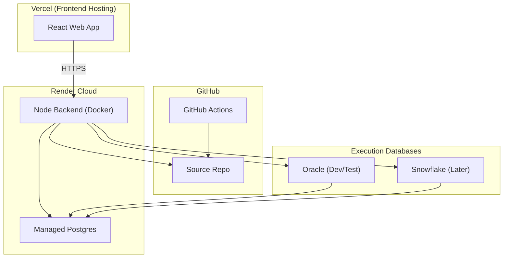
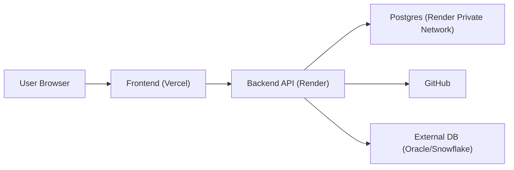
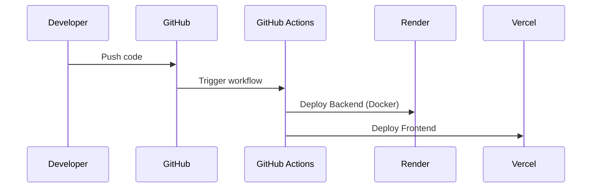
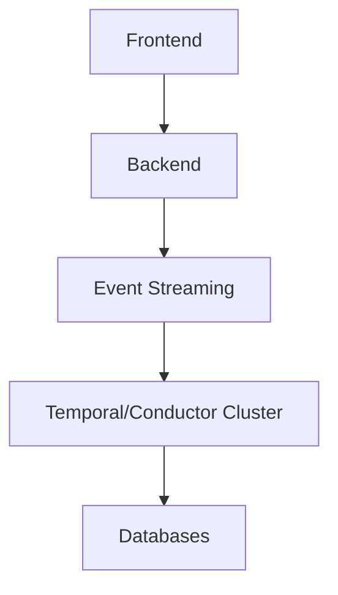

# DVT+ Infrastructure Architecture Proposal

## 1. Infrastructure Overview

---

Component Technology Hosting Provider Rationale

---

Frontend React + Vercel (Free/Pro Tier) Optimized for
TypeScript static + edge
delivery, CI
integration

Backend API Node.js + Render Web Service Simple Docker
TypeScript deploy,
(Docker) persistent
service

Database PostgreSQL Render Managed Postgres Tight
integration
with backend
hosting

Event Store PostgreSQL Same Render Postgres Simplifies
(append-only infra, no extra
schema) service

Artifact Storage GitHub GitHub Versioned,
immutable
artifacts

CI/CD GitHub Actions GitHub Native
integration
with repo

Target Execution Oracle (dev) / External DB infra DB-native
(Phase B) Snowflake (prod scheduling
later)

Observability Postgres + Render + Target DB Centralized
Target DB metrics
history

Future Temporal / Separate service Advanced
Orchestrator Conductor (future) orchestration
(Meta A) layer

---

---

## 2. Cloud Layout Diagram

---

## 3. Network & Security Zones

Security Principles:

- HTTPS only communication
- Backend isolated from public DB access
- DB not exposed publicly
- GitHub access via tokens
- Secrets managed via environment variables in Render

---

## 4. Data Persistence Model

Data Type Where Stored Why

---

UI Events Postgres (Event Store) Replay + audit
Graph State Postgres (Read Models) Fast query
dbt Project GitHub Repo Version control
Compiled Artifacts GitHub Immutable builds
Execution Logs Postgres Unified observability
DB Execution History Target DB Ground truth

---

## 5. CI/CD Flow

---

## 6. Scaling Strategy

Phase 1 (MVP): - Single Render service - Single Postgres instance -
External Oracle test DB

Phase 2: - Separate worker service (Render) - Background job processor -
Snowflake integration

Phase 3 (Meta A): - Dedicated Orchestrator cluster - Event streaming
service (Kafka or managed equivalent) - Separate observability stack

---

## 7. Future Evolution Diagram

---

End of Infrastructure Proposal
