# DVT+ - Top 3 Gaps and Roadmap

## Current system state

All G1-G10 gaps are closed for Phase 1. The system has:

- `POST /runs` with OIDC auth, tenant policy, and authorized facade
- `GET /runs`, `GET /runs/:id`, `GET /runs/:id/events`, `POST /runs/:id/signal` - implemented
- Temporal adapter with real worker host and time-skipping integration tests
- Postgres state store, outbox worker, projector worker, lineage worker - all running
- `contractVersion` validated against `SUPPORTED_PLAN_CONTRACT_VERSIONS = new Set(['1.0.0'])` at activity dispatch

What is open is what was never part of G1-G10 scope. These are Phase 2 gaps visible in the current code.

---

## Gap overview

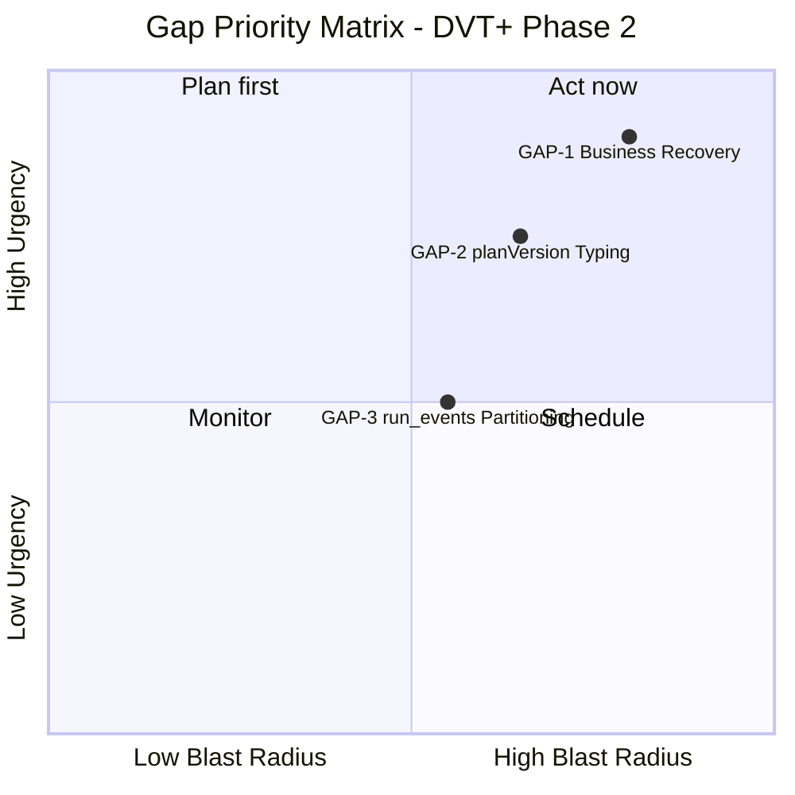

---

## GAP-1 - Business recovery flow does not exist

### What the code shows

`WorkflowEngine.ts:861`:

```typescript
logicalAttemptId: ctx.logicalAttemptId ?? 1,
```

`logicalAttemptId` defaults to `1` if not provided by the API caller. There is no
`RecoverRunUseCase`. No `parentRunId` or `originRunId` field exists in `RunContext`,
`RunMetadata`, or any snapshot type. There is no contract for recovery lineage.

When a run reaches `FAILED` or `CANCELLED`:

- There is no defined path to create a recovery run.
- A new `startRun` call with no lineage fields produces a run with zero traceability
  to the original failure.
- `logicalAttemptId: 1` on the new run creates no connection to prior attempts.

ADR-0008 establishes that idempotency keys derive from `logicalAttemptId`. An
uncontrolled `logicalAttemptId` on business retries means two semantically related
runs can hash to different key spaces with no auditable link - or the same key space
if the caller accidentally reuses identifiers.

### Why it is the most urgent gap

Recovery is a user-facing product requirement, not an infrastructure concern. Without
it, every production failure requires manual reconstruction. The longer this ships
without the pattern, the more ad-hoc recovery logic accumulates in product integrations
above the API boundary.

### Architecture diagram

```mermaid
flowchart TD
    subgraph TODAY["Today (no recovery primitive)"]
        A[Run FAILED] -->|operator action| B[New startRun call]
        B -->|logicalAttemptId: 1| C[New run - no lineage]
        C -->|no parentRunId| D[Orphaned run in state store]
    end

    subgraph TARGET["Target (GAP-1 closed)"]
        E[Run FAILED] --> F[POST /runs/:id/recover]
        F --> G[RecoverRunUseCase]
        G -->|reads failed run snapshot| H[PlannerClient.planFromSelection]
        H -->|new ExecutionPlanV2 for failed steps| I[WorkflowEngine.startRun]
        I -->|RunContext with parentRunId + originRunId| J[New run - full lineage]
    end
```

### Required contracts

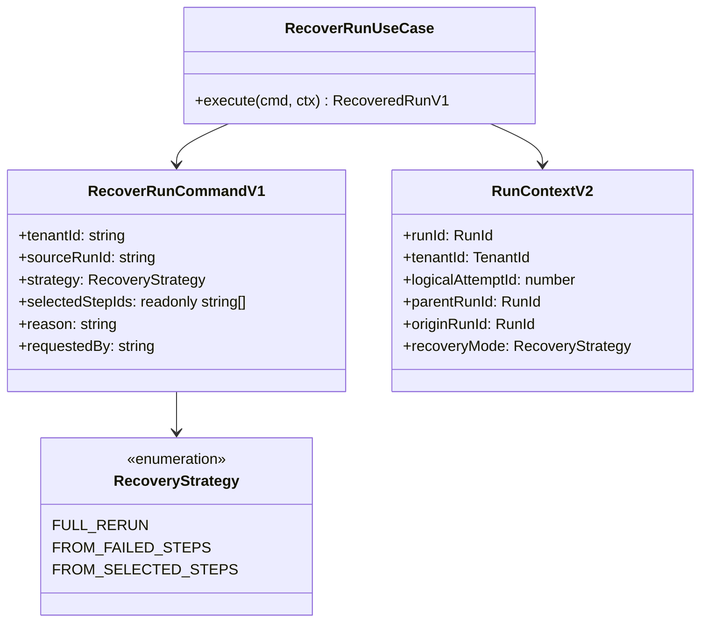

### Recovery invariants

| Invariant                      | Rule                                                                                                                                                                             |
| ------------------------------ | -------------------------------------------------------------------------------------------------------------------------------------------------------------------------------- |
| Terminal immutability          | `FAILED` and `CANCELLED` runs are never reopened. Recovery = new run.                                                                                                            |
| `logicalAttemptId` on recovery | Always `1` on the new run. `logicalAttemptId` tracks attempts of a single logical run, not across the recovery chain. Recovery chain is tracked via `parentRunId`/`originRunId`. |
| Plan generation                | `RecoverRunUseCase` calls the planner, not the engine. The engine receives a complete `ExecutionPlanV2`. Partial plan reconstruction is the planner's responsibility.            |
| Source run validation          | `RecoverRunUseCase` rejects if source run is not in a terminal state. Soft-deletes or runs in `RUNNING` state are rejected with a typed error.                                   |
| Lineage fields                 | `parentRunId` = direct source. `originRunId` = first run in the chain (i.e., if A -> B -> C, then C has `originRunId = A`).                                                      |

### Delivery tasks

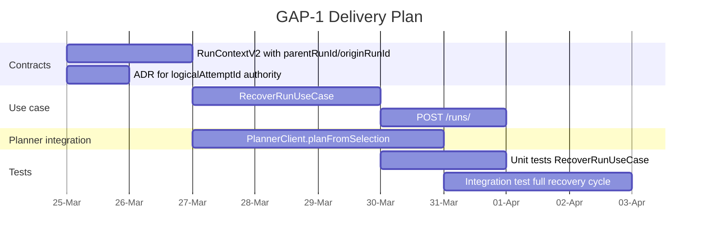

---

## GAP-2 - `planVersion` is an untyped string with no compatibility matrix

### What the code shows

`packages/@dvt/contracts/src/types/contracts.ts:61`:

```typescript
planVersion: string;
```

`contractVersion` is validated. `planVersion` is not:

```typescript
// stepActivities.ts:269
const SUPPORTED_PLAN_CONTRACT_VERSIONS = new Set(['1.0.0']);
// validates contractVersion - NOT planVersion

// stepActivities.ts:321-322
if (plan.metadata.planVersion !== ref.planVersion)
  throw new TypeError(`PLAN_REF_MISMATCH: planVersion`);
// equality check only - no compatibility range, no migration
```

Test fixtures use inconsistent values: `'1.0'`, `'1.0.0'`, `'v1'`, `'2.3'`.
There is no normative document defining valid `planVersion` values.

### Why it is a critical gap

The engine performs strict equality on `planVersion`. A planner bump from `'2.3'` to
`'2.4'` requires simultaneous deployment of planner and all engine workers. Any
in-flight run created with `'2.3'` that is picked up by a worker expecting `'2.4'`
fails immediately with `PLAN_REF_MISMATCH`.

This is a forced big-bang cutover model in production. It creates a deployment risk
for every plan schema evolution.

### State machine: version negotiation

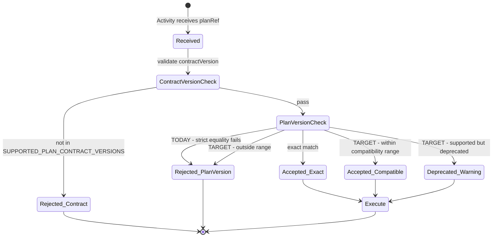

### Required change: discriminated union + compatibility set

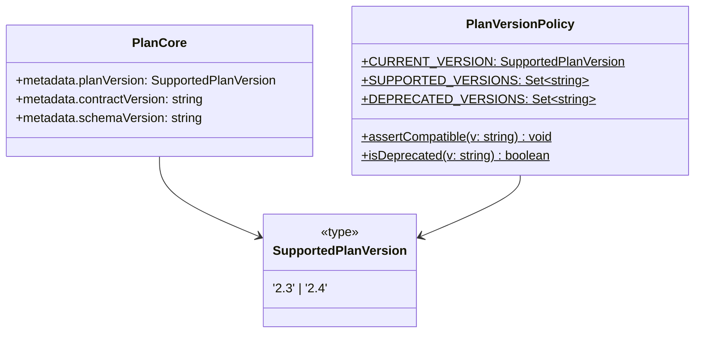

### Implementation

```typescript
// packages/@dvt/contracts/src/contracts/planner/PlanVersionPolicy.ts

export type SupportedPlanVersion = '2.3'; // extended with each release
export const CURRENT_PLAN_VERSION: SupportedPlanVersion = '2.3';

export const SUPPORTED_PLAN_VERSIONS = new Set<string>(['2.3']);
export const DEPRECATED_PLAN_VERSIONS = new Set<string>(); // populated at deprecation

export function assertCompatiblePlanVersion(planVersion: string): void {
  if (SUPPORTED_PLAN_VERSIONS.has(planVersion)) return;
  throw new UnsupportedPlanVersionError(planVersion, [...SUPPORTED_PLAN_VERSIONS]);
}
```

This replaces the current strict equality in `stepActivities.ts`. Adding `'2.4'` support
requires only adding `'2.4'` to `SUPPORTED_PLAN_VERSIONS` - no contracts package major
version bump, no coordinated deployment.

### ADR requirement

An ADR must define before any new `planVersion` is introduced:

- Valid version format (semver vs calendar vs integer)
- Minimum support window for deprecated versions (e.g., 30 days)
- In-flight run behavior when worker is upgraded mid-run
- Contract test requirements for planner <-> engine compatibility

### Delivery tasks

```mermaid
gantt
    title GAP-2 Delivery Plan
    dateFormat YYYY-MM-DD
    axisFormat %d-%b

    section Contracts
    SupportedPlanVersion type + PlanVersionPolicy    :t1, 2026-03-25, 2d
    ADR: planVersion compatibility policy            :t2, 2026-03-25, 2d

    section Engine adapter
    Replace strict equality with assertCompatible    :t3, after t1, 1d
    Normalize test fixtures to canonical values      :t4, after t1, 1d

    section Tests
    Contract tests: accepted, deprecated, rejected   :t5, after t3, 2d
    Rolling deployment simulation test               :t6, after t5, 2d
```

---

## GAP-3 - `run_events` is unpartitioned; archival pipeline is incomplete

### What the code shows

`PostgresSchemaManager.ts:163`:

```sql
CREATE TABLE IF NOT EXISTS run_events (
  tenant_id  TEXT NOT NULL,
  run_id     TEXT NOT NULL,
  run_seq    BIGINT NOT NULL,
  ...
)
-- No PARTITION BY clause
```

The archival tracking infrastructure exists:

- `run_event_archive_units` - tracks batches of runs pending archival
- `run_event_archive_batches` - tracks individual archival jobs

But `run_events` is a flat heap table. Without range partitioning by time, the archival
job must do a full-table scan to find old rows. At Phase 3 scale (500K runs/day, 100+
events/run = 50M rows/day), dropping old data without partitioning degrades to:

```sql
DELETE FROM run_events WHERE persisted_at < now() - interval '90 days';
-- Full table scan + row-by-row deletion = table bloat, lock contention, autovacuum pressure
```

### Growth projection

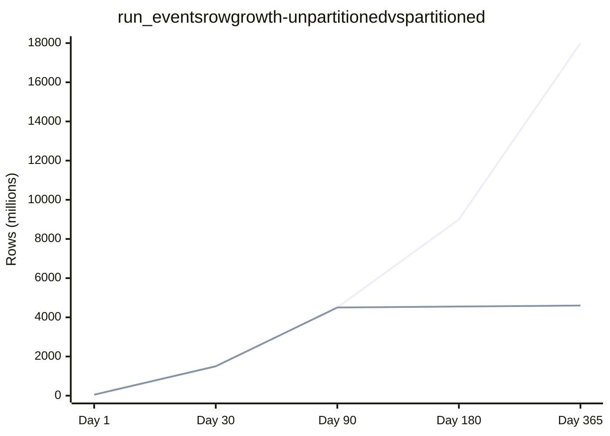

### Target architecture: partitioned `run_events`

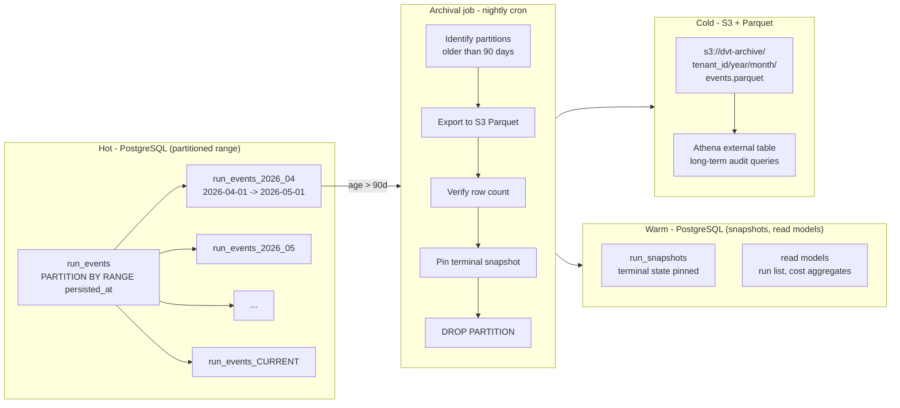

### Migration strategy

This cannot be done with `ALTER TABLE ... PARTITION BY` on an existing table.
Postgres does not support converting a heap table to a partitioned table in-place.

Required migration sequence:

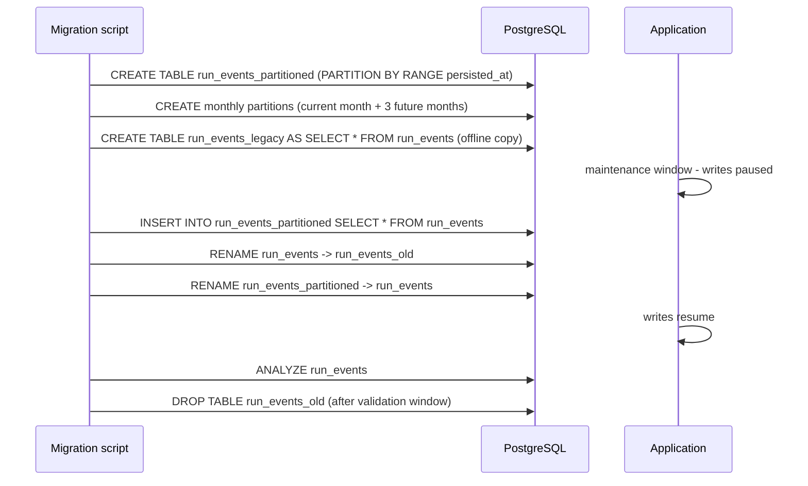

This requires a maintenance window. Schedule before Phase 3 load begins.

### Partition management cron

```typescript
// apps/archival-worker/src/PartitionManagerJob.ts (to be created)
// Runs weekly - creates next 2 monthly partitions in advance

async function ensurePartitionsExist(pool: Pool, schema: string, monthsAhead: number) {
  for (let i = 0; i <= monthsAhead; i++) {
    const start = startOfMonth(addMonths(new Date(), i));
    const end = startOfMonth(addMonths(new Date(), i + 1));
    await pool.query(`
      CREATE TABLE IF NOT EXISTS ${schema}.run_events_${format(start, 'yyyy_MM')}
        PARTITION OF ${schema}.run_events
        FOR VALUES FROM ('${start.toISOString()}') TO ('${end.toISOString()}')
    `);
  }
}
```

### Delivery tasks

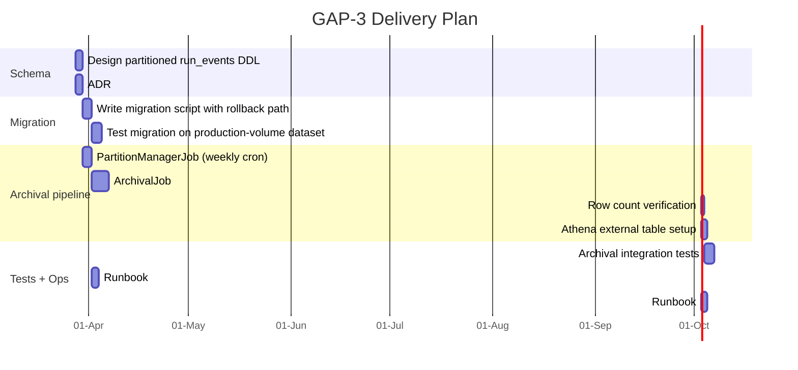

---

## Combined roadmap

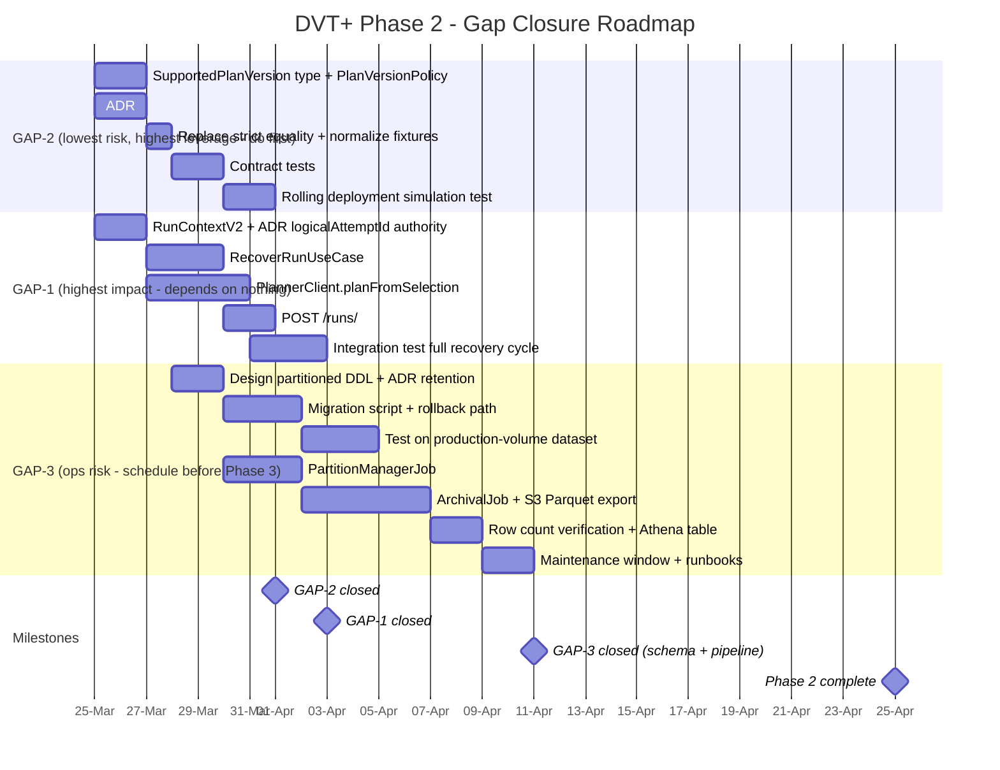

---

## Execution order rationale

GAP-2 ships first because it is purely additive (a new type + a policy class + test
fixtures normalization), has no runtime risk, and unblocks rolling deployments.
Every day GAP-2 is delayed is a day closer to a production deployment that requires
an orchestrated big-bang cutover.

GAP-1 ships second because it depends on no infrastructure changes, only contracts
and application layer additions. It is the highest-value product gap: no recovery
primitive means no production operability.

GAP-3 ships third because the migration requires a maintenance window and production
load estimation. It is not urgent at current scale but becomes critical before Phase 3
traffic begins. The schema work and archival pipeline can be built and tested in
parallel with GAP-1.

---

## What does not move until these three are closed

| Work item                  | Reason for deferral                                                                                                                    |
| -------------------------- | -------------------------------------------------------------------------------------------------------------------------------------- |
| Conductor adapter parity   | No POC; zero evidence of state equivalence with Temporal; GAP-1 must define the recovery contract before a second engine implements it |
| Cost attribution dashboard | No `QUERY_TAG` + `QUERY_HISTORY` pipeline; do not build UI before the data source exists                                               |
| Plugin sandbox             | Currently DRAFT; third-party code running in-process with the engine before a sandbox is an unacceptable security posture              |
| Enriched run status UI     | GET /runs/:id?enriched=true is a query enrichment feature; validate the base query path at load first                                  |
