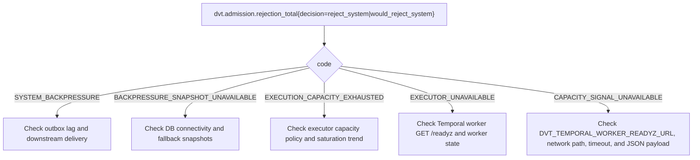

---
title: Admission Control Runbook
status: Active
owner: SRE / API
last_reviewed: 2026-04-23
---

# Admission Control Runbook

Covers the `DVT_START_RUN_BACKPRESSURE_MODE` system: off → observe → enforce.

---

## Configuration Reference

| Env var                                       | Default | Description                                                       |
| --------------------------------------------- | ------- | ----------------------------------------------------------------- |
| `DVT_START_RUN_BACKPRESSURE_MODE`             | `off`   | `off` \| `observe` \| `enforce`                                   |
| `DVT_START_RUN_MAX_PENDING_EVENTS_PER_TENANT` | —     | Tenant-level pending event ceiling                                |
| `DVT_START_RUN_MAX_OUTBOX_LAG_MS`             | —     | Global outbox age ceiling (ms)                                    |
| `DVT_START_RUN_STUCK_EVENT_AGE_THRESHOLD_MS`  | —     | Age threshold for "stuck" classification (ms)                     |
| `DVT_START_RUN_RETRY_AFTER_SECONDS`           | `30`    | `Retry-After` returned on backpressure rejection                  |
| `DVT_TEMPORAL_WORKER_READYZ_URL`              | —     | Temporal worker `GET /readyz` probe for execution-capacity denial |
| `DVT_START_RUN_BACKPRESSURE_CACHE_TTL_MS`     | —     | Snapshot cache TTL (ms)                                           |
| `DVT_START_RUN_BACKPRESSURE_QUERY_TIMEOUT_MS` | —     | Max DB query time before circuit opens (ms)                       |

---

## Rollout Procedure: off → observe → enforce

### Step 1 — Deploy with mode=off (baseline)

Verify all existing tests pass. Admission logic is in the code path but all requests are
admitted unconditionally. Metrics are not emitted.

### Step 2 — Switch to mode=observe

```bash
DVT_START_RUN_BACKPRESSURE_MODE=observe
```

In observe mode:

- All requests are **admitted** (guard is evaluated but result is ignored).
- Telemetry is emitted as if the guard had enforced:
  - `would_reject_tenant` instead of `reject_tenant`
  - `would_reject_system` instead of `reject_system`
- No `Retry-After` is returned to callers.

**What to watch (observe phase):**

```
dvt.admission.decision_total{decision="would_reject_tenant"}
dvt.admission.decision_total{decision="would_reject_system"}
dvt.admission.pending_events_per_tenant{source="live"}
dvt.admission.outbox_oldest_age_ms{source="live"}
```

Validate thresholds are not triggering spuriously before proceeding to enforce.

**Minimum observe window:** 1 week in production traffic, or until confidence in thresholds.

### Step 3 — Switch to mode=enforce

```bash
DVT_START_RUN_BACKPRESSURE_MODE=enforce
```

In enforce mode:

- Requests that would breach tenant or system thresholds are **rejected** with HTTP 429.
- Response includes `Retry-After: N` seconds.
- Telemetry uses `reject_tenant` / `reject_system` decisions.

**Rollback:** set mode back to `observe` or `off` via env var redeploy. No state to clean up.

---

## Metrics Glossary

| Metric                                    | Type    | Labels                     | Alert threshold                                               |
| ----------------------------------------- | ------- | -------------------------- | ------------------------------------------------------------- |
| `dvt.admission.decision_total`            | counter | `mode`, `decision`         | —                                                           |
| `dvt.admission.rejection_total`           | counter | `mode`, `decision`, `code` | > 0 in enforce (expected); spike in observe (unexpected load) |
| `dvt.admission.pending_events_per_tenant` | gauge   | `source`                   | Alert if > 80% of `MAX_PENDING_EVENTS_PER_TENANT` for 5 min   |
| `dvt.admission.outbox_oldest_age_ms`      | gauge   | `source`                   | Alert if > 80% of `MAX_OUTBOX_LAG_MS` for 5 min               |

**Codes in `rejection_total`:**

| Code                                | Meaning                                                                      |
| ----------------------------------- | ---------------------------------------------------------------------------- |
| `TENANT_BACKPRESSURE`               | This tenant's pending events exceed the per-tenant ceiling                   |
| `SYSTEM_BACKPRESSURE`               | Global outbox lag exceeds ceiling — system is overloaded                   |
| `BACKPRESSURE_SNAPSHOT_UNAVAILABLE` | Could not fetch snapshot; treated as system backpressure                     |
| `EXECUTION_CAPACITY_EXHAUSTED`      | The selected executor reported saturation through the abstract capacity port |
| `EXECUTOR_UNAVAILABLE`              | The selected executor was reachable but not ready to accept new work         |
| `CAPACITY_SIGNAL_UNAVAILABLE`       | The API could not obtain a valid execution-capacity signal and failed closed |

---

## Execution-Capacity Rejection Triage

Execution-capacity denials still emit system-level admission decisions:

- `decision=reject_system` in enforce mode
- `decision=would_reject_system` in observe mode

Operators must distinguish them by the `code` label on
`dvt.admission.rejection_total`.



### Execution-capacity code guide

| Code                           | Meaning                                                       | First checks                                                                                                                                                         |
| ------------------------------ | ------------------------------------------------------------- | -------------------------------------------------------------------------------------------------------------------------------------------------------------------- |
| `EXECUTION_CAPACITY_EXHAUSTED` | The abstract execution-capacity port reported saturation.     | Check recent rejection trend, adapter-specific capacity dashboards, and whether the condition is transient or sustained.                                             |
| `EXECUTOR_UNAVAILABLE`         | The Temporal worker probe responded, but `ready=false`.       | Query `GET /readyz`, inspect worker lifecycle state, and verify the worker is connected to the expected namespace/task queue.                                        |
| `CAPACITY_SIGNAL_UNAVAILABLE`  | The API could not query or parse the worker readiness signal. | Check `DVT_TEMPORAL_WORKER_READYZ_URL`, API-to-worker network reachability, timeout behavior, and whether the probe still returns JSON with a boolean `ready` field. |

---

## Threshold Derivation Procedure

Run in observe mode for a representative load period (≥ 1 week). Capture:

1. P99 of `dvt.admission.pending_events_per_tenant` during peak traffic.
2. P99 of `dvt.admission.outbox_oldest_age_ms` during peak traffic.

Set thresholds to **2× the observed P99** as initial ceiling. This gives 2× headroom before
any rejection fires. Lower thresholds incrementally with each load increase observation.

```
MAX_PENDING_EVENTS_PER_TENANT = 2 × p99_pending_per_tenant_at_peak
MAX_OUTBOX_LAG_MS             = 2 × p99_outbox_age_ms_at_peak
```

Do not set thresholds below observed maximums — that would cause false positives in
observe mode and rejections in enforce mode under normal load.

---

## Incident Response

### `rejection_total{decision="reject_tenant"}` spike

1. Identify the tenant(s) causing the spike via structured logs:
   ```
   msg=admission.decision decision=reject_tenant
   ```
2. Check if the tenant has a runaway workflow or unusual submission rate.
3. If legitimate: wait for backlog to drain (events will be processed by outbox worker).
4. If stuck: see Emergency Cleanup section.

### `rejection_total{code="SYSTEM_BACKPRESSURE"}` spike

1. Check outbox worker health — worker may be down or lagging.
2. Check `dvt.admission.outbox_oldest_age_ms{source="live"}` gauge trend.
3. If worker is healthy but lag is growing, check downstream Snowflake/Temporal latency.
4. If snapshot unavailable (`BACKPRESSURE_SNAPSHOT_UNAVAILABLE`): the circuit breaker has
   opened — check DB connectivity.

### `rejection_total{code="EXECUTOR_UNAVAILABLE"}` spike

1. Query the configured worker probe directly:
   ```bash
   curl "$DVT_TEMPORAL_WORKER_READYZ_URL"
   ```
2. If the worker responds with `ready=false`, treat this as executor unavailability, not
   outbox pressure.
3. Inspect the worker host, namespace, task queue, and any readiness sub-state such as
   `runStateCircuitState`.
4. Restore worker readiness before raising or relaxing admission thresholds.

### `rejection_total{code="CAPACITY_SIGNAL_UNAVAILABLE"}` spike

1. Verify `DVT_TEMPORAL_WORKER_READYZ_URL` is configured and resolves from the API runtime.
2. Check whether the worker probe timed out, returned a non-JSON body, or changed payload shape.
3. Treat this as fail-closed signal loss: admission is intentionally protecting the executor
   boundary.
4. Do not reclassify it as `SYSTEM_BACKPRESSURE`; the operator action is probe-path recovery,
   not backlog drainage.

### Fallback (circuit open)

When DB queries fail beyond the circuit threshold, `source=fallback` snapshots are served.
The `dvt.admission.outbox_oldest_age_ms{source="fallback"}` gauge reflects the last
persisted snapshot age.

Fallback file location: `{tmpdir}/dvt/{SERVICE_NAME}-start-run-backpressure-fallback.json`

---

## Chaos Scenarios

| Scenario                                    | Expected outcome                                                            |
| ------------------------------------------- | --------------------------------------------------------------------------- |
| DB down during snapshot query               | Circuit opens → fallback snapshot served → `source=fallback` gauge      |
| Tenant submits 10× normal rate             | `pending_events_per_tenant` gauge rises; `reject_tenant` in enforce         |
| Outbox worker stopped for 5 min             | `outbox_oldest_age_ms` gauge rises; `reject_system` in enforce at threshold |
| Redis/cache flush                           | Next request hits `source=live`; no impact on admission                     |
| Snapshot TTL expired                        | Next request re-queries live snapshot; circuit check applies                |
| Mode rolled back to observe during incident | All rejections stop; `would_reject_*` still emitted for visibility          |
| Telemetry exporter down                     | `record()` catch swallows error; admission continues unaffected             |

---

## See Also

- Emergency cleanup: [admission-control-emergency-cleanup.sql](./admission-control-emergency-cleanup.sql)
- Proposal: `docs/planning/proposals/superseded/runtime-and-contracts/gap4-backpressure-admission-pr4-plan-20260326.md`
