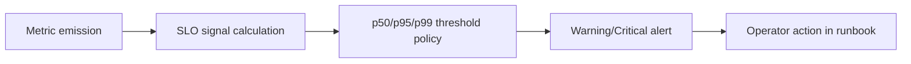

# API Runtime SLA Canonical

This document is the canonical SLA baseline for Lane C runtime behavior.

Truth-first rule for this document:

- `implemented`: metric is emitted today with code anchor evidence
- `derived from existing metric`: SLO is computed from currently emitted metric(s)
- `planned`: target metric/SLO not emitted yet; cannot be treated as active alert policy

Companion manuals for end-to-end interpretation:

- [AR-C2 Observability User Manual](../guides/ar-c2-observability-user-manual-20260404.md)
- [AR-C2 Observability Technical Manual](../guides/ar-c2-observability-technical-manual-20260404.md)

## SLA Model



## Current Observability Baseline

These are the only SLA signals safe to treat as active today.

Canonical signal-to-threshold mapping source for AR-C2 wiring:

- [AR-C2 SLA signal threshold mapping](ar-c2-sla-signal-threshold-mapping-20260404.md)

| Status                         | Logical signal                           | Exported metric(s)                                             | Threshold (SLO)                         | Alert policy                                            |
| ------------------------------ | ---------------------------------------- | -------------------------------------------------------------- | --------------------------------------- | ------------------------------------------------------- |
| `implemented`                  | Start-run latency p50/p99                | `dvt.api.run_start.latency_ms`                                 | p50 <= 500ms, p99 <= 2500ms (15m)       | warning p99 > 2000ms (10m), critical p99 > 2500ms (15m) |
| `implemented`                  | Plan compile latency p50/p99             | `dvt.api.plan_compile.latency_ms`                              | p50 <= 1200ms, p99 <= 6000ms (15m)      | warning p99 > 5000ms (10m), critical p99 > 6000ms (15m) |
| `implemented`                  | Snapshot staleness classification counts | `dvt.api.run_status.snapshot_staleness_result_total`           | source for stale/unknown ratios         | source metric only                                      |
| `implemented`                  | Snapshot unknown fallback counts         | `dvt.api.run_status.snapshot_staleness_fallback_unknown_total` | source for unknown fallback diagnostics | source metric only                                      |
| `implemented`                  | Outbox claimed-lag gauge                 | `dvt_outbox_oldest_claimed_lag_seconds`                        | observational baseline only             | no canonical threshold yet                              |
| `implemented`                  | Outbox drain lag gauge (canonical alias) | `dvt_delivery_outbox_drain_lag_seconds`                        | p95 <= 30s (15m)                        | warning p95 > 25s (10m), critical p95 > 30s (15m)       |
| `implemented`                  | Event delivery latency p95/p99           | `dvt_delivery_event_delivery_latency_ms`                       | p95 <= 1500ms, p99 <= 5000ms (15m)      | warning p99 > 4000ms (10m), critical p99 > 5000ms (15m) |
| `derived from existing metric` | Stale ratio for `GET /runs/:runId`       | derived from `snapshot_staleness_result_total`                 | stale <= 5% (15m)                       | warning > 2% (10m), critical > 5% (15m)                 |
| `derived from existing metric` | Unknown freshness ratio                  | derived from `snapshot_staleness_result_total`                 | unknown <= 0.1% (24h)                   | critical > 0.1% (24h)                                   |

## Target SLA / Pending Instrumentation

Metric emission for this SLA is now present. Remaining `AR-C2` work is
dashboard wiring, alert routing automation, and sustained threshold validation
evidence.

## PromQL Starters

Prometheus exposition note:

- logical metric IDs in this document use dotted names (`dvt.api.*`)
- PromQL queries use exported underscore form (`dvt_api_*`)

Start-run p99 (15m):

```promql
histogram_quantile(
  0.99,
  sum(rate(dvt_api_run_start_latency_ms_bucket[15m])) by (le)
)
```

Plan-compile p99 (15m):

```promql
histogram_quantile(
  0.99,
  sum(rate(dvt_api_plan_compile_latency_ms_bucket[15m])) by (le)
)
```

Outbox drain lag p95 (15m):

```promql
quantile_over_time(0.95, dvt_delivery_outbox_drain_lag_seconds[15m])
```

Event-delivery latency p99 (15m):

```promql
histogram_quantile(
  0.99,
  sum(rate(dvt_delivery_event_delivery_latency_ms_bucket[15m])) by (le)
)
```

Stale ratio (15m) from implemented metric:

```promql
sum(rate(dvt_api_run_status_snapshot_staleness_result_total{result="STALE"}[15m]))
/
sum(rate(dvt_api_run_status_snapshot_staleness_result_total[15m]))
```

Unknown ratio (24h) from implemented metric:

```promql
sum(rate(dvt_api_run_status_snapshot_staleness_result_total{result="UNKNOWN"}[24h]))
/
sum(rate(dvt_api_run_status_snapshot_staleness_result_total[24h]))
```

Unknown fallback reasons (15m):

```promql
sum(rate(dvt_api_run_status_snapshot_staleness_fallback_unknown_total[15m])) by (reason)
```

## Alert Routing

- warning alerts: API on-call channel
- critical alerts: API on-call + incident paging
- any sustained critical > 2 windows: incident ticket with owner and mitigation ETA

## Runbook Binding

When any threshold breaches, operators must follow:

- [Backend MVP Control-Plane Runbook](backend-mvp-control-plane-runbook-20260329.md)
- [Read-Your-Writes Freshness SLO](read-your-writes-freshness-slo-20260330.md)

## Review Cadence

- weekly SLO review by API/runtime owners
- threshold changes require updating this document and Lane C task status

## Code Anchors For Implemented Signals

- `apps/api/src/infrastructure/telemetry/ObservabilityRunStatusStalenessTelemetry.ts`
- `apps/api/src/infrastructure/telemetry/ObservabilityStartRunSlaTelemetry.ts`
- `apps/outbox-worker/src/ops/OutboxWorkerMonitor.ts`
