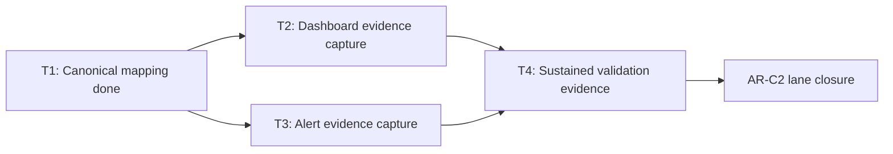

# AR-C2 Dashboard And Alert Wiring Evidence

This runbook records governed evidence for `AR-C2-T2` and `AR-C2-T3`.

It is intentionally truth-first:

- do not mark dashboard or alert wiring as complete without immutable evidence
- do not treat SLA threshold text as equivalent to wired monitor configuration

Companion manuals:

- [AR-C2 Observability User Manual](../guides/ar-c2-observability-user-manual-20260404.md)
- [AR-C2 Observability Technical Manual](../guides/ar-c2-observability-technical-manual-20260404.md)

## Governing sources

- `docs/planning/state/agent-lane-c.yaml`
- `docs/planning/proposals/mandatory/runtime-and-contracts/ar-c2-sla-operational-closure-plan-20260404.md`
- `docs/planning/reviews/architecture-and-governance/20260404-ar-c2-fowler-hard-qa-review.md`
- `docs/runbooks/ar-c2-sla-signal-threshold-mapping-20260404.md`
- `docs/runbooks/api-runtime-sla-canonical-20260404.md`

## Current verification snapshot (2026-05-14)

Repository-level search for versioned dashboard/alert config artifacts in this
workspace did not find a governed source of truth for runtime monitor wiring.

Verification command patterns executed:

- `rg -n "PrometheusRule|alertname|grafana|dashboard|alerts:|promql|record:" -S .`
- `rg --files | rg -n "prometheus|grafana|helm|k8s|terraform|monitor|alerts|rules"`

Result:

- metric emission docs and code anchors exist
- canonical mapping table exists (`AR-C2-T1`)
- no in-repo monitor-config-as-code artifact was found for AR-C2 dashboards and
  alerts
- `pnpm ops:ar-c2:evidence -- --require-dashboard-alert-evidence` generated
  the latest evidence artifact and failed closed with
  `AR-C2_IMMUTABLE_EVIDENCE_MISSING`: 9 dashboard panels and 11 alert rules are
  still missing immutable metadata.

Fowler posture:

- this is a hidden-authority guard, because dashboard completion must come from
  immutable dashboard metadata rather than manual row edits;
- this is documentation-drift protection, because canonical panel keys remain
  target truth while execution evidence remains explicitly missing;
- `AR-C2-T2` must stay blocked until a real `AR_C2_DASHBOARD_SNAPSHOT_FILE`
  supplies complete `panels[]` metadata for every mapped signal.
- `AR-C2-T3` must stay blocked until a real `AR_C2_ALERT_SNAPSHOT_FILE` or
  immutable monitor configuration reference supplies complete `rules[]`
  metadata for every threshold-backed mapping row.

## Completion evidence required

`AR-C2-T2` dashboard wiring evidence must include:

- dashboard system and environment
- immutable dashboard reference (UID/URL/export hash)
- panel ID or key per AR-C2 mapping row
- query expression per panel
- capture timestamp and reviewer

`AR-C2-T3` alert wiring evidence must include:

- alert rule identifier per AR-C2 threshold
- exact expression and duration window
- severity and routing target
- source of monitor config truth (file path or immutable external reference)
- capture timestamp and reviewer

For `AR-C2-INV-1`, closure reviewers must run the collector in assertion mode:

```bash
pnpm ops:ar-c2:evidence -- --require-dashboard-alert-evidence
```

The command must exit zero before dashboard and alert evidence can be treated as
complete. A non-zero result with `AR-C2_IMMUTABLE_EVIDENCE_MISSING` means AR-C2
stays open even though the generated artifact remains useful review evidence.

The assertion requires complete immutable metadata, not just matching keys. A
dashboard snapshot must provide `panels[]` rows with `panelKey`,
`dashboardSystem`, `environment`, `immutableDashboardReference`,
`queryExpression`, `capturedAt`, and `reviewer`. An alert snapshot must provide
`rules[]` rows with `thresholdKey`, `alertRuleId`, `expression`, `window`,
`severity`, `routingTarget`, `configSource`, `capturedAt`, and `reviewer`.
Legacy key-only snapshots are useful for draft inventory, but they are closure
blockers in assertion mode.

`thresholdKey` values must match the canonical keys from
[AR-C2 SLA Signal Threshold Mapping](./ar-c2-sla-signal-threshold-mapping-20260404.md).
Each threshold row below also carries the SLA/runbook source that owns the
threshold text. Do not substitute local alert names or dashboard labels for
these keys.

For `AR-C2-INV-4`, closure reviewers must run the collector in sustained-window
assertion mode:

```bash
pnpm ops:ar-c2:evidence -- --require-sustained-validation-windows
```

The command must exit zero before sustained validation evidence can be treated
as complete. A non-zero result with
`AR-C2_SUSTAINED_VALIDATION_WINDOWS_MISSING` means AR-C2 stays open even if
dashboard and alert evidence are complete.

The assertion validates the supplied `AR_C2_METRICS_SNAPSHOT_FILE`; it does not
collect live Prometheus data. Each `windows[]` row must provide `signalKey`,
`window`, `observed`, `expected`, and `status: "pass"` for the mapped threshold
row it proves.

## Dashboard evidence matrix (`AR-C2-T2`)

Populate one row per signal with immutable evidence when available.

| Signal key                        | Dashboard system | Environment | Immutable dashboard reference (UID/URL/hash) | Panel key/id | Query expression | Captured at (UTC) | Reviewer | Status  |
| --------------------------------- | ---------------- | ----------- | -------------------------------------------- | ------------ | ---------------- | ----------------- | -------- | ------- |
| `ar-c2.start-run-latency`         | pending          | pending     | pending                                      | pending      | pending          | pending           | pending  | pending |
| `ar-c2.plan-compile-latency`      | pending          | pending     | pending                                      | pending      | pending          | pending           | pending  | pending |
| `ar-c2.snapshot-staleness-counts` | pending          | pending     | pending                                      | pending      | pending          | pending           | pending  | pending |
| `ar-c2.snapshot-unknown-fallback` | pending          | pending     | pending                                      | pending      | pending          | pending           | pending  | pending |
| `ar-c2.outbox-claimed-lag`        | pending          | pending     | pending                                      | pending      | pending          | pending           | pending  | pending |
| `ar-c2.outbox-drain-lag`          | pending          | pending     | pending                                      | pending      | pending          | pending           | pending  | pending |
| `ar-c2.event-delivery-latency`    | pending          | pending     | pending                                      | pending      | pending          | pending           | pending  | pending |
| `ar-c2.run-status-stale-ratio`    | pending          | pending     | pending                                      | pending      | pending          | pending           | pending  | pending |
| `ar-c2.run-status-unknown-ratio`  | pending          | pending     | pending                                      | pending      | pending          | pending           | pending  | pending |

## Alert evidence matrix (`AR-C2-T3`)

Populate one row per threshold with immutable evidence when available.

| Threshold key                             | Canonical SLA/runbook source                                                         | Alert rule id | Expression | Window / duration | Severity | Routing target | Config source (path or immutable ref) | Captured at (UTC) | Reviewer | Status  |
| ----------------------------------------- | ------------------------------------------------------------------------------------ | ------------- | ---------- | ----------------- | -------- | -------------- | ------------------------------------- | ----------------- | -------- | ------- |
| `ar-c2.start-run-latency.warning`         | `docs/runbooks/api-runtime-sla-canonical-20260404.md#current-observability-baseline` | pending       | pending    | pending           | warning  | pending        | pending                               | pending           | pending  | pending |
| `ar-c2.start-run-latency.critical`        | `docs/runbooks/api-runtime-sla-canonical-20260404.md#current-observability-baseline` | pending       | pending    | pending           | critical | pending        | pending                               | pending           | pending  | pending |
| `ar-c2.plan-compile-latency.warning`      | `docs/runbooks/api-runtime-sla-canonical-20260404.md#current-observability-baseline` | pending       | pending    | pending           | warning  | pending        | pending                               | pending           | pending  | pending |
| `ar-c2.plan-compile-latency.critical`     | `docs/runbooks/api-runtime-sla-canonical-20260404.md#current-observability-baseline` | pending       | pending    | pending           | critical | pending        | pending                               | pending           | pending  | pending |
| `ar-c2.outbox-drain-lag.warning`          | `docs/runbooks/api-runtime-sla-canonical-20260404.md#current-observability-baseline` | pending       | pending    | pending           | warning  | pending        | pending                               | pending           | pending  | pending |
| `ar-c2.outbox-drain-lag.critical`         | `docs/runbooks/api-runtime-sla-canonical-20260404.md#current-observability-baseline` | pending       | pending    | pending           | critical | pending        | pending                               | pending           | pending  | pending |
| `ar-c2.event-delivery-latency.warning`    | `docs/runbooks/api-runtime-sla-canonical-20260404.md#current-observability-baseline` | pending       | pending    | pending           | warning  | pending        | pending                               | pending           | pending  | pending |
| `ar-c2.event-delivery-latency.critical`   | `docs/runbooks/api-runtime-sla-canonical-20260404.md#current-observability-baseline` | pending       | pending    | pending           | critical | pending        | pending                               | pending           | pending  | pending |
| `ar-c2.run-status-stale-ratio.warning`    | `docs/runbooks/read-your-writes-freshness-slo-20260330.md#contract`                  | pending       | pending    | pending           | warning  | pending        | pending                               | pending           | pending  | pending |
| `ar-c2.run-status-stale-ratio.critical`   | `docs/runbooks/read-your-writes-freshness-slo-20260330.md#contract`                  | pending       | pending    | pending           | critical | pending        | pending                               | pending           | pending  | pending |
| `ar-c2.run-status-unknown-ratio.critical` | `docs/runbooks/read-your-writes-freshness-slo-20260330.md#contract`                  | pending       | pending    | pending           | critical | pending        | pending                               | pending           | pending  | pending |

## AR-C2 status implication

- `AR-C2-T1`: done
- `AR-C2-T2`: blocked on immutable dashboard snapshot
- `AR-C2-T3`: blocked on immutable alert/routing snapshot
- `AR-C2-T4`: blocked on `T2/T3` evidence and sustained validation windows

## Mermaid diagram


