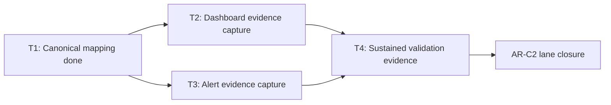

# AR-C2 Dashboard And Alert Wiring Evidence

This runbook records governed evidence for `AR-C2-T2` and `AR-C2-T3`.

It is intentionally truth-first:

- do not mark dashboard or alert wiring as complete without immutable evidence
- do not treat SLA threshold text as equivalent to wired monitor configuration

Companion manuals:

- [AR-C2 Observability User Manual](../guides/ar-c2-observability-user-manual-20260404.md)
- [AR-C2 Observability Technical Manual](../guides/ar-c2-observability-technical-manual-20260404.md)

## Governing sources

- `docs/planning/state/agent-lane-c.yaml`
- `docs/planning/proposals/mandatory/runtime-and-contracts/ar-c2-sla-operational-closure-plan-20260404.md`
- `docs/planning/reviews/architecture-and-governance/20260404-ar-c2-fowler-hard-qa-review.md`
- `docs/runbooks/ar-c2-sla-signal-threshold-mapping-20260404.md`
- `docs/runbooks/api-runtime-sla-canonical-20260404.md`

## Current verification snapshot (2026-04-04)

Repository-level search for versioned dashboard/alert config artifacts in this
workspace did not find a governed source of truth for runtime monitor wiring.

Verification command patterns executed:

- `rg -n "PrometheusRule|alertname|grafana|dashboard|alerts:|promql|record:" -S .`
- `rg --files | rg -n "prometheus|grafana|helm|k8s|terraform|monitor|alerts|rules"`

Result:

- metric emission docs and code anchors exist
- canonical mapping table exists (`AR-C2-T1`)
- no in-repo monitor-config-as-code artifact was found for AR-C2 dashboards and
  alerts

## Completion evidence required

`AR-C2-T2` dashboard wiring evidence must include:

- dashboard system and environment
- immutable dashboard reference (UID/URL/export hash)
- panel ID or key per AR-C2 mapping row
- query expression per panel
- capture timestamp and reviewer

`AR-C2-T3` alert wiring evidence must include:

- alert rule identifier per AR-C2 threshold
- exact expression and duration window
- severity and routing target
- source of monitor config truth (file path or immutable external reference)
- capture timestamp and reviewer

## Dashboard evidence matrix (`AR-C2-T2`)

Populate one row per signal with immutable evidence when available.

| Signal key                        | Dashboard system | Environment | Immutable dashboard reference (UID/URL/hash) | Panel key/id | Query expression | Captured at (UTC) | Reviewer | Status  |
| --------------------------------- | ---------------- | ----------- | -------------------------------------------- | ------------ | ---------------- | ----------------- | -------- | ------- |
| `ar-c2.start-run-latency`         | pending          | pending     | pending                                      | pending      | pending          | pending           | pending  | pending |
| `ar-c2.plan-compile-latency`      | pending          | pending     | pending                                      | pending      | pending          | pending           | pending  | pending |
| `ar-c2.snapshot-staleness-counts` | pending          | pending     | pending                                      | pending      | pending          | pending           | pending  | pending |
| `ar-c2.snapshot-unknown-fallback` | pending          | pending     | pending                                      | pending      | pending          | pending           | pending  | pending |
| `ar-c2.outbox-claimed-lag`        | pending          | pending     | pending                                      | pending      | pending          | pending           | pending  | pending |
| `ar-c2.outbox-drain-lag`          | pending          | pending     | pending                                      | pending      | pending          | pending           | pending  | pending |
| `ar-c2.event-delivery-latency`    | pending          | pending     | pending                                      | pending      | pending          | pending           | pending  | pending |
| `ar-c2.run-status-stale-ratio`    | pending          | pending     | pending                                      | pending      | pending          | pending           | pending  | pending |
| `ar-c2.run-status-unknown-ratio`  | pending          | pending     | pending                                      | pending      | pending          | pending           | pending  | pending |

## Alert evidence matrix (`AR-C2-T3`)

Populate one row per threshold with immutable evidence when available.

| Threshold key                       | Alert rule id | Expression | Window / duration | Severity | Routing target | Config source (path or immutable ref) | Captured at (UTC) | Reviewer | Status  |
| ----------------------------------- | ------------- | ---------- | ----------------- | -------- | -------------- | ------------------------------------- | ----------------- | -------- | ------- |
| `start-run.p99.warning`             | pending       | pending    | pending           | warning  | pending        | pending                               | pending           | pending  | pending |
| `start-run.p99.critical`            | pending       | pending    | pending           | critical | pending        | pending                               | pending           | pending  | pending |
| `plan-compile.p99.warning`          | pending       | pending    | pending           | warning  | pending        | pending                               | pending           | pending  | pending |
| `plan-compile.p99.critical`         | pending       | pending    | pending           | critical | pending        | pending                               | pending           | pending  | pending |
| `outbox-drain.p95.warning`          | pending       | pending    | pending           | warning  | pending        | pending                               | pending           | pending  | pending |
| `outbox-drain.p95.critical`         | pending       | pending    | pending           | critical | pending        | pending                               | pending           | pending  | pending |
| `event-delivery.p99.warning`        | pending       | pending    | pending           | warning  | pending        | pending                               | pending           | pending  | pending |
| `event-delivery.p99.critical`       | pending       | pending    | pending           | critical | pending        | pending                               | pending           | pending  | pending |
| `run-status-stale-ratio.warning`    | pending       | pending    | pending           | warning  | pending        | pending                               | pending           | pending  | pending |
| `run-status-stale-ratio.critical`   | pending       | pending    | pending           | critical | pending        | pending                               | pending           | pending  | pending |
| `run-status-unknown-ratio.critical` | pending       | pending    | pending           | critical | pending        | pending                               | pending           | pending  | pending |

## AR-C2 status implication

- `AR-C2-T1`: done
- `AR-C2-T2`: pending evidence capture
- `AR-C2-T3`: pending evidence capture
- `AR-C2-T4`: blocked on `T2/T3` evidence and sustained validation windows

## Mermaid diagram

