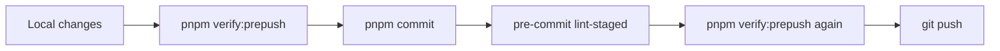
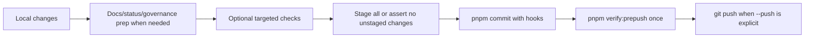

# Governed Changed Slice Closeout

Use this runbook when a local slice is ready for closeout and the changed files
may require generated docs, governance hashes, workboard views, or prepush
validation.

The canonical helper is:

```bash
pnpm closeout:changed
```

Preview the exact sequence first with:

```bash
pnpm closeout:changed --dry-run
```

Use the PR closeout rail when the slice is ready to be committed and pushed:

```bash
pnpm pr:closeout <type> <scope> "<Subject>" --stage-all --push
```

Preview the exact PR closeout sequence with:

```bash
pnpm pr:closeout <type> <scope> "<Subject>" --stage-all --push --dry-run
```

## Why There Are Two Helpers

`pnpm closeout:changed` is the validation and regeneration helper for an
uncommitted changed slice. It does not commit, push, or create PRs.

`pnpm pr:closeout` is the final PR rail. It removes the duplicated manual loop
where contributors ran full `verify:prepush`, then committed, then repeated the
same full gate after pre-commit formatting had changed the index.

Previous manual loop:



Mechanized PR closeout:



## What It Runs

The helper reads the local changed-file set and builds a deterministic closeout
sequence:

- `pnpm governance:refresh`, which owns docs sync, generated code status,
  capability coverage, governance manifest, document-unit map, file-component
  index, fingerprints, planning DB import, workboard generation, DB checks,
  governance DB import/check/export, and DB-sourced coverage/remediation
  generation;
- `git diff --check` and `git diff --cached --check`;
- an internal unresolved-conflict-marker scan over changed text files;
- `pnpm verify:prepush -- --full`.

`closeout:changed` intentionally does not keep a manual copy of the
`governance:refresh` substeps. That keeps changed-slice closeout aligned with
the DB-first governance rail and prevents local helpers from running stale
coverage/remediation or DB validation sequences.

The helper does not commit, push, create a PR, bypass hooks, relax checks, or
replace package-specific tests required by the active slice. It only removes
manual ordering and memory from the standard closeout path.

The stale-aware DB import rail keeps repeated governance safety checks from
becoming a fixed rebuild tax. `pnpm governance:db:import -- --if-stale` first
compares source hashes for planning lanes, repository commands, PR readiness,
docs disposition documents, knowledge documents, and risk debt documents. Only
when that cheap invalidation layer finds staleness does it run the full
auxiliary projection comparison and import path.

## What `pr:closeout` Runs

The PR rail reads the same local changed-file set and builds a deterministic
finalization sequence:

- `pnpm docs:sync` when files under `docs/` changed;
- `pnpm docs:status:generate` when files under `apps/` or `packages/` changed;
- `pnpm governance:refresh` when package scripts, governance workflow docs, or
  repository command tooling changed;
- each `--check "<command>"` supplied by the caller for slice-specific targeted
  tests;
- `git add -A` only when `--stage-all` is explicit;
- if `--stage-all` is omitted, a pre-commit guard fails when preparation or
  checks leave unstaged files outside the index;
- `pnpm commit <type> <scope> "<Subject>"`, preserving the repository commit
  helper and normal pre-commit hooks;
- one final `pnpm verify:prepush`;
- `git push` only when `--push` is explicit.

The rail refuses to commit with no staged files unless `--stage-all` is passed.
In staged-files mode, it also refuses to commit generated or prep outputs that
were left unstaged; stage those files explicitly or rerun with `--stage-all`.
It does not create a PR, bypass hooks, relax checks, or infer a commit message.

## Before Running

Check the worktree:

```bash
git status --short --branch
```

If unrelated untracked docs are present, isolate or resolve them before running
the closeout helper. Documentation generators scan the filesystem, so an
untracked local snapshot under `docs/` can legitimately affect generated
indexes even when it is not part of the intended slice.

## Closeout Evidence

After the helper passes, record:

- governing sources used for the slice;
- files actually changed;
- exact validation commands run, including `pnpm closeout:changed` or
  `pnpm pr:closeout`;
- whether package-specific tests were also required and run;
- no debt, no stubs, no skipped checks, and no hook bypass.
