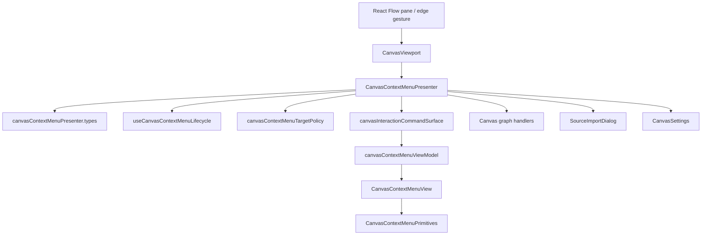
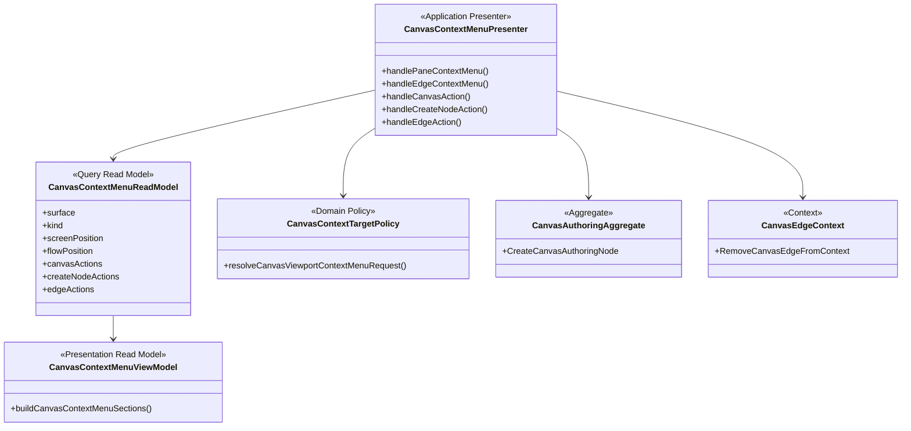
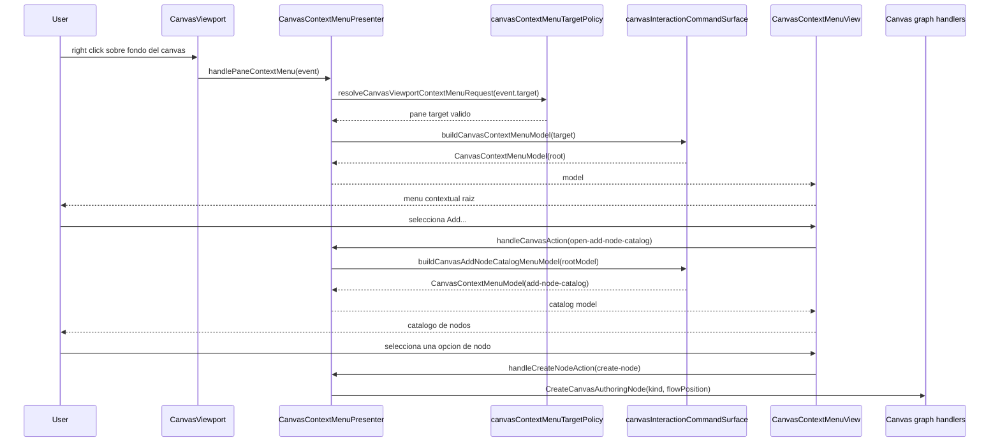

# Canvas Context Menu Presenter Informe

## Resumen

Si, el componente existe en Planning DB.

Componente:

- `component_id`: `web.component.canvas.CanvasContextMenuPresenter`
- `component_kind`: `context-panel`
- `status`: `current`
- `owner`: `Frontend / Canvas`
- `route_scope`: `/canvas`
- `plugin_scope`: `dbt;dvt`
- `file_count`: `8`
- `rail_count`: `3`
- `capability_gap_count`: `0`

Responsabilidad declarada en DB:

> Owns the Canvas context-menu presenter adapter and delegates browser lifecycle, target policy, and local port contracts to explicit child files.

Lectura directa: el componente ya no deberia ser un bloque grande. Es un
presenter/adaptador que coordina ciclo de vida, politica de target y comandos
locales. No deberia poseer catalogos visuales complejos ni semantica de negocio
de nodos.

## Componentes Relacionados

La familia Canvas registrada en DB contiene componentes vecinos que delimitan
el alcance real:

| Componente                                         | Tipo            | Estado observado                                     |
| -------------------------------------------------- | --------------- | ---------------------------------------------------- |
| `web.component.canvas.CanvasContextMenuPresenter`  | `context-panel` | Actual, con ownership de ficheros                    |
| `web.component.canvas.CanvasContextMenu`           | `context-panel` | Host/template posicionado                            |
| `web.component.canvas.CanvasBackgroundContextMenu` | `context-panel` | Acciones validas sobre fondo del canvas              |
| `web.component.canvas.CanvasAddNodeCatalog`        | `context-panel` | Existe como concepto, sin ficheros propios y con gap |
| `web.component.canvas.CanvasEdgeContextMenu`       | `context-panel` | Contexto de edge, sin ficheros propios               |
| `web.component.canvas.CanvasNodeContextMenu`       | `context-panel` | Menu contextual de nodo, separado                    |
| `web.component.canvas.CanvasSelectionContextMenu`  | `context-panel` | Planificado, con gap                                 |
| `web.component.canvas.CanvasSettings`              | `context-panel` | Existe como concepto, sin ficheros propios y con gap |

Conclusion Fowler: el presenter esta bien separado como componente tecnico de
interaccion, pero el catalogo `Add...` aun no esta suficientemente materializado
como componente UX propio. Ese es el siguiente corte natural.

## Diagrama De Componentes



### Lectura Del Diagrama

- `CanvasViewport` adapta eventos del canvas.
- `CanvasContextMenuPresenter` decide abrir/cerrar y enrutar acciones.
- `canvasContextMenuTargetPolicy` decide si el gesto pertenece al fondo del
  canvas o debe ignorarse por venir de nodo, edge, controles o minimap.
- `canvasInteractionCommandSurface` construye el modelo de comandos/query.
- `canvasContextMenuViewModel` agrupa el modelo para presentacion.
- `CanvasContextMenuView` y `CanvasContextMenuPrimitives` renderizan.

## DDD



### Bounded Context

Contexto propietario: `Canvas authoring / Canvas interaction`.

Objetos DDD:

- `CanvasContextMenuReadModel`: query local para acciones disponibles.
- `CanvasContextTargetPolicy`: politica explicita de target del gesto.
- `CanvasAuthoringAggregate`: agregado que recibe `CreateCanvasAuthoringNode`.
- `CanvasEdgeContext`: contexto local para retirar una conexion.

No pertenece a este componente:

- Propiedades de nodo.
- Workbench de nodo.
- Catalogo completo de templates.
- Ejecucion global.
- Preview de plan.

## Diagrama De Secuencia



## Command / Query Rails

La DB asocia tres rails al componente:

| Rail                          | Tipo            | Estado              | Responsabilidad                                   |
| ----------------------------- | --------------- | ------------------- | ------------------------------------------------- |
| `ResolveCanvasContextMenu`    | `local-query`   | `implemented-local` | Resolver que acciones se muestran segun contexto  |
| `CreateCanvasAuthoringNode`   | `local-command` | `implemented-local` | Crear nodo de authoring en coordenadas del canvas |
| `RemoveCanvasEdgeFromContext` | `local-command` | `implemented-local` | Retirar conexion desde menu contextual de edge    |

### Observacion De Diseño

`ResolveCanvasContextMenu` es correcto para el presenter, pero ahora cubre
demasiadas variantes si tambien contiene catalogo `Add...`, edge y root. El
siguiente refactor deberia separar:

- `ResolveCanvasBackgroundContextMenu`
- `ResolveCanvasAddNodeCatalog`
- `ResolveCanvasEdgeContextMenu`

Eso no implica crear tres componentes pesados: implica que la DB y el codigo
puedan consultar y probar cada contexto de forma clara.

## Ficheros Asociados En DB

| Rol        | Fichero                                                                              | Simbolo                                   |
| ---------- | ------------------------------------------------------------------------------------ | ----------------------------------------- |
| `contract` | `apps/web/src/app/views/canvas/canvasContextMenuPresenter.types.ts`                  | `UseCanvasContextMenuPresenterArgs`       |
| `hook`     | `apps/web/src/app/views/canvas/useCanvasContextMenuLifecycle.ts`                     | `useCanvasContextMenuLifecycle`           |
| `hook`     | `apps/web/src/app/views/canvas/useCanvasContextMenuPresenter.ts`                     | `useCanvasContextMenuPresenter`           |
| `policy`   | `apps/web/src/app/views/canvas/canvasContextMenuTargetPolicy.ts`                     | `resolveCanvasViewportContextMenuRequest` |
| `test`     | `apps/web/src/app/views/canvas/CanvasViewport.contextMenu.test.tsx`                  | n/a                                       |
| `test`     | `apps/web/src/app/views/canvas/useCanvasContextMenuPresenter.canvasActions.test.tsx` | n/a                                       |
| `test`     | `apps/web/src/app/views/canvas/useCanvasContextMenuPresenter.graphActions.test.tsx`  | n/a                                       |
| `test`     | `apps/web/src/app/views/canvas/useCanvasContextMenuPresenter.lifecycle.test.tsx`     | n/a                                       |

## Tests Asociados

Tests del componente segun DB:

- `CanvasViewport.contextMenu.test.tsx`
- `useCanvasContextMenuPresenter.canvasActions.test.tsx`
- `useCanvasContextMenuPresenter.graphActions.test.tsx`
- `useCanvasContextMenuPresenter.lifecycle.test.tsx`

Tests relacionados que no estan asignados directamente al presenter, pero
participan en el flujo actual:

- `CanvasContextMenuView.test.tsx`
- `canvasContextMenuViewModel.test.ts`
- `canvasInteractionCommandSurface.test.ts`
- `canvasInteractionCommandSurface.architecture.test.ts`
- `CanvasShell.contextMenuIntegration.test.tsx`
- `CanvasViewport.edgeContextMenu.test.tsx`

Observacion: estos tests relacionados deberian redistribuirse a los componentes
DB-first correctos. Ahora prueban partes del flujo, pero no todos pertenecen al
presenter.

## Consultas SQL Para Verificar

### Componente

```sql
select *
from planning_query_store.frontend_component_summary_query
where component_id = 'web.component.canvas.CanvasContextMenuPresenter';
```

### Estructura De Ficheros

```sql
select file_role, file_path, exported_symbol, source_path
from planning_query_store.frontend_component_file_query
where component_id = 'web.component.canvas.CanvasContextMenuPresenter'
order by file_role, file_path;
```

### Command / Query Rails

```sql
select rail_kind, rail_name, rail_status, source_path
from planning_query_store.frontend_component_rail_query
where component_id = 'web.component.canvas.CanvasContextMenuPresenter'
order by rail_kind, rail_name;
```

### Catalogo Canonico De Rails

```sql
select rail_name, rail_type, ddd_owner, rail_status, implementation_refs
from planning_query_store.command_query_rail_query
where rail_name in (
  'ResolveCanvasContextMenu',
  'CreateCanvasAuthoringNode',
  'RemoveCanvasEdgeFromContext'
)
order by rail_name;
```

### Familia De Componentes Canvas

```sql
select
  component_id,
  component_kind,
  responsibility,
  file_count,
  rail_count,
  capability_gap_count
from planning_query_store.frontend_component_summary_query
where component_id like 'web.component.canvas.%'
order by component_id;
```

## Diagnostico Actual

### Bien

- El componente existe en DB.
- Tiene ownership de ficheros.
- Tiene rails asociados.
- El presenter ya no concentra toda la logica: ciclo de vida, politica de target
  y tipos estan extraidos.
- `NodeContextMenu`, `BackgroundContextMenu` y `EdgeContextMenu` estan separados
  conceptualmente en DB.

### Mal O Incompleto

1. `CanvasAddNodeCatalog` existe como componente conceptual, pero no tiene
   ficheros propios. Eso confirma que el catalogo `Add...` aun vive mezclado en
   el flujo del presenter/view model.
2. El menu root y el catalogo producen una percepcion de doble `Add`: root item
   `Add...` y seccion `ADD` en el catalogo.
3. El catalogo de nodos es lista plana; no tiene filtro tipo NiFi.
4. Las opciones no tienen descripcion rica al hover ni texto secundario.
5. Hay textos de UI en ingles en el modelo (`Add...`, `Canvas settings`,
   `Add source`, etc.) pese a que el producto esta trabajando i18n.
6. `CanvasSettings` existe en DB, pero aparece sin ficheros propios y con gap.
7. `CanvasEdgeContextMenu` existe como contexto sin ownership de fichero. Puede
   ser aceptable si se declara explicitamente como contexto sin ownership, pero
   debe ser una decision DB-first, no una omision.
8. La accion de borrar canvas actual no esta en este componente ni consta como
   rail asociado. No debe implementarse sin rail.
9. Templates existen como ruta/workbench del shell, pero no como accion
   gobernada del canvas background menu. No debe agregarse sin rail/capability.

## Cambios Que Hay Que Hacer

### P0 Del Componente

1. Crear componente DB-first efectivo para `CanvasAddNodeCatalog` con ficheros,
   tests y rail propios.
2. Cambiar el catalogo `Add...` a:
   - buscador/filtro;
   - categorias;
   - descripcion por opcion;
   - labels i18n.
3. Quitar la percepcion visual de doble `Add`.
4. Mover copy del menu a un catalogo i18n de canvas context menu.

### P1 Del Componente

1. Declarar en DB si `CanvasEdgeContextMenu` es contexto sin ownership o darle
   ficheros propios.
2. Dar ownership real a `CanvasSettings` o registrar su gap con tareas.
3. Dividir el rail generico `ResolveCanvasContextMenu` en rails por contexto si
   el catalogo y edge siguen creciendo.

### P2 De Producto

1. Resolver rail/capability para `DeleteCanvasDocument` o equivalente antes de
   mostrar borrar canvas.
2. Resolver rail/capability para abrir templates desde canvas antes de exponer
   una seccion `Templates`.

## Decision Recomendada

No tocar mas el presenter como si fuera el lugar para todo. El siguiente corte
debe ser:

```text
CanvasContextMenuPresenter
  coordina gesto y routing

CanvasAddNodeCatalog
  posee filtro, categorias, descripcion e i18n

CanvasBackgroundContextMenu
  posee solo acciones raiz del fondo del canvas

CanvasSettings
  posee configuracion del canvas
```

Esta separacion conserva SRP y hace que Planning DB pueda responder con claridad
que componente, rail, ficheros y tests cubren cada comportamiento.
