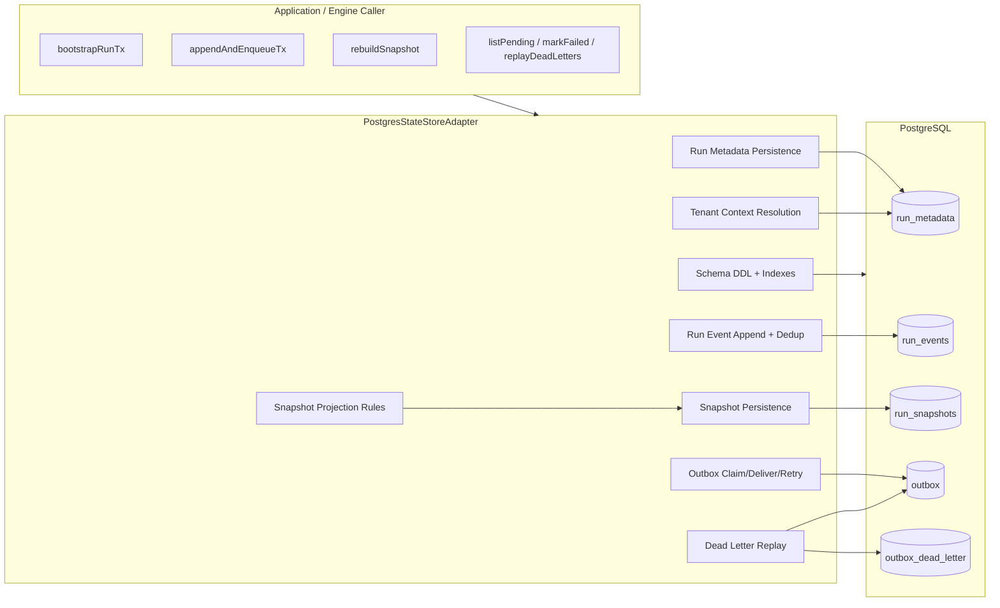
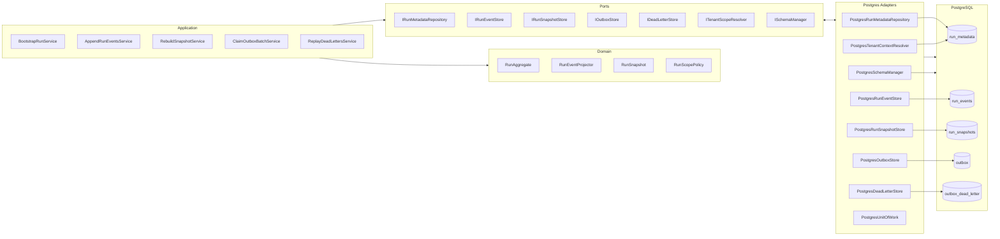
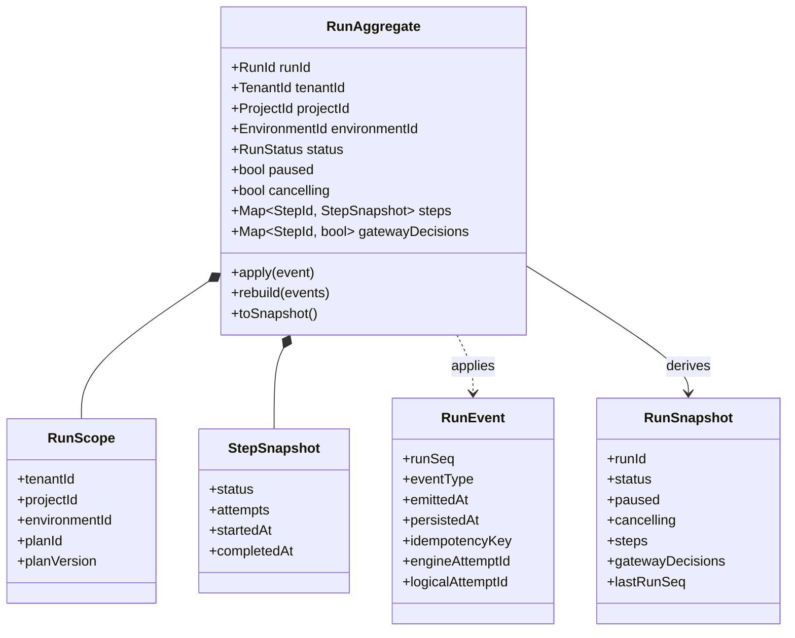
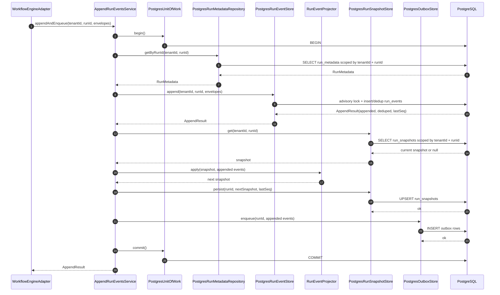
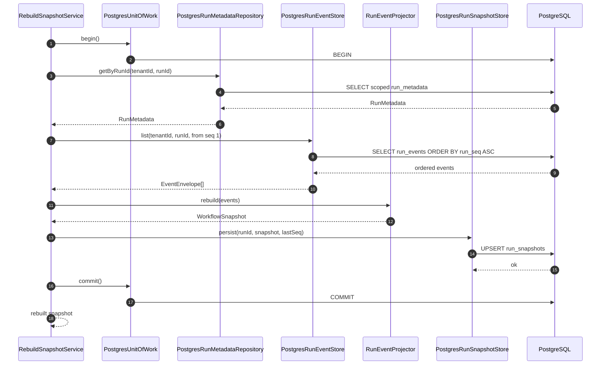

# PostgresStateStoreAdapter — Architecture Review and Refactor Proposal

**Target**: `packages/@dvt/adapter-postgres/src/PostgresStateStoreAdapter.ts`  
**Scope**: hard architectural review + target shape for refactor  
**Focus**: domain boundaries, aggregate roots, ports/adapters, file layout, sequence flows  
**Status**: review draft

---

## 1. Executive judgment

`PostgresStateStoreAdapter` is a **strong technical base** for PostgreSQL-backed run state, event append, snapshot persistence, and outbox delivery support.

It is **not yet a clean final design** for DVT+.

The main problem is not SQL correctness. The main problem is **boundary collapse**:

- infrastructure owns domain projection logic,
- one class owns too many reasons to change,
- tenant enforcement is inconsistent at the public boundary,
- outbox/dead-letter concerns are mixed into the same object as run state persistence,
- the adapter is acting as façade, repository, schema manager, projector host, retry store, and replay service at once.

That shape conflicts with the DVT+ product rule that **state is the source of truth**, the **engine does not decide**, and the architecture must remain contract-first and adapter-based. It also conflicts with the V2 architecture guidance that the **Metadata/State Store** is a dedicated layer behind explicit contracts, and that **RBAC / tenant scoping** is first-class.`r`n`r`n---

## 2. What is good in the current implementation

### 2.1 Correct state-centric flow

The following transactional flows are sound in intent:

- `bootstrapRunTx(...)`
- `appendAndEnqueueTx(...)`

They preserve the right invariant:

1. persist metadata/events,
2. derive snapshot,
3. enqueue outbox in the same transaction.

That matches DVT+’s state-first model.

### 2.2 Correct use of advisory lock per run

`acquireRunLock(runId)` is the right primitive to protect:

- `MAX(run_seq)`
- append ordering
- concurrent snapshot persistence

### 2.3 Correct idempotency intent

The combination of:

- `UNIQUE (run_id, idempotency_key)`
- event dedup readback
- outbox id based on `runId:runSeq`

is aligned with the requirement that engine-driven state updates must be safe under retries.

### 2.4 Constructor no longer runs DDL

Separating `migrate()` from constructor is the right operational choice.

---

## 3. Main architectural issues

### 3.1 Infrastructure contains domain projection rules

The adapter contains:

- `EVENT_HANDLERS`
- `applyEventToSnapshot(...)`
- `handleRunStarted / handleRunCompleted / handleStepFailed / ...`

This is the single most important design problem.

These are **domain state transition rules**. They should not live inside a PostgreSQL adapter.

Consequences:

- duplicated business rules across layers,
- sync drift risk between engine/domain and persistence,
- weaker replay guarantees,
- harder testing,
- violation of hexagonal boundaries.

### 3.2 One class owns too many responsibilities

This class currently owns:

- migration lifecycle,
- schema DDL,
- index management,
- transaction orchestration,
- tenant context setup,
- run metadata persistence,
- event store append/dedup,
- snapshot rebuild/persist,
- outbox enqueue/claim/fail/deliver,
- dead-letter replay.

That is a textbook SRP failure.

### 3.3 Public boundary does not consistently enforce tenant scope

Some read methods receive `tenantId`. Good.

But several mutation paths operate with only `runId` and internally resolve tenant context. That means the adapter accepts an unscoped identifier and discovers tenant ownership internally.

That is weaker than a hard boundary where all tenant-facing calls are explicitly scoped.

### 3.4 Unknown event types are ignored during projection

Current behavior: unknown event types do not mutate the snapshot.

This is dangerous because it can silently create divergence between:

- persisted event history,
- materialized snapshot,
- UI-visible state.

A core state layer should not silently lie.

### 3.5 Aggregate boundaries are blurred

The implementation mixes together:

- **Run state aggregate concerns**,
- **integration delivery concerns**,
- **operational recovery concerns**.

Those are related, but not the same aggregate.

---

## 4. SOLID / OOP / Hexagonal / DDD assessment

## 4.1 SOLID

### S — Single Responsibility

**Failing.** The class has too many reasons to change.

### O — Open/Closed

**Weak.** Adding event types, projection rules, outbox policies, or new migration concerns forces edits to the same class.

### L — Liskov

No major issue visible at the class contract level.

### I — Interface Segregation

**Weak.** Implementing both `IRunStateStore` and `IOutboxStorage` in the same concrete class is possible, but in practice it inflates the adapter surface and couples unrelated workflows.

### D — Dependency Inversion

**Weak.** Infrastructure depends on domain projection details instead of depending on a pure projector contract.

## 4.2 OOP

The implementation style is disciplined, but object design is overloaded.

Good:

- small helper methods,
- readable naming,
- reasonable transaction encapsulation.

Bad:

- god object shape,
- poor responsibility distribution,
- too much policy embedded in infrastructure.

## 4.3 Hexagonal

Partially correct.

Good:

- PostgreSQL is behind an adapter,
- execution planner and workflow engine are not directly embedded,
- the code is clearly meant to implement ports.

Bad:

- domain projection is leaking into infrastructure,
- tenant boundary is not fully explicit at call sites,
- one adapter implements too many ports and subconcerns.

## 4.4 DDD

DDD fit is incomplete.

The core business concept is the **Run** as an event-sourced aggregate with a derived snapshot.

But the current class treats:

- event stream,
- snapshot,
- outbox,
- dead letter replay,
- schema migration

as if they all belonged to one technical object. They do not.

---

## 5. Domain model — before vs after

## 5.1 Before — current effective domain/infrastructure shape



### Problem in the “before” model

The adapter is not only adapting persistence. It is also hosting domain projection and operational recovery policy.

---

## 5.2 After — target domain/infrastructure shape



### Benefit of the “after” model

- projection rules become pure and shared,
- PostgreSQL is only an implementation detail,
- outbox and dead-letter flows stop inflating the run-state repository,
- tenant enforcement becomes explicit,
- tests become much cheaper and more surgical.

---

## 6. Aggregate roots and domain boundaries

## 6.1 Recommended aggregate roots

### Aggregate Root 1 — `RunAggregate`

This is the core aggregate.

Owns:

- run identity and scope,
- lifecycle status,
- step status state,
- gateway decisions,
- event application semantics,
- snapshot derivation rules.

Does **not** own:

- outbox delivery mechanics,
- dead-letter recovery policy,
- schema DDL.

### Aggregate Root 2 — none for Outbox in the core domain

The outbox is best treated as an **integration reliability mechanism**, not as a business aggregate root.

It may have its own operational model, but it should not be elevated to the same domain aggregate as `Run`.

### Aggregate Root 3 — none for Dead Letter in the core domain

Dead letter replay is an **operational recovery concern**, not the business state of a run.

It belongs in application/integration support.

## 6.2 Aggregate diagram



## 6.3 Boundary note

The aggregate root is **RunAggregate**, not `PostgresStateStoreAdapter`.

The adapter should never be the place where aggregate rules are authored.

---

## 7. Recommended public contracts

The target split should look like this.

```ts
export interface IRunMetadataRepository {
  insert(meta: RunMetadata): Promise<void>;
  getByRunId(tenantId: string, runId: string): Promise<RunMetadata | null>;
  saveProviderRef(tenantId: string, runId: string, ref: ProviderRef): Promise<void>;
  listRuns(options: ListRunsOptions): Promise<RunMetadata[]>;
}

export interface IRunEventStore {
  append(tenantId: string, runId: string, envelopes: EventInput[]): Promise<AppendResult>;
  list(tenantId: string, runId: string, options?: ListEventsOptions): Promise<EventEnvelope[]>;
  getMaxRunSeq(runId: string): Promise<number>;
}

export interface IRunSnapshotStore {
  get(tenantId: string, runId: string): Promise<WorkflowSnapshot | null>;
  persist(runId: string, snapshot: WorkflowSnapshot, lastRunSeq: number): Promise<void>;
  rebuild(tenantId: string, runId: string): Promise<WorkflowSnapshot>;
}

export interface IOutboxStore {
  enqueue(runId: string, events: EventEnvelope[]): Promise<void>;
  claimPending(
    limit: number,
    selection?: { shardIds?: readonly number[] }
  ): Promise<OutboxRecord[]>;
  markDelivered(ids: string[]): Promise<void>;
  markFailed(id: string, error: string): Promise<void>;
}

export interface IDeadLetterStore {
  list(limit: number, tenantId: string): Promise<DeadLetterRecord[]>;
  replay(options: {
    limit?: number;
    tenantId: string;
    runId?: string;
    ids?: string[];
  }): Promise<number>;
}
```

---

## 8. Recommended file/package layout

## 8.1 New file structure

```mermaid
flowchart TB
    R[packages/@dvt]

    R --> D1[@dvt/run-state-domain]
    R --> D2[@dvt/run-state-application]
    R --> D3[@dvt/adapter-postgres]

    D1 --> D11[src/aggregates/RunAggregate.ts]
    D1 --> D12[src/domain-services/RunEventProjector.ts]
    D1 --> D13[src/value-objects/RunScope.ts]
    D1 --> D14[src/value-objects/RunSnapshot.ts]
    D1 --> D15[src/events/RunEvent.ts]
    D1 --> D16[src/policies/RunScopePolicy.ts]

    D2 --> A11[src/services/BootstrapRunService.ts]
    D2 --> A12[src/services/AppendRunEventsService.ts]
    D2 --> A13[src/services/RebuildSnapshotService.ts]
    D2 --> A14[src/services/ClaimOutboxBatchService.ts]
    D2 --> A15[src/services/ReplayDeadLettersService.ts]
    D2 --> A16[src/ports/IRunMetadataRepository.ts]
    D2 --> A17[src/ports/IRunEventStore.ts]
    D2 --> A18[src/ports/IRunSnapshotStore.ts]
    D2 --> A19[src/ports/IOutboxStore.ts]
    D2 --> A110[src/ports/IDeadLetterStore.ts]
    D2 --> A111[src/ports/IUnitOfWork.ts]

    D3 --> P11[src/PostgresUnitOfWork.ts]
    D3 --> P12[src/PostgresSchemaManager.ts]
    D3 --> P13[src/PostgresRunMetadataRepository.ts]
    D3 --> P14[src/PostgresRunEventStore.ts]
    D3 --> P15[src/PostgresRunSnapshotStore.ts]
    D3 --> P16[src/PostgresOutboxStore.ts]
    D3 --> P17[src/PostgresDeadLetterStore.ts]
    D3 --> P18[src/PostgresTenantContextResolver.ts]
    D3 --> P19[src/sql/sqlUtils.ts]
    D3 --> P110[src/sql/migrations/*]
```

## 8.2 Minimal transitional variant

If you do not want a package split yet, the minimum acceptable in the current package is:

```text
packages/@dvt/adapter-postgres/src/
  PostgresUnitOfWork.ts
  PostgresSchemaManager.ts
  PostgresRunMetadataRepository.ts
  PostgresRunEventStore.ts
  PostgresRunSnapshotStore.ts
  PostgresOutboxStore.ts
  PostgresDeadLetterStore.ts
  PostgresTenantContextResolver.ts
  sqlUtils.ts

packages/@dvt/run-state-domain/src/
  RunAggregate.ts
  RunEventProjector.ts
  RunScopePolicy.ts
```

---

## 9. Sequence diagram — current target append flow

This is the sequence that should exist after refactor.



---

## 10. Sequence diagram — rebuild snapshot



---

## 11. Concrete refactor plan

### Phase 1 — mandatory extractions

1. Extract `RunEventProjector` out of `adapter-postgres`
2. Extract `PostgresSchemaManager`
3. Extract `PostgresOutboxStore`
4. Extract `PostgresDeadLetterStore`
5. Extract `PostgresRunMetadataRepository`
6. Extract `PostgresRunEventStore`
7. Extract `PostgresRunSnapshotStore`

### Phase 2 — boundary hardening

1. Make all tenant-facing mutations require `tenantId`
2. Validate envelope scope against `run_metadata`
3. Replace generic `Error(...)` strings with typed errors
4. Fail hard on unknown event type during projection or mark snapshot as non-projectable

### Phase 3 — cleanup

1. Remove deprecated `saveRunMetadata()` from public use path
2. Add observability hooks around append/rebuild/claim/replay
3. Add contract tests per extracted store

---

## 12. Required non-negotiable rules after refactor

1. **Projection rules are domain code, not SQL adapter code.**
2. **RunAggregate is the root aggregate.**
3. **Snapshot is a projection, not the primary truth.**
4. **Outbox is integration reliability infrastructure, not business aggregate state.**
5. **Dead-letter replay is operational support, not domain behavior.**
6. **Every tenant-facing mutation must be tenant-scoped at the method boundary.**
7. **Unknown event types must not silently desynchronize snapshot from history.**

---

## 13. Final recommendation

Do not throw this implementation away.

The transactional core is useful. The SQL direction is mostly sound. The class already contains important concurrency and durability logic worth keeping.

But do not keep it as the final architectural shape.

The correct move is:

- keep the SQL mechanics,
- extract the domain projector,
- split the adapter into smaller repositories/stores,
- make tenant scope explicit,
- treat `RunAggregate` as the actual root.

That gets you much closer to the DVT+ architecture rule set:

- state-centric,
- replayable,
- engine-agnostic,
- UI state-driven,
- contract-first,
- multi-tenant by boundary, not by convention.

## 18. Short PR summary

**Good:** transactional persistence flow, append ordering, and snapshot/outbox coupling are directionally strong.
**Bad:** projection rules and too many infrastructure concerns collapse into one adapter class.
**Next move:** split projector, repositories/stores, and tenant-scoped boundaries while keeping the transactional SQL core.
