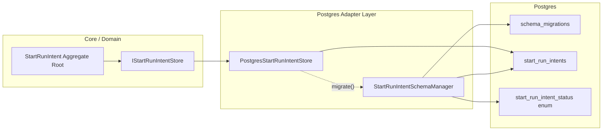
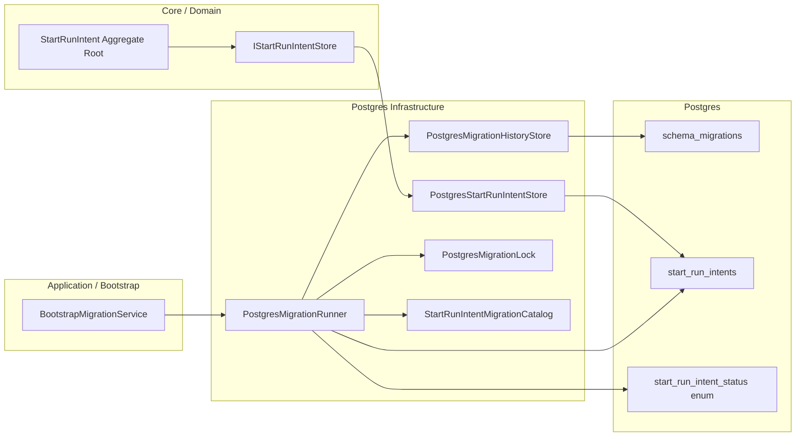
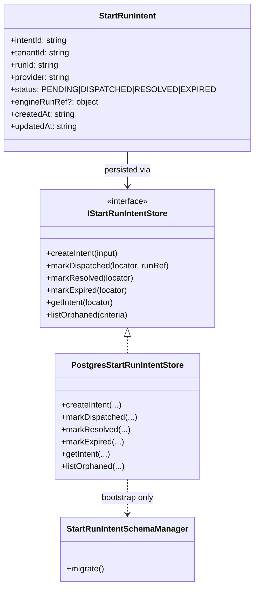
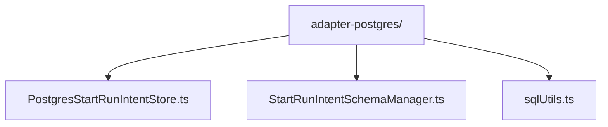
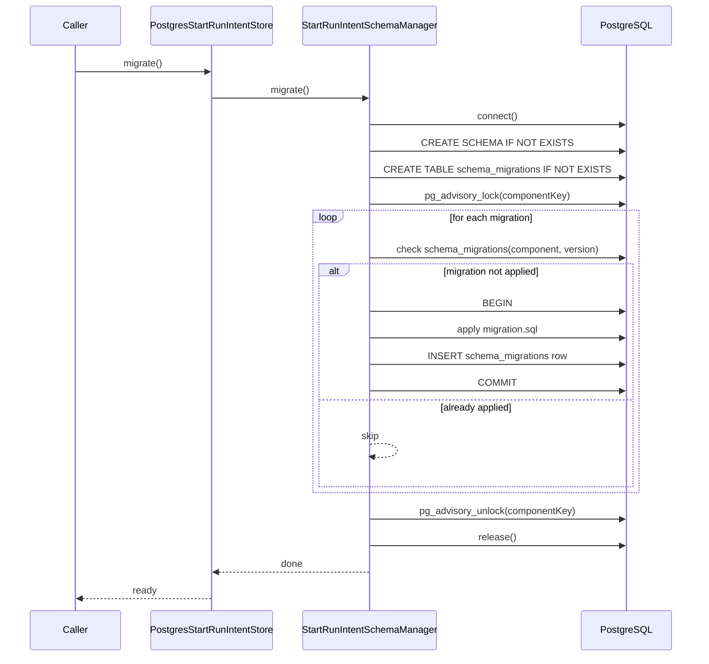
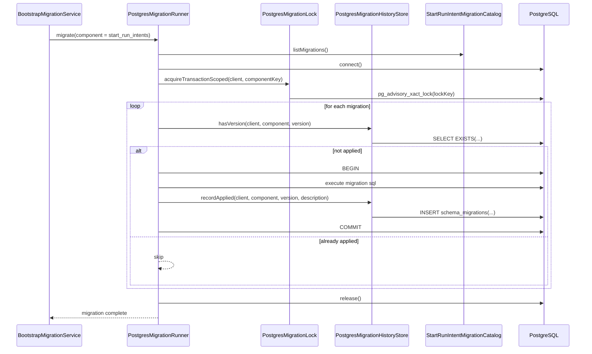

# StartRunIntentSchemaManager — QA, Architecture Review, and Refactor Proposal

**File under review**  
`packages/@dvt/adapter-postgres/src/StartRunIntentSchemaManager.ts`

**Status**  
Review focused on architectural fit, operational correctness, and target refactor shape.

---

## 1. Executive assessment

This class is **materially healthier** than `PostgresStateStoreAdapter` and `PostgresStartRunIntentStore` because it keeps a narrower scope: it coordinates schema evolution for the `start_run_intents` storage slice.

That said, it is **not yet a perfect infrastructure component**.

The main conclusions are:

1. The class is **directionally correct** because it keeps migrations outside repository CRUD logic.
2. It is **not domain logic**, and that is good. It must stay outside the aggregate.
3. It still mixes a few responsibilities that should be split more explicitly:
   - migration plan definition,
   - migration table bootstrap,
   - advisory lock policy,
   - migration runner.
4. It has some **operational weaknesses**:
   - session-level advisory lock instead of transaction-scoped lock,
   - manual transaction control inside a long-lived connection,
   - migration definitions embedded inline in the class,
   - weak typing/versioning of migration artifacts.

**Overall verdict:**  
**Good infrastructure base, not yet final.**

---

## 2. Why this matters in DVT+

DVT+ is explicitly built around **strict boundaries** between planning, execution, state, and presentation. The product definition states that the planner does not persist state, the engine does not decide, and the UI reflects persisted state only. The architecture explanation also places metadata/state behind explicit contracts and makes state the source of truth for the rest of the system. The architecture guidance further requires clean architecture, contract boundaries, tenant/RBAC first-class handling, and a metadata/state layer that remains distinct from runtime behavior.

This means a schema manager is legitimate **only as an infrastructure/bootstrap component**. It must not drift into domain rules, execution policy, or repository behavior. fileciteturn10file6turn10file0turn10file19

---

## 3. What is good already

### 3.1. Correct placement intent

The file header says migrations are managed outside repository CRUD logic. That is the right call.

A repository/store should answer questions like:

- create intent
- transition status
- get intent
- list orphaned

A schema manager should answer only:

- does schema exist?
- which versions are applied?
- which migrations remain?
- how are they executed safely?

That separation is good.

### 3.2. `migratePromise` dedup is correct

The class deduplicates concurrent `migrate()` calls. That is good operationally and avoids duplicate migration runners in the same process.

### 3.3. Explicit migration table is correct

Keeping `schema_migrations` with `(component, version)` is reasonable. It is simple, auditable, and enough for this slice.

### 3.4. Migration versioning is explicit

The migration entries have:

- `version`
- `description`
- `sql`

That is materially better than ad hoc `CREATE TABLE IF NOT EXISTS` scattered through stores.

### 3.5. The `StartRunIntentStore` / `SchemaManager` split is healthier than the older pattern

Compared with the larger Postgres state adapter that mixed runtime persistence with schema evolution, this split is closer to the target architecture where adapters implement contracts and bootstrap/migration stays in its own operational box. fileciteturn10file0turn10file19

---

## 4. Blocking / near-blocking issues

## B1. Advisory lock is session-scoped, not transaction-scoped

Current code:

```ts
await client.query('SELECT pg_advisory_lock(hashtext($1))', [key]);
```

### Why this is weak

`pg_advisory_lock(...)` is **session-level**. That means the lock lives for the connection/session, not for a single transaction.

If anything goes wrong in a strange way during the migration loop, the lock lifecycle is tied to manual unlock in `finally`, not naturally tied to transaction completion.

### Better option

Prefer a **transaction-scoped advisory lock**:

```sql
SELECT pg_advisory_xact_lock(hashtext($1))
```

That reduces lock lifecycle risk and matches the semantics better:

- acquire lock,
- run migration unit,
- commit/rollback,
- lock released automatically.

### Review status

**Strong issue.** Not necessarily catastrophic today, but not the cleanest operational primitive.

---

## B2. The class mixes migration catalog definition and migration execution

`getMigrations(...)` is inside the class and returns inline SQL strings.

### Why this is a problem

This means one object is currently responsible for:

- owning the migration runner,
- defining the migration catalog,
- bootstrapping the migration table,
- defining the locking pattern.

That is not disastrous, but it is still too much responsibility for a component that should stay boring and predictable.

### Better shape

Split into:

- `StartRunIntentMigrationCatalog`
- `PostgresMigrationHistoryStore`
- `PostgresMigrationLock`
- `StartRunIntentSchemaManager` as thin orchestrator

This keeps responsibilities cleaner and makes migrations testable as data, not as embedded behavior.

### Review status

**Architectural issue.** Strongly recommended refactor.

---

## B3. Migration SQL is large, stringly-typed, and not independently testable

The migration content is embedded inline as template strings.

### Risks

- hard to diff cleanly,
- hard to validate independently,
- hard to reuse in migration tests,
- harder to reason about rollback/compatibility story.

### Better shape

Move migrations to separate modules:

- `migrations/20260305_001_start_run_intents_base.ts`
- `migrations/20260305_002_start_run_intents_status_enum_upgrade.ts`

Each exports a typed `MigrationDefinition` object.

This is still code-first, but cleaner than a giant method returning an inline array.

---

## B4. Domain-adjacent invariants are in DDL and must be explicitly recognized as storage invariants, not aggregate rules

You have constraints like:

- `dispatched_requires_run_ref`
- `engine_run_ref_shape`
- active run uniqueness by `(tenant_id, run_id)` for active statuses

These are good as **storage guardrails**.

But they are **not the aggregate root** and **not the full domain model**.

### Why this needs to be called out

Without documenting this boundary, teams often slide into a bad pattern:

- “the DB constraint is the domain rule”

That is wrong.

The DB constraint is only:

- a persistence invariant,
- a last-line storage guard,
- a corruption barrier.

The actual aggregate behavior still belongs to domain contracts and application services.

### Review status

Not a code bug, but a **boundary risk**.

---

## 5. Non-blocking but important issues

## N1. `hashtext()` lock key has a collision surface

Current lock key:

```sql
hashtext($1)
```

For one component this may be acceptable, but it is weaker than a 64-bit derived lock key.

### Better option

Use an md5-derived 64-bit bigint, consistent with the stronger pattern already used elsewhere:

```sql
('x' || left(md5($1), 16))::bit(64)::bigint
```

This reduces accidental collision risk.

---

## N2. Manual `BEGIN`/`COMMIT` inside loop is serviceable but ugly

The loop does:

- existence check,
- `BEGIN`,
- apply migration,
- insert migration history row,
- `COMMIT`.

This is workable, but the code would be cleaner with a helper like:

```ts
withTransaction(client, async () => { ... })
```

That removes repetitive transaction control and makes rollback behavior more consistent.

---

## N3. No explicit observability hooks

The DVT+ architecture explicitly treats observability as first-class at core + adapters. Even bootstrap/migrations benefit from auditability and visibility. fileciteturn10file0turn10file16

This class should emit at least:

- migration component,
- version,
- duration,
- success/failure,
- skipped/applied count.

Not because migrations are business logic, but because failed bootstrap needs clear diagnostics.

---

## N4. No dry-run / inspect mode

A mature migration manager usually supports at least one of:

- `plan()`
- `listPending()`
- `dryRun()`

This class only executes.

That is okay for early phases, but weak for operational maturity.

---

## N5. `toSqlStringLiteral()` is a smell even if currently safe

It is currently used in a controlled way for DDL/DO block construction. But as a general pattern it is weaker than keeping SQL templates minimal and parameterizable where possible.

I would not call it a bug here, but I would avoid expanding this style.

---

## 6. SOLID review

## S — Single Responsibility

**Partially okay, not ideal.**

The class has one broad reason to change: schema migration for `start_run_intents`. That is much better than the bigger state adapter.

But internally it still mixes:

- migration catalog ownership,
- migration history bootstrap,
- advisory lock policy,
- migration execution.

So it is better than average, but not fully clean.

## O — Open/Closed

**Moderate.**

Adding a new migration is easy enough, but it requires editing the class itself.
A cleaner design would allow adding migration definitions without changing runner behavior.

## L — Liskov

No obvious issue.

## I — Interface Segregation

There is no explicit interface here, but that is acceptable for a narrow operational component.
Still, if a migration runner contract existed, it would help testing.

## D — Dependency Inversion

**Reasonable but incomplete.**

The class depends directly on `pg` and SQL utilities, which is fine for an infrastructure adapter. But the migration catalog should ideally be injected or imported as data, not hardcoded into the runner.

---

## 7. OOP review

From an OOP perspective, this is **acceptable**:

- state is small,
- responsibilities are understandable,
- methods are cohesive enough,
- no giant public surface.

The weakness is not style. The weakness is **object role inflation** inside infrastructure.

---

## 8. Hexagonal review

This component is **hexagon-compatible** if it stays where it belongs:

- outside the domain,
- outside the application use cases,
- inside infra/bootstrap.

That fits the DVT+ principle that core depends on contracts and adapters implement contracts, while bootstrap/operational plumbing remains explicit and separate. fileciteturn10file19turn10file13

### The important caveat

Do **not** let this class drift into:

- repository behavior,
- reconciliation logic,
- runtime cleanup,
- domain validation.

It should remain boring infra.

---

## 9. DDD / aggregate review

## Key point

`StartRunIntentSchemaManager` is **not an aggregate** and **must not become one**.

The likely aggregate in this slice is:

- `StartRunIntent` as aggregate root,
  with identity, status transitions, and storage representation.

The schema manager is only supporting infrastructure.

### Correct DDD reading

- Aggregate root: `StartRunIntent`
- Repository/store: `IStartRunIntentStore` / `PostgresStartRunIntentStore`
- Schema bootstrap: `StartRunIntentSchemaManager`

That is the correct separation.

### Wrong direction to avoid

Do not move transition rules or reconciliation policy into this class just because it already owns the table definition.

---

## 10. Before vs after — domain/infrastructure boundary

## 10.1 Current shape (before)



### Reading

This is already much healthier than mixing migrations directly into the store, but the schema manager still contains both the **migration catalog** and the **migration runner**.

---

## 10.2 Target shape (after)



### Reading

This target shape is cleaner because:

- migration definitions are data/catalog,
- lock policy is isolated,
- migration history persistence is isolated,
- runner orchestrates but does not own all concerns.

---

## 11. Aggregate root diagram



### Interpretation

The aggregate root is **StartRunIntent**, not the schema manager.
The schema manager must remain a bootstrap concern only.

---

## 12. File layout proposal

## 12.1 Current likely shape



## 12.2 Proposed shape

```mermaid
flowchart TD
    ROOT[packages/@dvt/adapter-postgres/src/] --> I[intents/]
    ROOT --> M[migrations/]
    ROOT --> S[shared/]

    I --> I1[PostgresStartRunIntentStore.ts]
    I --> I2[StartRunIntentSchemaBootstrap.ts]

    M --> M1[PostgresMigrationRunner.ts]
    M --> M2[PostgresMigrationHistoryStore.ts]
    M --> M3[PostgresMigrationLock.ts]
    M --> M4[types.ts]
    M --> M5[start-run-intents/]

    M5 --> V1[20260305_001_start_run_intents_base.ts]
    M5 --> V2[20260305_002_start_run_intents_status_enum_upgrade.ts]
    M5 --> CAT[StartRunIntentMigrationCatalog.ts]

    S --> S1[sqlUtils.ts]
```

### Why this is better

- migration artifacts become first-class files,
- review diffs are cleaner,
- runner logic is reusable,
- bootstrap is explicit,
- store stays focused on persistence behavior.

---

## 13. Sequence diagram — current migration flow



---

## 14. Sequence diagram — target migration flow



---

## 15. Recommended refactor steps

### Phase 1 — safe operational improvements

1. Replace `pg_advisory_lock` with `pg_advisory_xact_lock`
2. Replace `hashtext()` with a stronger 64-bit derived lock key
3. Add structured logging / metrics for migration apply/skip/fail
4. Add `listPendingMigrations()` or `plan()`

### Phase 2 — structural cleanup

1. Extract migration definitions into separate files
2. Extract lock strategy into `PostgresMigrationLock`
3. Extract migration history persistence into `PostgresMigrationHistoryStore`
4. Leave `StartRunIntentSchemaManager` as a thin bootstrap façade or rename it to `StartRunIntentSchemaBootstrap`

### Phase 3 — portfolio-level consistency

1. Reuse the same migration runner pattern across other Postgres-backed adapters
2. Keep domain aggregates completely unaware of migration mechanics

---

## 16. Non-negotiable rules

1. **No domain transitions in SchemaManager**
2. **No reconciliation/runtime behavior in SchemaManager**
3. **No CRUD in SchemaManager**
4. **Schema constraints are storage guardrails, not the aggregate model**
5. **Migration runner concerns must stay outside the aggregate root**

---

## 17. Final judgment

## What it is now

- a **reasonable infrastructure bootstrap class**,
- better separated than the larger state adapter,
- acceptable for current iteration,
- not yet the cleanest long-term shape.

## What it should become

- a thin bootstrap/facade over:
  - migration catalog,
  - migration runner,
  - history store,
  - lock strategy.

## Merge recommendation

**Mergeable with caution** if the goal is incremental progress.  
**Not the final shape** if the goal is a clean, reusable migration architecture across DVT+.

---

## 18. Short PR summary

**Good:** migrations are split out from repository CRUD, which is the correct direction.  
**Bad:** the class still owns too much of the migration mechanism internally.  
**Next move:** keep it outside the domain, but split catalog/history/lock/runner so the component stays boring, explicit, and reusable.
