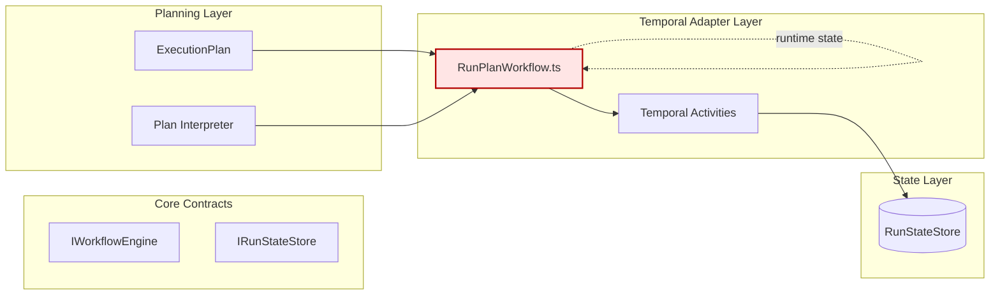
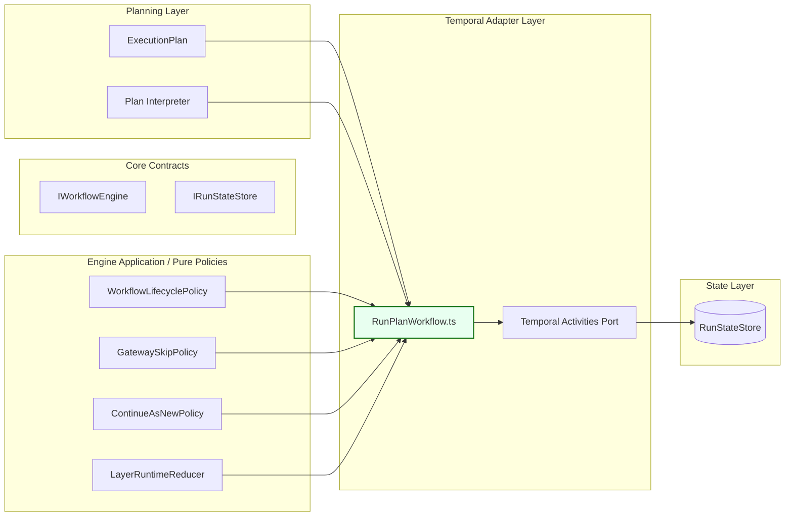
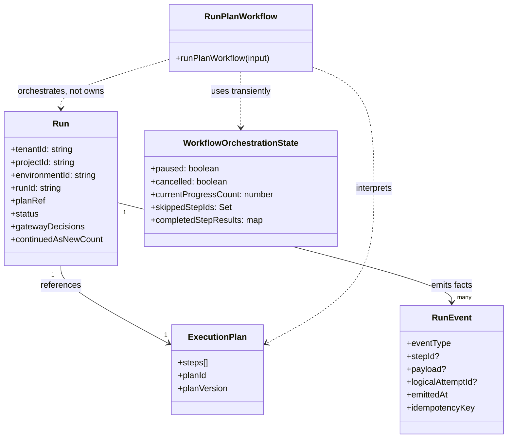
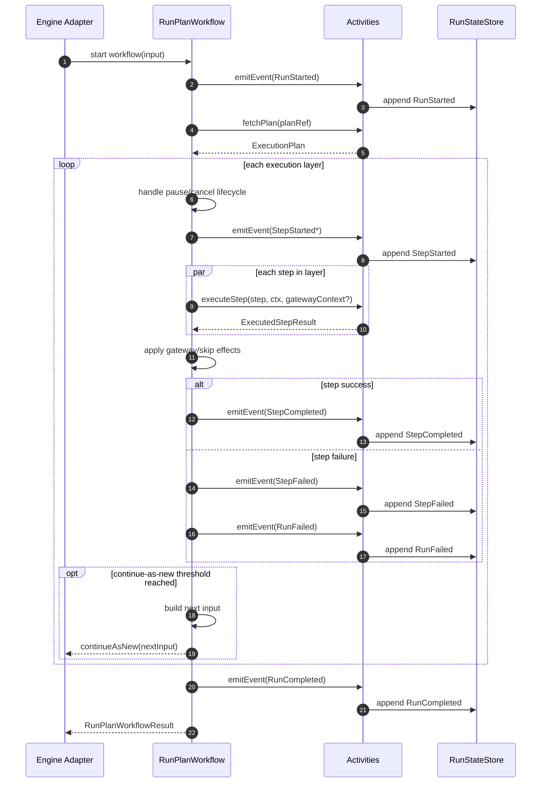

# RunPlanWorkflow — Architecture Review, Refactor Map, and Mermaid Diagrams

**File under review**  
`packages/@dvt/adapter-temporal/src/workflows/RunPlanWorkflow.ts`

**Scope**  
Review of the deterministic Temporal workflow against DVT+ architectural principles, with refactor guidance, target boundaries, aggregate view, file layout, and sequence diagrams.

---

## Executive verdict

`RunPlanWorkflow.ts` is **substantially better aligned** with DVT+ than the Postgres adapter reviewed earlier.

It gets several core things right:

- the workflow is explicitly deterministic,
- side effects are delegated to activities,
- plan interpretation remains inside the workflow boundary,
- lifecycle is modeled through signals/queries rather than ambient mutable runtime,
- the code respects the DVT+ split where **the engine executes but does not become the source of truth**, and the **state store remains primary**.

However, it is **not fully clean yet**. The main issues are not raw Temporal mechanics; they are **responsibility creep**, **state duplication inside the workflow**, and **domain policy leakage into the workflow layer**.

**Merge posture:** acceptable as a serious iteration, but **not yet the final canonical workflow module**.

---

## Why this file is strategically important

Within DVT+, the orchestration engine is interchangeable and must sit **behind `IWorkflowEngine`**, while the **RunStateStore remains the primary truth** and the UI stays state-driven rather than runtime-driven. The engine must emit lifecycle events with idempotency keys and tolerate Temporal’s at-least-once activity semantics. The workflow therefore has to be deterministic, side-effect-thin, and narrowly focused on orchestration.

This review uses those project rules as the baseline.

---

## What is good

### 1. Determinism is called out explicitly

The header is correct in spirit and useful in practice:

- no `Date.now()` / `new Date()`
- no `Math.random()`
- no `process.env`
- no Node.js / DOM APIs

That matches the Temporal sandbox model and the DVT+ requirement that execution remains replay-safe.

### 2. Side effects are delegated to activities

This is the biggest architectural positive.

The workflow itself does not directly:

- fetch from databases,
- write run state,
- execute step side effects,
- talk to infrastructure.

Instead it uses a narrow activities port:

- `fetchPlan(...)`
- `executeStep(...)`
- `emitEvent(...)`

That is the right shape for a Temporal workflow in a hexagonal system.

### 3. Lifecycle signal/query handling is disciplined

The workflow exposes:

- `pause`
- `resume`
- `cancel`
- `status`

That is coherent with a workflow-as-orchestrator model. It does not try to make the workflow the permanent source of truth; it just maintains enough transient state to orchestrate in-flight behavior.

### 4. Continue-as-new is treated as a first-class concern

This is good, not cosmetic.

The file already models rollover explicitly with:

- `continueAsNewAfterLayerCount`
- `resumeFromLayerIndex`
- `continuedAsNewCount`
- `gatewayDecisions`
- `skippedStepIds`

That shows the workflow is being designed for long-lived execution limits rather than pretending a single execution will always be enough.

### 5. The file tries to isolate helpers

Using `workflowHelpers.ts` for parsing, formatting, continue-as-new input, and gateway validation is a good direction. The main workflow file would be much worse without that split.

---

## Main blocking concerns

## B1. The workflow still contains too much domain policy

The workflow is supposed to orchestrate execution, not become the location where execution policy accumulates.

Today it still owns too much of the following:

- layer traversal policy,
- skip propagation policy,
- gateway downstream skip behavior,
- lifecycle-to-event emission mapping,
- failure-to-terminal-status mapping,
- continue-as-new rollover policy wiring.

Some of this is unavoidable in a workflow, but **too much of it is currently embedded directly in the Temporal file**.

### Why this is a problem

DVT+ is explicit that:

- the **planner decides order/skip/cost**,
- the **engine executes**,
- the **state store persists truth**.

If the workflow starts owning skip semantics, terminal transition semantics, or policy interpretation in an ad hoc way, then the engine is drifting into decision-making.

### What should change

Move orchestration policies that are pure and engine-agnostic into dedicated pure modules, for example:

- `workflow-lifecycle-policy.ts`
- `gateway-skip-policy.ts`
- `continue-as-new-policy.ts`
- `layer-runtime-reducer.ts`

The Temporal workflow should call those functions, not embody the policy directly.

---

## B2. There is duplicate in-memory truth inside the workflow

The workflow maintains several runtime structures:

- `state`
- `completedStepResults`
- `skippedSteps`
- `completedSteps`
- `gatewayDecisions`

Some of that is necessary for deterministic in-flight orchestration, but the current setup is too close to becoming a second state model beside the persisted one.

### Why this is dangerous

DVT+ says the state store is the source of truth. The UI must not depend on engine memory, and the system must not infer state from runtime memory alone.

This workflow is still correct operationally, but architecturally it is carrying a **shadow state model** that is larger than ideal.

### Better target

Keep only the minimal orchestration memory required to:

- choose the next deterministic action,
- react to signals,
- build activity inputs,
- support continue-as-new.

Everything else should be reducible from persisted events or from deterministic planner/runtime policies.

---

## B3. `emitEvent` is too generic as the workflow boundary

The activities port currently exposes:

```ts
emitEvent({ ctx, planRef, eventType, stepId?, payload?, logicalAttemptId? })
```

This is simple, but it is also too weakly typed for such a critical boundary.

### Why this matters

The workflow is one of the narrowest and most sensitive boundaries in the system. A stringly-typed generic event emitter allows accidental drift in:

- event shape,
- required payload fields,
- lifecycle validity,
- engine/state contract consistency.

### Better target

Replace or wrap `emitEvent(...)` with a narrower typed event activity port, for example:

- `emitRunStarted(...)`
- `emitRunCompleted(...)`
- `emitRunFailed(...)`
- `emitStepStarted(...)`
- `emitStepCompleted(...)`
- `emitStepFailed(...)`
- `emitStepSkipped(...)`

Or use a strongly typed discriminated union builder that is not assembled ad hoc in the workflow file.

---

## B4. Lifecycle emission is partially duplicated across the workflow

Examples:

- `RunCancelled` emission appears in more than one path,
- `RunFailed` can be emitted in `applyLayerResults(...)` and again best-effort in `markWorkflowFailedIfNeeded(...)`,
- pause/resume lifecycle emission is spread between handlers and layer-precheck logic.

### Why this matters

Even if idempotency at the state store absorbs duplicates, the workflow should still have **one canonical lifecycle transition mapping**.

### Better target

Introduce a pure lifecycle transition module such as:

- `workflow-lifecycle-transitions.ts`

This module would compute what event, if any, must be emitted for:

- cancel before layer,
- pause before layer,
- resume after wait,
- step failure,
- final completion,
- unexpected workflow error.

The workflow should orchestrate; the transition policy should decide the canonical event sequence.

---

## B5. Gateway semantics are still too embedded in the workflow

The workflow currently:

- builds gateway context,
- interprets gateway decision,
- mutates `gatewayDecisions`,
- marks downstream steps as skipped.

### Why this is delicate

That is very close to planner/runtime policy, not just workflow mechanics.

The planner should own what downstream set exists. The workflow may own the runtime fact of a false gateway result, but the translation from that fact into skip propagation should ideally be a pure engine-agnostic rule.

### Better target

Keep the workflow responsible only for:

- obtaining the gateway result,
- passing current deterministic context,
- applying a pure skip-propagation policy imported from a non-Temporal module.

---

## Non-blocking issues

## N1. The workflow status query is useful but not authoritative

This is acceptable, but documentation must remain explicit:

- `statusQuery` is runtime visibility,
- persisted state is authoritative.

That distinction should be stated in comments and docs because Temporal query state is easy to over-trust.

## N2. Failure payload fidelity is thin

`StepFailed` emission currently does not appear to include the failure message/retriable classification. The workflow computes them in `buildFailedLayerStepExecution(...)`, but the emitted failure event path is still thin.

That makes persisted diagnostics weaker than they should be.

## N3. `currentStepIndex` is a leaky metric name

It is not really a step index in plan order. It is closer to:

- completed step count,
- progress cursor,
- execution progress count.

The name is slightly misleading.

## N4. The workflow file is still too large

It is not yet a God Class, but it is drifting toward a God File.

You already have natural extraction points.

---

## SOLID review

### Single Responsibility Principle

**Partially met, but trending wrong.**

The workflow does one high-level thing — orchestrate a run — but internally it still mixes:

- lifecycle policy,
- gateway/skip policy,
- continue-as-new policy,
- layer iteration,
- query/signal surface,
- activity call choreography.

This should be split more aggressively into pure collaborators.

### Open/Closed Principle

**Weak to moderate.**

Adding new lifecycle semantics, new gateway behavior, or new terminal rules likely requires touching this workflow file directly.

### Liskov Substitution Principle

No material issue observed here.

### Interface Segregation Principle

**Good direction.**

The `WorkflowActivitiesPort` is much better than binding the workflow to a giant activities bag.

### Dependency Inversion Principle

**Mostly good.**

The workflow depends on an abstract activities port and pure helpers. This is the strongest part of the design.

---

## OOP review

This file is reasonably disciplined in terms of decomposition and naming. However:

- the object model is mostly functional rather than object-oriented,
- orchestration state is spread across multiple plain structures,
- there is room for a small immutable runtime-state reducer model.

That is not a problem by itself. The issue is not “lack of classes”; the issue is **policy concentration in the workflow file**.

---

## Hexagonal review

This file is **mostly aligned** with hexagonal architecture.

### Good

- workflow side effects are behind activities,
- plan interpretation uses pure helpers,
- infrastructure is not called directly from the workflow.

### Not good enough yet

- too much execution policy still lives in the workflow adapter layer,
- event emission is too generic for such an important boundary,
- state shaping for lifecycle is not centralized enough.

The Temporal workflow should be an adapter implementation of the `IWorkflowEngine` orchestration semantics, not a secondary policy engine.

---

## DDD review

## Aggregate/root view

The workflow itself is **not** the aggregate root.

The aggregate root conceptually remains **Run**.

The workflow manipulates an in-flight orchestration projection of that aggregate, but it must not become the authoritative domain object.

### Correct conceptual aggregate

- **Run** — aggregate root
  - scope: tenant / project / environment / runId
  - plan reference
  - lifecycle facts
  - step execution facts
  - gateway decisions as persisted facts
  - attempts / emitted events

### Workflow’s role

- interpret the execution plan deterministically,
- coordinate side-effect activities,
- emit lifecycle facts,
- react to pause/resume/cancel signals,
- continue-as-new when required.

That means the workflow is better modeled as an **application/orchestration service**, not as a domain root.

---

## Before — current conceptual placement



### Reading

The workflow is doing the right engine job, but it is still too “hot”: it owns too much orchestration policy and too much transient interpretation state.

---

## After — target conceptual placement



### Reading

The workflow remains the Temporal-specific orchestrator, but policy is pulled outward into pure engine-agnostic collaborators.

---

## Aggregate/root diagram



### Reading

`Run` is the aggregate root. `RunPlanWorkflow` is an orchestrator around it, not the root itself.

---

## Current file structure pressure points

The following concerns are currently crowded into one workflow file:

- workflow bootstrap,
- signal/query handlers,
- layer iteration,
- lifecycle gating,
- gateway context resolution,
- step execution error normalization,
- continue-as-new decisioning,
- terminal status resolution.

This is the natural split point for a refactor.

---

## Proposed file layout

```mermaid
flowchart TB
  subgraph PKG[packages/@dvt/adapter-temporal/src/workflows]
    A[RunPlanWorkflow.ts]
    B[workflowSignals.ts]
    C[workflowLifecyclePolicy.ts]
    D[layerExecutionLoop.ts]
    E[gatewaySkipPolicy.ts]
    F[continueAsNewPolicy.ts]
    G[layerRuntimeReducer.ts]
    H[workflowEventBuilders.ts]
    I[workflowTypes.ts]
    J[workflowHelpers.ts]
  end
```

### Suggested file tree

```text
packages/@dvt/adapter-temporal/src/
  workflows/
    RunPlanWorkflow.ts
    workflowTypes.ts
    workflowSignals.ts
    workflowEventBuilders.ts
    workflowLifecyclePolicy.ts
    layerExecutionLoop.ts
    layerRuntimeReducer.ts
    gatewaySkipPolicy.ts
    continueAsNewPolicy.ts
    workflowHelpers.ts
  activities/
    TemporalWorkflowActivities.ts
    emitRunLifecycleEvent.ts
    executeWorkflowStep.ts
    fetchExecutionPlan.ts
```

### Split intent

- `RunPlanWorkflow.ts` → thin Temporal orchestration shell
- `workflowSignals.ts` → signal/query registration only
- `workflowLifecyclePolicy.ts` → canonical lifecycle transition policy
- `layerExecutionLoop.ts` → layer traversal orchestration
- `layerRuntimeReducer.ts` → in-flight deterministic state evolution
- `gatewaySkipPolicy.ts` → pure skip propagation rules
- `continueAsNewPolicy.ts` → rollover decision and next input construction
- `workflowEventBuilders.ts` → typed event payload builders

---

## Sequence diagram — current flow



### Current weakness

Policy decisions are still spread across the workflow instead of being pushed into pure collaborators.

---

## Sequence diagram — target flow after refactor

```mermaid
sequenceDiagram
  autonumber
  participant API as Engine Adapter
  participant WF as RunPlanWorkflow
  participant LIFE as LifecyclePolicy
  participant LOOP as LayerExecutionLoop
  participant GATE as GatewaySkipPolicy
  participant CAN as ContinueAsNewPolicy
  participant ACT as Activities
  participant STORE as RunStateStore

  API->>WF: start workflow(input)
  WF->>ACT: emitRunStarted()
  ACT->>STORE: append RunStarted
  WF->>ACT: fetchPlan(planRef)
  ACT-->>WF: ExecutionPlan

  loop each execution layer
    WF->>LIFE: evaluatePreLayer(state)
    LIFE-->>WF: lifecycle action
    alt paused or cancelled
      WF->>ACT: emit canonical lifecycle event(s)
      ACT->>STORE: append lifecycle facts
    end

    WF->>LOOP: executeLayer(layer, runtime)
    LOOP->>ACT: executeStep(...)
    ACT-->>LOOP: step results
    LOOP->>GATE: applySkipPolicy(results, runtime)
    GATE-->>LOOP: updated runtime
    LOOP-->>WF: layer outcome + event intents

    WF->>ACT: emit typed step/run events
    ACT->>STORE: append facts

    WF->>CAN: shouldContinueAsNew(runtime, layerIndex)
    CAN-->>WF: nextInput or null
    opt rollover needed
      WF-->>API: continueAsNew(nextInput)
    end
  end

  WF->>ACT: emitRunCompleted()
  ACT->>STORE: append RunCompleted
  WF-->>API: final result
```

### Target benefit

The workflow remains deterministic and Temporal-specific, but policy becomes reusable, testable, and engine-agnostic.

---

## Recommended refactor phases

## Phase 1 — Safe extraction without behavior change

Extract pure modules:

- `workflowSignals.ts`
- `workflowLifecyclePolicy.ts`
- `continueAsNewPolicy.ts`
- `gatewaySkipPolicy.ts`
- `workflowEventBuilders.ts`

Goal: shrink the workflow file without changing runtime behavior.

## Phase 2 — Introduce a small runtime reducer

Create a pure reducer for transient orchestration state:

- progress count,
- skipped step set,
- completed step facts,
- gateway decisions.

Goal: reduce ad hoc state mutation.

## Phase 3 — Tighten event typing

Replace generic `emitEvent(...)` assembly with either:

- strongly typed activity methods, or
- a discriminated-union event intent builder.

Goal: make workflow-to-state contract safer.

## Phase 4 — Canonical lifecycle transitions

Centralize event sequencing for:

- cancel before layer,
- pause/resume,
- step failure to run failure,
- unexpected workflow failure.

Goal: eliminate duplicate lifecycle emission logic.

---

## Non-negotiable rules after refactor

1. The workflow must remain deterministic.
2. Side effects must stay in activities.
3. The workflow query state must never be treated as authoritative persisted truth.
4. Planner-owned policy must not drift into the Temporal workflow.
5. Unknown lifecycle paths must fail clearly rather than silently inventing semantics.
6. Continue-as-new input must remain serializable, minimal, and explicit.

---

## Test matrix that should exist

## Determinism / replay

- workflow replays without divergence for the same history,
- continue-as-new preserves gateway decisions and skipped steps correctly,
- pause/resume/cancel signals behave deterministically across replay.

## Lifecycle correctness

- first execution emits `RunStarted` exactly once semantically,
- step failure produces canonical terminal state,
- cancel-before-layer emits `RunCancelled` once semantically,
- pause then resume emits the correct sequence.

## Gateway semantics

- gateway false skips downstream deterministically,
- skipped steps are emitted exactly as expected,
- gateway decisions survive continue-as-new.

## Boundary correctness

- workflow never imports non-workflow-safe modules,
- activities port is the only side-effect boundary,
- query state is not required by external correctness.

## Negative tests

- invalid `resumeFromLayerIndex` fails fast,
- malformed control inputs fail fast,
- unknown step execution failure normalizes safely,
- activity failure in failure-path emission does not mask original workflow error.

---

## Final judgement

This file is **architecturally promising** and much closer to the intended DVT+ execution model than the heavier storage-side classes.

Its strongest qualities are:

- deterministic workflow discipline,
- activity-based side effects,
- clean Temporal awareness,
- serious handling of continue-as-new,
- reasonable signal/query design.

Its main weakness is that it still carries **too much orchestration policy directly in the Temporal workflow file**.

That should be fixed now, before the file becomes the canonical place where engine rules, gateway behavior, lifecycle semantics, and transient state evolution all accumulate together.

**Short form:**  
Good architecture direction.  
Not yet the final boundary shape.  
Refactor now while the file is still tractable.`r`n
