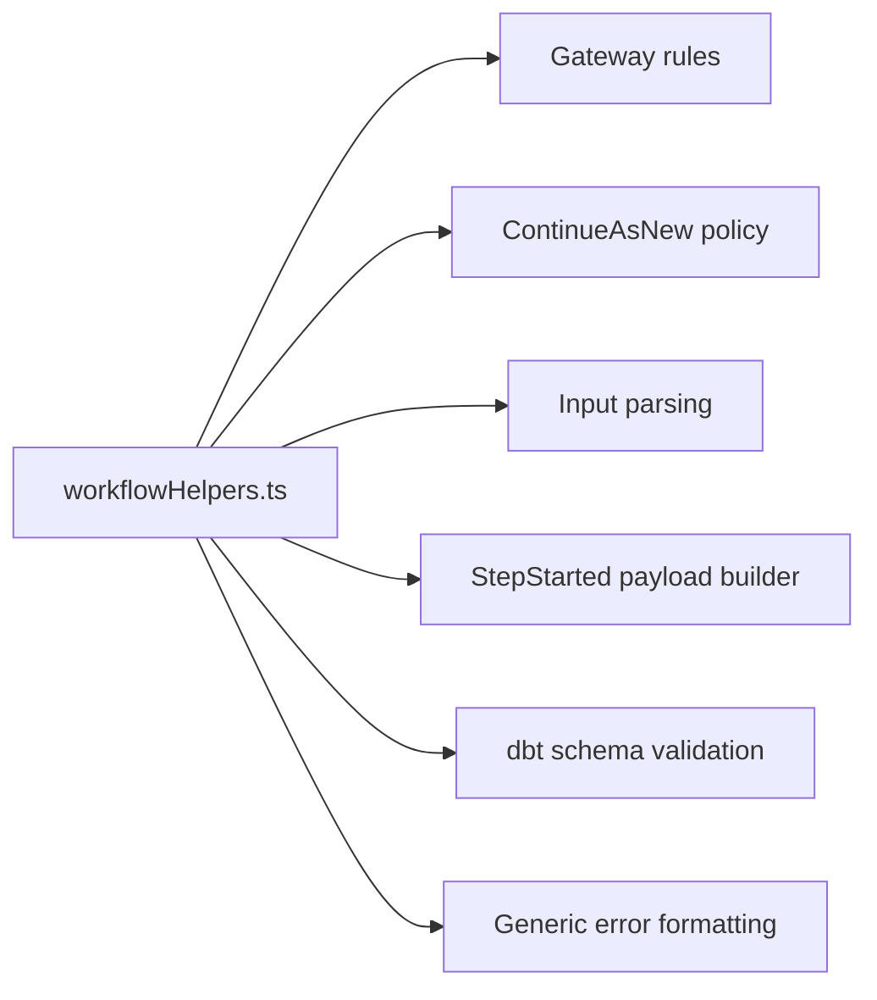
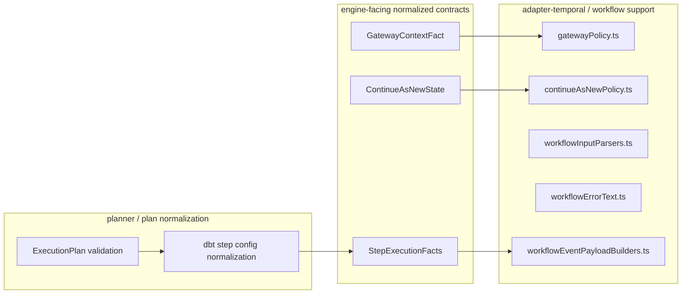
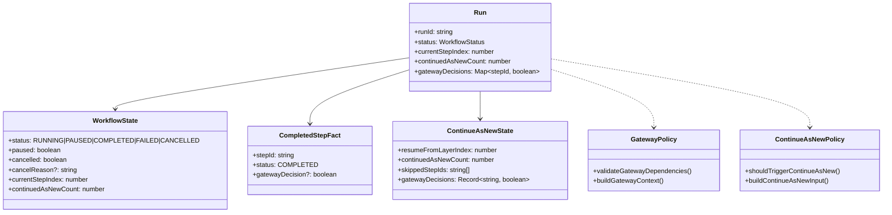
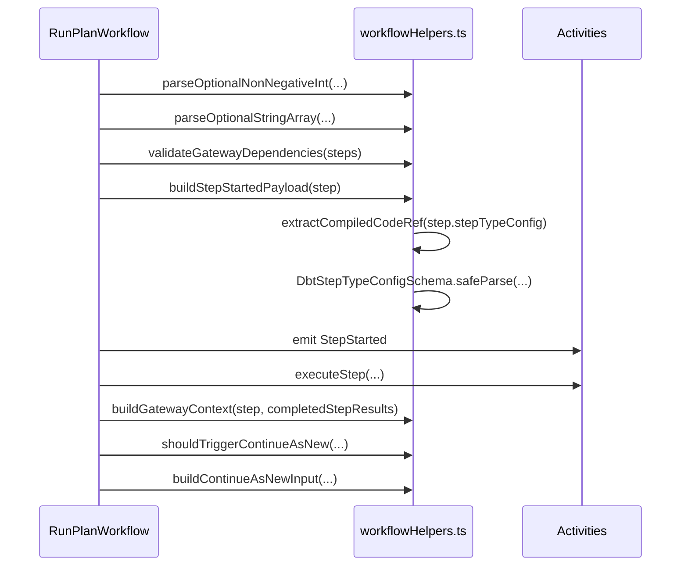
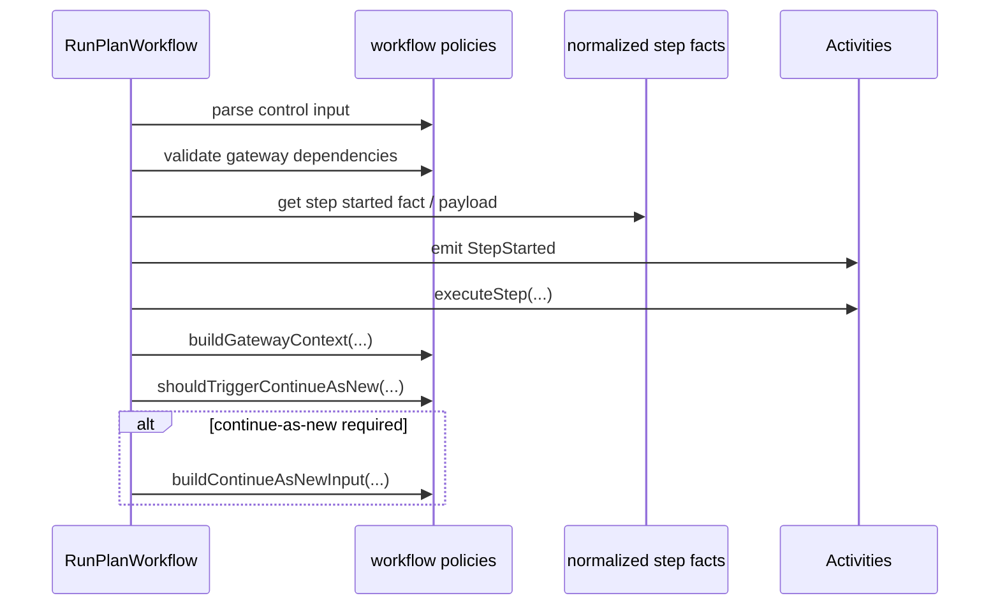

# `workflowHelpers.ts` — Architecture Review

**File**: `packages/@dvt/adapter-temporal/src/workflows/workflowHelpers.ts`  
**Scope**: deterministic helper module used by `RunPlanWorkflow`  
**Review type**: architecture + design QA  
**Status**: good helper base, but not yet cleanly factored

---

## Executive verdict

This file is **materially healthier** than the larger classes reviewed before.

It is:

- pure and deterministic,
- Temporal-runtime free,
- easy to unit test,
- mostly side-effect free,
- structurally compatible with replay-safe workflow code.

That said, it is **not yet architecturally clean**.

The main issue is not correctness of the small functions. The main issue is that the file has become a **mixed helper bucket** that blends:

1. workflow input parsing,
2. gateway execution rules,
3. continue-as-new state shaping,
4. event payload shaping,
5. dbt-specific contract validation,
6. generic error formatting.

That is not catastrophic, but it is the beginning of a **kitchen-sink helper module**.

---

## High-level architectural judgment

### What is good

- The module stays **deterministic**.
- It has **no Temporal runtime imports**.
- It is largely **functional** and **stateless**.
- It helps keep `RunPlanWorkflow` smaller.

### What is not yet good enough

- It mixes multiple reasons to change.
- It pulls **dbt-specific schema validation** into the Temporal adapter helper layer.
- It relies too heavily on `Record<string, unknown>` instead of domain-shaped types.
- It blurs the line between:
  - workflow policy,
  - contract validation,
  - event payload building,
  - generic utility behavior.

---

## Alignment with DVT+

This review is anchored on the DVT+ principles that:

- the engine executes but **must not decide planning concerns**,
- the **state store is the source of truth**,
- the **UI is state-driven**, and
- execution planning remains a distinct layer from orchestration.

That boundary is explicit in the product definition and engine artifact, and the V2 architecture also states that partial execution / skip logic is planner-owned, while the engine consumes a versioned `ExecutionPlan`.

For this helper file, that means one thing: **it may help interpret workflow state, but it must not quietly absorb planner or dbt compiler concerns.**

---

## QA assessment

## What is solid

### 1. Deterministic design is correct

The file avoids runtime-only or nondeterministic behavior. For Temporal workflow support code, that is the correct baseline.

### 2. Functional style is appropriate

Most functions are:

- input → output,
- stateless,
- composable,
- easy to test in isolation.

That is the right approach for workflow support policies.

### 3. Gateway support is small and understandable

These pieces are coherent:

- `normalizeDependsOn`
- `validateGatewayDependencies`
- `buildGatewayContext`
- `resolveGatewayDependencyContext`
- `buildCompletedStepFact`

There is a real local cohesion there.

### 4. Continue-as-new support is well-shaped

These pieces also belong together:

- `shouldTriggerContinueAsNew`
- `buildContinueAsNewInput`

This is exactly the kind of workflow policy logic that benefits from being outside the main workflow function.

### 5. Input parsing is explicit and testable

The parsers:

- `parseOptionalNonNegativeInt`
- `parseOptionalStringArray`

are simple, deterministic, and safer than inline ad hoc coercion.

---

## Problems and design gaps

## B1. This is already a helper bucket

The file currently contains at least **five different concerns**:

1. dependency normalization,
2. gateway rules,
3. continue-as-new policy,
4. workflow input parsing,
5. event payload extraction for `StepStarted`,
6. generic error formatting.

That means the file is no longer “one helper concept”. It is a **miscellaneous policy shelf**.

### Why this matters

Not because the file is long. It matters because future change vectors are already different:

- gateway rules change for planner semantics,
- continue-as-new changes for Temporal lifecycle policy,
- payload extraction changes for step contract/schema evolution,
- input parsing changes for API/workflow invocation shape,
- error formatting changes for observability/debugging.

Those are different reasons to change.

### Assessment

**Non-trivial design smell.** Not a hard blocker, but it should be split before this grows.

---

## B2. `buildStepStartedPayload()` leaks dbt-specific contract logic into Temporal workflow helpers

This is the most important architectural issue in the file.

```ts
import { DbtStepTypeConfigSchema } from '@dvt/contracts';
```

and then:

```ts
export function buildStepStartedPayload(step: Readonly<Record<string, unknown>>);
```

which inspects `step.stepTypeConfig` and parses it using a dbt-oriented schema.

### Why this is a problem

DVT+ explicitly separates:

- planning,
- execution,
- state,
- presentation,

and treats orchestration as pluggable. The engine consumes an `ExecutionPlan`; it should not quietly become the place where dbt step configuration semantics are reinterpreted in ad hoc ways.

### Concrete risk

This function creates a coupling chain:

`Temporal adapter workflow helper -> dbt step schema detail -> event payload shape`

That is too specific for a generic workflow helper module.

### Better placement

One of these is better:

- `execution-plan` normalization phase,
- planner-side enrichment,
- a dedicated event-payload builder module,
- a `stepFacts` builder package that is engine-agnostic.

### Assessment

**Architecture concern.** Not a correctness bug, but the wrong boundary.

---

## B3. Too much `Record<string, unknown>` for a core execution path

This file uses generic maps in several places:

- `completedStepResults: Record<string, Record<string, unknown>>`
- `buildGatewayContext(...): Record<string, unknown>`
- `buildCompletedStepFact(...): Record<string, unknown>`
- `buildStepStartedPayload(step: Readonly<Record<string, unknown>>)`

### Why this matters

For a core orchestration path, `Record<string, unknown>` is a useful escape hatch, but too much of it weakens:

- compile-time safety,
- semantic clarity,
- contract evolution,
- refactor confidence.

### Better shape

Introduce small types such as:

```ts
interface CompletedStepFact {
  stepId: string;
  status: 'COMPLETED';
  gatewayDecision?: boolean;
}

interface GatewayDependencyContext extends CompletedStepFact {}

interface StepStartedPayload {
  compiledCodeRef: CompiledCodeRef;
}
```

Then use explicit value objects rather than generic bags.

### Assessment

**Important cleanup item.**

---

## B4. Error formatting is unrelated to workflow policy

`formatUnknownError()` is harmless, but it does not belong with:

- continue-as-new policy,
- gateway dependency rules,
- step payload extraction.

This is a small sign that the file is becoming “anything used by the workflow”.

### Assessment

Small, but real cohesion problem.

---

## B5. `extractCompiledCodeRef()` throws plan-schema errors from inside workflow helper space

The validation logic itself is reasonable, but where it lives is questionable.

### Why

Plan schema validation should ideally happen:

- before workflow execution starts, or
- in a dedicated execution-plan validation module,
- not lazily when building a lifecycle event payload.

If malformed `stepTypeConfig` can reach the workflow, the system is already late in the failure path.

### Better model

- planner or plan-loader validates step config,
- workflow helper consumes already-normalized step facts,
- event payload builder becomes trivial.

### Assessment

Moderate architectural issue.

---

## Review by principle

## SOLID

### S — Single Responsibility

**Partially violated.**

The file has multiple reasons to change:

- gateway policy,
- continue-as-new policy,
- input parsing,
- dbt payload shaping,
- generic error text formatting.

### O — Open/Closed

**Acceptable but trending worse.**

Small pure helpers are easy to extend, but because they are centralized in one file, every new policy likely lands here.

### L — Liskov

Not relevant here in any meaningful way.

### I — Interface Segregation

Not directly applicable, but conceptually the file is not segregated enough by function.

### D — Dependency Inversion

**Mostly okay, with one caveat.**

The caveat is the direct dependency on `DbtStepTypeConfigSchema` inside a Temporal helper module. That is a real boundary smell.

---

## OOP

This module is not object-oriented by design, and that is fine.

For this kind of workflow support code, **functional style is preferable**.

The OOP concern is not lack of classes. The OOP concern is **lack of cohesive semantic modules**.

---

## Hexagonal architecture

### What fits

- the module is inside adapter-temporal,
- it supports workflow execution behavior,
- it stays deterministic,
- it does not reach infra/runtime directly.

### What does not fit cleanly

- dbt-specific contract parsing inside Temporal helper code,
- latent planner/plan-schema concerns surfacing too low in the stack.

### Hexagonal target

The Temporal workflow layer should mostly depend on:

- engine-facing plan types,
- workflow policy helpers,
- event builders,
- normalized execution facts.

It should not need to know raw dbt-specific step config schema parsing details.

---

## DDD / aggregate view

This file does **not** define an aggregate.

That is correct.

The likely aggregate root remains:

- **Run** as the main aggregate concept,

with associated concepts such as:

- Step execution facts,
- Gateway decisions,
- Continue-as-new cursor state,
- Lifecycle status.

This helper file should therefore remain a **policy/value-helper layer**, not a pseudo-domain center.

### Good news

It is not currently trying to be the aggregate.

### Risk

If more state-shaping logic accumulates here, it will become an unowned pseudo-domain module inside the Temporal adapter.

---

## Recommended target split

## Before



## After



---

## Aggregate/root view



---

## Proposed file layout

```mermaid
flowchart TB
  ROOT[packages/@dvt/adapter-temporal/src/workflows]

  ROOT --> A[RunPlanWorkflow.ts]
  ROOT --> B[workflowPolicies/]
  ROOT --> C[workflowTypes/]
  ROOT --> D[eventPayloadBuilders/]
  ROOT --> E[inputParsers/]
  ROOT --> F[errors/]

  B --> B1[gatewayPolicy.ts]
  B --> B2[continueAsNewPolicy.ts]

  C --> C1[completedStepFact.ts]
  C --> C2[gatewayContextFact.ts]
  C --> C3[continueAsNewState.ts]

  D --> D1[buildStepStartedPayload.ts]

  E --> E1[parseOptionalNonNegativeInt.ts]
  E --> E2[parseOptionalStringArray.ts]

  F --> F1[formatUnknownError.ts]
```

### Better target if you want stronger separation

```mermaid
flowchart TB
  ROOT[packages/@dvt]

  ROOT --> A[@dvt/adapter-temporal]
  ROOT --> B[@dvt/workflow-policies]
  ROOT --> C[@dvt/execution-plan-normalizer]

  A --> A1[RunPlanWorkflow.ts]
  A --> A2[Temporal activity proxies]

  B --> B1[gatewayPolicy.ts]
  B --> B2[continueAsNewPolicy.ts]
  B --> B3[workflowInputParsers.ts]

  C --> C1[normalizeDbtStepFacts.ts]
  C --> C2[validatePlanContracts.ts]
```

---

## Sequence — current



### Problem in current flow

The workflow helper layer is doing both:

- workflow policy work,
- and dbt-specific step config interpretation.

That is too much responsibility for one helper file.

---

## Sequence — target



### Why target is better

- workflow policy remains in workflow support,
- step normalization is not re-derived inside Temporal helper code,
- dbt-specific contract parsing can move earlier,
- helper cohesion improves.

---

## Concrete recommendations

## Keep as-is

These functions are fine in principle:

- `normalizeDependsOn`
- `validateGatewayDependencies`
- `buildGatewayContext`
- `resolveGatewayDependencyContext`
- `buildCompletedStepFact`
- `shouldTriggerContinueAsNew`
- `buildContinueAsNewInput`
- `parseOptionalNonNegativeInt`
- `parseOptionalStringArray`

## Move out

Move these out of this file:

- `buildStepStartedPayload`
- `extractCompiledCodeRef`
- `formatUnknownError`

### Suggested destinations

- `buildStepStartedPayload` → `workflowEventPayloadBuilders.ts`
- `extractCompiledCodeRef` → planner-side normalization or execution-plan validator
- `formatUnknownError` → `workflowErrorText.ts` or shared error helper

---

## Non-negotiable rules

1. `workflowHelpers.ts` must not become the dumping ground for all workflow support logic.
2. dbt-specific schema parsing should move **upstream** or into a dedicated normalized-facts layer.
3. Workflow support code should prefer **small explicit value types** over repeated `Record<string, unknown>`.
4. Workflow policy and event payload shaping should be separate concerns.
5. The Temporal adapter must remain replaceable without dragging dbt-specific interpretation details through every helper.

---

## Final judgment

### As code quality

**Good.**

### As architecture

**Good intent, but needs refactor before growth.**

### Merge posture

**Acceptable if the file remains small.**  
**Not acceptable if more mixed concerns keep landing here.**

This is the right moment to split it while it is still cheap.

---

## Suggested next artifact

A natural follow-up would be a second document with the **target TypeScript skeletons** for:

- `gatewayPolicy.ts`
- `continueAsNewPolicy.ts`
- `workflowInputParsers.ts`
- `workflowEventPayloadBuilders.ts`
- `completedStepFact.ts`
- `continueAsNewState.ts`

---

## Sources used for alignment

- `dvt_workflow_engine_artifact.txt`
- `dvt_v2_architecture_explanation.txt`
- `DVT_Product_Definition_V0.txt`
