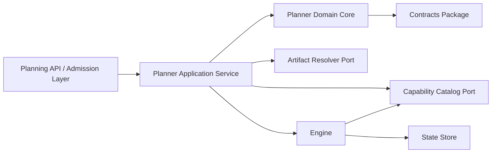
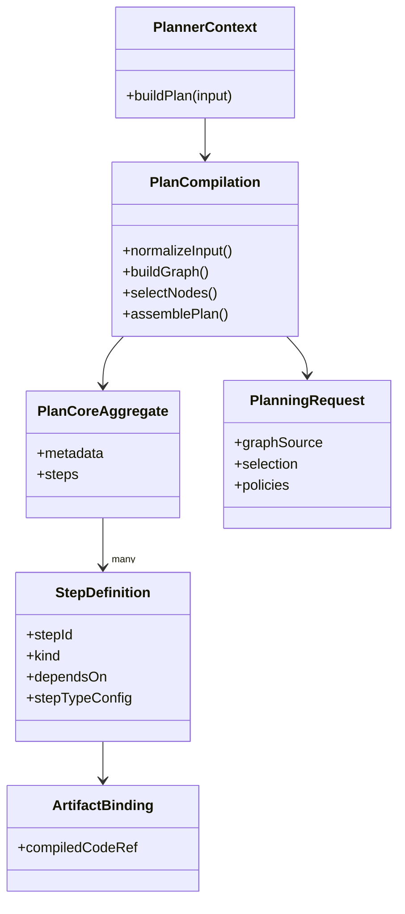
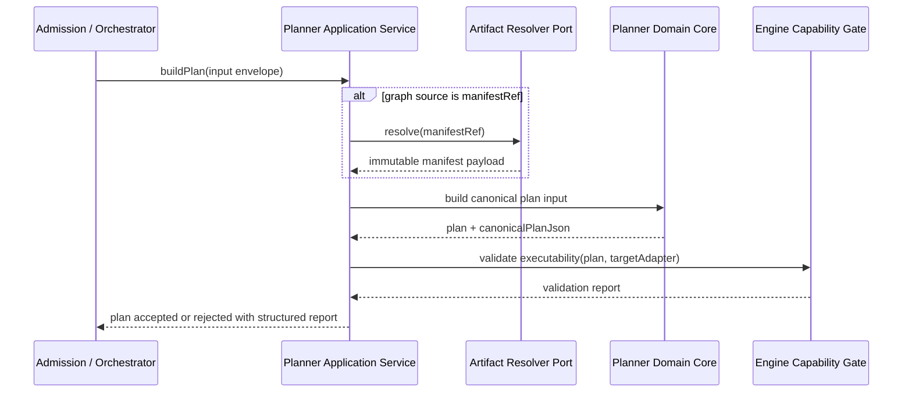

# Stage 1.1 Planner Canonicalization - Machine Readable Companion

This file is a machine-readable companion to
[`Stage-1.1-Planner-Canonicalization.md`](./Stage-1.1-Planner-Canonicalization.md).

The human-oriented proposal remains the primary prose artifact.
This companion exists to make section lookup, decision extraction, gap
identification, artifact tracing, and follow-on implementation planning
deterministic for AI agents.

## MR-00 Document Contract

```yaml
document:
  document_id: planner.stage-1-1.canonicalization.machine-readable
  schema_version: 2
  status: proposed
  owner: Architecture
  primary_human_source: packages/@dvt/planner/docs/planning/Stage-1.1-Planner-Canonicalization.md
  machine_reading_goal:
    - deterministic_section_lookup
    - deterministic_decision_extraction
    - deterministic_gap_extraction
    - deterministic_artifact_tracing
  scope:
    - canonical ownership of planner public contracts
    - planner public vs internal surface split
    - planner-engine-state boundary clarification
    - migration away from duplicate public contract sources
    - documentation placement and triage policy
  non_goals:
    - planner algorithm redesign
    - gateway DSL full specification
    - runtime concurrency model
    - automatic replanning loop
```

## MR-01 Section Registry

```yaml
section_registry:
  - id: MR-00
    title: Document Contract
    kind: metadata
    depends_on: []
  - id: MR-01
    title: Section Registry
    kind: metadata
    depends_on: [MR-00]
  - id: MR-02
    title: Source Basis
    kind: source-map
    depends_on: [MR-00]
  - id: MR-03
    title: Problem Statement
    kind: problem
    depends_on: [MR-02]
  - id: MR-04
    title: Baseline Invariants
    kind: invariants
    depends_on: [MR-02]
  - id: MR-05
    title: Architectural Style Constraints
    kind: invariants
    depends_on: [MR-04]
  - id: MR-06
    title: Diagrams
    kind: diagram-set
    depends_on: [MR-05]
  - id: D-01
    title: ExecutionPlanV2 Ownership
    kind: decision
    depends_on: [MR-04, MR-05]
  - id: D-02
    title: PlannerInputEnvelopeV2 Ownership
    kind: decision
    depends_on: [MR-04, MR-05]
  - id: D-03
    title: IExecutionPlanner Ownership
    kind: decision
    depends_on: [MR-04, MR-05]
  - id: D-04
    title: Planner Internal Types Boundary
    kind: decision
    depends_on: [D-01, D-02, D-03]
  - id: D-05
    title: Planner Purity Boundary
    kind: decision
    depends_on: [MR-04, MR-05]
  - id: D-06
    title: Policy vs Runtime Enforcement Split
    kind: decision
    depends_on: [D-05]
  - id: D-07
    title: Input Envelope Strategy
    kind: decision
    depends_on: [D-02, D-05]
  - id: D-08
    title: manifestRef Resolution
    kind: decision
    depends_on: [D-07]
  - id: D-09
    title: compiledCodeRef Placement
    kind: decision
    depends_on: [D-01, D-05]
  - id: D-10
    title: Executability Gate
    kind: decision
    depends_on: [D-03, D-05, D-06, D-07]
  - id: D-11
    title: stepId to nodeId Relationship
    kind: decision
    depends_on: [D-01]
  - id: D-12
    title: Unknown StepKind Policy
    kind: decision
    depends_on: [D-10]
  - id: D-13
    title: custom Passthrough Policy
    kind: decision
    depends_on: [D-10, D-12]
  - id: D-14
    title: Schema Authority
    kind: decision
    depends_on: [D-01, D-02, D-03, D-13]
  - id: D-15
    title: ADR and Documentation Placement Policy
    kind: decision
    depends_on: [D-14]
  - id: D-16
    title: Evolution Rules and Owners
    kind: decision
    depends_on: [D-01, D-02, D-03, D-14]
  - id: D-17
    title: Migration Plan
    kind: plan
    depends_on: [D-04, D-14, D-15, D-16]
  - id: D-18
    title: Acceptance and Verification
    kind: acceptance
    depends_on: [D-17]
  - id: G-01
    title: Explicit Contract Gaps
    kind: gap-register
    depends_on: [D-08, D-10, D-13, D-14, D-17, D-18]
  - id: NG-01
    title: Non-Goals
    kind: exclusions
    depends_on: [D-18]
```

## MR-02 Source Basis

```yaml
source_basis:
  active_governance:
    - docs/planning/status/governance-document-rule-inventory.md
    - docs/guides/ai-work-protocol.md
    - docs/planning/reviews/20260316-principal-architecture-review.md
  design_sources:
    - packages/@dvt/planner/docs/planning/Stage-1.1-Planner-Canonicalization.md
    - docs/planning/proposals/principal-architecture-review-execution-plan-20260317.md
    - docs/architecture/engine/contracts/engine/IWorkflowEngine.v2.0.md
    - docs/architecture/engine/contracts/capabilities/README.md
  historical_context:
    - docs/archive/DVT+_Architectural_Review_20260225.md
```

## MR-03 Problem Statement

```yaml
problem_statement:
  planner_exists: true
  root_problem: semantic_authority_ambiguity
  symptoms:
    - execution_plan_ownership_is_ambiguous
    - public_planner_contracts_exist_in_multiple_places
    - internal_planner_types_risk_becoming_parallel_normative_contracts
    - planner_vs_runtime_authority_is_not_fully_frozen
    - subsystem_documentation_is_inconsistent
  rule_to_restore:
    - no_package_may_remain_a_parallel_normative_source_for_a_shared_public_contract
```

## MR-04 Baseline Invariants

```yaml
baseline_invariants:
  - planner_decides_execution_plans
  - engine_executes_plans
  - state_store_persists_reality
  - ui_reflects_state_only
  - engine_consumes_a_versioned_execution_plan
  - engine_must_not_perform_planning
  - product_does_not_own_runtime_retry_or_durability_mechanics
  - engine_capability_contracts_exist_for_executability_validation
```

## MR-05 Architectural Style Constraints

```yaml
architectural_style_constraints:
  ddd:
    rule: planner_is_a_bounded_context_not_a_bag_of_helpers
  hexagonal:
    rule: artifact_resolution_and_capability_lookup_happen_behind_ports
  cqrs:
    rule: planner_is_command_side_compilation_not_query_side_operational_truth
  oop:
    rule: public_contracts_application_services_and_domain_objects_must_not_collapse_into_untyped_procedural_glue
```

## MR-06 Diagrams

### MR-06.1 Component View



### MR-06.2 Domain View



### MR-06.3 Sequence View



## D-01 ExecutionPlanV2 Ownership

```yaml
decision_id: D-01
subject: ExecutionPlanV2 ownership
status: selected
selected_option: contracts_owns_public_shape_planner_is_semantic_author
public_owner: '@dvt/contracts'
semantic_author: '@dvt/planner'
consumers:
  - '@dvt/engine'
  - adapters
rejected_options:
  - planner_owns_public_shape
  - engine_owns_public_shape
  - dual_ownership
rationale:
  - keeps_public_contracts_shared
  - keeps_planner_authorship_explicit
  - avoids_engine_becoming_semantic_owner_of_planning
hard_rule:
  - execution_plan_v2_must_not_be_redefined_as_a_parallel_public_type_in_planner
```

## D-02 PlannerInputEnvelopeV2 Ownership

```yaml
decision_id: D-02
subject: PlannerInputEnvelopeV2 ownership
status: selected
selected_option: contracts_owns_public_input_envelope
public_owner: '@dvt/contracts'
planner_role: derive_richer_internal_normalized_representations
rejected_options:
  - planner_owns_public_envelope
  - dual_ownership_for_convenience
hard_rule:
  - planner_must_not_expose_a_second_public_input_envelope_contract
```

## D-03 IExecutionPlanner Ownership

```yaml
decision_id: D-03
subject: IExecutionPlanner ownership
status: selected
selected_option: contracts_owns_interface_planner_implements
public_owner: '@dvt/contracts'
implementation_owner: '@dvt/planner'
rejected_options:
  - planner_owns_public_interface
  - interface_duplication
hard_rule:
  - no_other_package_defines_an_equivalent_public_planner_interface
```

## D-04 Planner Internal Types Boundary

```yaml
decision_id: D-04
subject: planner internal types boundary
status: selected
file_in_scope: packages/@dvt/planner/src/domain/types.ts
allowed_contents:
  - normalized_planner_graph_nodes
  - internal_compiler_pipeline_structures
  - intermediate_validation_artifacts
  - local_diagnostics_shapes
  - internal_expansion_results
  - internal_gateway_preparation_structures
forbidden_public_shapes:
  - ExecutionPlanV2
  - PlannerInputEnvelopeV2
  - IExecutionPlanner
selected_option: keep_only_internal_derivation_and_compiler_domain_types
```

## D-05 Planner Purity Boundary

```yaml
decision_id: D-05
subject: planner purity
status: selected
selected_option: planner_compiles_graph_to_plan_and_sets_declarative_policy_but_does_not_execute
planner_may:
  - accept_stable_planning_input_envelope
  - normalize_dbt_artifacts
  - resolve_selection
  - expand_dependencies
  - derive_steps_and_barriers
  - define_declarative_retry_concurrency_timeout_policy_classes
  - emit_versioned_execution_plan_v2
  - emit_deterministic_diagnostics
planner_must_not:
  - execute_tasks
  - persist_run_state
  - inspect_engine_memory_as_authority
  - resolve_secrets_inline
  - own_runtime_backoff_mechanics
  - own_workflow_queueing_leasing_or_task_dispatch
  - mutate_shared_state_outside_explicit_output
```

## D-06 Policy vs Runtime Enforcement Split

```yaml
decision_id: D-06
subject: policy vs runtime enforcement split
status: selected
planner_defines:
  - what_must_hold
  - max_attempt_intent_or_retry_class
  - timeout_class_or_budget
  - concurrency_class
  - dependency_barriers
  - gateway_semantics_reference
  - observability_tags
  - execution_intent_metadata
runtime_defines:
  - how_policy_is_enforced
  - temporal_or_conductor_retry_knobs
  - exact_backoff_curves
  - queue_or_worker_assignment
  - heartbeat_semantics
  - lease_duration
  - task_registration_details
  - cancellation_mechanics
```

## D-07 Input Envelope Strategy

```yaml
decision_id: D-07
subject: planner input envelope strategy
status: selected
selected_option: one_stable_public_envelope_with_exactly_one_active_graph_source
public_shape: PlannerInputEnvelopeV2
graph_source_variants:
  - manifestRef
  - manifest
  - nodes
authoritative_source_rule: exactly_one
invalid_cases:
  - no_graph_source
  - more_than_one_authoritative_graph_source
  - conflicting_graph_source_content
preferred_production_path: manifestRef
compatibility_paths:
  - manifest
  - nodes
internal_rule:
  - every_accepted_input_is_normalized_into_one_internal_canonical_model_before_graph_build_or_hashing
```

### D-07 Example Discriminated Union

```ts
type PlannerInputEnvelopeV2 =
  | {
      graphSource: 'manifestRef';
      manifestRef: { uri: string; sha256: string };
      selection: PlannerSelection;
      policies?: PlannerPolicies;
    }
  | {
      graphSource: 'manifest';
      manifest: DbtManifestLike;
      selection: PlannerSelection;
      policies?: PlannerPolicies;
    }
  | {
      graphSource: 'nodes';
      nodes: GraphNode[];
      selection: PlannerSelection;
      policies?: PlannerPolicies;
    };
```

## D-08 manifestRef Resolution

```yaml
decision_id: D-08
subject: manifestRef resolution
status: selected
selected_option: resolve_manifestRef_through_port_outside_domain_core
role: preferred_production_graph_source
resolution_location:
  allowed:
    - planner_application_service
    - admission_layer_orchestrator
  forbidden:
    - planner_domain_core
validity_requirements:
  - resolves_to_immutable_content
  - integrity_can_be_verified
  - resolution_is_deterministic
  - authorization_and_tenant_scoping_are_enforced_before_dereference
  - resolution_failures_return_structured_rejection
stage_1_1_limit:
  - retry_policy_for_artifact_resolution_not_defined_here
```

### D-08 Proposed Port Shape

```ts
interface ArtifactResolverPort {
  resolveManifest(
    ref: ManifestRef
  ): Promise<
    | { ok: true; manifest: DbtManifestLike; digest: string }
    | { ok: false; code: string; reason: string; retryable: boolean }
  >;
}
```

```yaml
port_status:
  artifact_resolver_port_interface:
    state: not_yet_canonicalized_in_contracts
    owner_to_define: '@dvt/contracts and planner boundary docs'
    needed_because:
      - manifest_ref_resolution_otherwise_remains_implementation_defined
```

## D-09 compiledCodeRef Placement

```yaml
decision_id: D-09
subject: compiledCodeRef placement
status: selected
selected_option: post_build_optional_enrichment_not_part_of_hashed_plan_core
part_of_hashed_plan_core: false
must_not_affect:
  - inputHashSha256
  - planId
may_appear_only_through: '@dvt/contracts public surfaces'
planner_side_enrichment_allowed: true
reproducibility_caveat:
  planId_identifies: logical_plan_core
  planId_does_not_identify: execution_binding
  reproducibility_depends_on:
    - immutable_artifact_storage
    - artifact_digest_verification
    - execution_time_binding_checks
warning:
  - changing_compiled_code_with_same_logical_plan_core_is_a_new_execution_binding_even_if_planId_does_not_change
```

## D-10 Executability Gate

```yaml
decision_id: D-10
subject: planner-engine executability gate
status: selected
selected_option: two_step_validity_model_with_structured_rejection
planner_validity_means:
  - structurally_valid
  - deterministic
  - contract_compliant
engine_validity_means:
  - plan_is_executable_against_target_adapter_or_runtime_capabilities
stage_1_1_guarantee:
  - executability_gate_exists_as_a_boundary_requirement
  - minimum_supported_behavior_is_structured_rejection
stage_1_1_non_goal:
  - closed_replanning_loop
hard_rules:
  - planner_does_not_guarantee_universal_executability
  - engine_does_not_redesign_the_plan
  - automatic_replanning_is_not_part_of_stage_1_1
structured_rejection_minimum:
  - which_capability_is_missing
  - which_adapter_or_runtime_rejected
  - whether_rejection_is_hard_or_degradable
```

### D-10 Proposed Validation Result Shape

```ts
type ExecutabilityValidationResult =
  | { status: 'OK' }
  | {
      status: 'ERRORS';
      errors: Array<{
        capability: string;
        reason: string;
        hard: boolean;
        adapter: string;
      }>;
    };
```

### D-10 Proposed Contract Surface

```ts
interface IExecutabilityValidator {
  validatePlan(
    plan: ExecutionPlanV2,
    targetAdapter: string
  ): Promise<ExecutabilityValidationResult>;
}
```

### D-10 Example Gate Flow

```ts
const build = await planner.buildPlan(input);
const validation = await engine.validatePlan(build.plan, targetAdapter);

if (validation.status === 'ERRORS') {
  return rejectWithStructuredReport(validation);
}

return engine.startRun(planRef, ctx);
```

```yaml
contract_status:
  validatePlan_surface:
    state: not_confirmed_in_current_engine_contract
    treatment_in_this_document: explicit_required_gap
    follow_on_artifacts:
      - '@dvt/contracts engine boundary'
      - docs/architecture/planner/planner-boundary.md
      - docs/contracts/planner/IExecutionPlanner.v2.md
```

## D-11 stepId to nodeId Relationship

```yaml
decision_id: D-11
subject: stepId_to_nodeId relationship
status: selected
current_state:
  v2_3_x_may_preserve_equality: true
permanent_invariant: false
reasons_future_divergence_is_expected:
  - one_dbt_node_may_expand_into_multiple_executable_steps
  - one_technical_step_may_not_map_one_to_one_to_a_graph_node
  - gateway_or_plugin_driven_steps_may_introduce_synthetic_steps
  - future_adapters_may_need_internal_technical_steps_not_represented_in_ui_nodes
```

## D-12 Unknown StepKind Policy

```yaml
decision_id: D-12
subject: unknown StepKind policy
status: target_state_selected_migration_pending
target_state: fail_closed_by_default
current_state: implementation_not_yet_aligned
interim_rule:
  allowed_only_when:
    - explicitly_allowlisted_by_environment_or_capability_configuration
  required_runtime_behavior:
    - emit_warning_grade_diagnostics
  canonical_status:
    - extension_remains_non_canonical_during_bridge_state
  default_bridge_behavior:
    - unknown_stepkind_not_treated_as_canonical_by_default
    - absence_of_explicit_allowlist_or_capability_approval_results_in_rejection
required_for_extension:
  - explicit_capability_declaration
  - schema_validation
  - authorization_check
  - size_limits
  - namespace_discipline
  - observability
stage_1_1_scope_note:
  - this_is_a_target_state_policy_not_an_implicit_claim_of_current_runtime_behavior
```

## D-13 custom Passthrough Policy

```yaml
decision_id: D-13
subject: custom passthrough policy
status: selected_with_explicit_runtime_gap
selected_option: namespaced_and_bounded_passthrough
allowed: true
conditions:
  - namespace_ownership
  - schema_or_zod_validation_when_registered
  - size_limits
  - denial_of_secret_bearing_fields
  - tenant_safe_authorization_rules
  - clear_separation_from_core_normative_fields
validation_ownership:
  planner:
    - validates_custom_only_when_registered_namespace_or_schema_exists
  runtime:
    - may_apply_additional_capability_and_authorization_gates
open_limit:
  - unregistered_namespaces_must_not_be_silently_promoted_to_canonical_behavior
warning:
  - unbounded_opaque_blobs_are_not_an_acceptable_long_term_model
```

## D-14 Schema Authority

```yaml
decision_id: D-14
subject: schema authority
status: selected
canonical_executable_schema_source: '@dvt/contracts'
planner_local_schema_docs:
  allowed: true
  condition: informative_only
subsystem_documentation_copies:
  must_reference: generated_canonical_artifacts
  must_not: fork_public_schemas_manually
synchronization_target:
  - generated_or_mechanically_checked_documentation
required_follow_on:
  - add_schema_generation_or_verification_pipeline
```

## D-15 ADR and Documentation Placement Policy

```yaml
decision_id: D-15
subject: ADR and documentation placement policy
status: selected
canonical_public_contract_docs:
  - docs/contracts/planner/**
canonical_subsystem_docs:
  - docs/architecture/planner/**
proposal_and_migration_docs:
  - docs/planning/proposals/**
package_local_docs:
  retain_for:
    - implementation_local_notes
    - local_pipeline_decomposition
    - experiments_and_historical_rationale
  must_not_be:
    - second_governance_system
naming_rule:
  - if_a_note_is_local_only_stop_calling_it_an_ADR_unless_repo_governance_recognizes_it_as_one
triage_buckets:
  - promote
  - retain_local
  - archive
```

## D-16 Evolution Rules and Owners

```yaml
decision_id: D-16
subject: evolution rules and owners
status: selected
role_ownership:
  public_planner_contracts:
    owner_role: contracts_owner
    responsibilities:
      - own_public_types
      - own_schemas
      - own_compatibility_matrix
  planner_implementation:
    owner_role: planner_owner
    responsibilities:
      - emit_compliant_plans
      - maintain_deterministic_build_pipeline
  engine_executability_validation:
    owner_role: engine_owner
    responsibilities:
      - validate_target_runtime_support_before_execution
  adapter_capability_declarations:
    owner_role: adapter_owners
    responsibilities:
      - expose_truthful_capability_surfaces
evolution_rules:
  breaking_change:
    - requires_new_major_line_or_compatibility_shim
  minor_change_requires:
    - updated_schema
    - updated_fixtures_or_examples
    - planner_engine_compatibility_evidence
  no_public_contract_change_until:
    - owner_role_assigned
    - migration_path_documented
    - validation_evidence_defined
delivery_ownership_state:
  current_assignment: role_level_only
  unresolved_for_execution:
    - named_individual_owners
    - calendar_committed_dates
```

## D-17 Migration Plan

```yaml
decision_id: D-17
subject: migration plan
status: proposed
goal:
  - remove_duplicated_public_contract_authority_without_breaking_tests_or_consumers
phases:
  - phase_id: P1
    name: freeze_authority
    outputs:
      - declare_@dvt/contracts_owner_for_ExecutionPlanV2
      - declare_@dvt/contracts_owner_for_PlannerInputEnvelopeV2
      - declare_@dvt/contracts_owner_for_IExecutionPlanner
      - mark_planner_local_equivalents_non_authoritative
  - phase_id: P2
    name: compatibility_reexports
    outputs:
      - planner_may_reexport_public_types_from_contracts
      - prevent_local_type_alias_drift
  - phase_id: P3
    name: replace_internal_imports
    outputs:
      - planner_internals_import_from_@dvt/contracts
      - move_planner_only_structures_into_internal_domain_modules
  - phase_id: P4
    name: separate_internal_domain_model
    outputs:
      - preserve_true_internal_types_only
      - remove_duplicate_public_shape_definitions
  - phase_id: P5
    name: unify_schemas
    outputs:
      - move_canonical_validation_schemas_to_contracts
      - convert_planner_local_schema_docs_to_informative_or_generated_mirrors
  - phase_id: P6
    name: update_tests
    outputs:
      - keep_behavior_tests
      - replace_contract_shape_assertions_to_shared_public_contracts
      - add_anti_duplication_checks_if_needed
  - phase_id: P7
    name: documentation_triage
    outputs:
      - promote_subsystem_docs
      - mark_retained_local_docs_non_canonical
      - archive_duplicated_local_docs
tentative_sequence:
  week_1:
    - P1
    - P2
  week_2:
    - P3
    - P5
    - P6
  week_3:
    - P4
    - P7
execution_gap:
  - no_named_individuals_or_committed_dates_in_this_document
```

### D-17 Artifact Update Set

```yaml
artifacts_to_update:
  code_and_contracts:
    - packages/@dvt/contracts/src/contracts/planner/**
    - packages/@dvt/contracts/src/contracts/IExecutionPlanner*
    - packages/@dvt/planner/src/domain/types.ts
    - packages/@dvt/planner/src/** imports and re-exports
    - planner tests asserting public contract shape
  schemas:
    - canonical public JSON schemas in contracts authority domain
    - planner-local docs referencing canonical schema artifacts
  documentation:
    - docs/architecture/planner/planner-boundary.md
    - docs/architecture/planner/planner-versioning-compatibility.md
    - docs/architecture/planner/planner-migration-stage-1-1.md
    - docs/contracts/planner/ExecutionPlan.v2.md
    - docs/contracts/planner/PlannerInputEnvelope.v2.md
    - docs/contracts/planner/IExecutionPlanner.v2.md
  governance_notes:
    - packages/@dvt/planner/docs/** triaged_as_promote_or_retain_local_or_archive
```

## D-18 Acceptance and Verification

```yaml
decision_id: D-18
subject: acceptance and verification
status: proposed
acceptance_requirements:
  - one_declared_public_owner_for_ExecutionPlanV2
  - one_declared_public_owner_for_PlannerInputEnvelopeV2
  - one_declared_public_owner_for_IExecutionPlanner
  - planner_package_is_not_a_parallel_normative_public_contract_source
  - internal_planner_types_remain_internal_only
  - planner_purity_is_explicitly_documented
  - planner_policy_vs_runtime_enforcement_split_is_explicitly_documented
  - planner_engine_executability_gate_is_explicitly_documented
  - compiledCodeRef_placement_is_explicitly_resolved
  - public_input_envelope_graph_source_rule_is_explicitly_resolved
  - documentation_placement_policy_is_defined
  - current_planner_local_docs_are_triaged_into_promote_or_retain_local_or_archive
  - migration_plan_exists_and_is_tied_to_concrete_artifacts
  - tests_and_consumers_have_a_non_breaking_migration_path
  - verifiable_deliverables_exist_for_each_acceptance_point
verification_deliverables:
  - deliverable: canonical_contract_owner_note_published
    verifier: architecture_or_contracts_owner
  - deliverable: planner_local_duplicate_public_types_frozen
    verifier: planner_owner
  - deliverable: contract_diffs_enumerated
    verifier: contracts_owner
  - deliverable: discriminated_envelope_rule_documented
    verifier: contracts_owner
  - deliverable: compiledCodeRef_binding_caveat_documented
    verifier: architecture
  - deliverable: engine_executability_rejection_contract_documented
    verifier: engine_owner
  - deliverable: migration_leads_assigned
    verifier: architecture
  - deliverable: documentation_triage_inventory_created
    verifier: docs_owner
verification_state:
  current_state: proposal_only
  unresolved_for_execution:
    - deliverables_not_yet_implemented
    - verifiers_not_yet_named_as_individuals
```

## G-01 Explicit Contract Gaps

```yaml
gap_register:
  - gap_id: G-01.1
    subject: executability_validation_contract
    severity: high
    current_state: not_canonicalized
    required_artifact:
      - '@dvt/contracts definition for validation result'
      - '@dvt/engine contract surface for validatePlan or equivalent'
  - gap_id: G-01.2
    subject: artifact_resolver_port_interface
    severity: high
    current_state: not_canonicalized
    required_artifact:
      - planner boundary contract or application service boundary doc
  - gap_id: G-01.3
    subject: custom_namespace_registration_model
    severity: high
    current_state: underspecified
    required_artifact:
      - extension registration contract
      - planner_and_runtime_validation_split note
  - gap_id: G-01.4
    subject: schema_sync_mechanism
    severity: medium
    current_state: intention_only
    required_artifact:
      - generation_or_ci_verification_task
  - gap_id: G-01.5
    subject: named_delivery_owners_and_dates
    severity: medium
    current_state: role_only
    required_artifact:
      - assigned_issues_or_execution_plan
```

## NG-01 Non-Goals

```yaml
non_goals:
  - planner_algorithm_redesign
  - gateway_DSL_details
  - retry_lifecycle_full_definition
  - runtime_concurrency_model
  - outbox_worker_behavior
  - automatic_replanning_based_on_executability_feedback
```

## Machine Reader Notes

```yaml
reader_protocol:
  primary_for:
    - deterministic_navigation
    - extracting_decisions
    - extracting_gaps
    - planning_follow_on_work
  read_human_companion_when:
    - prose_rationale_is_needed
    - tradeoff_explanation_is_needed
    - non_structured_argumentation_is_needed
  treat_as_unresolved_if_listed_under:
    - port_status
    - contract_status
    - delivery_ownership_state
    - execution_gap
    - verification_state
    - gap_register
```
