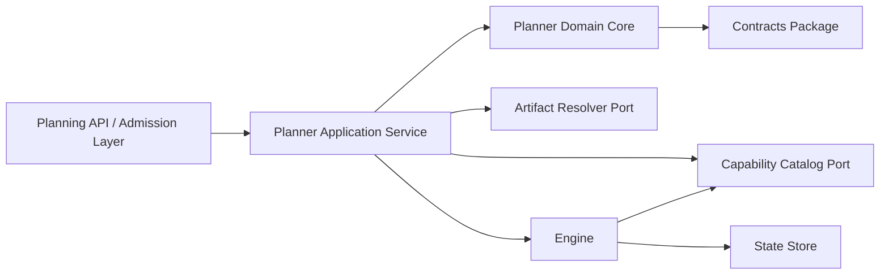
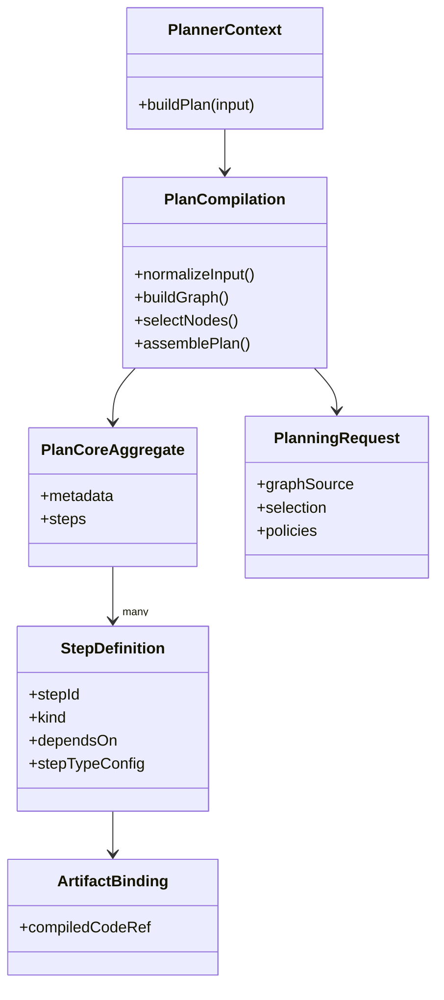
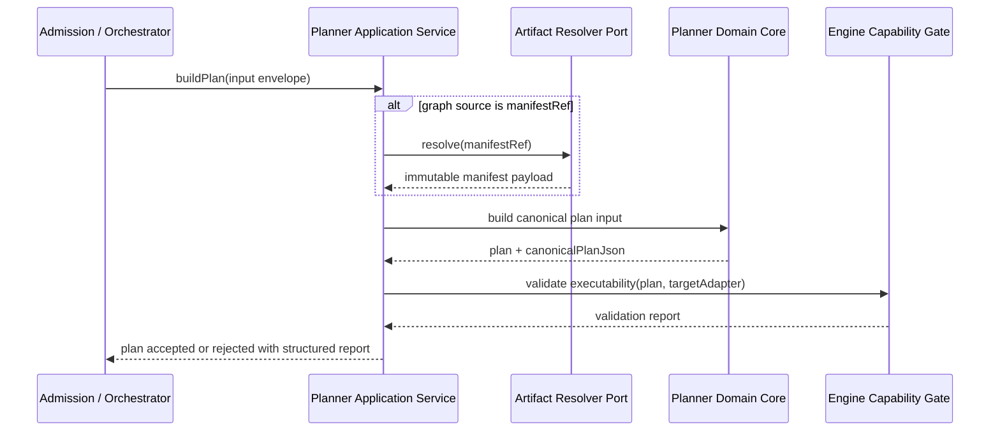

# Stage 1.1 — Planner Contract, Canonical Ownership, and Documentation Placement

## 1. Purpose

This document converts the Stage 1.1 planner discussion into an operational proposal.
Its goal is not to redesign the planner from zero. Its goal is to stop semantic drift by fixing:

- canonical ownership of planner-facing contracts
- public vs internal planner surfaces
- planner vs engine vs state boundary
- migration path away from duplicated contract definitions
- documentation placement at subsystem level instead of source-file level

This proposal is intentionally narrow. It does not add new planner features.

---

## 2. Problem Statement

The current issue is not that the planner does not exist. The planner already has package structure, local contracts, local ADRs, examples, and tests. The problem is that the system-level authority is still ambiguous.

Current symptoms:

1. `ExecutionPlan` ownership is ambiguous.
2. Public planner contracts appear to exist in more than one place.
3. Internal planner types risk behaving as a second normative contract.
4. Runtime authority vs planner authority is not fully frozen.
5. Documentation placement is inconsistent:
   - some docs live local to the planner package
   - but Stage 1.1 needs subsystem-governed documentation, not scattered package notes

This is exactly the kind of semantic drift that Stage 1 is supposed to stop.

---

## 3. Architectural Baseline

The system baseline already establishes the following:

- DVT+ separates planning, execution, state, and presentation.
- The planner decides execution plans.
- The engine executes plans.
- The state store persists reality.
- The UI reflects state and does not execute.
- The engine must consume a versioned `ExecutionPlan`.
- The engine must not perform planning.
- The product is not an orchestration engine and does not own runtime retry/durability mechanics.
- The architecture already shows `IExecutionPlanner` as a core contract and the Execution Planning Layer as distinct from the workflow engine.
- The engine capability contracts already define an executability validation path
  against target adapter capabilities.

This proposal does not invent new doctrine. It operationalizes that baseline.

---

## 4. Decision Criteria

The previous weighted scoring approach was too arbitrary for a Stage 1.1
proposal. Decisions in this document are therefore justified qualitatively using
these criteria:

- architectural coherence
- evolution and versioning safety
- runtime safety and security
- maintainability and developer clarity
- migration feasibility
- consumer compatibility

Where tradeoffs matter, the text explains them directly instead of pretending a
weighted sum is more rigorous than it is.

---

## 5. Architectural Style Constraints

Stage 1.1 must remain compatible with:

- DDD: planner is a bounded context, not a bag of helpers
- Hexagonal architecture: artifact resolution and capability lookup happen
  behind ports, not inside domain logic
- CQRS: planner is command-side compilation, not query-side operational truth
- OOP discipline: public contracts, application services, and domain objects
  must not collapse into untyped procedural glue

### Component View



### Domain View



### Sequence View



---

## 6. Current Duplication

The present duplication appears in at least these forms:

- planner-local type shapes such as `packages/@dvt/planner/src/domain/types.ts`
- shared planner contract shapes such as `packages/@dvt/contracts/src/contracts/planner/ExecutionPlan.v2.ts`
- planner-local documentation and JSON-schema material under `packages/@dvt/planner/docs/**`

That duplication may have been acceptable during package-local exploration. It is no longer acceptable for a Stage 1.1 canonicalization slice.

The rule going forward must be:

> no package may remain a parallel normative source for a shared public contract.

---

## 7. Decision 1 — Who Canonically Owns `ExecutionPlanV2`?

### Options

#### Option A — `@dvt/planner` owns `ExecutionPlanV2`

Planner package defines and exports the public shape. Other packages depend on planner.

#### Option B — `@dvt/contracts` owns public `ExecutionPlanV2`; planner is semantic author

Shared contracts package defines the public shape. Planner constructs compliant plans. Engine consumes them.

#### Option C — `@dvt/engine` owns engine-facing `ExecutionPlanV2`

Engine defines the shape because it executes it.

#### Option D — Shared dual ownership

Planner keeps its own shape and contracts package keeps another canonical mirror.

### Qualitative analysis

- Option A keeps semantic authorship local, but forces external consumers to
  depend on planner implementation.
- Option C is wrong on boundary grounds. Engine executes; it does not define
  planning semantics.
- Option D preserves the current failure mode and is therefore unacceptable.
- Option B is the only option that keeps public contracts shared, planner
  semantic authorship explicit, and engine consumption clean.

### Selected Decision

**Select Option B.**

### Rationale

This is the only option that keeps all three truths aligned:

- planner decides the plan
- engine consumes the plan
- contracts define the public shared shape

That avoids forcing consumers to depend on planner implementation details. It also avoids the engine becoming a semantic owner of planning concerns.

### Canonical Rule

- `ExecutionPlanV2` **public contract owner**: `@dvt/contracts`
- `ExecutionPlanV2` **semantic author**: `@dvt/planner`
- `ExecutionPlanV2` **consumer**: `@dvt/engine` and adapters
- `ExecutionPlanV2` **must not** be redefined as a parallel public type in planner

---

## 8. Decision 2 — Who Canonically Owns `PlannerInputEnvelopeV2`?

### Options

#### Option A — planner package owns it

#### Option B — contracts package owns it as shared planner boundary input

#### Option C — both own variants for convenience

### Qualitative analysis

- Planner-only ownership would tie every caller to planner packaging details.
- Dual ownership repeats the same ambiguity this stage exists to end.
- Shared contract ownership is the only durable boundary because the input
  envelope is public and consumed outside the planner package.

### Selected Decision

**Select Option B.**

### Canonical Rule

- `PlannerInputEnvelopeV2` is a **public boundary input**
- therefore it belongs in `@dvt/contracts`
- planner may derive richer internal normalized representations from it
- planner must not expose a second public input-envelope contract

---

## 9. Decision 3 — Who Canonically Owns `IExecutionPlanner`?

### Options

#### Option A — planner package owns interface and consumers depend on planner

#### Option B — contracts package owns interface and planner implements it

#### Option C — interface duplicated in planner and contracts

### Qualitative analysis

- A public planner interface belongs with public contracts, not with one
  implementation package.
- Duplication is not a transition strategy; it is the bug.

### Selected Decision

**Select Option B.**

### Canonical Rule

`IExecutionPlanner` is a core contract. It belongs in `@dvt/contracts`.  
`@dvt/planner` implements it.  
No other package defines an equivalent public interface.

---

## 10. Decision 4 — What stays in `packages/@dvt/planner/src/domain/types.ts`?

### Options

#### Option A — keep all current shapes there, including public ones

#### Option B — keep only internal derivation and compiler-domain types there

#### Option C — remove file entirely and use only public contracts directly everywhere

### Qualitative analysis

- Keeping public and internal shapes mixed preserves semantic drift.
- Deleting the file entirely would force awkward overexposure of internal
  compiler structures.
- Keeping the file for internal domain types only is the clean compromise.

### Selected Decision

**Select Option B.**

### Canonical Rule

`types.ts` may remain, but only for **internal planner-domain types**, such as:

- normalized planner graph nodes
- internal compiler pipeline structures
- intermediate validation artifacts
- local diagnostics shapes
- internal expansion results
- internal gateway-preparation structures

`types.ts` must **not** remain a second normative source for:

- `ExecutionPlanV2`
- `PlannerInputEnvelopeV2`
- `IExecutionPlanner`

---

## 11. Public vs Internal Planner Surfaces

### Public planner surface

The following are **public contracts** and must live in `@dvt/contracts`:

- `IExecutionPlanner`
- `PlannerInputEnvelopeV2`
- `ExecutionPlanV2`
- public request/response schemas for planner boundary invocation
- any stable public diagnostics shape if consumed outside planner package

### Internal planner surface

The following belong inside `@dvt/planner`:

- manifest normalization types
- graph compiler pipeline types
- selection expansion internals
- planning diagnostics internals
- heuristics internals
- normalization/transformation helpers
- local validators that enforce planner invariants beyond shared schema validation

### Hard rule

> `@dvt/planner` implements and transforms.  
> `@dvt/contracts` defines public shared shape.  
> `@dvt/planner` must not redefine public planner contracts as peer authorities.

---

## 12. Decision 5 — What exactly does “planner is pure” mean?

### Options

#### Option A — planner only topologically sorts nodes

#### Option B — planner compiles graph to plan and sets declarative policy, but does not execute

#### Option C — planner also decides runtime enforcement details

#### Option D — planner emits hints only; runtime decides meaning

### Qualitative analysis

- “Only sort graph” is too weak; the planner clearly does more.
- “Planner decides runtime enforcement” breaks the engine boundary.
- “Runtime decides semantics” collapses planning into hints and makes plans
  unstable.
- Therefore the planner must compile structure and declarative policy, but must
  stop before execution mechanics.

### Selected Decision

**Select Option B.**

### Planner Purity Definition

The planner is pure in this sense:

It may:

- accept a stable planning input envelope
- normalize dbt artifacts
- resolve selection
- expand dependencies
- derive steps and barriers
- define declarative retry/concurrency/timeout policy classes
- emit a versioned `ExecutionPlanV2`
- emit deterministic diagnostics

It must not:

- execute tasks
- persist run state
- inspect engine memory as authority
- resolve secrets inline
- own runtime backoff mechanics
- own workflow queueing, leasing, or task dispatch
- mutate shared state outside explicit output

This preserves the product baseline:
planner decides, engine executes, state persists.

---

## 13. Normative Policy vs Runtime Enforcement

### Recommended Split

The plan may contain **normative declarative policy**, such as:

- max-attempt intent or retry class
- timeout class or timeout budget
- concurrency class
- dependency barriers
- gateway semantics reference
- observability tags
- execution intent metadata

The runtime remains responsible for **provider-specific enforcement**, such as:

- Temporal or Conductor retry knobs
- exact backoff curves
- queue / worker assignment
- heartbeat semantics
- lease duration
- task registration details
- runtime cancellation mechanics

### Hard Rule

The planner may define **what must hold**.  
The engine/adapters define **how that is enforced in the chosen runtime**.

---

## 14. Decision 6 — Stable Inputs: `manifest`, normalized nodes, or both?

### Options

#### Option A — planner publicly accepts only full manifest

#### Option B — planner publicly accepts only normalized nodes

#### Option C — one stable envelope with exactly one graph source active, then normalize internally

### Qualitative analysis

- Manifest-only is too narrow for migration and interop.
- Nodes-only throws away artifact-first planning.
- A single envelope with one active source is the only option that preserves one
  public input while avoiding precedence ambiguity.

### Selected Decision

**Select Option C.**

### Canonical Rule

The public boundary uses **one** stable `PlannerInputEnvelopeV2`, but exactly
**one graph source variant** may be authoritative in a single request:

- `manifestRef`
- `manifest`
- `nodes`

The planner must reject envelopes that provide:

- no graph source
- more than one authoritative graph source
- conflicting graph source content

`manifestRef` is the preferred production path for immutable artifact-first
planning. `manifest` and `nodes` are compatibility paths, not equal-precedence
authorities.

Inside the planner boundary, every accepted input is normalized into one
internal canonical model before graph build or hashing.

---

## 15. `manifestRef` Resolution Contract

### Selected Decision

`manifestRef` is a **real boundary concept** and the preferred production graph
source.

### Rule

`manifestRef` is resolved through a **port**, not inside planner domain logic.

The domain core never performs network or storage IO. A planner application
service or admission-layer orchestrator must use an injected artifact resolver
adapter to dereference `manifestRef` before handing canonical input to the core.

`manifestRef` is valid only if:

- it resolves to immutable content
- integrity can be verified
- resolution is deterministic
- authorization and tenant scoping are enforced before dereference
- resolution failures return a structured rejection; Stage 1.1 does not define
  retry policy for artifact resolution

`manifestRef` is not a convenience hack. It is the canonical large-artifact
entry path. Raw `manifest` and expanded `nodes` remain transitional or
specialized input modes.

### Minimum boundary port shape

Stage 1.1 should stop treating the artifact resolver as a hand-wavy concept.
The minimum boundary shape should look like:

```ts
interface ArtifactResolverPort {
  resolveManifest(
    ref: ManifestRef
  ): Promise<
    | { ok: true; manifest: DbtManifestLike; digest: string }
    | { ok: false; code: string; reason: string; retryable: boolean }
  >;
}
```

This does not require the exact names above to be frozen immediately, but it
does require the repository to define:

- one canonical resolver port or application-boundary equivalent
- one structured failure shape
- one owner for that boundary contract

Without that, `manifestRef` remains implementation-defined.

---

## 16. `compiledCodeRef` Decision

### Problem

`compiledCodeRef` already exists in the contracts/step-registry path and in the
planner enrichment pipeline, but Stage 1.1 previously left its placement open.

### Selected Decision

`compiledCodeRef` is **not** part of the core hashed `PlanCore` semantics.

It is an optional, capability-specific enrichment attached after canonical plan
build to known step-type configuration shapes.

This does **not** mean it is semantically irrelevant.

### Rule

- `compiledCodeRef` MUST NOT affect `inputHashSha256`
- `compiledCodeRef` MUST NOT affect `planId`
- `compiledCodeRef` MAY appear only through public contract surfaces owned by
  `@dvt/contracts`
- planner-side enrichment such as `attachCompiledCodeRefs` is allowed, but it
  enriches a compliant plan; it does not redefine the core public contract

### Reproducibility caveat

`planId` identifies the logical plan core, not the execution binding.

If runtime behavior depends on compiled artifact content, reproducibility
depends on:

- immutable artifact storage
- artifact digest verification
- execution-time binding checks

Changing compiled code while preserving the same logical plan core is therefore
not free. It is a new execution binding, even if it is not a new `planId`.

### Consequence

This resolves the ownership question now. It is not deferred.

---

## 17. Planner ↔ Engine Executability Gate

### Problem

A plan can be structurally valid and still be impossible to execute on the
target runtime because required capabilities, plugins, or execution modes are
not available.

### Selected Decision

Stage 1.1 explicitly adopts a **two-step validity model**:

1. **Planner validity**
   - planner proves the plan is structurally valid, deterministic, and
     contract-compliant
2. **Engine executability validity**
   - engine validates the plan against adapter/runtime capabilities before
     execution starts

### Canonical Rule

- planner does **not** guarantee universal executability
- engine does **not** redesign the plan
- engine validates executability against target adapter capabilities and emits a
  structured validation result
- Stage 1.1 guarantees a **gate**, not a closed replanning loop
- the minimum supported behavior is structured rejection

### Structured rejection contract

The engine-side validation result must be machine-readable enough to answer:

- which capability is missing
- which adapter/runtime rejected the plan
- whether the rejection is hard or degradable

This allows future replanning or rerouting, but Stage 1.1 does not pretend that
automatic replanning already exists.

### Minimum Stage 1.1 contract shape

The gate is not complete until the repository has a canonical validation result
shape. The minimum acceptable form is:

```ts
type ExecutabilityValidationResult =
  | { status: 'OK' }
  | {
      status: 'ERRORS';
      errors: Array<{
        capability: string;
        reason: string;
        hard: boolean;
        adapter: string;
      }>;
    };
```

If the engine contract surface exposes the gate directly, the minimum interface
should be equivalent to:

```ts
interface IExecutabilityValidator {
  validatePlan(
    plan: ExecutionPlanV2,
    targetAdapter: string
  ): Promise<ExecutabilityValidationResult>;
}
```

Stage 1.1 does not claim that this exact interface already exists in the active
engine contract. It states that an equivalent canonical boundary is required if
the gate is to be more than prose.

### Source of truth

The executability loop must align with the existing engine capability contract
surfaces:

- capability enum
- adapter capability matrix
- validation report schema

### Hard rule

Automatic “planner retries with another plan” is **not** part of Stage 1.1.
If adaptive replanning exists later, it belongs to an explicit higher
application/orchestration contract.

### Status note

If `validatePlan` or its equivalent is not already present in the canonical
engine contract, this remains an explicit follow-on contract gap, not a shipped
fact.

---

## 18. `stepId === nodeId` Decision

### Recommendation

Do **not** freeze `stepId === nodeId` as a permanent architectural invariant.

It can remain a temporary simplification in v2.3.x, but the architecture should assume future divergence because:

- one dbt node may expand into multiple executable steps
- one technical step may not map 1:1 to a graph node
- gateway and plugin-driven steps may introduce synthetic steps
- future adapters may need internal technical steps not represented in UI nodes

### Rule

- current implementation may preserve `stepId === nodeId` where valid
- public contract must not require it permanently

---

## 19. Decision 7 — Unknown `StepKind` behavior

### Options

#### Option A — fail-open by default

#### Option B — fail-closed by default, explicit capability-based opt-in

#### Option C — allow unknown kinds only in dev/test

### Weighted Matrix

| Option                                                         | Architectural coherence | Evolution / versioning | Runtime safety | Maintainability | Migration cost | Consumer compatibility | Weighted score |
| -------------------------------------------------------------- | ----------------------: | ---------------------: | -------------: | --------------: | -------------: | ---------------------: | -------------: |
| A — Fail-open by default                                       |                       2 |                      4 |              1 |               3 |              5 |                      4 |           2.75 |
| **B — Fail-closed by default with explicit capability opt-in** |                   **5** |                  **4** |          **5** |           **4** |          **3** |                  **4** |       **4.35** |
| C — Dev/test only soft-open                                    |                       4 |                      4 |              4 |               3 |              3 |                      3 |           3.75 |

### Selected Decision

**Select Option B.**

### Rule

In a multi-tenant governed system, the **target-state policy** is
fail-closed-by-default for unknown `StepKind`.

Any extension path must require:

- explicit capability declaration
- schema validation
- authorization check
- size limits
- namespace discipline
- observability

### Migration note

The current implementation is not yet there. This proposal treats fail-closed
unknown kinds as a follow-on migration decision, not as silently completed
behavior in Stage 1.1.

---

## 20. Decision 8 — `custom` passthrough policy

### Options

#### Option A — unrestricted passthrough

#### Option B — allowed but namespaced and bounded

#### Option C — no passthrough at all

### Weighted Matrix

| Option                                     | Architectural coherence | Evolution / versioning | Runtime safety | Maintainability | Migration cost | Consumer compatibility | Weighted score |
| ------------------------------------------ | ----------------------: | ---------------------: | -------------: | --------------: | -------------: | ---------------------: | -------------: |
| A — Unrestricted passthrough               |                       2 |                      4 |              1 |               2 |              5 |                      4 |           2.55 |
| **B — Namespaced and bounded passthrough** |                   **5** |                  **5** |          **4** |           **4** |          **3** |                  **4** |       **4.35** |
| C — No passthrough                         |                       4 |                      3 |              5 |               3 |              2 |                      2 |           3.45 |

### Selected Decision

**Select Option B.**

### Rule

`custom` passthrough is acceptable only if bounded by:

- namespace ownership
- schema or zod validation
- size limits
- denial of secret-bearing fields
- tenant-safe authorization rules
- clear separation from core normative fields

### Validation ownership

Stage 1.1 fixes the boundary, not the full extension runtime:

- planner validates `custom` only when a registered namespace/schema exists
- unregistered namespaces are not silently promoted to canonical behavior
- engine/runtime may apply additional capability and authorization gates

This also means:

- planner is not allowed to imply that unknown `custom` payloads are safe
- engine/runtime must reject unsafe or unauthorized `custom` payloads before
  execution
- secret-bearing `custom` content is policy-invalid even if it is syntactically
  well formed

This is intentionally conservative. Unbounded opaque blobs are not an acceptable
long-term model.

---

## 21. JSON Schemas in `packages/@dvt/planner/docs/contracts/**` vs `schemas.ts`

### Problem

Planner-local docs and schemas currently risk competing with code-level contract sources.

### Recommendation

Adopt a three-tier rule:

1. **Canonical executable schema source**
   - lives with shared public contract code in `@dvt/contracts`
   - generated or authored in the same authority domain as the public types

2. **Planner-local explanatory schema docs**
   - may remain as explanatory artifacts temporarily
   - must be explicitly marked `informative`
   - must not be treated as canonical validation source

3. **Subsystem documentation copies**
   - if planner subsystem docs need schema examples, they should reference generated canonical artifacts
   - they should not fork them manually

### Rule

Planner-local schema docs may exist for explanation, but they are **never canonical** if the schema is public.

### Synchronization requirement

Examples and explanatory schemas must not drift silently. The long-term target is
generated or mechanically checked documentation sourced from canonical contract
artifacts, not hand-maintained parallel examples.

### Immediate implementation implication

This proposal is not complete if “mechanically checked” remains only aspiration.
The follow-on execution slice should add at least:

- one schema generation or verification script in the contracts authority domain
- one CI check proving docs/examples do not drift from canonical contract
  artifacts
- one documented owner for that generation or verification path

---

## 22. ADR Policy — Local planner ADRs vs canonical repo governance

### Problem

Planner has useful local ADR-style material, but Stage 1.1 decisions are subsystem-level, not package-only.

### Decision

Split ADR/doc authority as follows:

### Rule

- package-local ADR-style notes are allowed only for implementation-local
  rationale
- subsystem decisions that affect shared contracts or cross-package semantics
  must be promoted to canonical repo docs
- local ADRs are not a second governance system

### Naming recommendation

If a note is local-only, stop calling it an ADR unless the repo governance
recognizes it as one. Use implementation note / package decision note if needed.

---

## 23. Documentation Placement Policy

### Required policy

Documentation should **not** live mixed into source files as the primary system of record.  
But documentation should **remain aligned to the subsystem** that owns the concern.

That means the correct target is **subsystem-scoped docs outside source code**, not code-adjacent drift and not a giant flat root doc pile.

### Recommended structure

```text
docs/
  architecture/
    planner/
      index.md
      planner-boundary.md
      planner-versioning-compatibility.md
      planner-migration-stage-1-1.md
      planner-security-and-extensibility.md
  contracts/
    planner/
      index.md
      ExecutionPlan.v2.md
      PlannerInputEnvelope.v2.md
      IExecutionPlanner.v2.md
  planning/
    proposals/
      planner-stage-1-1-canonicalization.md
```

### Transitional policy for existing planner docs

Current planner-local docs under `packages/@dvt/planner/docs/**` should be triaged into three buckets:

| Bucket       | Meaning                                   | Action                                                                |
| ------------ | ----------------------------------------- | --------------------------------------------------------------------- |
| Promote      | still valid and subsystem-governed        | move to `docs/architecture/planner/**` or `docs/contracts/planner/**` |
| Retain local | implementation-local and package-specific | keep local, mark non-canonical                                        |
| Archive      | duplicated or obsolete                    | move to archive or delete                                             |

### Hard rule

A subsystem may have documentation aligned to it.  
That documentation must not require living inside `src/` or inside package code directories to be authoritative.

---

## 24. Contract Evolution, Owners, and Delivery Gates

### Role ownership

| Concern                         | Owner role      | Responsibility                                                 |
| ------------------------------- | --------------- | -------------------------------------------------------------- |
| Public planner contracts        | Contracts owner | Own public types, schemas, compatibility matrix                |
| Planner implementation          | Planner owner   | Emit compliant plans and maintain deterministic build pipeline |
| Engine executability validation | Engine owner    | Validate target runtime support before execution               |
| Adapter capability declarations | Adapter owners  | Expose truthful capability surfaces                            |

### Minimum evolution rules

- Breaking changes to public planner contracts require a new major line or a
  compatibility shim
- Minor evolution requires:
  - updated schema
  - updated fixtures/examples
  - planner+engine compatibility evidence
- No public contract change is done until:
  - owner role is assigned
  - migration path is documented
  - validation evidence is defined

### Tentative delivery ownership

| Migration track                     | Suggested lead            |
| ----------------------------------- | ------------------------- |
| Public contract canonicalization    | Contracts owner           |
| Planner import and type cleanup     | Planner owner             |
| Engine executability gate alignment | Engine owner              |
| Documentation triage                | Architecture / Docs owner |

These are still role-level assignments, not execution-ready staffing. Stage 1.1
cannot be claimed as execution-ready until the work is assigned to named owners
in the actual delivery system.

### Done gate for Stage 1.1 execution

Stage 1.1 is not “done” because a document exists. It is done only when:

- ownership is declared
- contract diffs are enumerated
- migration steps are assigned
- compatibility validation path is defined
- named implementers and target dates exist outside this document

---

## 25. Migration Plan

### Goal

Remove duplicated public contract authority without breaking tests and consumers.

### Migration Phases

#### Phase 1 — Freeze authority

- declare `@dvt/contracts` owner for:
  - `ExecutionPlanV2`
  - `PlannerInputEnvelopeV2`
  - `IExecutionPlanner`
- declare planner-local equivalents non-authoritative immediately

#### Phase 2 — Introduce compatibility re-exports

- if needed temporarily, `@dvt/planner` may re-export public types from `@dvt/contracts`
- no local type alias may drift from the public shape

#### Phase 3 — Replace internal imports

- migrate planner internals to import public contracts from `@dvt/contracts`
- move planner-only structures into internal domain modules

#### Phase 4 — Separate internal domain model

- preserve internal planner domain types only where they are truly internal
- remove any duplicate public-shape definitions

#### Phase 5 — Unify schemas

- move canonical validation schemas to `@dvt/contracts`
- convert planner-local schema docs into informative examples or generated mirrors

#### Phase 6 — Update tests

- keep behavior tests
- replace contract-shape assertions to depend on shared public contracts
- add anti-duplication checks if necessary

#### Phase 7 — Documentation triage

- promote subsystem docs
- mark retained local docs as non-canonical
- archive duplicated local ADRs/docs

### Tentative sequencing

- Week 1: authority freeze + compatibility re-exports
- Week 2: import/test/schema migration
- Week 3: documentation triage and duplicate removal

Dates are tentative and must be assigned by the owning teams before execution.

---

## 26. Critical Follow-On Contract Gaps

The proposal resolves ownership and boundary direction, but several follow-on
contracts are still required before execution can be claimed as operationally
closed.

| Gap                                   | Why it matters                                                                   | Minimum required artifact                                           |
| ------------------------------------- | -------------------------------------------------------------------------------- | ------------------------------------------------------------------- |
| Executability validation contract     | Without it, the gate is prose and each engine can invent its own rejection shape | canonical validation result shape and engine-boundary surface       |
| `ArtifactResolverPort` contract       | Without it, `manifestRef` resolution remains implementation-defined              | canonical resolver port or equivalent application-boundary contract |
| `custom` namespace registration model | Without it, planner/runtime validation responsibility remains fuzzy              | extension registration contract and validation ownership note       |
| Schema sync mechanism                 | Without it, public docs and examples will drift from contracts                   | generation or CI verification task                                  |
| Named migration owners and dates      | Without them, migration remains paper planning                                   | assigned execution tracker entries                                  |

These are not arguments against Stage 1.1. They are the explicit remaining
obligations needed to execute it honestly.

---

## 27. Concrete Examples

### Example A — canonical public input envelope shape

```ts
type PlannerInputEnvelopeV2 =
  | {
      graphSource: 'manifestRef';
      manifestRef: { uri: string; sha256: string };
      selection: PlannerSelection;
      policies?: PlannerPolicies;
    }
  | {
      graphSource: 'manifest';
      manifest: DbtManifestLike;
      selection: PlannerSelection;
      policies?: PlannerPolicies;
    }
  | {
      graphSource: 'nodes';
      nodes: GraphNode[];
      selection: PlannerSelection;
      policies?: PlannerPolicies;
    };
```

Operational rule: exactly one discriminated branch is authoritative per request.

### Example B — planner output vs enrichment

```ts
const { plan, canonicalPlanJson } = await planner.buildPlan(input);
const enrichedPlan = await attachCompiledCodeRefs(plan, storage);
```

Rule: `canonicalPlanJson` and `plan.metadata.planId` derive from core plan
content, not from the later enrichment.

### Example C — executability validation loop

```ts
const build = await planner.buildPlan(input);
const validation = await engine.validatePlan(build.plan, targetAdapter);

if (validation.status === 'ERRORS') {
  return rejectWithStructuredReport(validation);
}

return engine.startRun(planRef, ctx);
```

---

## 28. Artifacts To Update

### Code / contracts

- `packages/@dvt/contracts/src/contracts/planner/**`
- `packages/@dvt/contracts/src/contracts/IExecutionPlanner*`
- canonical engine validation boundary for `validatePlan` or equivalent
- `packages/@dvt/planner/src/domain/types.ts`
- `packages/@dvt/planner/src/**` imports and re-exports
- planner tests asserting public contract shape

### Schemas

- canonical public JSON schemas in contracts authority domain
- planner-local docs referencing canonical schema artifacts

### Documentation

- `docs/architecture/planner/planner-boundary.md`
- `docs/architecture/planner/planner-versioning-compatibility.md`
- `docs/architecture/planner/planner-migration-stage-1-1.md`
- artifact resolver boundary note or equivalent planner application-boundary note
- `docs/contracts/planner/ExecutionPlan.v2.md`
- `docs/contracts/planner/PlannerInputEnvelope.v2.md`
- `docs/contracts/planner/IExecutionPlanner.v2.md`
- engine executability validation contract doc or equivalent canonical contract surface

### Governance notes

- mark `packages/@dvt/planner/docs/**` items as:
  - promote
  - retain-local
  - archive

---

## 29. Recommended Output Artifacts For Stage 1.1

Stage 1.1 is not complete without these output artifacts:

1. **Canonical boundary note**
   - planner responsibilities
   - planner non-responsibilities
   - planner vs engine vs state split

2. **Canonical ownership note**
   - owner of `ExecutionPlanV2`
   - owner of `PlannerInputEnvelopeV2`
   - owner of `IExecutionPlanner`

3. **Public vs internal surface map**
   - what is public
   - what remains internal in planner

4. **Migration note**
   - duplicate removal plan
   - re-export policy
   - schema policy
   - test migration approach

5. **Documentation placement note**
   - subsystem docs outside source
   - triage of current planner-local docs

6. **Compatibility note**
   - planner input compatibility promise
   - execution-plan compatibility promise
   - engine-consumer expectation

7. **Executability gate contract note**
   - minimum rejection result shape
   - owner of the validation boundary
   - statement of whether `validatePlan` is canonical, pending, or renamed

8. **Artifact resolution boundary note**
   - resolver port or application-boundary equivalent
   - success/failure shape
   - tenant and integrity requirements

---

## 30. Residual Non-Blocking Questions

The critical questions are resolved in this document:

- public owner of `ExecutionPlanV2`
- public owner of `PlannerInputEnvelopeV2`
- public owner of `IExecutionPlanner`
- `compiledCodeRef` placement
- planner-engine executability validation loop
- canonical planner input strategy
- minimum artifact resolver shape
- minimum executability validation result shape

Residual questions that do **not** block Stage 1.1 ownership:

1. Should public planner diagnostics remain planner-local until a second
   consumer exists?
2. Should compatibility policy prefer “current + previous minor” or explicit
   translator layers after the first major?
3. Which generator pipeline should materialize canonical JSON schemas from the
   shared contract source?

---

## 31. Acceptance Criteria

Stage 1.1 is accepted only if all of the following are true:

- there is one declared public owner for `ExecutionPlanV2`
- there is one declared public owner for `PlannerInputEnvelopeV2`
- there is one declared public owner for `IExecutionPlanner`
- planner package is not a parallel normative public contract source
- internal planner types remain internal only
- planner purity is explicitly documented
- planner policy vs runtime enforcement split is explicitly documented
- planner-engine executability validation loop is explicitly documented
- `compiledCodeRef` placement is explicitly resolved
- public input envelope graph-source rule is explicitly resolved
- documentation placement policy is defined
- current planner-local docs are triaged into promote / retain-local / archive
- migration plan exists and is tied to concrete artifacts
- tests and consumers have a non-breaking migration path
- verifiable deliverables exist for each acceptance point
- explicit follow-on contract gaps are declared rather than implied away

### Verification checklist

- [ ] canonical contract owner note published
- [ ] planner-local duplicate public types frozen
- [ ] contract diffs enumerated
- [ ] discriminated envelope rule documented
- [ ] `compiledCodeRef` binding caveat documented
- [ ] engine executability rejection contract documented
- [ ] artifact resolver boundary documented
- [ ] schema sync task defined
- [ ] migration leads assigned
- [ ] documentation triage inventory created

---

## 32. Final Recommendations

### Selected decisions

- `ExecutionPlanV2` public owner: `@dvt/contracts`
- `PlannerInputEnvelopeV2` public owner: `@dvt/contracts`
- `IExecutionPlanner` public owner: `@dvt/contracts`
- `@dvt/planner` is the semantic author and implementation of planning
- `packages/@dvt/planner/src/domain/types.ts` stays only for internal planner-domain types
- planner is pure in the strong sense:
  - compiles and decides
  - does not execute
  - does not persist
  - does not own runtime enforcement
- unknown `StepKind` target state is fail-closed
- planner-engine capability validation is a mandatory second-step gate before run start
- `compiledCodeRef` is post-build optional enrichment and not part of hashed plan identity
- `custom` passthrough is allowed only under namespaced, bounded, validated rules
- docs should live outside source code but aligned to the planner subsystem
- existing `packages/@dvt/planner/docs/**` content must be triaged, not ignored
- unresolved boundary contracts must be written down as explicit gaps, not hidden
  behind prose

### Short form

```text
Public contract lives in contracts.
Semantic planning lives in planner.
Execution lives in engine.
Persistence lives in state.
Subsystem docs live with the subsystem, not inside source code.
```

---

## 33. Implementation Order

1. Approve ownership decisions
2. Publish subsystem boundary and ownership docs
3. Freeze duplicated planner-local public contract evolution
4. Introduce re-exports if needed for compatibility
5. Migrate imports/tests/schemas
6. Triage local planner docs
7. Remove parallel contract sources

---

## 34. Non-Goals

This proposal does not:

- redesign the planner algorithm
- define gateway DSL details
- define retry lifecycle in full
- define runtime concurrency model
- define outbox worker behavior
- replace Stage 1.2, 1.3, or 1.4
- implement automatic replanning based on executability feedback

It exists to make those later slices governable.
