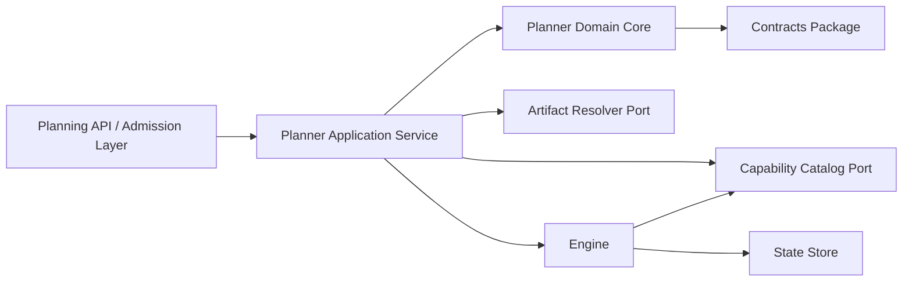
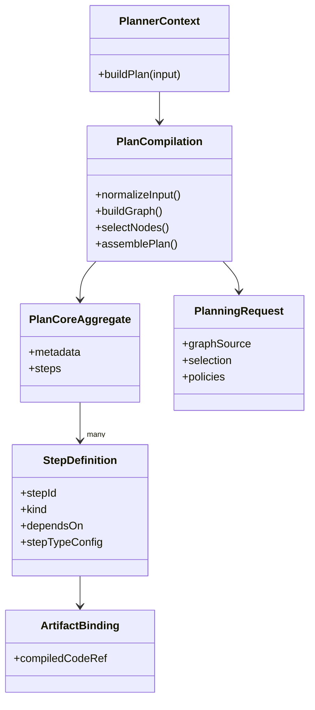
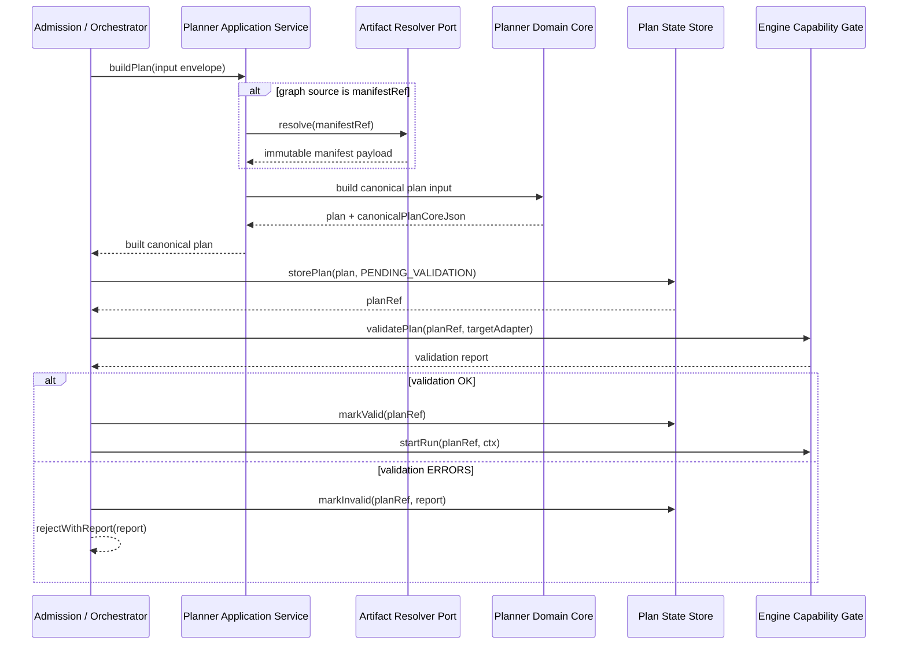

# Stage 1.1 — Planner Contract, Canonical Ownership, and Documentation Placement

## Artifact authority supersession

ADR-0067 supersedes every compiled-code-specific reference, enrichment, storage
and execution-binding proposal in this document. Those passages are historical
proposal evidence, not current requirements. Planner publishes no artifacts;
current runtime artifact references use StepArtifactRef and verified artifact
reads belong to @dvt/artifacts. See
[ADR-0067](../../../../../docs/adr/ADR-0067-canonical-artifact-authority-and-compiled-code-hard-cut.md).

## 1. Purpose

This document converts the Stage 1.1 planner discussion into an operational proposal.
Its goal is not to redesign the planner from zero. Its goal is to stop semantic drift by fixing:

- canonical ownership of planner-facing contracts
- public vs internal planner surfaces
- planner vs engine vs state boundary
- migration path away from duplicated contract definitions
- documentation placement at subsystem level instead of source-file level

This proposal is intentionally narrow in **implementation and feature-delivery
scope**. It does not add new planner features.

That does **not** mean the proposal is policy-light. Stage 1.1 still makes real
architectural decisions about extension boundaries, unknown step handling,
`custom` passthrough governance, and ownership of future registry or validation
surfaces. The narrowness claim applies to what the slice implements, not to
whether it sets boundary policy.

Structured artifact rule:

- the human proposal is the policy authority for Stage 1.1
- the repository-validated structured artifact for deterministic navigation
  lives at `docs/planning/proposals/planner-stage-1-1-canonicalization.manifest.json`
- if the structured artifact diverges, the human proposal wins until both
  artifacts are synchronized
- the structured artifact is a structural governance index, not a policy
  restatement surface
- the structured artifact must not introduce new substantive decisions ahead of
  the human proposal
- the legacy Markdown machine-readable companion is retired and must not be
  revived as a second prose surface

---

## 2. Problem Statement

The current issue is not that the planner does not exist. The planner already has package structure, local contracts, local ADRs, examples, and tests. The problem is that the system-level authority is still ambiguous.

Current symptoms:

1. `ExecutionPlan` ownership is ambiguous.
2. Public planner contracts appear to exist in more than one place.
3. Internal planner types risk behaving as a second normative contract.
4. Runtime authority vs planner authority is not fully frozen.
5. Documentation placement is inconsistent:
   - some docs live local to the planner package
   - but Stage 1.1 needs subsystem-governed documentation, not scattered package notes

This is exactly the kind of semantic drift that Stage 1 is supposed to stop.

---

## 3. Architectural Baseline

The system baseline already establishes the following:

- DVT+ separates planning, execution, state, and presentation.
- The planner decides execution plans.
- The engine executes plans.
- The state store persists reality.
- The UI reflects state and does not execute.
- The engine must consume a versioned `ExecutionPlan`.
- The engine must not perform planning.
- The product is not an orchestration engine and does not own runtime retry/durability mechanics.
- The architecture already shows `IExecutionPlanner` as a core contract and the Execution Planning Layer as distinct from the workflow engine.
- The engine capability contracts already define an executability validation path
  against target adapter capabilities.

This proposal does not invent new doctrine. It operationalizes that baseline.

---

## 4. Decision Criteria

The previous weighted scoring approach was too arbitrary for a Stage 1.1
proposal. Decisions in this document are therefore justified qualitatively using
these criteria:

- architectural coherence
- evolution and versioning safety
- runtime safety and security
- maintainability and developer clarity
- migration feasibility
- consumer compatibility

Where tradeoffs matter, the text explains them directly instead of pretending a
weighted sum is more rigorous than it is.

---

## 5. Architectural Style Constraints

Stage 1.1 must remain compatible with:

- DDD: planner is a bounded context, not a bag of helpers
- Hexagonal architecture: artifact resolution and capability lookup happen
  behind ports, not inside domain logic
- CQRS: planner is command-side compilation, not query-side operational truth
- OOP discipline: public contracts, application services, and domain objects
  must not collapse into untyped procedural glue

### Target-State Component View

This diagram is a **target-state boundary view**. It shows the intended
planner-to-engine relationship once the executability boundary is canonized; it
does **not** assert that the current repository wiring already exposes that
exact interaction surface.



### Domain View



### Target-State Sequence View

This sequence is also **target-state**. It illustrates the intended validation
flow once the planner-engine executability boundary and artifact resolver
boundary have canonical contract surfaces. It is not evidence that the current
planner implementation already calls the engine in this exact way.

It also does **not** mean the planner domain core depends on the engine as an
internal domain collaborator. The cross-context call shown here belongs in the
application or admission orchestration layer that coordinates policy-authoring
and capability validation across bounded contexts.



---

## 6. Current Duplication

The present duplication appears in at least these forms:

- planner-local type shapes such as `packages/@dvt/planner/src/domain/types.ts`
- shared planner contract shapes such as `packages/@dvt/contracts/src/contracts/planner/ExecutionPlan.v2.ts`
- planner-local documentation and JSON-schema material under `packages/@dvt/planner/docs/**`

### Baseline snapshot as of 2026-03-18

Stage 1.1 should not speak about "freeze authority" as if the repository were a
blank slate. The baseline in the current tree is:

| Surface                                                | Current repo state                                     | Evidence                                                                |
| ------------------------------------------------------ | ------------------------------------------------------ | ----------------------------------------------------------------------- |
| `ExecutionPlanV2` canonical contract                   | already exists under `@dvt/contracts`                  | `packages/@dvt/contracts/src/contracts/planner/ExecutionPlan.v2.ts`     |
| `PlannerInputEnvelopeV2` canonical contract            | already exists under `@dvt/contracts`                  | `packages/@dvt/contracts/src/contracts/planner/ExecutionPlan.v2.ts`     |
| `IExecutionPlanner` canonical contract                 | already exists under `@dvt/contracts`                  | `packages/@dvt/contracts/src/contracts/planner/IExecutionPlanner.v1.ts` |
| planner-local public-like duplicates                   | still exist in planner domain types                    | `packages/@dvt/planner/src/domain/types.ts`                             |
| planner-local contract wrapper for `IExecutionPlanner` | still exists and points at planner-local domain types  | `packages/@dvt/planner/src/contracts/planner/IExecutionPlanner.v1.ts`   |
| planner-local contract wrapper for plan/input types    | still exists and re-exports planner-local domain types | `packages/@dvt/planner/src/contracts/planner/ExecutionPlan.v2.ts`       |

So the starting point is **partial migration, not zero migration**:

- the contracts package already contains the intended public planner contract
  family
- planner still carries local duplicate or wrapper surfaces that can continue to
  confuse authority
- Phase 1 is therefore not "invent the first canonical home"; it is "freeze the
  already-present contracts authority and stop planner-local surfaces from
  competing with it"

That duplication may have been acceptable during package-local exploration. It is no longer acceptable for a Stage 1.1 canonicalization slice.

The rule going forward must be:

> no package may remain a parallel normative source for a shared public contract.

---

## 7. Decision 1 — Who Canonically Owns `ExecutionPlanV2`?

### Options

#### Option A — `@dvt/planner` owns `ExecutionPlanV2`

Planner package defines and exports the public shape. Other packages depend on planner.

#### Option B — `@dvt/contracts` owns public `ExecutionPlanV2`; planner is semantic author

Shared contracts package defines the public shape. Planner constructs compliant plans. Engine consumes them.

#### Option C — `@dvt/engine` owns engine-facing `ExecutionPlanV2`

Engine defines the shape because it executes it.

#### Option D — Shared dual ownership

Planner keeps its own shape and contracts package keeps another canonical mirror.

### Qualitative analysis

- Option A keeps semantic authorship local, but forces external consumers to
  depend on planner implementation.
- Option C is wrong on boundary grounds. Engine executes; it does not define
  planning semantics.
- Option D preserves the current failure mode and is therefore unacceptable.
- Option B is the only option that keeps public contracts shared, planner
  semantic authorship explicit, and engine consumption clean.

### Selected Decision

**Select Option B.**

### Rationale

This is the only option that keeps all three truths aligned:

- planner decides the plan
- engine consumes the plan
- contracts define the public shared shape

That avoids forcing consumers to depend on planner implementation details. It also avoids the engine becoming a semantic owner of planning concerns.

### Canonical Rule

- `ExecutionPlanV2` **public contract owner**: `@dvt/contracts`
- `ExecutionPlanV2` **semantic author**: `@dvt/planner`
- `ExecutionPlanV2` **consumer**: `@dvt/engine` and adapters
- `ExecutionPlanV2` **must not** be redefined as a parallel public type in planner

---

## 8. Decision 2 — Who Canonically Owns `PlannerInputEnvelopeV2`?

### Options

#### Option A — planner package owns it

#### Option B — contracts package owns it as shared planner boundary input

#### Option C — both own variants for convenience

### Qualitative analysis

- Planner-only ownership would tie every caller to planner packaging details.
- Dual ownership repeats the same ambiguity this stage exists to end.
- Shared contract ownership is the only durable boundary because the input
  envelope is public and consumed outside the planner package.

### Selected Decision

**Select Option B.**

### Canonical Rule

- `PlannerInputEnvelopeV2` is a **public boundary input**
- therefore it belongs in `@dvt/contracts`
- planner may derive richer internal normalized representations from it
- planner must not expose a second public input-envelope contract

---

## 9. Decision 3 — Who Canonically Owns `IExecutionPlanner`?

### Options

#### Option A — planner package owns interface and consumers depend on planner

#### Option B — contracts package owns interface and planner implements it

#### Option C — interface duplicated in planner and contracts

### Qualitative analysis

- A public planner interface belongs with public contracts, not with one
  implementation package.
- Duplication is not a transition strategy; it is the bug.

### Selected Decision

**Select Option B.**

### Canonical Rule

`IExecutionPlanner` is a core contract. It belongs in `@dvt/contracts`.  
`@dvt/planner` implements it.  
No other package defines an equivalent public interface.

---

## 10. Decision 4 — What stays in `packages/@dvt/planner/src/domain/types.ts`?

### Options

#### Option A — keep all current shapes there, including public ones

#### Option B — keep only internal derivation and compiler-domain types there

#### Option C — remove file entirely and use only public contracts directly everywhere

### Qualitative analysis

- Keeping public and internal shapes mixed preserves semantic drift.
- Deleting the file entirely would force awkward overexposure of internal
  compiler structures.
- Keeping the file for internal domain types only is the clean compromise.

### Selected Decision

**Select Option B.**

### Canonical Rule

`types.ts` may remain, but only for **internal planner-domain types**, such as:

- normalized planner graph nodes
- internal compiler pipeline structures
- intermediate validation artifacts
- local diagnostics shapes
- internal expansion results
- internal gateway-preparation structures

`types.ts` must **not** remain a second normative source for:

- `ExecutionPlanV2`
- `PlannerInputEnvelopeV2`
- `IExecutionPlanner`

---

## 11. Public vs Internal Planner Surfaces

### Public planner surface

The following are **public contracts** and must live in `@dvt/contracts`:

- `IExecutionPlanner`
- `PlannerInputEnvelopeV2`
- `ExecutionPlanV2`
- public request/response schemas for planner boundary invocation
- any stable public diagnostics shape if consumed outside planner package

### Internal planner surface

The following belong inside `@dvt/planner`:

- manifest normalization types
- graph compiler pipeline types
- selection expansion internals
- planning diagnostics internals
- heuristics internals
- normalization/transformation helpers
- local validators that enforce planner invariants beyond shared schema validation

### Hard rule

> `@dvt/planner` implements and transforms.  
> `@dvt/contracts` defines public shared shape.  
> `@dvt/planner` must not redefine public planner contracts as peer authorities.

---

## 12. Decision 5 — What exactly does “planner is pure” mean?

### Options

#### Option A — planner only topologically sorts nodes

#### Option B — planner compiles graph to plan and sets declarative policy, but does not execute

#### Option C — planner also decides runtime enforcement details

#### Option D — planner emits hints only; runtime decides meaning

### Qualitative analysis

- “Only sort graph” is too weak; the planner clearly does more.
- “Planner decides runtime enforcement” breaks the engine boundary.
- “Runtime decides semantics” collapses planning into hints and makes plans
  unstable.
- Therefore the planner must compile structure and declarative policy, but must
  stop before execution mechanics.

### Selected Decision

**Select Option B.**

### Planner Purity Definition

The planner is pure in this sense:

It may:

- accept a stable planning input envelope
- normalize dbt artifacts
- resolve selection
- expand dependencies
- derive steps and barriers
- define declarative retry/concurrency/timeout policy classes
- emit a versioned `ExecutionPlanV2`
- emit deterministic diagnostics

It must not:

- execute tasks
- persist run state
- inspect engine memory as authority
- resolve secrets inline
- own runtime backoff mechanics
- own workflow queueing, leasing, or task dispatch
- mutate shared state outside explicit output

This preserves the product baseline:
planner decides, engine executes, state persists.

---

## 13. Normative Policy vs Runtime Enforcement

### Recommended Split

The plan may contain **normative declarative policy**, such as:

- max-attempt intent or retry class
- timeout class or timeout budget
- concurrency class
- dependency barriers
- gateway semantics reference
- observability tags
- execution intent metadata

These policy classes are **not** adapter-local opaque strings. They belong to a
canonical runtime-neutral vocabulary owned through shared contract governance.

The runtime remains responsible for **provider-specific enforcement**, such as:

- provider-runtime-specific retry knobs
- exact backoff curves
- queue / worker assignment
- heartbeat semantics
- lease duration
- task registration details
- runtime cancellation mechanics

### Policy vocabulary rule

Stage 1.1 fixes the architectural stance now:

- retry, timeout, and concurrency classes must be drawn from a canonical shared
  vocabulary
- that vocabulary must define runtime-neutral semantics, not just labels
- adapters may map canonical classes into provider-specific knobs, but they must
  not reinterpret the class meaning
- if a runtime cannot faithfully honor a canonical class, it must reject the
  plan or return a structured degradation result rather than silently changing
  semantics

This means a policy class is a semantic contract reference, not a free-form
string.

For example:

- retry semantics must be defined against one canonical attempt-counting rule
  rather than provider-specific attempt numbering
- timeout semantics must be defined against one canonical time-budget meaning
- concurrency semantics must be defined against one canonical scope and limit
  meaning

### Canonical policy vocabulary in contracts

This slice now canonizes the runtime-neutral vocabulary in `@dvt/contracts` as:

```ts
type RetryPolicy = { kind: 'at-most-once' } | { kind: 'at-most-N'; maxAttempts: number };

type TimeoutPolicy = { kind: 'unbounded' } | { kind: 'budget'; maxSeconds: number };

type ConcurrencyPolicy =
  { kind: 'sequential' } | { kind: 'bounded'; maxParallel: number } | { kind: 'unbounded' };
```

The shared contract surface also now includes:

- `PlannerPolicyClassSet` as the aggregate vocabulary holder
- `AdapterPolicyMapper` as the required runtime mapping interface
- `UnsupportedPlannerPolicyError` as the typed local failure until the full
  executability result contract is canonized
- `PlannerInputEnvelopeV2.policies` as the public planner-boundary adoption
  point for the canonical vocabulary

This slice closes the minimum design questions as follows:

- scope: the value objects are reusable, but Stage 1.1 anchors them as
  **plan-level** policy classes; this slice does not introduce step-level or
  per-step-kind attachment
- retry count semantics: `RetryPolicy.maxAttempts` counts **total attempts
  including the initial execution**, and the shared contract validates an upper
  bound of `20`
- timeout semantics: `TimeoutPolicy` models one **end-to-end execution budget**
  for a step; it does not split scheduling timeout from execution timeout in
  this slice
- concurrency semantics: `ConcurrencyPolicy` is **plan-wide**, not a per-kind
  override matrix

### Adapter mapping rule

Each adapter/runtime integration must publish one explicit mapping table from:

- canonical planner policy class
- to runtime enforcement shape

If a runtime cannot honor a canonical policy class, it must reject through the
executability gate with a structured unsupported-policy result. Silent
reinterpretation is out of contract.

This slice now makes that requirement concrete through
`AdapterPolicyMapper<TRetry, TTimeout, TConcurrency>` in `@dvt/contracts`, and
`@dvt/adapter-temporal` now contains a `TemporalPolicyMapper` as the reference
implementation.

The remaining follow-on is no longer "invent the vocabulary" or "wire it into
the public planner boundary". Those steps are now complete. The remaining work
is:

- add explicit mapping artifacts for non-Temporal adapters
- fold unsupported-policy failures into the future executability result
  contract
- complete migration notes for callers leaving removed numeric fields such as
  `stepTimeoutMs` and `backoffMs`

### Hard Rule

The planner may define **what must hold**.  
The engine/adapters define **how that is enforced in the chosen runtime**.

---

## 14. Decision 6 — Stable Inputs: `manifest`, normalized nodes, or both?

### Options

#### Option A — planner publicly accepts only full manifest

#### Option B — planner publicly accepts only normalized nodes

#### Option C — one stable envelope with exactly one graph source active, then normalize internally

### Qualitative analysis

- Manifest-only is too narrow for migration and interop.
- Nodes-only throws away artifact-first planning.
- A single envelope with one active source is the only option that preserves one
  public input while avoiding precedence ambiguity.

### Selected Decision

**Select Option C.**

### Canonical Rule

The public boundary uses **one** stable `PlannerInputEnvelopeV2`, but exactly
**one graph source variant** may be authoritative in a single request:

- `manifestRef`
- `manifest`
- `nodes`

The planner must reject envelopes that provide:

- no graph source
- more than one authoritative graph source
- conflicting graph source content

`manifestRef` is the preferred production path for immutable artifact-first
planning. `manifest` and `nodes` are compatibility paths, not equal-precedence
authorities.

### Lifecycle rule

Stage 1.1 does **not** grant permanent first-class status to all three graph
sources.

- `manifestRef` is the canonical forward-looking graph source
- `manifest` and `nodes` are compatibility-only input modes in the current line
- new planner capabilities or policy semantics must be defined against
  `manifestRef` first, not invented separately for compatibility paths
- support for `manifest` and `nodes` must be justified in the canonical
  compatibility note rather than assumed to live forever by default
- removing either compatibility path requires an explicit deprecation or
  retention note in canonical compatibility governance

That means Stage 1.1 treats `manifest` and `nodes` as transitional or
specialized modes, not as permanently equal citizens of the public boundary.

Inside the planner boundary, every accepted input is normalized into one
internal canonical model before graph build or hashing.

For `manifestRef`, that means the logical hash basis is the **resolved canonical
manifest content**, not the storage locator tuple. `uri` and declared artifact
digest are resolver inputs and provenance material; they do not define
`planId`.

---

## 15. `manifestRef` Resolution Contract

### Selected Decision

`manifestRef` is a **real boundary concept** and the preferred production graph
source.

### Rule

`manifestRef` is resolved through a **port**, not inside planner domain logic.

The domain core never performs network or storage IO. A planner application
service or admission-layer orchestrator must use an injected artifact resolver
adapter to dereference `manifestRef` before handing canonical input to the core.

`manifestRef` is valid only if:

- it resolves to immutable content
- integrity can be verified
- resolution is deterministic
- authorization and tenant scoping are enforced before dereference
- resolution failures return a structured rejection; Stage 1.1 does not define
  retry policy for artifact resolution

### Hashing rule for `manifestRef`

When the public input uses `manifestRef`:

- the application service or admission layer must resolve and integrity-check
  the manifest **before** handing canonical input to the domain core
- `inputHashSha256` and `planId` must be derived from the resolved canonical
  manifest content plus the rest of the canonical planner input
- `uri` changes alone must not change logical plan identity
- two different valid references that resolve to identical canonical manifest
  content must yield the same logical plan hash
- if the declared `manifestRef.sha256` does not match the resolved content
  digest, the request must be rejected before planning rather than hashed as a
  distinct plan

`manifestRef` is not a convenience hack. It is the canonical large-artifact
entry path. Raw `manifest` and expanded `nodes` remain transitional or
specialized input modes and do not receive permanent first-class status from
Stage 1.1.

### Minimum boundary port shape

Stage 1.1 should stop treating the artifact resolver as a hand-wavy concept.
The planning doc must not become the most complete implementation-facing source
for a non-canonical interface. Therefore Stage 1.1 does **not** publish a
TypeScript interface here.

Instead, the minimum canonical contract content still required is:

- one request shape that identifies the artifact reference being resolved
- one success shape that returns the resolved manifest payload plus integrity
  material
- one failure shape that returns structured rejection data
- one owner for the boundary contract

This does not require the exact names above to be frozen immediately, but it
does require the repository to define:

- one canonical resolver port or application-boundary equivalent
- one structured failure shape
- one owner for that boundary contract

Without that, `manifestRef` remains implementation-defined.

---

## 16. `compiledCodeRef` Decision

### Problem

`compiledCodeRef` already exists in the contracts/step-registry path and in the
planner enrichment pipeline, but Stage 1.1 previously left its placement open.

### Selected Decision

`compiledCodeRef` is **not** part of the core hashed `PlanCore` semantics.

It is an optional, capability-specific enrichment attached after canonical plan
build to known step-type configuration shapes.

This does **not** mean it is semantically irrelevant.

### Rule

- `compiledCodeRef` MUST NOT affect `inputHashSha256`
- `compiledCodeRef` MUST NOT affect `planId`
- `compiledCodeRef` MAY appear only through public contract surfaces owned by
  `@dvt/contracts`
- planner-side enrichment such as `attachCompiledCodeRefs` is allowed, but it
  enriches a compliant plan; it does not redefine the core public contract

### Reproducibility caveat

`planId` identifies the logical plan core, not the execution binding.

If runtime behavior depends on compiled artifact content, reproducibility
depends on:

- immutable artifact storage
- artifact digest verification
- execution-time binding checks

Changing compiled code while preserving the same logical plan core is therefore
not free. It is a new execution binding, even if it is not a new `planId`.

### Execution binding integrity rule

That binding change must not be treated as invisible at runtime.

At minimum:

- the engine must verify that each enriched `compiledCodeRef` still resolves to
  the intended immutable artifact binding before execution
- the engine must reject stale, missing, or digest-mismatched bindings rather
  than silently running against them
- the repository needs one canonical contract surface for reporting that
  verification result

The minimum target-state verification content should be equivalent to:

```ts
type ExecutionBindingVerificationResult =
  | { status: 'OK'; bindingDigest: string }
  | {
      status: 'ERROR';
      code: 'MISSING_BINDING' | 'STALE_BINDING' | 'DIGEST_MISMATCH';
      stepId: string;
      bindingDigest?: string;
      reason: string;
    };
```

This shape is **illustrative until canonized**. It exists to make the missing
binding-integrity mechanism explicit, not to pretend the contract already
exists.

Without an equivalent canonical boundary, `execution-time binding checks`
remains an underspecified dependency rather than an enforceable rule.

### Persistence rule for enriched bindings

Stage 1.1 also fixes the storage stance:

- the canonical stored plan remains the logical plan core identified by
  `planId`
- `compiledCodeRef` enrichment must not create a second canonical plan form in
  the state store
- if binding data must survive between build and execution, it should be stored
  as execution-binding material associated with the canonical plan, not as a new
  canonical plan body

That means the repository should converge toward:

- one stored canonical plan core
- zero or more associated execution-binding records or equivalent binding
  surfaces

This avoids three failure modes:

- persisting only an enriched plan shape that differs from the hashed plan
- re-enriching blindly on every execution with no stable stored binding
  material
- treating both the core plan and the enriched plan as co-canonical plan forms

The minimum target-state storage contract should be equivalent to:

```ts
type PlanBindingRecord = {
  planId: string;
  bindings: Array<{
    stepId: string;
    compiledCodeRef: string;
    bindingDigest?: string;
  }>;
};
```

This shape is **illustrative until canonized**. It exists to make the storage
split explicit:

- the state store persists the core plan identified by `planId`
- binding records persist artifact bindings separately from the hashed plan body
- the engine reads the binding record at execution time and verifies each
  binding against current immutable artifact state
- a different binding record may exist for the same `planId` without implying a
  new logical plan identity

If artifact content does not match the stored binding digest or equivalent
integrity material, the engine must reject rather than silently executing
against drifted artifacts.

The follow-on contract still needed is the storage boundary for that binding
material.

### Consequence

This resolves the ownership question now. It is not deferred.

---

## 17. Planner ↔ Engine Executability Gate

### Problem

A plan can be structurally valid and still be impossible to execute on the
target runtime because required capabilities, plugins, or execution modes are
not available.

### Selected Decision

Stage 1.1 explicitly adopts a **two-step validity model as target-state
architecture**, not as a claim that the full engine-side contract is already
canonized:

1. **Planner validity**
   - planner proves the plan is structurally valid, deterministic, and
     contract-compliant
2. **Engine executability validity**
   - engine validates the plan against adapter/runtime capabilities before
     execution starts

### Canonical Rule

- planner does **not** guarantee universal executability
- engine does **not** redesign the plan
- engine validates executability against target adapter capabilities and emits a
  structured validation result
- Stage 1.1 records the required **gate semantics**, not a shipped gate contract
- the target-state minimum behavior is structured rejection

### Structured rejection contract

The engine-side validation result must be machine-readable enough to answer:

- which capability is missing
- which adapter/runtime rejected the plan
- whether the rejection is hard or degradable

This allows future replanning or rerouting, but Stage 1.1 does not pretend that
automatic replanning already exists.

### Minimum Stage 1.1 contract shape

The gate is not complete until the repository has a canonical validation result
shape. The planning doc must not become the most complete source for a
non-canonical validator interface. Therefore Stage 1.1 does **not** publish a
TypeScript interface here.

Instead, the minimum canonical contract content still required is:

- one success state for executable plans
- one structured error state for non-executable plans
- machine-readable rejection fields for missing capability, rejecting adapter or
  runtime, and hard-versus-degradable status
- one owner for the validation boundary

Stage 1.1 does not claim that this exact interface already exists in the active
engine contract. It states that an equivalent canonical boundary is required if
the gate is to be more than prose.

### Source of truth

The executability loop must align with the existing engine capability contract
surfaces:

- capability enum
- adapter capability matrix
- validation report schema

### Hard rule

Automatic “planner retries with another plan” is **not** part of Stage 1.1.
If adaptive replanning exists later, it belongs to an explicit higher
application/orchestration contract.

### Status note

If `validatePlan` or its equivalent is not already present in the canonical
engine contract, this remains an explicit follow-on contract gap, not a shipped
fact.

That means:

- Stage 1.1 may close the ownership and boundary-direction question
- Stage 1.1 must **not** be described as execution-ready on the basis of this
  section alone
- the gate becomes operationally mandatory only once its canonical contract
  surface exists

### Cross-context justification

The planner and engine remain separate bounded contexts:

- planner is the policy author for plan semantics
- engine is the capability authority for runtime executability
- the dependency therefore belongs at the orchestration boundary, not in the
  planner domain core

Stage 1.1 allows that orchestration layer to call the engine because the
question being answered is external to the planner core: "can this already
authored plan execute on this target runtime?"

### Validation-to-start handoff rule

The target-state gate must not introduce a validation-to-start TOCTOU window.

At minimum:

- the canonical plan must be persisted before executability validation as a
  `PENDING_VALIDATION` or equivalent non-runnable state
- the engine-side validation step should operate on the persisted plan
  reference or an equivalent immutable stored-plan handle
- a validation success must transition that stored plan reference into `VALID`
  or equivalent runnable state before `startRun`
- a validation failure must transition that stored plan reference into
  `INVALID` or equivalent rejected state together with the structured report
- a "validate in memory, then rebuild or mutate before start" flow is out of
  contract

Stage 1.1 does **not** claim that the repository already has the canonical
transaction or storage contract needed for this handoff. It records the rule
that such a contract is required before the gate can be treated as
execution-ready.

### Availability rule

The target-state gate is **not** a best-effort check when execution-ready
guarantees are required.

Once the gate has a canonical contract surface:

- engine unavailability at planning or admission time must fail closed for
  flows that claim executability-checked start semantics
- the orchestration layer may expose a separate mode that builds plans without
  executability assurance, but it must not present that mode as equivalent to a
  validated start path

Until the canonical gate contract exists, this remains a target-state rule
rather than a claim about shipped runtime behavior.

---

## 18. `stepId === nodeId` Transitional Policy

### Selected Decision

Stage 1.1 adopts a **transitional policy**, not a permanent invariant:

- current implementation may continue using `stepId === nodeId` in the v2.3.x
  line
- the public contract must not freeze that equality as a permanent rule

### Rationale

The architecture should assume future divergence because:

- one dbt node may expand into multiple executable steps
- one technical step may not map 1:1 to a graph node
- gateway and plugin-driven steps may introduce synthetic steps
- future adapters may need internal technical steps not represented in UI nodes

### Current operating rule

- planner may emit `stepId === nodeId` where the current compiler still produces
  one executable step per selected node
- tests may assert that equality only as a **current implementation property**
  in the v2.3.x line
- no public contract, compatibility promise, or external consumer guidance may
  treat that equality as normative architecture

### Migration trigger

The transition away from `stepId === nodeId` becomes mandatory as soon as any
of the following is introduced:

- one selected node can expand into more than one executable step
- synthetic technical or gateway steps are added to the plan
- adapter-facing execution steps exist that do not map 1:1 to UI-visible nodes

### Minimum follow-on expectation

When that trigger is crossed, the repository must add:

- a canonical identifier rule describing step identity independently from node
  identity
- contract and fixture updates proving the new relationship
- tests that reject accidental reliance on `stepId === nodeId` as a universal
  invariant

---

## 19. Decision 7 — Unknown `StepKind` behavior

### Options

#### Option A — fail-open by default

#### Option B — fail-closed by default, explicit capability-based opt-in

#### Option C — allow unknown kinds only in dev/test

### Qualitative analysis

- Fail-open preserves extension flexibility, but it is the weakest option for a
  governed multi-tenant system because it treats unknown behavior as acceptable
  until runtime proves otherwise.
- Dev/test soft-open is a useful migration or experimentation stance, but it is
  not a durable default for a canonical production policy.
- Fail-closed with explicit capability opt-in is the cleanest long-term model
  because it makes extension explicit, reviewable, and enforceable.

### Selected Decision

**Select Option B.**

### Rule

In a multi-tenant governed system, the **target-state policy** is
fail-closed-by-default for unknown `StepKind`.

Any extension path must require:

- explicit capability declaration
- schema validation
- authorization check
- size limits
- namespace discipline
- observability

### Interim operating rule

Until the target state lands, unknown `StepKind` may pass only when all of the
following are true:

- the kind appears in one canonical bridge registry under `@dvt/contracts`
- the path emits warning-grade diagnostics
- the extension remains non-canonical and subject to later rejection

### Allowlist authority rule

That allowlist must not be treated as adapter-local folklore or runtime-local
configuration.

- the long-term canonical source of truth is a normative `KnownStepKind` enum or
  equivalent shared contract in `@dvt/contracts`
- adding a fully known `StepKind` to the system requires a contracts change, not
  a runtime-only allowlist update
- during the bridge period, provisional kinds must live in a central
  `StepKindBridgeRegistry` or equivalent governed contract artifact under
  `@dvt/contracts`
- each bridge entry must carry explicit owner and decision-date metadata
- adapters may consume that central registry, but they must not invent separate
  local allowlists

This bridge registry is not a free runtime escape hatch. It is a visible,
compile-time governed inventory of provisional kinds pending promotion to
`KnownStepKind` or rejection.

Default bridge behavior remains conservative:

- unknown `StepKind` is not treated as canonical by default
- absence from `KnownStepKind` and absence from `StepKindBridgeRegistry` should
  result in rejection

### Migration note

The current implementation is not yet there. This proposal treats fail-closed
unknown kinds as a follow-on migration decision, not as silently completed
behavior in Stage 1.1.

---

## 20. Decision 8 — `custom` passthrough policy

### Options

#### Option A — unrestricted passthrough

#### Option B — allowed but namespaced and bounded

#### Option C — no passthrough at all

### Qualitative analysis

- Unrestricted passthrough is operationally cheap, but it turns `custom` into a
  semantic escape hatch and undermines governance.
- A blanket ban would be cleaner from a control perspective, but it would also
  remove a useful extension seam that the architecture may still need.
- Namespaced and bounded passthrough is the best compromise because it keeps an
  extension path while preserving reviewability, validation, and safety
  boundaries.

### Selected Decision

**Select Option B.**

### Rule

`custom` passthrough is acceptable only if bounded by:

- namespace ownership
- schema or zod validation
- size limits
- denial of secret-bearing fields
- tenant-safe authorization rules
- clear separation from core normative fields

### Validation ownership

Stage 1.1 fixes the boundary, not the full extension runtime:

- planner validates `custom` only when a registered namespace/schema exists
- unregistered namespaces are not silently promoted to canonical behavior
- engine/runtime may apply additional capability and authorization gates

### Registration authority

Namespace registration authority must live **outside** the planner
implementation package and must be governed as a shared contract or extension
registry concern.

That means:

- `@dvt/planner` must not become the de facto canonical registry owner by local
  convenience
- planner-local ad hoc namespace registries are not acceptable as repository
  canon
- the eventual registry model may be deferred, but the authority boundary is not

This also means:

- planner is not allowed to imply that unknown `custom` payloads are safe
- engine/runtime must reject unsafe or unauthorized `custom` payloads before
  execution
- secret-bearing `custom` content is policy-invalid even if it is syntactically
  well formed

This is intentionally conservative. Unbounded opaque blobs are not an acceptable
long-term model.

---

## 21. JSON Schemas in `packages/@dvt/planner/docs/contracts/**` vs `schemas.ts`

### Problem

Planner-local docs and schemas currently risk competing with code-level contract sources.

### Recommendation

Adopt a three-tier rule:

1. **Canonical executable schema source**
   - lives with shared public contract code in `@dvt/contracts`
   - generated or authored in the same authority domain as the public types

2. **Planner-local explanatory schema docs**
   - may remain as explanatory artifacts temporarily
   - must be explicitly marked `informative`
   - must not be treated as canonical validation source

3. **Subsystem documentation copies**
   - if planner subsystem docs need schema examples, they should reference generated canonical artifacts
   - they should not fork them manually

### Rule

Planner-local schema docs may exist for explanation, but they are **never canonical** if the schema is public.

### Synchronization requirement

Examples and explanatory schemas must not drift silently. The long-term target is
generated or mechanically checked documentation sourced from canonical contract
artifacts, not hand-maintained parallel examples.

### Immediate implementation implication

This proposal is not complete if “mechanically checked” remains only aspiration.
The follow-on execution slice should add at least:

- one schema generation or verification script in the contracts authority domain
- one CI check proving docs/examples do not drift from canonical contract
  artifacts
- one documented owner for that generation or verification path

---

## 22. ADR Policy — Local planner ADRs vs canonical repo governance

### Problem

Planner has useful local ADR-style material, but Stage 1.1 decisions are subsystem-level, not package-only.

### Decision

Split ADR/doc authority as follows:

### Rule

- package-local ADR-style notes are allowed only for implementation-local
  rationale
- subsystem decisions that affect shared contracts or cross-package semantics
  must be promoted to canonical repo docs
- local ADRs are not a second governance system

### Naming recommendation

If a note is local-only, stop calling it an ADR unless the repo governance
recognizes it as one. Use implementation note / package decision note if needed.

---

## 23. Documentation Placement Policy

### Required policy

Documentation should **not** live mixed into source files as the primary system of record.  
But documentation should **remain aligned to the subsystem** that owns the concern.

That means the correct target is **subsystem-scoped docs outside source code**, not code-adjacent drift and not a giant flat root doc pile.

Stage 1.1 also needs to be explicit about the location transition:

- current state: the primary working artifact for this slice still lives under
  `packages/@dvt/planner/docs/planning/**`
- current structured execution artifact: the machine-readable manifest now lives
  under `docs/planning/proposals/`
- target state: accepted subsystem governance should converge toward repo-level
  docs under `docs/architecture/**`, `docs/contracts/**`, and `docs/planning/**`
- this proposal must not normalize the current package-local location as the
  final destination

### Recommended structure

```text
docs/
  architecture/
    planner/
      index.md
      planner-boundary.md
      planner-versioning-compatibility.md
      planner-migration-stage-1-1.md
      planner-security-and-extensibility.md
  contracts/
    planner/
      index.md
      ExecutionPlan.v2.md
      PlannerInputEnvelope.v2.md
      IExecutionPlanner.v1.md
  planning/
    proposals/
      planner-stage-1-1-canonicalization.md
```

### Transitional policy for existing planner docs

Current planner-local docs under `packages/@dvt/planner/docs/**` should be triaged into three buckets:

| Bucket       | Meaning                                   | Action                                                                |
| ------------ | ----------------------------------------- | --------------------------------------------------------------------- |
| Promote      | still valid and subsystem-governed        | move to `docs/architecture/planner/**` or `docs/contracts/planner/**` |
| Retain local | implementation-local and package-specific | keep local, mark non-canonical                                        |
| Archive      | duplicated or obsolete                    | move to archive or delete                                             |

### Hard rule

A subsystem may have documentation aligned to it.  
That documentation must not require living inside `src/` or inside package code directories to be authoritative.

---

## 24. Contract Evolution, Owners, and Delivery Gates

### Role ownership

| Concern                         | Owner role      | Responsibility                                                 |
| ------------------------------- | --------------- | -------------------------------------------------------------- |
| Public planner contracts        | Contracts owner | Own public types, schemas, compatibility matrix                |
| Planner implementation          | Planner owner   | Emit compliant plans and maintain deterministic build pipeline |
| Engine executability validation | Engine owner    | Validate target runtime support before execution               |
| Adapter capability declarations | Adapter owners  | Expose truthful capability surfaces                            |

### Minimum evolution rules

- For `ExecutionPlanV2`, `PlannerInputEnvelopeV2`, and `IExecutionPlanner`, the
  planner owner is the **semantic author** and must initiate any proposal that
  changes planning meaning, planner boundary semantics, or planner-produced
  behavior
- The contracts owner is the **compatibility and package-coherence gate** for
  those public types
- The contracts owner reviews those changes for backward compatibility, package
  coherence, schema alignment, and publication discipline
- The contracts owner is **not** the semantic design arbiter for planning
  behavior merely because the canonical type lives in `@dvt/contracts`
- Breaking changes to public planner contracts require a new major line or a
  compatibility shim
- Minor evolution requires:
  - updated schema
  - updated fixtures/examples
  - planner+engine compatibility evidence
- No public contract change is done until:
  - owner role is assigned
  - migration path is documented
  - validation evidence is defined

### Canonical protocol location

The single protocol-of-record for changing those three public planner contracts
is [ADR-0035 - Planner Public Contract Evolution
Protocol](../../../../../docs/adr/ADR-0035-planner-public-contract-evolution-protocol.md).

This section is a proposal-local summary only. Contributors should not have to
search across repo docs to answer "How do I propose a change to
`ExecutionPlanV2`, `PlannerInputEnvelopeV2`, or `IExecutionPlanner`?"

### Contracts owner review scope

| Contracts owner reviews                                          | Contracts owner does not review                        |
| ---------------------------------------------------------------- | ------------------------------------------------------ |
| Whether existing imports or consumers break                      | Whether the planning decision is the right one         |
| Whether the change requires a major version bump                 | Whether the field or concept should exist semantically |
| Whether other `@dvt/contracts` consumers are impacted            | Whether the planner semantics are desirable            |
| Whether compatibility notes or changelog updates are present     | Planner-domain design preference disputes              |
| Whether schemas, fixtures, and package publication stay coherent | Planner implementation strategy choices                |

### Coordination rule

This split is intentional:

- semantic change authority belongs to the planner owner
- compatibility and package-governance authority belongs to the contracts owner

Stage 1.1 therefore does **not** turn the contracts owner into a design veto
point for planning semantics. It turns that role into the gatekeeper for
compatibility, schema discipline, and canonical publication.

### Worked example

If the planner needs to add a field `planVersion` to `ExecutionPlanV2`, the
expected flow is:

1. The planner owner opens or sponsors the PR in `@dvt/contracts`.
2. The planner owner supplies the semantic rationale and linked planning source.
3. The contracts owner reviews only for compatibility, versioning, package
   coherence, and cross-consumer impact.
4. If those checks pass, the contracts owner approves and the planner owner
   remains the semantic authority for the change.

### Tentative delivery ownership

| Migration track                     | Suggested lead            |
| ----------------------------------- | ------------------------- |
| Public contract canonicalization    | Contracts owner           |
| Planner import and type cleanup     | Planner owner             |
| Engine executability gate alignment | Engine owner              |
| Documentation triage                | Architecture / Docs owner |

These are still role-level assignments, not execution-ready staffing. Stage 1.1
cannot be claimed as execution-ready until the work is assigned to named owners
in the actual delivery system.

### Done gate for Stage 1.1 execution

Stage 1.1 is not “done” because a document exists. It is done only when:

- ownership is declared
- contract diffs are enumerated
- migration steps are assigned
- compatibility validation path is defined
- named implementers and target dates exist outside this document

---

## 25. Migration Plan

### Goal

Remove duplicated public contract authority without breaking tests and consumers.

### Baseline inventory prerequisite

Before executing Phase 1, the team must publish a baseline inventory, for
example at:

- `docs/planning/migration/stage-1-1-baseline-snapshot.md`

That inventory must enumerate exactly:

- which `ExecutionPlanV2`, `PlannerInputEnvelopeV2`, and `IExecutionPlanner`
  types exist today under `@dvt/contracts/src/contracts/planner/`
- which equivalent shapes exist under
  `@dvt/planner/src/domain/types.ts` and planner-local contract wrappers
- whether each pair is identical, divergent, or a subset/superset relationship

Phase 1 must not start from assumption alone. Without this inventory, a
declaration that planner-local equivalents are non-authoritative can break
consumers if the shapes have already drifted.

### Migration Phases

#### Phase 1 — Freeze authority

- declare `@dvt/contracts` owner for:
  - `ExecutionPlanV2`
  - `PlannerInputEnvelopeV2`
  - `IExecutionPlanner`
- declare planner-local equivalents non-authoritative immediately

#### Phase 2 — Introduce compatibility re-exports

- if needed temporarily, `@dvt/planner` may re-export public types from `@dvt/contracts`
- no local type alias may drift from the public shape

#### Phase 3 — Replace internal imports

- migrate planner internals to import public contracts from `@dvt/contracts`
- move planner-only structures into internal domain modules

#### Phase 4 — Separate internal domain model

- preserve internal planner domain types only where they are truly internal
- remove any duplicate public-shape definitions

#### Phase 5 — Unify schemas

- move canonical validation schemas to `@dvt/contracts`
- convert planner-local schema docs into informative examples or generated mirrors

#### Phase 6 — Update tests

- keep behavior tests
- replace contract-shape assertions to depend on shared public contracts
- add anti-duplication checks if necessary

#### Phase 7 — Documentation triage

- promote subsystem docs
- mark retained local docs as non-canonical
- archive duplicated local ADRs/docs

### Tentative sequencing

- Week 1: authority freeze + compatibility re-exports
- Week 2: import/test/schema migration
- Week 3: documentation triage and duplicate removal

Dates are tentative and must be assigned by the owning teams before execution.

---

## 26. Critical Follow-On Contract Gaps

The proposal resolves ownership and boundary direction, but several follow-on
contracts are still required before execution can be claimed as operationally
closed.

| Gap                                   | Why it matters                                                                                                                                       | Minimum required artifact                                               |
| ------------------------------------- | ---------------------------------------------------------------------------------------------------------------------------------------------------- | ----------------------------------------------------------------------- |
| Executability validation contract     | Without it, the gate is prose and each engine can invent its own rejection shape                                                                     | canonical validation result shape and engine-boundary surface           |
| `ArtifactResolverPort` contract       | Without it, `manifestRef` resolution remains implementation-defined                                                                                  | canonical resolver port or equivalent application-boundary contract     |
| `custom` namespace registration model | Without it, planner/runtime validation responsibility remains fuzzy                                                                                  | extension registration contract and validation ownership note           |
| Execution binding verification        | Without it, stale `compiledCodeRef` bindings lack a canonical rejection path                                                                         | binding verification result contract                                    |
| Execution binding storage contract    | Without it, the repository cannot say what stored form carries binding data                                                                          | state or engine boundary for associated binding material                |
| Validation-to-start handoff contract  | Without it, executability validation and `startRun` admit a TOCTOU gap                                                                               | admission or state boundary for validated-plan persistence/handoff      |
| Input-path deprecation policy         | Without it, `manifest` and `nodes` can remain forever as undeclared compatibility debt                                                               | canonical compatibility note with retention/deprecation rule            |
| Unknown-kind allowlist authority      | Without it, unknown `StepKind` admission can drift into adapter-local governance                                                                     | canonical runtime-capability allowlist surface or shared contract       |
| Declarative policy vocabulary         | The planner boundary is now canonicalized, but non-Temporal runtimes can still drift without explicit adapter mappings and executability integration | additional adapter mapping tables plus executability result integration |
| Schema sync mechanism                 | Without it, public docs and examples will drift from contracts                                                                                       | generation or CI verification task                                      |
| Named migration owners and dates      | Without them, migration remains paper planning                                                                                                       | assigned execution tracker entries                                      |

These do not block Stage 1.1 as an ownership-direction proposal.

They do block:

- execution-ready closure
- any claim that the executability gate is already canonically operational
- any claim that `manifestRef` resolution is already canonically closed

---

## 27. Concrete Examples

### Example A — canonical public input envelope shape

```ts
type PlannerInputEnvelopeV2 =
  | {
      graphSource: 'manifestRef';
      manifestRef: { uri: string; sha256: string };
      selection: PlannerSelection;
      policies?: PlannerPolicyClassSet;
    }
  | {
      graphSource: 'manifest';
      manifest: DbtManifestLike;
      selection: PlannerSelection;
      policies?: PlannerPolicyClassSet;
    }
  | {
      graphSource: 'nodes';
      nodes: GraphNode[];
      selection: PlannerSelection;
      policies?: PlannerPolicyClassSet;
    };
```

Operational rule: exactly one discriminated branch is authoritative per request.

### Example B — planner output vs enrichment

```ts
const { plan, canonicalPlanCoreJson } = await planner.buildPlan(input);
const enrichedPlan = await attachCompiledCodeRefs(plan, storage);
```

Rule: `canonicalPlanCoreJson` and `plan.metadata.planId` derive from core plan
content, not from the later enrichment.

If the enriched binding needs to persist, it should persist as associated
execution-binding data, not as a second canonical plan body.

### Example C — executability validation loop

```ts
const build = await planner.buildPlan(input);
const planRef = await stateStore.storePlan(build.plan, {
  status: 'PENDING_VALIDATION',
});

const validation = await engine.validatePlan(planRef, targetAdapter);

if (validation.status === 'ERRORS') {
  await stateStore.markInvalid(planRef, validation);
  return rejectWithStructuredReport(validation);
}

await stateStore.markValid(planRef);

return engine.startRun(planRef, ctx);
```

Rule: the admission layer orchestrates persistence, validation, and state
transition. `startRun` consumes only a `VALID` plan reference. A best-effort
"validate, then later rebuild or mutate before start" flow is out of contract.

---

## 28. Artifacts To Update

### Code / contracts

- `packages/@dvt/contracts/src/contracts/planner/**`
- `packages/@dvt/contracts/src/contracts/IExecutionPlanner*`
- canonical engine validation boundary for `validatePlan` or equivalent
- `packages/@dvt/planner/src/domain/types.ts`
- `packages/@dvt/planner/src/**` imports and re-exports
- planner tests asserting public contract shape

### Schemas

- canonical public JSON schemas in contracts authority domain
- planner-local docs referencing canonical schema artifacts

### Documentation

- `docs/architecture/planner/planner-boundary.md`
- `docs/architecture/planner/planner-versioning-compatibility.md`
- `docs/architecture/planner/planner-migration-stage-1-1.md`
- `docs/planning/proposals/planner-stage-1-1-canonicalization.manifest.json`
- `docs/planning/proposals/planner-stage-1-1-canonicalization.manifest.schema.json`
- artifact resolver boundary note or equivalent planner application-boundary note
- `docs/contracts/planner/ExecutionPlan.v2.md`
- `docs/contracts/planner/PlannerInputEnvelope.v2.md`
- `docs/contracts/planner/IExecutionPlanner.v1.md`
- engine executability validation contract doc or equivalent canonical contract surface

### Validation / tooling

- `tools/docs/validate-planner-stage-1-1-manifest.ts`
- `package.json` docs governance script wiring

### Governance notes

- mark `packages/@dvt/planner/docs/**` items as:
  - promote
  - retain-local
  - archive

### Artifact mapping table

The summary lists above are still too broad to execute directly. The following
table is the bridge from policy to implementation slice.

| Current artifact                                                                    | Problem                                                 | Target owner                                                                                 | Action                                                                    |
| ----------------------------------------------------------------------------------- | ------------------------------------------------------- | -------------------------------------------------------------------------------------------- | ------------------------------------------------------------------------- |
| `packages/@dvt/planner/src/domain/types.ts` public shapes                           | duplicate public contract authority                     | `@dvt/contracts`                                                                             | remove, replace with imports, or temporary re-export from contracts       |
| `packages/@dvt/contracts/src/contracts/planner/**`                                  | canonical public contract must become the single source | `@dvt/contracts`                                                                             | absorb public planner boundary types and compatibility notes              |
| planner-local imports of public planner contracts                                   | drift toward planner-local contract ownership           | `@dvt/planner` consuming `@dvt/contracts`                                                    | replace internal imports to consume canonical shared contracts            |
| `packages/@dvt/planner/docs/contracts/*.schema.json` and related local schema docs  | informative drift risk vs canonical executable schemas  | `@dvt/contracts` plus canonical docs surfaces                                                | promote, reference generated canonical artifacts, or archive local copies |
| `packages/@dvt/planner/docs/adr/**` local ADR-like notes affecting shared semantics | governance ambiguity                                    | canonical repo docs under `docs/architecture/**`, `docs/contracts/**`, or `docs/planning/**` | rename as local notes, promote to canonical docs, or archive              |
| engine-side validation boundary for `validatePlan` or equivalent                    | gate remains prose without canonical surface            | canonical engine/contracts boundary                                                          | define or align one validation contract surface                           |
| artifact resolver boundary note or equivalent planner application-boundary note     | `manifestRef` resolution remains implementation-defined | planner boundary docs plus shared contract authority                                         | define resolver boundary, failure shape, and owner                        |
| planner-local docs under `packages/@dvt/planner/docs/**`                            | mixed canonical vs implementation-local status          | canonical repo docs or retained local implementation docs                                    | classify each doc as promote, retain-local, or archive                    |

---

## 29. Recommended Output Artifacts For Stage 1.1

For clarity, Stage 1.1 now distinguishes between ownership-direction closure
and execution-ready closure.

Required for Stage 1.1 ownership-direction closure:

1. **Canonical boundary note**
   - planner responsibilities
   - planner non-responsibilities
   - planner vs engine vs state split

2. **Canonical ownership note**
   - owner of `ExecutionPlanV2`
   - owner of `PlannerInputEnvelopeV2`
   - owner of `IExecutionPlanner`

3. **Public vs internal surface map**
   - what is public
   - what remains internal in planner

4. **Migration note**
   - duplicate removal plan
   - re-export policy
   - schema policy
   - test migration approach

5. **Documentation placement note**
   - subsystem docs outside source
   - triage of current planner-local docs

6. **Compatibility note**
   - planner input compatibility promise
   - execution-plan compatibility promise
   - engine-consumer expectation

7. **Structured proposal manifest**
   - real machine-readable artifact path
   - schema path
   - repository validation command

Required later for execution-ready closure, but not for Stage 1.1 ownership
acceptance by itself:

1. **Executability gate contract note**
   - minimum rejection result shape
   - owner of the validation boundary
   - statement of whether `validatePlan` is canonical, pending, or renamed

2. **Validation-to-start handoff note**
   - what exact object is validated
   - what exact object or reference is later passed to `startRun`
   - where validated canonical plans are frozen or persisted

3. **Artifact resolution boundary note**
   - resolver port or application-boundary equivalent
   - success/failure shape
   - tenant and integrity requirements

---

## 30. Residual Non-Blocking Questions

The critical ownership questions are resolved in this document:

- public owner of `ExecutionPlanV2`
- public owner of `PlannerInputEnvelopeV2`
- public owner of `IExecutionPlanner`
- `compiledCodeRef` placement
- canonical planner input strategy

The following target-state boundary clarifications are directionally resolved,
but not yet canonized enough to count as execution-ready closure:

- planner-engine executability validation loop
- minimum artifact resolver shape
- minimum executability validation result shape

Residual questions that do **not** block Stage 1.1 ownership:

1. Should public planner diagnostics remain planner-local until a second
   consumer exists?
2. What deprecation or retention window governs compatibility-only graph
   sources such as `manifest` and `nodes`?
3. Which generator pipeline should materialize canonical JSON schemas from the
   shared contract source?

---

## 31. Acceptance Criteria

Stage 1.1 is accepted only as an ownership and boundary-direction proposal if
all of the following are true:

- there is one declared public owner for `ExecutionPlanV2`
- there is one declared public owner for `PlannerInputEnvelopeV2`
- there is one declared public owner for `IExecutionPlanner`
- planner package is not a parallel normative public contract source
- internal planner types remain internal only
- planner purity is explicitly documented
- planner policy vs runtime enforcement split is explicitly documented
- planner-engine executability validation loop is explicitly documented
- `compiledCodeRef` placement is explicitly resolved
- public input envelope graph-source rule is explicitly resolved
- documentation placement policy is defined
- current planner-local docs are triaged into promote / retain-local / archive
- migration plan exists and is tied to concrete artifacts
- tests and consumers have a non-breaking migration path
- verifiable deliverables exist for each acceptance point
- explicit follow-on contract gaps are declared rather than implied away
- the structured proposal manifest exists and validates against its schema

This acceptance does **not** mean Stage 1.1 is execution-ready.

Stage 1.1 must not be described as execution-ready while any of the following
remain unresolved:

- canonical executability validation contract surface
- canonical `ArtifactResolverPort` or equivalent application-boundary contract
- named execution owners and dates for those follow-on contracts

### Verification checklist

- [ ] canonical contract owner note published
- [ ] planner-local duplicate public types frozen
- [ ] contract diffs enumerated
- [ ] discriminated envelope rule documented
- [ ] `compiledCodeRef` binding caveat documented
- [ ] execution binding verification gap documented
- [ ] executability gate follow-on gap documented
- [ ] artifact resolver follow-on gap documented
- [ ] schema sync task defined
- [ ] migration leads assigned
- [ ] documentation triage inventory created

### Expected evidence form

Each verification item should be satisfied by an artifact type, not by informal
assertion alone.

| Deliverable                                 | Expected evidence form                                                             |
| ------------------------------------------- | ---------------------------------------------------------------------------------- |
| canonical contract owner note published     | canonical doc path or accepted note path                                           |
| planner-local duplicate public types frozen | diff note, migration note, or PR-scoped change summary                             |
| contract diffs enumerated                   | diff note or compatibility note path                                               |
| discriminated envelope rule documented      | canonical contract doc path or schema path                                         |
| `compiledCodeRef` binding caveat documented | canonical doc path                                                                 |
| binding verification gap documented         | gap note path, canonical planning doc path, or execution tracker reference         |
| executability gate follow-on gap documented | gap note path, canonical planning doc path, or execution tracker reference         |
| artifact resolver follow-on gap documented  | gap note path, boundary note path, or execution tracker reference                  |
| schema sync task defined                    | CI check path, script path, or execution task reference                            |
| migration leads assigned                    | issue tracker reference, plan item reference, or equivalent execution tracker path |
| documentation triage inventory created      | inventory file path, review note path, or canonical planning artifact path         |
| structured proposal manifest validates      | canonical planning artifact path, schema path, and CI check path                   |

---

## 32. Final Recommendations

### Selected decisions

- `ExecutionPlanV2` public owner: `@dvt/contracts`
- `PlannerInputEnvelopeV2` public owner: `@dvt/contracts`
- `IExecutionPlanner` public owner: `@dvt/contracts`
- `@dvt/planner` is the semantic author and implementation of planning
- `packages/@dvt/planner/src/domain/types.ts` stays only for internal planner-domain types
- planner is pure in the strong sense:
  - compiles and decides
  - does not execute
  - does not persist
  - does not own runtime enforcement
- unknown `StepKind` target state is fail-closed
- planner-engine capability validation is a target-state second-step gate, not a
  claim of current execution-ready closure
- `compiledCodeRef` is post-build optional enrichment and not part of hashed plan identity
- `custom` passthrough is allowed only under namespaced, bounded, validated rules
- docs should live outside source code but aligned to the planner subsystem
- existing `packages/@dvt/planner/docs/**` content must be triaged, not ignored
- unresolved boundary contracts must be written down as explicit gaps, not hidden
  behind prose
- Stage 1.1 closes ownership direction first; execution-ready closure requires
  follow-on contract canonization

### Short form

```text
Public contract lives in contracts.
Semantic planning lives in planner.
Execution lives in engine.
Persistence lives in state.
Subsystem docs live with the subsystem, not inside source code.
```

---

## 33. Implementation Order

1. Approve ownership decisions
2. Publish subsystem boundary and ownership docs
3. Freeze duplicated planner-local public contract evolution
4. Introduce re-exports if needed for compatibility
5. Migrate imports/tests/schemas
6. Triage local planner docs
7. Remove parallel contract sources

---

## 34. Non-Goals

This proposal does not:

- redesign the planner algorithm
- define gateway DSL details
- define retry lifecycle in full
- define runtime concurrency model
- define outbox worker behavior
- replace Stage 1.2, 1.3, or 1.4
- implement automatic replanning based on executability feedback

It exists to make those later slices governable.
