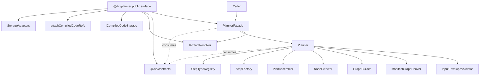
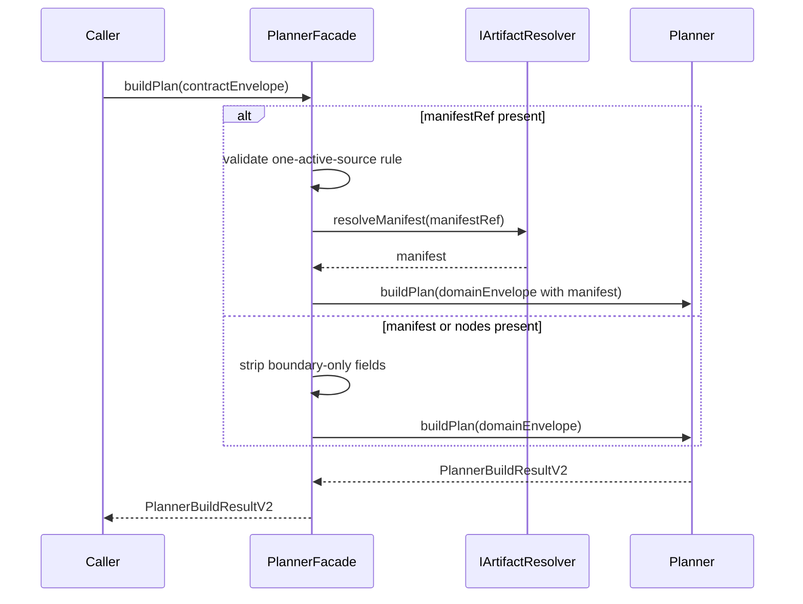
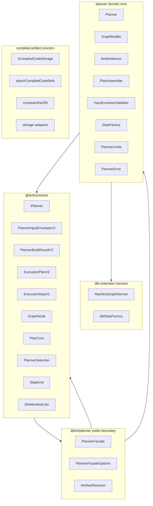
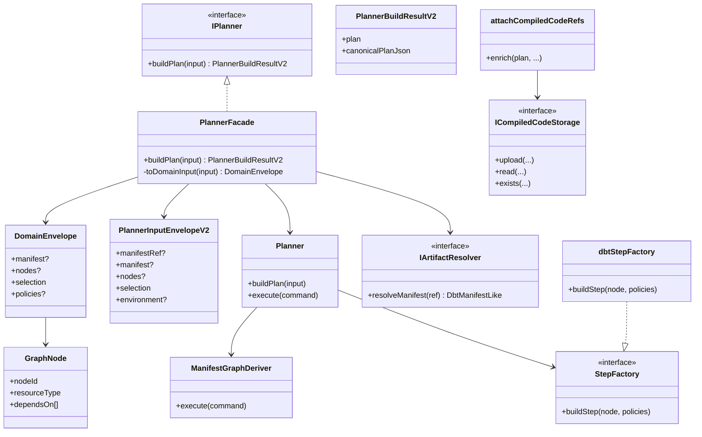

# Planner Refactor Baseline — Corrected for `docs/planner-stage-1-1-canonicalization`

**Repository:** `dunay2/dvt`  
**Reviewed branch:** `docs/planner-stage-1-1-canonicalization`  
**Module:** `packages/@dvt/planner`

This document replaces the previous baseline, which was built against the wrong branch.  
The current branch has already changed the planner boundary in material ways:

- `PlannerFacade` is now the sole public entry point,
- `Planner` is an internal domain service,
- canonical boundary types are re-exported from `@dvt/contracts`,
- `IArtifactResolver` exists as a new application-boundary port,
- the future architecture and migration path therefore change substantially.

Primary reviewed sources:

- `packages/@dvt/planner/src/index.ts`
- `packages/@dvt/planner/src/application/PlannerFacade.ts`
- `packages/@dvt/planner/src/domain/Planner.ts`
- `packages/@dvt/planner/src/ports/IArtifactResolver.ts`

---

# Part I — Current Architecture (Corrected)

## 1. Executive Summary

The planner package in `docs/planner-stage-1-1-canonicalization` is no longer shaped as a direct domain-service package exposing `Planner` as the public API. The public boundary has already moved one layer outward:

- `PlannerFacade` is the public application-boundary service,
- the inner `Planner` remains the deterministic domain planner,
- `PlannerFacade` accepts contract-level input from `@dvt/contracts`,
- `PlannerFacade` strips application-boundary fields and optionally resolves `manifestRef` through `IArtifactResolver`,
- the domain planner only receives resolved domain input (`manifest` or `nodes`) and stays pure with respect to storage/network concerns.

This means the architecture is already evolving toward a layered shape:

- **application boundary**: `PlannerFacade`
- **domain planning core**: `Planner`
- **contract authority**: `@dvt/contracts`
- **artifact resolution port**: `IArtifactResolver`
- **compiled-code/artifact enrichment**: still mixed into the package surface

So the refactor is no longer starting from “monolithic planner package with public `Planner`”. It is starting from an intermediate state where some boundary cleanup is already done, but residual concerns are still exposed.

---

## 2. Current Public Surface

Current `src/index.ts` on this branch exports:

- `PlannerFacade`, `PlannerFacadeOptions`
- contract-facing types from `@dvt/contracts`
- `ResolvedPolicies`
- `StepFactory`
- `PlannerError`, `PlannerErrorCode`
- `PlannerLimits`, `PlannerMetrics`
- `IArtifactResolver`
- `ICompiledCodeStorage`
- compiled-code helpers
- concrete storage adapters

### Immediate structural implication

The package is now best understood as:

1. **planner application facade package**
2. **domain planning package**
3. **temporary contract re-export package**
4. **artifact concern package**
5. **adapter export package**

That is a better state than before, but still too broad for a final architecture.

---

## 3. Current Layered Architecture

### Interpretation

This is no longer a simple “core planner package”.  
It is a **boundary package plus residual adjacent concerns**.

---

## 4. Current Domain/Application Split

## 4.1 Public entry point: `PlannerFacade`

`PlannerFacade` is the only public entry point and explicitly implements the full `IPlanner` contract. It handles concerns that the domain planner does not model:

- `manifestRef` resolution through `IArtifactResolver`
- stripping `environment`
- enforcing the one-active-source rule across `manifestRef`, `manifest`, and `nodes`

### Responsibilities of `PlannerFacade`

- accept contract envelope from `@dvt/contracts`
- validate source exclusivity at the application boundary
- fail fast if `manifestRef` is provided but no resolver exists
- call `resolver.resolveManifest(...)`
- hand a reduced domain envelope to `Planner.buildPlan(...)`

## 4.2 Internal domain service: `Planner`

The inner `Planner` remains a deterministic domain service:

- validates input
- normalizes nodes/manifest
- builds graph
- resolves policies
- selects nodes
- topologically orders steps
- validates step config
- assembles canonical plan output

This is a much better split than the earlier baseline assumed.

---

## 5. Current Domain Flow

---

# Part II — Corrected Slice 1

# Export Inventory and Boundary Classification

## 6. Goal

Classify the current public surface of `@dvt/planner` on `docs/planner-stage-1-1-canonicalization` and decide, export by export:

- what is correct to keep at the public boundary,
- what is transitional,
- what is internal leakage,
- what should move to a dedicated concern/module.

This slice is now **branch-corrected**.

---

## 7. Classification Model

### Categories

- `public-boundary`: symbols that belong to the planner package public API
- `contract-reexport`: canonical authority lives in `@dvt/contracts`; planner re-exports temporarily or intentionally
- `core-seam`: extension seam or core-adjacent abstraction needed by planner internals
- `application-port`: public application-boundary port, not domain core
- `artifact`: compiled artifact concern
- `adapter`: concrete infra implementation
- `internal-leak`: implementation-facing type currently exported but not desirable as strategic API

### Decisions

- `keep`
- `re-export temporarily`
- `keep but narrow`
- `move`
- `deprecate`

---

## 8. Corrected Export Inventory

| Export                          | Source                                     | Category          | Decision              | Target/Owner                                         | Notes                                                                                |
| ------------------------------- | ------------------------------------------ | ----------------- | --------------------- | ---------------------------------------------------- | ------------------------------------------------------------------------------------ |
| `PlannerFacade`                 | `./application/PlannerFacade.js`           | public-boundary   | keep                  | `@dvt/planner` public API                            | Sole public entry point today.                                                       |
| `PlannerFacadeOptions`          | `./application/PlannerFacade.js`           | public-boundary   | keep but narrow       | `@dvt/planner` public API                            | Valid public option surface; should stay minimal.                                    |
| `DbtManifestLike`               | `@dvt/contracts`                           | contract-reexport | re-export temporarily | `@dvt/contracts`                                     | DBT-specific contract already centralized.                                           |
| `ExecutionPlanV2`               | `@dvt/contracts`                           | contract-reexport | re-export temporarily | `@dvt/contracts`                                     | Canonical contract already externalized.                                             |
| `ExecutionStepV2`               | `@dvt/contracts`                           | contract-reexport | re-export temporarily | `@dvt/contracts`                                     | Same.                                                                                |
| `GraphNode`                     | `@dvt/contracts`                           | contract-reexport | re-export temporarily | `@dvt/contracts`                                     | Correctly treated as contract-facing now.                                            |
| `IExecutionPlanner`             | `@dvt/contracts`                           | contract-reexport | deprecate             | `@dvt/contracts`                                     | New façade speaks `IPlanner`; keep only for compatibility if still needed.           |
| `IPlanner`                      | `@dvt/contracts`                           | contract-reexport | keep                  | `@dvt/contracts`                                     | This is now the correct public planner contract.                                     |
| `PlanCore`                      | `@dvt/contracts`                           | contract-reexport | re-export temporarily | `@dvt/contracts`                                     | Contract-owned.                                                                      |
| `PlannerBuildResultV2`          | `@dvt/contracts`                           | contract-reexport | keep                  | `@dvt/contracts`                                     | Public output result of facade buildPlan.                                            |
| `PlannerInputEnvelopeV2`        | `@dvt/contracts`                           | contract-reexport | keep                  | `@dvt/contracts`                                     | Public planner input.                                                                |
| `PlannerSelection`              | `@dvt/contracts`                           | contract-reexport | re-export temporarily | `@dvt/contracts`                                     | Contract-owned.                                                                      |
| `StepKind`                      | `@dvt/contracts`                           | contract-reexport | re-export temporarily | `@dvt/contracts`                                     | Contract-owned vocabulary.                                                           |
| `ExecutionPlan` alias           | `@dvt/contracts`                           | contract-reexport | deprecate             | `@dvt/contracts`                                     | Backward-compat alias only.                                                          |
| `ResolvedPolicies`              | `./domain/types.js`                        | internal-leak     | deprecate             | internal only                                        | Exported only because StepFactory implementers need it; should be revisited.         |
| `StepFactory`                   | `./domain/stepFactory/StepFactory.js`      | core-seam         | keep                  | planner core seam                                    | Legitimate extension seam.                                                           |
| `PlannerError`                  | `./domain/errors.js`                       | internal-leak     | keep but narrow       | implementation-facing                                | Concrete class may remain temporarily visible, but not as shared contract authority. |
| `PlannerErrorCode`              | `./domain/errors.js`                       | contract-reexport | move                  | `@dvt/contracts`                                     | Taxonomy should converge externally; current location is residual drift.             |
| `PlannerLimits`                 | `./domain/limits.js`                       | core-seam         | keep                  | planner core                                         | Still acceptable as planner runtime constraint surface.                              |
| `PlannerMetrics`                | `./domain/metrics.js`                      | internal-leak     | move                  | internal/observability                               | Should not remain public stable API.                                                 |
| `IArtifactResolver`             | `./ports/IArtifactResolver.js`             | application-port  | keep                  | planner public boundary or shared artifact API later | This is now structurally important because `PlannerFacade` depends on it.            |
| `ICompiledCodeStorage`          | `./ports/ICompiledCodeStorage.js`          | artifact          | move                  | artifact module                                      | Not part of planning/application boundary.                                           |
| `computeSha256`                 | `./compiledCode/sha256.js`                 | artifact          | move                  | artifact module                                      | Artifact concern.                                                                    |
| `attachCompiledCodeRefs`        | `./compiledCode/attachCompiledCodeRefs.js` | artifact          | move                  | artifact module                                      | Post-plan enrichment concern.                                                        |
| `AttachCompiledCodeRefsOptions` | `./compiledCode/attachCompiledCodeRefs.js` | artifact          | move                  | artifact module                                      | Same concern.                                                                        |
| `S3CompiledCodeStorage`         | compiledCode adapter                       | adapter           | move                  | artifact module                                      | Concrete infra adapter.                                                              |
| `MinioCompiledCodeStorage`      | compiledCode adapter                       | adapter           | move                  | artifact module                                      | Concrete infra adapter.                                                              |
| `FileSystemCompiledCodeStorage` | compiledCode adapter                       | adapter           | move                  | artifact module                                      | Concrete infra adapter.                                                              |
| `InMemoryCompiledCodeStorage`   | compiledCode adapter                       | adapter           | move                  | artifact module                                      | Concrete infra adapter.                                                              |
| `NoopCompiledCodeStorage`       | compiledCode adapter                       | adapter           | move                  | artifact module                                      | Concrete infra adapter.                                                              |

---

## 9. Corrected Slice 1 Observations

### 9.1 The strongest improvement is already real

`PlannerFacade` has replaced `Planner` as the public boundary. That is not a cosmetic change; it is a structural change in architecture.

### 9.2 Contract authority is partially fixed already

The branch already re-exports major planner boundary types from `@dvt/contracts`, which is a meaningful advance over the older baseline.

### 9.3 A new public port has appeared

`IArtifactResolver` is now a real application-boundary concern because `PlannerFacade` cannot fulfill the `manifestRef` path without it.

### 9.4 Residual drift remains

The package still leaks:

- `ResolvedPolicies`
- `PlannerMetrics`
- `ICompiledCodeStorage`
- compiled-code helpers
- concrete adapters

### 9.5 The future architecture is no longer “planner-core first, then façade”

The façade already exists, so the future architecture must now be framed around:

- public boundary façade,
- domain core,
- contract authority,
- application-boundary ports,
- artifact concern extraction.

---

# Part III — Corrected Slice 2

# Boundary Specification

## 10. Goal

Define the corrected boundary of the planner package **as it exists on this branch**, not as it existed on `main`.

The boundary now has to distinguish between:

- **public application boundary**
- **internal domain core**
- **contract authority**
- **application-boundary ports**
- **artifact concern leakage**

---

## 11. Official Architectural Position

The official architectural position remains:

> **generic core + dbt extension**

But it must now be refined as:

> **public façade + generic planning core + dbt extension + artifact concerns extracted**

This reflects the reality of the branch more accurately.

---

## 12. Boundary Model

## 12.1 Public application boundary

Owns:

- `PlannerFacade`
- `PlannerFacadeOptions`
- `IPlanner`-shaped interaction
- acceptance of `manifestRef`
- interaction with `IArtifactResolver`
- stripping of application-boundary-only fields like `environment`

## 12.2 Internal domain planning core

Owns:

- `Planner`
- graph build/selection/order/assembly
- deterministic plan computation
- `StepFactory`
- `PlannerLimits`
- internal policy resolution
- internal error handling implementation

## 12.3 Contract authority

Owned by:

- `@dvt/contracts`

Includes:

- `PlannerInputEnvelopeV2`
- `PlannerBuildResultV2`
- `ExecutionPlanV2`
- `ExecutionStepV2`
- `GraphNode`
- `IPlanner`
- `PlanCore`
- related planner vocabulary types already re-exported from there

## 12.4 Application-boundary port

Owned at boundary level:

- `IArtifactResolver`

This port is not a compiled-code concern. It is now part of the manifest-ref application pathway and should be treated separately from artifact-enrichment storage.

## 12.5 Artifact concern

Non-core, non-boundary concern:

- `ICompiledCodeStorage`
- `attachCompiledCodeRefs`
- compiled-code hashing
- compiled-code storage adapters

---

## 13. Corrected Boundary Rules

### Rule 1 — `PlannerFacade` is the sole public entry point

The package public API is façade-first, not domain-service-first. `Planner` is internal domain machinery.

### Rule 2 — Domain planner must stay behind the façade

The domain planner should not re-emerge as the primary public surface unless there is a deliberate architectural reversal.

### Rule 3 — Contract authority belongs in `@dvt/contracts`

Planner may re-export contract shapes for compatibility, but should not reclaim authority for them.

### Rule 4 — `IArtifactResolver` is boundary-relevant

Because `manifestRef` resolution is now handled at façade level, `IArtifactResolver` belongs to the application-boundary design discussion, not the compiled-code concern bucket.

### Rule 5 — Compiled-code enrichment remains out of core and out of façade

Anything related to compiled code attachment after plan assembly is neither domain planning core nor public façade responsibility.

### Rule 6 — Internal helper types are not strategic API

Types like `ResolvedPolicies` and metrics hooks should not remain public unless they are deliberately promoted.

### Rule 7 — The new package boundary is layered

The package should be thought of as:

- façade boundary
- domain core
- contract re-export surface
- residual artifact leakage to be removed

not as one homogeneous core package.

---

## 14. Corrected Allowed Public Surface

### Keep as public boundary

- `PlannerFacade`
- `PlannerFacadeOptions`
- `IPlanner`
- `PlannerBuildResultV2`
- `PlannerInputEnvelopeV2`
- `IArtifactResolver`

### Keep as public re-exports for now

- contract-facing types already re-exported from `@dvt/contracts`
- possibly `StepFactory`
- possibly `PlannerLimits`

### Keep only if intentionally narrowed

- `PlannerError`

---

## 15. Corrected Internal/Core Surface

### Internal domain core

- `Planner`
- `GraphBuilder`
- `NodeSelector`
- `PlanAssembler`
- `InputEnvelopeValidator`
- policy resolution
- graph derivation and dbt default mapping unless extracted later

### Core seam

- `StepFactory`

### Core local runtime constraints

- `PlannerLimits`

---

## 16. Corrected Removal/Extraction Set

These are the clearest extraction candidates from the current public surface:

- `PlannerMetrics`
- `ResolvedPolicies`
- `ICompiledCodeStorage`
- `computeSha256`
- `attachCompiledCodeRefs`
- `AttachCompiledCodeRefsOptions`
- all compiled-code storage adapters

---

## 17. Corrected Target Architecture

---

## 18. New Domain Model (Corrected)

### Domain reading

- `PlannerFacade` is now the application service at the public boundary.
- `Planner` is the deterministic domain service.
- `IArtifactResolver` is an application-boundary port for manifest resolution.
- `ICompiledCodeStorage` belongs to a different concern: compiled artifact handling after plan computation.
- The planner package therefore has **two different artifact-related concerns**, and they must not be conflated:
  - **manifest resolution for input acquisition**
  - **compiled code storage for post-plan enrichment**

That distinction was missing from the earlier baseline.

---

## 19. Revised Migration Direction

The next architectural work should now aim at this, in order:

### Step 1 — accept the façade-first public API

Do not write future docs as if `Planner` were still the public entry point.

### Step 2 — narrow the public surface

Keep:

- façade boundary
- contract re-exports that are still needed
- `IArtifactResolver`
- only the minimum justified seams

### Step 3 — extract compiled artifact concern

Move out:

- `ICompiledCodeStorage`
- compiled-code helpers
- compiled-code adapters

### Step 4 — decide the long-term home of `IArtifactResolver`

It may remain planner-boundary-local, or later move to a more shared artifact/reference API if the system generalizes artifact resolution beyond planner.

### Step 5 — reduce internal leakage

Revisit:

- `ResolvedPolicies`
- `PlannerMetrics`
- `PlannerError` exposure level

---

## 20. What changed versus the invalid baseline

The earlier baseline was wrong because it assumed:

- public `Planner`
- contract ambiguity still centered in planner package
- no façade/application layer
- no `IArtifactResolver`
- a simpler split of future architecture

This corrected baseline reflects the actual branch state:

- façade-first public API,
- domain planner internalized,
- contract authority partially externalized,
- application-boundary artifact resolution introduced,
- future architecture now shaped around boundary layering, not just package splitting.

---

## 21. Recommended Next Deliverable

The next correct document should be:

# Slice 3 — Branch-Correct Physical Reorganization Plan

And it should answer:

- which exports stay in `@dvt/planner`,
- which exports are deprecated,
- which exports move to artifact concern,
- whether `IArtifactResolver` stays in planner boundary or becomes shared,
- whether `PlannerErrorCode` moves to contracts now or later,
- how `PlannerFacade` and `IPlanner` remain the stable public API through transition.

---

## 22. Reviewed sources

- `packages/@dvt/planner/src/index.ts`
- `packages/@dvt/planner/src/application/PlannerFacade.ts`
- `packages/@dvt/planner/src/domain/Planner.ts`
- `packages/@dvt/planner/src/ports/IArtifactResolver.ts`
